<div align="center">

# 📝 Kansas Frontier Matrix — Notes Workspace

`docs/notes/README.md`

**Mission:** Maintain a **lightweight, versioned knowledge workspace** for
working notes, research logs, and early drafts that evolve into formal
MCP documentation and structured knowledge graph entries.

[](../)
[](../architecture/knowledge-graph.md)
[](README.md)
[](../../data/work/logs/docs/)

</div>

---

## 🎯 Purpose

The `/docs/notes/` directory is a **sandbox for thinking in public** —
an **idea incubator** where concepts, discussions, and discoveries are captured
before formalization into architecture, design, or integration documents.

Notes serve as:

* 🧠 **Working drafts** — capture ideas fast before structure hardens.
* 🔍 **Research digests** — summaries of archives, datasets, and oral histories.
* 🗓️ **Meeting & sprint logs** — record decisions, blockers, and insights.
* ⚙️ **Technical backlogs** — track pending work or experimental prototypes.
* 🧾 **Idea provenance** — keep “why we thought this” context in Git forever.

> **MCP Principle:** *Write fast. Preserve context. Promote when reproducible.*

---

## 🧩 MCP Note Lifecycle

```mermaid
flowchart LR
    A["✍️ Draft Note<br>(/docs/notes/research.md, ideas.md)"] --> B["🧭 Review / Discussion<br>(team + Git comments)"]
    B --> C["🧱 Stabilize Insight<br>(cross-linked to data, commits, and sources)"]
    C --> D["🚀 Promote to Formal Doc<br>(/architecture /design /integration)"]
    D --> E["🗂️ Archive Note<br>(/docs/notes/archive/)"]

    style A fill:#f9fbff,stroke:#0077cc
    style B fill:#f7f0ff,stroke:#9966cc
    style C fill:#f3fcf3,stroke:#33aa33
    style D fill:#fffbea,stroke:#e8a500
    style E fill:#f9f9f9,stroke:#888888
%% END OF MERMAID
```



<!-- END OF MERMAID -->

---

## 🧱 Directory Layout

```text
docs/notes/
├── README.md          # Index (this file)
├── research.md        # Ad-hoc research notes & references
├── meetings.md        # Meeting logs, retrospectives, decisions
├── ideas.md           # Early brainstorms, experimental concepts
├── backlog.md         # Pending tasks, technical debt, blockers
├── templates/         # Optional note + meeting templates
└── archive/           # Deprecated or closed notes (retained for provenance)
```

---

## 📋 Recommended Note Structure (YAML Front-Matter)

Every note should begin with lightweight metadata for search & linkage:

```yaml
---
title: "Hydrology Dataset Crosswalk — Early Draft"
author: "KFM Hydrology Team"
date: 2025-10-05
status: draft          # draft | review | stable | archived
tags: ["hydrology", "dataset", "integration"]
linked_datasets:
  - data/stac/hydro/usgs_streamflow_ks_1900_2020.json
linked_commits:
  - a3f29e9
linked_docs:
  - ../architecture/data-architecture.md
---
```

### 🧭 Notes Metadata Rules

| Field      | Description                          | Example                                 |
| :--------- | :----------------------------------- | :-------------------------------------- |
| `title`    | Concise subject line                 | “LiDAR DEM Pipeline – Draft Hypothesis” |
| `status`   | Note maturity level                  | `draft`, `review`, `stable`, `archived` |
| `tags`     | Search keywords or ontology concepts | `["terrain","LiDAR","ETL"]`             |
| `linked_*` | Permalinks to related artifacts      | Datasets, commits, docs, or issues      |
| `date`     | ISO 8601 date                        | `2025-10-05`                            |

> All YAML headers are parsed by CI and the knowledge graph builder to index note provenance.

---

## 🧾 Suggested Workflow

| Stage              | Action                                                                           | Description                                    |
| :----------------- | :------------------------------------------------------------------------------- | :--------------------------------------------- |
| **1️⃣ Capture**    | Add to `research.md` or create new `note_*.md`.                                  | Capture ideas immediately, minimal formatting. |
| **2️⃣ Cross-link** | Reference STAC items, data sources, or Git commits.                              | Maintain traceability.                         |
| **3️⃣ Review**     | Share via PR for team feedback.                                                  | Use GitHub comments for peer input.            |
| **4️⃣ Promote**    | Move or copy to `/docs/architecture/`, `/docs/design/`, or `/docs/integration/`. | Once reproducible or approved.                 |
| **5️⃣ Archive**    | Move older notes to `/docs/notes/archive/`.                                      | Nothing is deleted — preserve context.         |

---

## 🧠 Linking Notes to the Knowledge Graph

Each finalized note becomes an entity in the **KFM Knowledge Graph** under
`kfm:note/<slug>` with `prov:wasDerivedFrom` and `prov:wasGeneratedBy` relationships.

**Example RDF Triples:**

```turtle
@prefix kfm: <https://kfm.org/id/> .
@prefix prov: <http://www.w3.org/ns/prov#> .
@prefix dc:   <http://purl.org/dc/terms/> .

kfm:note/hydrology_crosswalk
    a prov:Entity ;
    dc:title "Hydrology Dataset Crosswalk — Early Draft" ;
    prov:wasDerivedFrom kfm:dataset/usgs_streamflow_ks_1900_2020 ;
    prov:wasGeneratedBy kfm:process/research_sprint_oct2025 ;
    dc:creator "KFM Hydrology Team" ;
    dc:date "2025-10-05"^^xsd:date .
```

This ensures every note, even informal, can be referenced in semantic queries or audit trails.

---

## 📦 Example Note Templates

**Quick Idea Template:**

```markdown
# 💡 Idea: [Short Title]
*Date:* YYYY-MM-DD  
*Author:* Your Name  
*Status:* draft  

## Context
Briefly describe the origin or trigger of the idea.

## Hypothesis
If X → then Y.

## Linked Data
- `data/sources/...`
- Commit: `<hash>`
- STAC: `<item>.json`

## Next Steps
1. Validate concept.
2. Add to backlog.md if actionable.
```

**Meeting Log Template:**

```markdown
# 🗓️ Meeting – [Topic]
*Date:* YYYY-MM-DD  
*Participants:* …  
*Recording:* link (if applicable)

## Agenda
1. …

## Notes & Decisions
- …

## Action Items
- [ ] Owner — Task
```

---

## 🧩 Tagging & Discovery

All notes support **semantic tagging** via YAML `tags:` and inline `#tag` hashtags.
Tags are parsed into a SKOS vocabulary (`data/vocabularies/tags.skos.ttl`) and indexed into the knowledge graph.

| Tag Type    | Example                            | Used For                  |
| :---------- | :--------------------------------- | :------------------------ |
| **Domain**  | `#climate`, `#archaeology`         | Thematic grouping         |
| **Phase**   | `#draft`, `#review`, `#archived`   | Workflow stage            |
| **Concept** | `#ontology`, `#timeline`, `#LiDAR` | Conceptual linkage        |
| **Process** | `#etl`, `#qa`, `#stac-validation`  | Pipeline cross-references |

---

## 🔄 Versioning & Provenance

* Notes evolve through commits; **never edit without version control**.
* Significant changes: append a changelog section (`### Change Log`).
* Each note inherits commit metadata → automatically added to MCP provenance.
* Archived notes are moved into `/archive/<year>/` with a prefix:
  `YYYY-MM-DD_<original_title>.md`.

> The note archive acts as a permanent knowledge record — no deletions, only evolution.

---

## 🧠 CI Integration & Validation

Notes are validated through **`make docs-validate`** and CI pipelines.

| Validation             | Tool                            | Description                      |
| :--------------------- | :------------------------------ | :------------------------------- |
| **Front-matter check** | `yamllint`                      | Validates note metadata headers. |
| **Link check**         | `remark-lint`                   | Detects broken internal links.   |
| **Tag indexing**       | `scripts/parse_tags.py`         | Updates SKOS vocabularies.       |
| **Graph ingestion**    | `scripts/graph_ingest_notes.py` | Adds notes to Neo4j RDF store.   |

---

## 📎 Related Documentation

| Path                                   | Description                                 |
| :------------------------------------- | :------------------------------------------ |
| `docs/architecture/knowledge-graph.md` | How notes link into RDF & Neo4j models.     |
| `docs/templates/provenance.md`         | Provenance & lineage capture templates.     |
| `docs/standards/documentation.md`      | Formal writing & versioning standards.      |
| `docs/standards/ontologies.md`         | Ontology and semantic alignment references. |

---

## 📅 Version History

| Version | Date       | Author                 | Summary                                                                                        |
| :------ | :--------- | :--------------------- | :--------------------------------------------------------------------------------------------- |
| v1.1    | 2025-10-05 | KFM Documentation Team | Added YAML front-matter schema, tag vocabularies, knowledge-graph linkage, and CI integration. |
| v1.0    | 2025-10-04 | KFM Documentation Team | Initial lightweight workspace for brainstorming & research notes.                              |

---

<div align="center">

**Kansas Frontier Matrix** — *“Ideas Recorded. Knowledge Preserved. Insight Proven.”*
📍 [`docs/notes/README.md`](.) · Official MCP-compliant workspace for versioned notes and early research.

</div>
