<div align="center">

# 📝 Kansas Frontier Matrix — **Notes Workspace**  
`docs/notes/README.md`

**Mission:** Maintain a **lightweight, versioned knowledge workspace** for  
working notes, research logs, and early drafts that evolve into formal  
MCP documentation and structured knowledge graph entries.

[](../standards/documentation.md)
[](../../.github/workflows/docs-validate.yml)
[](../../.github/workflows/policy-check.yml)
[](../../.github/workflows/site.yml)
[](../../.github/workflows/stac-validate.yml)
[](../../.github/workflows/codeql.yml)
[](../../.github/workflows/trivy.yml)
[](../../LICENSE)

</div>

```yaml
---
title: "Kansas Frontier Matrix — Notes Workspace"
document_type: "README"
version: "v1.6.0"
last_updated: "2025-10-18"
created: "2025-10-04"
owners: ["@kfm-docs","@kfm-architecture","@kfm-data","@kfm-security","@kfm-ai"]
status: "Stable"
maturity: "Production"
scope: "Docs/Notes"
license: "CC-BY 4.0"
semver_policy: "MAJOR.MINOR.PATCH"
tags: ["docs","notes","mcp","provenance","knowledge-graph","search","markdown","ai"]
audit_framework: "MCP-DL v6.3"
ci_required_checks:
  - docs-validate
  - policy-check
  - site-build
  - pre-commit
  - stac-validate
  - codeql
  - trivy
semantic_alignment:
  - STAC 1.0
  - DCAT 2.0
  - JSON Schema
  - ISO 8601
  - CIDOC CRM
  - PROV-O
  - OWL-Time
  - SKOS
provenance:
  workflow_pin_policy: "actions pinned by tag or commit SHA"
  artifact_retention_days: 90
---
```

---

## 📚 Table of Contents

- [🎯 Purpose](#-purpose)  
- [🧩 MCP Note Lifecycle](#-mcp-note-lifecycle)  
- [🧱 Directory Layout](#-directory-layout)  
- [🗂️ Note Types](#️-note-types)  
- [📋 Recommended Note Structure (YAML Front-Matter)](#-recommended-note-structure-yaml-front-matter)  
- [🧭 Metadata Schema](#-metadata-schema)  
- [🧾 Suggested Workflow](#-suggested-workflow)  
- [🧠 Linking Notes to the Knowledge Graph](#-linking-notes-to-the-knowledge-graph)  
- [📦 Example Note Templates](#-example-note-templates)  
- [🏷️ Tagging & Discovery](#️-tagging--discovery)  
- [🗄️ Archiving & Filenames](#️-archiving--filenames)  
- [🤖 AI Assistant & Automation](#-ai-assistant--automation)  
- [✅ Contributor Checklist](#-contributor-checklist)  
- [🔒 Ethics & Data Sensitivity](#-ethics--data-sensitivity)  
- [🤖 CI Integration & Validation](#-ci-integration--validation)  
- [📎 Related Documentation](#-related-documentation)  
- [🚀 Roadmap](#-roadmap)  
- [📅 Version History](#-version-history)

---

## 🎯 Purpose

The `/docs/notes/` directory is a **sandbox for thinking in public** —  
an **idea incubator** where concepts, discussions, and discoveries are captured  
before formalization into architecture, design, or integration documents.

Notes serve as:

- 🧠 **Working drafts** — capture ideas fast before structure hardens.  
- 🔍 **Research digests** — summaries of archives, datasets, and oral histories.  
- 🗓️ **Meeting & sprint logs** — record decisions, blockers, and insights.  
- ⚙️ **Technical backlogs** — track pending work or experimental prototypes.  
- 🧾 **Idea provenance** — keep “why we thought this” context in Git forever.

> **MCP Principle:** *Write fast. Preserve context. Promote when reproducible.*

---

## 🧩 MCP Note Lifecycle

```mermaid
flowchart LR
    A["✍️ Draft Note<br>(/docs/notes/research.md, ideas.md)"] --> B["🧭 Review / Discussion<br>(team + Git comments)"]
    B --> C["🧱 Stabilize Insight<br>(cross-linked to data, commits, and sources)"]
    C --> D["🚀 Promote to Formal Doc<br>(/architecture /design /integration)"]
    D --> E["🗂️ Archive Note<br>(/docs/notes/archive/)"]

    style A fill:#f9fbff,stroke:#0077cc
    style B fill:#f7f0ff,stroke:#9966cc
    style C fill:#f3fcf3,stroke:#33aa33
    style D fill:#fffbea,stroke:#e8a500
    style E fill:#f9f9f9,stroke:#888888
%% END OF MERMAID
```



---

## 🧱 Directory Layout

```text
docs/notes/
├── README.md          # Index (this file)
├── research.md        # Ad-hoc research notes & references
├── meetings.md        # Meeting logs, retrospectives, decisions
├── ideas.md           # Early brainstorms, experimental concepts
├── backlog.md         # Pending tasks, technical debt, blockers
├── templates/         # Note + meeting templates
└── archive/           # Deprecated or closed notes (retained for provenance)
```

---

## 🗂️ Note Types

| File         | Purpose                                                  |
| :----------- | :------------------------------------------------------- |
| `research.md`| Scratchpad for datasets, literature, references.        |
| `meetings.md`| Agile retrospectives, agenda logs, team updates.        |
| `ideas.md`   | Experimental ideas, hypotheses, technical sketches.     |
| `backlog.md` | Short-term tasks, tech debt tracking, feature backlog.  |
| `templates/` | Prebuilt YAML & Markdown templates for uniform structure.|
| `archive/`   | Long-term record of finalized or deprecated notes.      |

> **Tip:** If a note becomes foundational, promote it to `/docs/architecture/` or `/docs/design/`.

---

## 📋 Recommended Note Structure (YAML Front-Matter)

```yaml
---
title: "Hydrology Dataset Crosswalk — Early Draft"
author: "KFM Hydrology Team"
date: 2025-10-05
status: draft          # draft | review | stable | archived
tags: ["hydrology","dataset","integration"]
linked_datasets:
  - data/stac/hydro/usgs_streamflow_ks_1900_2020.json
linked_commits:
  - a3f29e9
linked_docs:
  - ../architecture/data-architecture.md
period:
  id: "perio.do/dust-bowl-1930s"
  label: "Dust Bowl Era"
ai_assist:
  summarize: true
  embed_in_graph: true
  vector_model: "sentence-transformers/all-MiniLM-L6-v2"
references:
  - "url:https://example.org/context"
---
```

---

## 🧭 Metadata Schema

| Field        | Description                      | Example                               |
| :----------- | :------------------------------- | :------------------------------------ |
| `title`      | Concise subject line             | “LiDAR DEM Pipeline – Draft Hypothesis” |
| `author`     | Individual or team               | `"KFM Hydrology Team"`                |
| `date`       | ISO 8601 date                    | `2025-10-05`                          |
| `status`     | Lifecycle stage                  | `draft`, `review`, `stable`, `archived` |
| `tags`       | Keywords / ontology concepts     | `["terrain","LiDAR","ETL"]`           |
| `linked_*`   | Crosslinks to artifacts          | Dataset paths, commits, docs          |
| `period`     | Historical period (PeriodO)      | `"Dust Bowl Era"`                     |
| `ai_assist`  | AI workflow flags                | Summarization / embedding             |
| `references` | Bibliography pointers            | `["doi:10.123/abc","url:..."]`        |

> Schema: `docs/schemas/note.schema.json` (validated in CI).

---

## 🧾 Suggested Workflow

| Stage | Action | Description |
| :-- | :-- | :-- |
| **1️⃣ Capture** | Add a note/section to `research.md`. | Minimal viable capture. |
| **2️⃣ Link** | Cross-reference datasets/commits. | Maintain provenance. |
| **3️⃣ Review** | Open PR for comments. | Team discussion/validation. |
| **4️⃣ Promote** | Move to `/architecture/` or `/design/`. | When reproducible/validated. |
| **5️⃣ Archive** | Move into `archive/<year>/`; set `status: archived`. | Lock history. |

> **Golden Rule:** *Nothing is deleted — preserve knowledge via Git + Archive.*

---

## 🧠 Linking Notes to the Knowledge Graph

Each note is ingested into **Neo4j/RDF** aligned with **CIDOC-CRM**, **PROV-O**, and **OWL-Time**.

```turtle
@prefix kfm: <https://kfm.org/id/> .
@prefix prov: <http://www.w3.org/ns/prov#> .
@prefix dc:   <http://purl.org/dc/terms/> .

kfm:note/hydrology_crosswalk
    a prov:Entity ;
    dc:title "Hydrology Dataset Crosswalk — Early Draft" ;
    prov:wasDerivedFrom kfm:dataset/usgs_streamflow_ks_1900_2020 ;
    prov:wasGeneratedBy kfm:process/research_sprint_oct2025 ;
    dc:creator "KFM Hydrology Team" ;
    dc:date "2025-10-05"^^xsd:date .
```

> Notes are vectorized for semantic search and discoverable in the web UI.

---

## 📦 Example Note Templates

See ready-to-use templates in `docs/notes/templates/`:

- **Idea**: quick concept capture  
- **Meeting**: actions/decisions  
- **Research**: findings/literature  
- **Backlog**: tasks/tech debt  
- **Archive**: supersession record

---

## 🏷️ Tagging & Discovery

Tags map to a controlled **SKOS** vocabulary in `data/vocabularies/tags.skos.ttl`.  
All tags are ingested as triples for federated search.

| Tag Type  | Example                       | Used For           |
| :-------- | :---------------------------- | :----------------- |
| **Domain**| `#climate`, `#archaeology`    | Thematic grouping  |
| **Phase** | `#draft`, `#review`           | Workflow stage     |
| **Concept**| `#ontology`, `#timeline`     | Concept linkage    |
| **Process**| `#etl`, `#stac-validation`   | Pipeline references|

---

## 🗄️ Archiving & Filenames

- **When**: after promotion or phase end.  
- **Where**: `docs/notes/archive/<year>/`  
- **Pattern**: `YYYY-MM-DD_<kebab-title>.md`

**Example**
```
2025-10-05_hydrology-dataset-crosswalk.md
```

---

## 🤖 AI Assistant & Automation

- Summaries → dashboards  
- Embeddings → `scripts/vector_index_notes.py`  
- Graph sync → `scripts/graph_ingest_notes.py`  
- Search → site search + KG APIs


---

## ✅ Contributor Checklist

| ✅ Item | Description |
| :-- | :-- |
| [ ] `make docs-validate` passes |
| [ ] Tags follow `data/vocabularies/tags.skos.ttl` |
| [ ] All links resolve |
| [ ] Lint clean (`remark-lint`) |
| [ ] Added to `research.md` or cross-linked |
| [ ] No sensitive/PII content |

---

## 🔒 Ethics & Data Sensitivity

> Include only public-domain or CC-BY content.  
> Do **not** commit PII or restricted datasets.  
> Cite licenses in `references:`.

---

## 🤖 CI Integration & Validation

| Validation | Tool | Purpose |
| :-- | :-- | :-- |
| Front-matter | `yamllint` | Validates YAML |
| Schema | `jsonschema` | Enforces `note.schema.json` |
| Links | `remark-lint` | Verifies internal links |
| Tags → SKOS | `scripts/parse_tags.py` | Updates vocabularies |
| Graph | `scripts/graph_ingest_notes.py` | Loads to Neo4j |
| Embeddings | `scripts/vector_index_notes.py` | Builds vectors |

---

## 📎 Related Documentation

| Path                                   | Description |
| :------------------------------------- | :---------- |
| `../standards/documentation.md`        | Documentation & writing rules |
| `../architecture/knowledge-graph.md`   | RDF/Neo4j mapping & queries |
| `../templates/README.md`               | Template index & guidance |

---

## 🚀 Roadmap

| Milestone | Target  | Description |
| :-------- | :------ | :---------- |
| **v1.7**  | Q3 2026 | Web-based note creation & promotion workflow |
| **v1.8**  | Q4 2026 | Auto-suggest tags via AI + SKOS reconciliation |

---

## 📅 Version History

| Version | Date       | Author     | Summary                                                                         |
| :------ | :--------- | :--------- | :------------------------------------------------------------------------------ |
| **v1.6.0** | 2025-10-18 | @kfm-docs  | Added policy badge, expanded CI matrix, clarified template references and KG flow. |
| v1.5.0  | 2025-10-18 | @kfm-docs  | Clarified schema, AI workflows, and archive patterns.                            |
| v1.4.0  | 2025-10-18 | @kfm-docs  | YAML header; aligned with MCP-DL v6.3; expanded ethics & automation.             |

---

<div align="center">

**Kansas Frontier Matrix** — *“Ideas Recorded. Knowledge Preserved. Insight Proven.”*  
📍 `docs/notes/README.md` · Maintained under MCP governance and CI validation.

</div>
