<div align="center">

# 🧩 Kansas Frontier Matrix — **Initial Design Discussion (2024 Archive Entry)**  
`docs/notes/archive/2024/2024-02-10_initial_design_discussion.md`

**Purpose:** Preserve the **original 2024 system design discussion** that shaped the foundation of the  
**Kansas Frontier Matrix (KFM)** — documenting early architecture concepts, team deliberations,  
and key decisions that established the MCP-DL documentation-first and reproducibility framework.

[](../../../standards/documentation.md)
[](../../../../.github/workflows/docs-validate.yml)
[](../../../../.github/workflows/policy-check.yml)
[](../../../architecture/knowledge-graph.md)
[](../README.md)
[](../../../../LICENSE)

</div>

```yaml
---
id: A-2024-001
title: "Initial Design Discussion — MCP Foundations"
author: ["@kfm-docs","@kfm-architecture","@kfm-data"]
version: "v1.0.1"
original_path: "docs/notes/meetings.md"
status: archived
archived_date: 2024-02-10
reason: superseded
linked_successor:
  - ../../../architecture/data-architecture.md
  - ../../../standards/documentation.md
period_context:
  id: "perio.do/early-development-2024"
  label: "Initial MCP Integration Period"
tags: ["archive","design","architecture","provenance","mcp","governance","policy"]
fair_alignment:
  findable: true
  accessible: true
  interoperable: true
  reusable: true
ai_index:
  embed_in_graph: true
  model: "sentence-transformers/all-MiniLM-L6-v2"
  searchable_fields: ["title","summary","tags"]
access_policy:
  level: "public"
  license: "CC-BY 4.0"
  classification: "low"
preservation:
  checksum: "b8a9d3ac4f11e2f..."
  bagit_package: "bags/kfm_archive_2024_bagit/"
  zenodo_doi: "10.5281/zenodo.1234567"
  last_verified: "2025-10-18"
summary: >
  This meeting captured the first full-team design discussion outlining the
  Kansas Frontier Matrix architecture: documentation-first workflows, data provenance
  principles, and cross-domain integration standards (geospatial, historical, and scientific).
---
```

---

## 🧭 Context

On **February 10, 2024**, the founding team of **KFM** held an initial design workshop to unify multiple data and documentation efforts into a single **MCP-aligned architecture**.  
This session laid the groundwork for:

- 🧱 **Documentation-First Principles** — later codified in MCP-DL v6.  
- 🔗 **Provenance Tracking Framework** — via PROV-O + CIDOC CRM.  
- 🌍 **Cross-Domain Unification** — GIS, historical, and scientific datasets.  
- ⚙️ **CI/CD-Integrated Governance** — the first validation pipelines.  

---

## 🧱 Original Discussion Summary

### 🧩 Core Goals
1. Consolidate fragmented research and data projects into a **single monorepo**.  
2. Enforce **metadata-first documentation** for all datasets and models.  
3. Define the baseline **Knowledge Graph schema** using Neo4j + RDF hybrid.  
4. Establish open interoperability with **STAC 1.0, DCAT 2.0, JSON Schema**, and **OWL-Time**.  
5. Prototype **cross-linking scripts** between `data/`, `docs/`, and `architecture/`.

---

### 🧠 Topics Discussed

| Theme | Key Decisions | Responsible Team |
| :---- | :------------ | :--------------- |
| **Architecture** | Modular monorepo (`src/`, `data/`, `docs/`, `tools/`). | @kfm-architecture |
| **Provenance**   | PROV-O lineage; YAML metadata required in docs. | @kfm-data |
| **Governance**   | CI/CD workflows for validation & compliance. | @kfm-governance |
| **Design Lang.** | Markdown (GFM) + YAML + Mermaid as core doc stack. | @kfm-docs |
| **AI Readiness** | Future semantic indexing & summarization. | @kfm-research |

---

## 📐 Early Architecture Sketch

```mermaid
flowchart TD
    A["Data Sources<br/>maps · rasters · vectors · text archives"] --> B["ETL Pipeline<br/>Python Makefile · GDAL · Checksums"]
    B --> C["Processed Layers<br/>COG · GeoJSON · CSV"]
    C --> D["STAC Catalog<br/>Collections · Items · Assets"]
    D --> E["Knowledge Graph<br/>Neo4j · CIDOC CRM · OWL-Time"]
    E --> F["Web Interface<br/>React · MapLibre · D3"]
    F --> G["Documentation Hub<br/>GitHub Pages · MkDocs · MCP-DL"]
%% END OF MERMAID
```



---

## 🧮 Key Outcomes

- ✅ Defined **MCP principle set**: Documentation-first, Provenance, Reproducibility, Transparency.  
- ✅ Agreed on **monorepo structure** with versioned submodules.  
- ✅ Drafted **data-architecture.md** and **documentation.md**.  
- ✅ Adopted **CC-BY 4.0 licensing** for open reproducibility.  
- ✅ Established CI validation workflows (`site.yml`, `docs-validate.yml`).  

---

## 🔗 Successor Documents

| Successor | Description | Promotion Date |
| :-------- | :---------- | :------------- |
| [`docs/architecture/data-architecture.md`](../../../architecture/data-architecture.md) | Unified file & data architecture schema. | 2024-03-05 |
| [`docs/standards/documentation.md`](../../../standards/documentation.md) | MCP-DL governance model & doc anatomy. | 2024-03-10 |

---

## 🧩 Provenance Record (RDF/Turtle)

```turtle
@prefix prov: <http://www.w3.org/ns/prov#> .
@prefix kfm: <https://kfm.org/id/> .
@prefix dc:   <http://purl.org/dc/terms/> .

kfm:meeting/2024_02_10_design_discussion
    a prov:Activity ;
    dc:title "Initial Design Discussion — MCP Foundations" ;
    prov:wasAssociatedWith kfm:agent/kfm-architecture ;
    prov:generated kfm:document/data_architecture ;
    prov:generated kfm:document/documentation_standards ;
    prov:endedAtTime "2024-02-10T16:30:00-06:00"^^xsd:dateTime ;
    dc:description "Original MCP design meeting; defined documentation-first and provenance mandates." .
```

---

## 📦 Preservation Metadata

```yaml
preservation:
  archived_date: "2024-02-10"
  checksum: "b8a9d3ac4f11e2f..."
  bagit_package: "bags/kfm_archive_2024_bagit/"
  zenodo_doi: "10.5281/zenodo.1234567"
  last_verified: "2025-10-18"
```

---

## 📈 Historical Significance

> **“If it’s not documented, it didn’t happen.”**

This meeting marked the **shift from ad-hoc work to MCP governance**.  
Every subsequent document, pipeline, and model traces lineage back to this event.

---

## 🧠 FAIR & Digital Preservation Compliance

| Principle | Implementation |
| :-- | :-- |
| **Findable** | Indexed in `manifest_2024.yml` and the Knowledge Graph |
| **Accessible** | Git + Zenodo snapshot |
| **Interoperable** | PROV-O + CIDOC CRM mappings |
| **Reusable** | CC-BY 4.0; provenance RDF included |

---

## 🧮 Metrics (2024 Archive Entry Validation)

| Check            | Result | Verified By                    |
| :--------------- | :----- | :----------------------------- |
| YAML + Schema    | ✅     | `yamllint` + `jsonschema`      |
| Graph Ingestion  | ✅     | Neo4j (CI Sync)                |
| FAIR Validation  | ✅     | `scripts/fair_validate.py`     |
| Successor Links  | ✅     | `remark-lint`                  |
| Checksum Verified| ✅     | `verify_checksums.py`          |

---

## 📜 Legacy References

- *Master Coder Protocol (Draft Specification)* — 2024-01 internal  
- *Open Reproducibility Manifesto — MCP Principles v0.8*  
- *Unified Frontier Data Model — Proposal Notes*  

These texts informed the first formal MCP governance documentation.

---

## 🧾 Governance & Lineage Record

```json
{
  "archive_entry": {
    "id": "A-2024-001",
    "title": "Initial Design Discussion — MCP Foundations",
    "archived_date": "2024-02-10",
    "linked_successors": [
      "docs/architecture/data-architecture.md",
      "docs/standards/documentation.md"
    ],
    "status": "archived",
    "reason": "superseded",
    "validated": true,
    "checksum_verified": true,
    "ingested_to_graph": true
  }
}
```

---

## 📎 Related Documentation

| File | Description |
| :-- | :-- |
| `../../../architecture/data-architecture.md` | Successor: repository file/data schema. |
| `../../../standards/documentation.md` | Successor: MCP-DL standard derived here. |
| `../README.md` | 2024 archive index and manifest. |
| `../../../architecture/knowledge-graph.md` | Provenance & ontology alignment. |
| `../../../../data/work/graph/2024_design_discussion.ttl` | RDF provenance export. |

---

## 📅 Version History

| Version | Date       | Author     | Summary                                                                       |
| :------ | :--------- | :--------- | :----------------------------------------------------------------------------- |
| **v1.0.1** | 2025-10-18 | @kfm-docs  | Added policy badge, preservation metadata/DOI, and validation audit snapshot. |
| v1.0.0  | 2025-10-18 | @kfm-docs  | Reconstructed founding 2024 meeting entry with FAIR + provenance.             |

---

<div align="center">

**Kansas Frontier Matrix** — *“Where Documentation Became Design.”*  
📍 `docs/notes/archive/2024/2024-02-10_initial_design_discussion.md` · Immutable archival record under MCP-DL v6.3 governance and preservation standards.

</div>