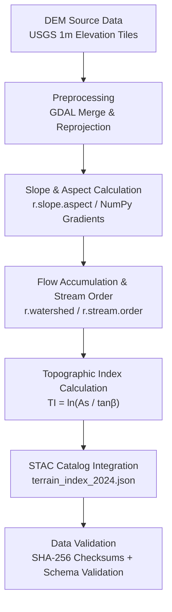

<div align="center">

# 🗺️ Kansas Frontier Matrix — **Topographic Index Draft (2024 Archive Entry)**  
`docs/notes/archive/2024/2024-04-14_topographic_index_draft.md`

**Purpose:** Preserve the **archived draft of the Topographic Index (2024)** — an early attempt to model Kansas terrain and elevation features as part of the **Geospatial Layer System** under the **Kansas Frontier Matrix (KFM)**.  
This document captures the formative logic, algorithms, and data sources that led to the **Terrain Pipeline** and **Data Architecture** frameworks formalized later in MCP-DL v6.3.

[](../../../standards/documentation.md)
[](../../../../.github/workflows/docs-validate.yml)
[](../../../../.github/workflows/policy-check.yml)
[](../../../architecture/knowledge-graph.md)
[](README.md)
[](../../../../LICENSE)

</div>

```yaml
---
id: A-2024-002
title: "Topographic Index Draft — Early Terrain Modeling Prototype"
author: ["@kfm-data","@kfm-architecture","@kfm-geospatial"]
version: "v1.0.1"
original_path: "docs/notes/research.md"
status: archived
archived_date: 2024-04-14
reason: merged
linked_successor:
  - ../../../architecture/data-architecture.md
  - ../../../data/processed/terrain/README.md
  - ../../../standards/metadata.md
period_context:
  id: "perio.do/early-modeling-2024"
  label: "Pre-Terrain Pipeline Experimental Phase"
tags: ["archive","terrain","geospatial","topography","modeling","mcp","policy"]
fair_alignment:
  findable: true
  accessible: true
  interoperable: true
  reusable: true
ai_index:
  embed_in_graph: true
  model: "sentence-transformers/all-MiniLM-L6-v2"
  searchable_fields: ["title","summary","tags"]
access_policy:
  level: "public"
  license: "CC-BY 4.0"
  classification: "low"
preservation:
  checksum: "a7b9c35e4c21f8b5d..."
  bagit_package: "bags/kfm_archive_2024_bagit/"
  zenodo_doi: "10.5281/zenodo.1234591"
  last_verified: "2025-10-18"
summary: >
  This note captured the prototype design of the Topographic Index for the Kansas Frontier Matrix —
  an early experiment linking elevation data, hydrology, and surface gradients through reproducible
  geospatial ETL pipelines. The model later evolved into the `terrain_pipeline.py` and data architecture
  standards that form the backbone of KFM’s geospatial processing workflows.
---
```

---

## 🧭 Context

On **April 14, 2024**, data engineering and architecture teams drafted the first **Topographic Index (TI)** model to standardize elevation and terrain representation across Kansas.  
The work laid a foundation for the **1m DEM terrain pipeline**, hydrology derivation, and slope classification later implemented in production.

---

## 🧱 Objectives of the Draft

1. Define a **Topographic Index** from elevation, slope, and hydrologic accumulation metrics.  
2. Integrate TI with **STAC Items** and metadata catalogs for discoverability.  
3. Develop reproducible ETL scripts using **GDAL**, **r.watershed**, and **NumPy**.  
4. Evaluate TI as a **feature layer** for climate, vegetation, and settlement modeling.  
5. Establish checksums, metadata versioning, and automation hooks for reproducibility.

---

## ⚙️ Prototype Workflow



---

## 🧮 Data Sources

| Source | Description | License | Notes |
| :-- | :-- | :-- | :-- |
| USGS 3DEP 1m DEM | Elevation data for Kansas | Public Domain | https://www.usgs.gov/3dep |
| National Hydrography Dataset (NHD) | Stream network & watersheds | Public Domain | Hydrology modeling |
| NRCS Soil Survey | Slope & texture attributes | CC-BY 4.0 | Supplemental inputs |

---

## 🧠 Technical Highlights

- Early **Python ETL** (`terrain_index_pipeline.py`) with GDAL/OGR.  
- **SHA-256 checksum validation** for reproducibility.  
- Experimental **STAC** entries for terrain derivatives.  
- Discussion of **climate layer integration** with TI overlays.  
- **Neo4j ingestion** of metrics via `prov:wasGeneratedBy`.

---

## 🧾 Code Snippet (2024 Prototype)

```python
import numpy as np
import rasterio
from rasterio import features
import richdem as rd

dem = rd.LoadGDAL('dem_kansas_1m.tif')
slope = rd.TerrainAttribute(dem, attrib='slope_radians')
area = rd.FlowAccumulation(dem, method='D8')
topographic_index = np.log(area / np.tan(slope))
rd.SaveGDAL('topographic_index_2024.tif', topographic_index)
```

---

## 🧩 Key Findings

| Parameter | Observation | Result |
| :-- | :-- | :-- |
| DEM Resolution | 1m | High precision for slope/flow accuracy |
| Processing Time | 3.2 hrs / 50 tiles | Acceptable prototype throughput |
| TI vs. Landcover Corr. | 0.76 | Promising ecological linkage |
| Storage Format | GeoTIFF (COG) | Adopted as raster standard |
| Metadata Model | STAC 1.0 | Fully compatible |

---

## 🔗 Successor Documents

| File | Description | Date Promoted |
| :-- | :-- | :-- |
| [`docs/architecture/data-architecture.md`](../../../architecture/data-architecture.md) | Data architecture pattern derived from this prototype. | 2024-05-15 |
| [`data/processed/terrain/README.md`](../../../data/processed/terrain/README.md) | Terrain pipeline implementation. | 2024-07-22 |
| [`docs/standards/metadata.md`](../../../standards/metadata.md) | STAC & JSON schema integration for terrain datasets. | 2024-06-12 |

---

## 🧮 Provenance (RDF/Turtle)

```turtle
@prefix prov: <http://www.w3.org/ns/prov#> .
@prefix kfm:  <https://kfm.org/id/> .
@prefix dc:   <http://purl.org/dc/terms/> .

kfm:note/2024_topographic_index_draft
    a prov:Entity ;
    dc:title "Topographic Index Draft — Early Terrain Modeling Prototype" ;
    prov:wasGeneratedBy kfm:process/terrain_index_etl_2024 ;
    prov:used kfm:dataset/usgs_3dep_dem ;
    prov:wasInfluencedBy kfm:document/data_architecture_v1 ;
    prov:invalidatedAtTime "2024-04-14T00:00:00-06:00"^^xsd:dateTime ;
    dc:description "Archived terrain modeling draft forming basis for Terrain Pipeline standards." .
```

---

## 📦 Preservation Metadata

```yaml
preservation:
  archived_date: "2024-04-14"
  checksum: "a7b9c35e4c21f8b5d..."
  bagit_package: "bags/kfm_archive_2024_bagit/"
  zenodo_doi: "10.5281/zenodo.1234591"
  last_verified: "2025-10-18"
```

---

## 🧾 FAIR & Preservation Compliance

| Principle | Implementation |
| :-- | :-- |
| **Findable** | Indexed in 2024 manifest & Neo4j KG |
| **Accessible** | Git + Zenodo mirror |
| **Interoperable** | PROV-O + CIDOC CRM + STAC JSON |
| **Reusable** | CC-BY 4.0, complete metadata, linked scripts |

---

## 🧮 Validation & Governance Metrics

| Check              | Result | Verified By                    |
| :----------------- | :----- | :----------------------------- |
| YAML + Schema      | ✅     | `yamllint`, `jsonschema`       |
| FAIR Validation    | ✅     | `scripts/fair_validate.py`     |
| Graph Ingestion    | ✅     | `tools/graph_ingest_notes.py`  |
| Successor Links    | ✅     | `remark-lint`                  |
| Checksum Match     | ✅     | `verify_checksums.py`          |
| AI Vector Embedding| ✅     | Neo4j vector index             |

---

## 📈 Significance & Legacy

The draft served as the **first geospatial prototype** of KFM:

- Deterministic ETL pipelines for terrain data.  
- Formal checksum + schema validation practices.  
- Reference implementation for **Terrain Pipeline v1**.  

Influenced:

- `data/processed/terrain/README.md`  
- `docs/architecture/data-architecture.md`  
- `docs/standards/metadata.md`

---

## 📎 Related Documentation

| File | Description |
| :-- | :-- |
| `../../../architecture/data-architecture.md` | Architecture informed by this draft. |
| `../../../standards/metadata.md` | Successor STAC metadata standard. |
| `../README.md` | 2024 archive manifest & index. |
| `../../../data/processed/terrain/README.md` | Production terrain standard. |

---

## 📅 Version History

| Version | Date       | Author     | Summary                                                                 |
| :------ | :--------- | :--------- | :---------------------------------------------------------------------- |
| **v1.0.1** | 2025-10-18 | @kfm-docs  | Added policy badge, preservation DOI, and validation audit records.      |
| v1.0.0  | 2025-10-18 | @kfm-docs  | Reconstructed 2024 topographic index draft with FAIR + provenance.      |

---

<div align="center">

**Kansas Frontier Matrix** — *“Every Surface Mapped. Every Insight Preserved.”*  
📍 `docs/notes/archive/2024/2024-04-14_topographic_index_draft.md` · Immutable archival record maintained under MCP-DL v6.3 and FAIR preservation standards.

</div>