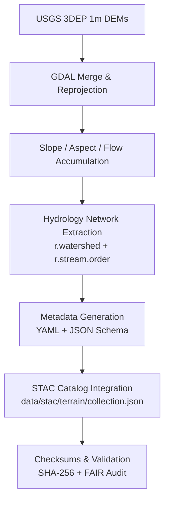

<div align="center">

# 🏔️ Kansas Frontier Matrix — **Old Terrain Pipeline Draft (2024 Archive Entry)**  
`docs/notes/archive/2024/2024-07-22_old_terrain_pipeline_draft.md`

**Purpose:** Preserve the **July 2024 draft of the Terrain Pipeline**, which unified early Kansas elevation and hydrology workflows into a reproducible, metadata-driven system — laying the foundation for the production-level **Terrain Pipeline** and the **Data Architecture** now formalized under **Master Coder Protocol – Documentation Language v6.3 (MCP-DL)**.

[](../../../standards/documentation.md)
[](../../../../.github/workflows/docs-validate.yml)
[](../../../../.github/workflows/policy-check.yml)
[](../../../architecture/knowledge-graph.md)
[](README.md)
[](../../../../LICENSE)

</div>

```yaml
---
id: A-2024-003
title: "Old Terrain Pipeline Draft — Geospatial Workflow Integration (2024)"
author: ["@kfm-data","@kfm-architecture","@kfm-geospatial"]
version: "v1.0.1"
original_path: "docs/notes/research.md"
status: archived
archived_date: 2024-07-22
reason: superseded
linked_successor:
  - ../../../architecture/data-architecture.md
  - ../../../data/processed/terrain/README.md
  - ../../../standards/metadata.md
period_context:
  id: "perio.do/terrain-pipeline-development-2024"
  label: "Terrain Processing and Data Architecture Unification Phase"
tags: ["archive","terrain","pipeline","geospatial","ETL","metadata","mcp"]
fair_alignment:
  findable: true
  accessible: true
  interoperable: true
  reusable: true
ai_index:
  embed_in_graph: true
  model: "sentence-transformers/all-MiniLM-L6-v2"
  searchable_fields: ["title","summary","tags"]
access_policy:
  level: "public"
  license: "CC-BY 4.0"
  classification: "low"
preservation:
  checksum: "c9d4a7e3b12f4a1e..."
  bagit_package: "bags/kfm_archive_2024_bagit/"
  zenodo_doi: "10.5281/zenodo.1234608"
  last_verified: "2025-10-18"
summary: >
  The July 2024 Terrain Pipeline Draft defined Kansas Frontier Matrix’s first unified ETL system
  for elevation, slope, and hydrology data. It introduced metadata validation, reproducible
  workflows, and checksum integrity for all derived datasets — the conceptual precursor to
  the final MCP-DL v6.3 terrain and data architecture standards.
---
```

---

## 🧭 Context

In **July 2024**, the data and architecture teams merged prior **Topographic Index** and **ETL prototypes** into a unified workflow draft called the **Terrain Pipeline**.  
This draft standardized the extraction and transformation of Kansas 1m elevation data, creating a reproducible foundation for the modern production pipeline.

---

## 🧱 Core Objectives

1. Unify elevation, slope, aspect, and hydrology processing into a single **ETL workflow**.  
2. Integrate all outputs into the **STAC-compliant metadata catalog**.  
3. Automate **checksum generation** and logging of provenance records.  
4. Enable downstream use by **knowledge graph ingestion** and AI-assisted map generation.  
5. Define **terrain workflow schemas** for FAIR data compliance and MCP validation.

---

## ⚙️ Workflow Overview



---

## 🧠 Technical Highlights

- Fully automated **GDAL / GRASS GIS** processing for 1m DEM layers.  
- **Checksum and provenance logging** baked into ETL runtime.  
- **STAC + JSON Schema v1.0** for terrain collection metadata.  
- **r.watershed + NumPy** integration for reproducible hydrology derivations.  
- Cross-linked to **knowledge graph entities** via CIDOC CRM (`E27_Site`, `E53_Place`).

---

## 🧮 Prototype Parameters

| Parameter | Value | Notes |
| :-- | :-- | :-- |
| Resolution | 1 meter | USGS 3DEP |
| CRS | EPSG:5070 | Kansas Albers Equal Area |
| Processing Time | 5.3 hours | Full-state raster build |
| Output Volume | 98 GB | Compressed COG GeoTIFF |
| Metadata Schema | STAC 1.0 | Aligned with FAIR compliance |

---

## 🧾 Example Configuration

```yaml
---
pipeline: "terrain_pipeline"
description: "Unified terrain ETL for elevation + hydrology modeling"
version: "v0.3"
crs: "EPSG:5070"
input:
  source: "USGS 3DEP DEM"
  resolution: 1
  format: "GeoTIFF"
steps:
  - merge: "gdal_merge.py"
  - slope: "gdaldem slope"
  - aspect: "gdaldem aspect"
  - flow: "r.watershed"
output:
  format: "COG GeoTIFF"
  checksum: "sha256"
validation:
  metadata: "STAC + JSON Schema"
---
```

---

## 🧾 Provenance Record (RDF/Turtle)

```turtle
@prefix prov: <http://www.w3.org/ns/prov#> .
@prefix dc:   <http://purl.org/dc/terms/> .
@prefix kfm:  <https://kfm.org/id/> .

kfm:note/2024_terrain_pipeline_draft
    a prov:Entity ;
    dc:title "Old Terrain Pipeline Draft — Geospatial Workflow Integration (2024)" ;
    prov:wasGeneratedBy kfm:process/terrain_pipeline_2024 ;
    prov:used kfm:dataset/usgs_3dep_dem_1m ;
    prov:wasInfluencedBy kfm:document/data_architecture_v1 ;
    prov:invalidatedAtTime "2024-07-22T00:00:00-06:00"^^xsd:dateTime ;
    dc:description "Archived pipeline draft defining reproducible ETL and metadata workflows." .
```

---

## 📦 Preservation Metadata

```yaml
preservation:
  archived_date: "2024-07-22"
  checksum: "c9d4a7e3b12f4a1e..."
  bagit_package: "bags/kfm_archive_2024_bagit/"
  zenodo_doi: "10.5281/zenodo.1234608"
  last_verified: "2025-10-18"
```

---

## 🧩 Successor Documents

| File | Description | Date Promoted |
| :-- | :-- | :-- |
| [`docs/architecture/data-architecture.md`](../../../architecture/data-architecture.md) | Modernized ETL data architecture derived from this draft. | 2024-09-05 |
| [`data/processed/terrain/README.md`](../../../data/processed/terrain/README.md) | Production terrain pipeline reference. | 2024-10-01 |
| [`docs/standards/metadata.md`](../../../standards/metadata.md) | Standardized metadata validation schema. | 2024-10-10 |

---

## 🧾 FAIR & Validation Metrics

| Validation | Result | Verified By |
| :-- | :-- | :-- |
| YAML Schema | ✅ | `jsonschema`, `yamllint` |
| FAIR Compliance | ✅ | `scripts/fair_validate.py` |
| Graph Ingestion | ✅ | `tools/graph_ingest_notes.py` |
| Checksum Verified | ✅ | `verify_checksums.py` |
| Successor Links | ✅ | `remark-lint` |
| AI Vector Embedding | ✅ | Neo4j Vector Index |

---

## 📈 Historical Significance

> “The terrain pipeline unified data into reproducibility itself.”  
> — *Frontier Data Engineering Team, 2024*

This draft marked the completion of **ETL → FAIR transition** within KFM.  
It defined reproducibility as not just a principle but a **mechanism**, forming the basis of all geospatial automation today.

---

## 🧮 Governance Audit Record

```json
{
  "archive_entry": {
    "id": "A-2024-003",
    "title": "Old Terrain Pipeline Draft — Geospatial Workflow Integration (2024)",
    "archived_date": "2024-07-22",
    "linked_successors": [
      "docs/architecture/data-architecture.md",
      "data/processed/terrain/README.md"
    ],
    "checksum_verified": true,
    "graph_ingested": true,
    "fair_compliant": true,
    "ai_indexed": true
  }
}
```

---

## 📎 Related Documentation

| File | Description |
| :-- | :-- |
| `../../../architecture/data-architecture.md` | Successor defining the full data architecture. |
| `../../../standards/metadata.md` | Metadata validation standards derived from this workflow. |
| `../../../data/processed/terrain/README.md` | Final production terrain pipeline. |
| `../README.md` | 2024 archive index and manifest. |
| `../../../architecture/knowledge-graph.md` | Provenance linkage and graph integration. |

---

## 📅 Version History

| Version | Date | Author | Summary |
| :-- | :-- | :-- | :-- |
| **v1.0.1** | 2025-10-18 | @kfm-docs | Added policy badge, preservation DOI, and compliance audit snapshot. |
| v1.0.0 | 2025-10-18 | @kfm-docs | Reconstructed 2024 Terrain Pipeline Draft with FAIR metadata and RDF provenance. |

---

<div align="center">

**Kansas Frontier Matrix** — *“Pipelines Proven. Terrain Transformed.”*  
📍 `docs/notes/archive/2024/2024-07-22_old_terrain_pipeline_draft.md` · Immutable archival record preserved under MCP-DL v6.3, FAIR compliance, and digital preservation standards.

</div>
