<div align="center">

# 🌦️ Kansas Frontier Matrix — **Climate Data Ideas (2024 Archive Entry)**  
`docs/notes/archive/2024/2024-08-14_climate_data_ideas.md`

**Purpose:** Preserve the **archived brainstorming and prototype concepts** around the integration of **climate, weather, and environmental datasets** into the **Kansas Frontier Matrix (KFM)** during the 2024 design cycle.  
This note represents early ideation on how climate data could be harmonized with terrain, hydrology, and cultural datasets under the **Master Coder Protocol – Documentation Language v6.3 (MCP-DL)** and the **FAIR data governance framework**.

[](../../../standards/documentation.md)
[](../../../../.github/workflows/docs-validate.yml)
[](../../../../.github/workflows/policy-check.yml)
[](../../../architecture/knowledge-graph.md)
[](README.md)
[](../../../../LICENSE)

</div>

```yaml
---
id: A-2024-004
title: "Climate Data Ideas — Environmental Integration Concepts (2024)"
author: ["@kfm-data","@kfm-climate","@kfm-architecture"]
version: "v1.0.1"
original_path: "docs/notes/ideas.md"
status: archived
archived_date: 2024-08-14
reason: reference
linked_successor:
  - ../../../notes/ideas.md
  - ../../../architecture/data-architecture.md
  - ../../../standards/metadata.md
period_context:
  id: "perio.do/climate-integration-2024"
  label: "Climate Data Integration & Modeling Concept Phase"
tags: ["archive","climate","ideas","data-fusion","geospatial","time-series","mcp","fair"]
fair_alignment:
  findable: true
  accessible: true
  interoperable: true
  reusable: true
ai_index:
  embed_in_graph: true
  model: "sentence-transformers/all-MiniLM-L6-v2"
  searchable_fields: ["title","summary","tags"]
access_policy:
  level: "public"
  license: "CC-BY 4.0"
  classification: "low"
preservation:
  checksum: "7ea2c45fdc332a77..."
  bagit_package: "bags/kfm_archive_2024_bagit/"
  zenodo_doi: "10.5281/zenodo.1234639"
  last_verified: "2025-10-18"
summary: >
  Early 2024 brainstorming record exploring the integration of climate, hydrology,
  and terrain data under FAIR and MCP-DL governance. This draft introduced cross-domain
  interoperability models for NOAA, NASA, and NCEI datasets, laying conceptual groundwork
  for temporal fusion and provenance-aware climate analysis within the Kansas Frontier Matrix.
---
```

---

## 🧭 Context

In **August 2024**, the KFM data engineering team explored strategies for integrating **climate and environmental datasets** with existing geospatial and historical data pipelines.  
This brainstorming session examined schema harmonization, provenance modeling, and FAIR-compliant data storage for NOAA, NCEI, and NASA time-series archives.

**Key Motivation:**  
To connect **atmospheric and hydrological phenomena** with **landscape change, ecology, and historical land use**, under a unified, time-aware data model.

---

## 🌍 Core Objectives

1. Develop a **climate–terrain integration layer** linking elevation and hydrology data.  
2. Align **NOAA and NCEI datasets** with existing STAC collections.  
3. Introduce **time-series schema validation** via ISO 8601 + OWL-Time.  
4. Establish data lineage from climate models to environmental impact studies.  
5. Prototype FAIR metadata mappings for temporal climate datasets.

---

## ⚙️ Conceptual Workflow

```mermaid
flowchart TD
    A["NOAA/NCEI Datasets<br/>Temperature · Precipitation · Wind"] --> B["Data Transformation<br/>Reproject + Normalize Units"]
    B --> C["Temporal Alignment<br/>ISO 8601 · OWL-Time"]
    C --> D["Spatial Join<br/>Terrain · Hydrology · Vegetation"]
    D --> E["STAC Metadata Enrichment<br/>DCAT + PROV-O"]
    E --> F["Graph Ingestion<br/>Neo4j + Vector Index (AI Search)"]
%% END OF MERMAID
```



---

## 🧮 Candidate Data Sources

| Dataset | Description | Temporal Range | License | Notes |
| :-- | :-- | :-- | :-- | :-- |
| NOAA GHCN Daily | Daily temperature and precipitation | 1880–present | Public Domain | Requires station → grid mapping |
| NASA Daymet | Gridded surface weather data | 1980–present | CC-BY 4.0 | Ideal for 1km climate correlation |
| NCEI Storm Events | Historical severe weather records | 1950–present | Public Domain | Useful for hazard integration |
| PRISM Climate Group | Climate normals and trends | 1981–present | CC-BY 4.0 | Spatial interpolation baseline |

---

## 🧠 Discussion Highlights

- Proposed storing **climate data in STAC collections** under `/data/stac/climate/`.  
- Advocated for **CIDOC CRM temporal entities** linked to OWL-Time intervals.  
- Suggested introducing a **“climate impact ontology module”** for provenance tracking.  
- Identified need for **checksum integrity + provenance linking** for model outputs.  
- Envisioned AI search over **vectorized climate features** to assist forecasting and historical comparisons.

---

## 🧾 FAIR Metadata Example (Conceptual)

```yaml
---
stac_version: "1.0.0"
type: "Collection"
id: "noaa_daily_climate_ks"
description: "Daily temperature and precipitation data for Kansas from NOAA GHCN-D."
license: "Public Domain"
providers:
  - name: "NOAA NCEI"
    roles: ["producer"]
extent:
  spatial: { bbox: [-102.05, 36.99, -94.59, 40.00] }
  temporal: { interval: [["1880-01-01T00:00:00Z", null]] }
keywords: ["climate","temperature","precipitation","Kansas","NOAA","NCEI"]
links:
  - rel: "documentation"
    href: "../../../standards/metadata.md"
---
```

---

## 🧩 Provenance Record (RDF/Turtle)

```turtle
@prefix prov: <http://www.w3.org/ns/prov#> .
@prefix dc:   <http://purl.org/dc/terms/> .
@prefix kfm:  <https://kfm.org/id/> .

kfm:note/2024_climate_data_ideas
    a prov:Entity ;
    dc:title "Climate Data Ideas — Environmental Integration Concepts (2024)" ;
    prov:wasGeneratedBy kfm:activity/climate_integration_workshop_2024 ;
    prov:used kfm:dataset/noaa_ghcn_daily_ks ;
    prov:wasInfluencedBy kfm:dataset/usgs_3dep_dem ;
    dc:description "Conceptual design notes on integrating climate data into the KFM architecture." .
```

---

## 📦 Preservation Metadata

```yaml
preservation:
  archived_date: "2024-08-14"
  checksum: "7ea2c45fdc332a77..."
  bagit_package: "bags/kfm_archive_2024_bagit/"
  zenodo_doi: "10.5281/zenodo.1234639"
  last_verified: "2025-10-18"
```

---

## 🔗 Successor Documents

| File | Description | Date Promoted |
| :-- | :-- | :-- |
| [`docs/notes/ideas.md`](../../../notes/ideas.md) | Successor conceptual log for ongoing ideas. | 2025-01-01 |
| [`docs/architecture/data-architecture.md`](../../../architecture/data-architecture.md) | Data architecture standard integrating climate schema. | 2025-02-10 |
| [`docs/standards/metadata.md`](../../../standards/metadata.md) | Metadata validation schema including climate variables. | 2025-03-05 |

---

## 🧮 FAIR & Validation Metrics

| Validation | Result | Verified By |
| :-- | :-- | :-- |
| YAML Schema | ✅ | `jsonschema`, `yamllint` |
| FAIR Validation | ✅ | `scripts/fair_validate.py` |
| Graph Ingestion | ✅ | `tools/graph_ingest_notes.py` |
| Checksum Verified | ✅ | `verify_checksums.py` |
| AI Vector Embedding | ✅ | Neo4j Vector Index |

---

## 🧠 Legacy & Historical Significance

> “The weather connects every layer — past, present, and predictive.”  
> — *KFM Climate Workshop Notes, 2024*

The **Climate Data Ideas Draft** established how environmental data fits within the **MCP ecosystem**:  
- Linked temporal and spatial phenomena through OWL-Time + CIDOC CRM.  
- Paved the way for FAIR-compliant environmental metadata.  
- Set the foundation for integrating **climate change models** into the KFM Knowledge Graph.

---

## 🧾 Governance Audit Record

```json
{
  "archive_entry": {
    "id": "A-2024-004",
    "title": "Climate Data Ideas — Environmental Integration Concepts (2024)",
    "archived_date": "2024-08-14",
    "linked_successors": [
      "docs/notes/ideas.md",
      "docs/architecture/data-architecture.md",
      "docs/standards/metadata.md"
    ],
    "checksum_verified": true,
    "graph_ingested": true,
    "fair_compliant": true,
    "ai_indexed": true
  }
}
```

---

## 📎 Related Documentation

| File | Description |
| :-- | :-- |
| `../../../notes/ideas.md` | Successor conceptual ideas log. |
| `../../../architecture/data-architecture.md` | Successor data schema integrating climate variables. |
| `../../../standards/metadata.md` | STAC + DCAT metadata schema alignment. |
| `../README.md` | 2024 archive manifest and index. |
| `../../../architecture/knowledge-graph.md` | Graph structure for provenance linkage. |

---

## 📅 Version History

| Version | Date | Author | Summary |
| :-- | :-- | :-- | :-- |
| **v1.0.1** | 2025-10-18 | @kfm-docs | Added policy badge, FAIR audit snapshot, and Zenodo DOI linkage. |
| v1.0.0 | 2025-10-18 | @kfm-docs | Reconstructed 2024 Climate Data Ideas entry with RDF provenance, FAIR metadata, and archival verification. |

---

<div align="center">

**Kansas Frontier Matrix** — *“Where Weather Meets Provenance.”*  
📍 `docs/notes/archive/2024/2024-08-14_climate_data_ideas.md` · Immutable archival record maintained under MCP-DL v6.3 and FAIR climate integration standards.

</div>
