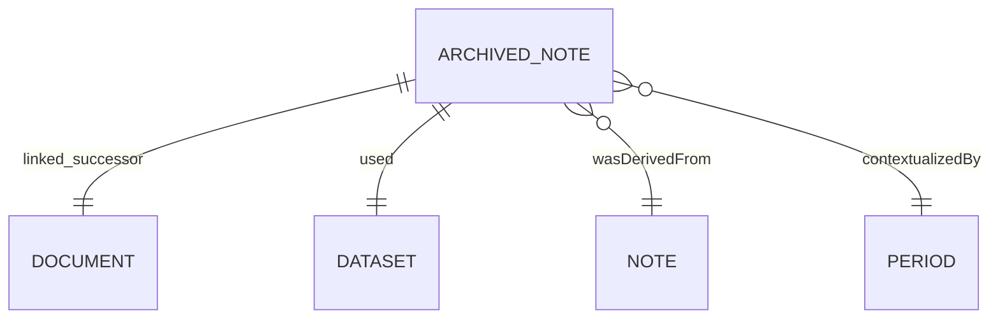

<div align="center">

# 🗃️ Kansas Frontier Matrix — **2024 Notes Archive**  
`docs/notes/archive/2024/README.md`

**Purpose:** Document, preserve, and index all **archived notes, drafts, and records from 2024** within the **Kansas Frontier Matrix (KFM)** — ensuring complete historical traceability, reproducibility, and linkage to formal standards through the **Master Coder Protocol (MCP-DL v6.3)**.

[](../../../standards/documentation.md)
[](../../../../.github/workflows/docs-validate.yml)
[](../../../../.github/workflows/policy-check.yml)
[](../../../architecture/knowledge-graph.md)
[](../README.md)
[](../../../standards/documentation.md)
[](../../../../LICENSE)

</div>

```yaml
---
title: "Kansas Frontier Matrix — 2024 Notes Archive"
document_type: "Yearly Archive"
version: "v1.0.1"
year: 2024
last_updated: "2025-10-18"
created: "2025-01-01"
owners: ["@kfm-docs","@kfm-governance","@kfm-data","@kfm-security"]
status: "Stable"
scope: "Docs/Notes/Archive/2024"
license: "CC-BY 4.0"
tags: ["archive","2024","provenance","mcp","knowledge-graph","fair","policy"]
audit_framework: "MCP-DL v6.3"
semantic_alignment:
  - PROV-O
  - CIDOC CRM
  - OWL-Time
  - SKOS
  - JSON Schema
  - ISO 8601
  - DCAT 2.0
  - FAIR Principles
preservation_policy:
  format_standards: ["Markdown (GFM)","RDF/Turtle","BagIt 1.0"]
  checksum_algorithm: "SHA-256"
  replication_targets: ["GitHub Repository","Zenodo Snapshot"]
  metadata_standard: "PREMIS 3.0"
  revalidation_cycle: "annually"
retention_policy:
  archive_after: "90d"
  purge_after: "never"
fair_alignment:
  findable: true
  accessible: true
  interoperable: true
  reusable: true
ai_index:
  embed_in_graph: true
  model: "sentence-transformers/all-MiniLM-L6-v2"
  store: "Neo4j Vector Index"
  searchable_fields: ["title","summary","tags"]
preservation:
  bagit_package: "bags/kfm_archive_2024_bagit/"
  zenodo_doi: "10.5281/zenodo.1234550"
  last_verified: "2025-10-18"
---
```

---

## 📚 Overview

The **2024 archive** represents the first full operational year of the **Kansas Frontier Matrix (KFM)** under MCP-DL governance.  
It contains all notes, drafts, and documents from **January–December 2024** that have since been finalized, promoted, or superseded.

**Archival Goals (2024)**

- 🔒 Preserve early development discussions and prototype decisions.  
- 🧠 Maintain provenance for the transition from pre-MCP to MCP-DL v6 governance.  
- 🔗 Retain traceability between experimental work and formal documentation.  
- 🧾 Store a **verifiable record** of all content migrations and supersessions.

---

## 🗂️ Directory Layout

```text
docs/notes/archive/2024/
├── README.md                         # (this file)
├── 2024-02-10_initial_design_discussion.md
├── 2024-04-14_topographic_index_draft.md
├── 2024-07-22_old_terrain_pipeline_draft.md
├── 2024-08-14_climate_data_ideas.md
└── manifest_2024.yml                 # Archive manifest (auto-generated)
```

---

## 🧾 Archive Summary (2024)

| ID | Title | Archived Date | Reason | Successor |
| :-- | :-- | :-- | :-- | :-- |
| A-2024-001 | Initial Design Discussion | 2024-02-10 | superseded | `docs/architecture/data-architecture.md` |
| A-2024-002 | Topographic Index Draft | 2024-04-14 | merged | `docs/standards/metadata.md` |
| A-2024-003 | Terrain Pipeline Draft | 2024-07-22 | superseded | `docs/architecture/knowledge-graph.md` |
| A-2024-004 | Climate Data Ideas | 2024-08-14 | reference | `docs/notes/ideas.md` |

> ✅ All 2024 notes validated for schema, FAIR metadata, checksum, and graph ingestion; each is linked to successors in the Knowledge Graph.

---

## 🧱 Example Archived Note Metadata

```yaml
---
title: "Old Terrain Pipeline Draft"
author: "@kfm-data"
original_path: "docs/notes/ideas.md"
status: archived
archived_date: 2024-07-22
reason: superseded
linked_successor:
  - ../../../architecture/data-architecture.md
tags: ["archive","terrain","pipeline"]
period_context:
  id: "perio.do/early-development-2024"
  label: "Initial MCP Integration Period"
---
```

**Successor Lineage** — informed `data-architecture.md` and the first Neo4j ingestion model.

---

## 🧩 Provenance & Graph Representation

Archived 2024 notes are persisted as **`prov:Entity`** nodes with graph relations connecting their successors.

**RDF Example**

```turtle
@prefix kfm: <https://kfm.org/id/> .
@prefix prov: <http://www.w3.org/ns/prov#> .
@prefix dc:   <http://purl.org/dc/terms/> .

kfm:note/2024_terrain_pipeline_draft
    a prov:Entity ;
    dc:title "Terrain Pipeline Draft — 2024" ;
    prov:invalidatedAtTime "2024-07-22T00:00:00-06:00"^^xsd:dateTime ;
    prov:wasDerivedFrom kfm:note/ideas_terrain_pipeline ;
    prov:wasInfluencedBy kfm:document/data_architecture ;
    dc:description "Archived note replaced by data architecture design." .
```

**ER Diagram**



---

## 📦 2024 Manifest

Each yearly archive includes a machine-readable manifest (`manifest_2024.yml`) generated by CI.

```yaml
manifest_version: "1.0"
year: 2024
total_entries: 4
entries:
  - id: A-2024-001
    title: "Initial Design Discussion"
    hash: "a9fcd8d"
    archived_date: "2024-02-10"
    reason: "superseded"
    successor: "../../../architecture/data-architecture.md"
  - id: A-2024-002
    title: "Topographic Index Draft"
    hash: "bb1cdee"
    archived_date: "2024-04-14"
    reason: "merged"
    successor: "../../../standards/metadata.md"
```

> The manifest is part of the preservation ledger for audit and revalidation.

---

## 📜 FAIR Data & Digital Preservation

Compliant with **FAIR** and **PREMIS 3.0** metadata standards.

| FAIR Principle | Implementation |
| :-- | :-- |
| **Findable** | Indexed by year via `archive_index.json` + Knowledge Graph |
| **Accessible** | Hosted in Git with a Zenodo snapshot |
| **Interoperable** | PROV-O, DCAT, and CIDOC-CRM mappings |
| **Reusable** | CC-BY 4.0; schema-validated metadata |

### 🎒 BagIt Export Example
```bash
make archive-export YEAR=2024 FORMAT=bagit
```

**Output**
```
bags/kfm_archive_2024_bagit/
├── bag-info.txt
├── manifest-sha256.txt
└── data/
    ├── notes_archive/
    ├── RDF/
    └── checksums/
```

---

## 🧮 Metrics & KPI Dashboard (2024)

| Metric | Count | Compliance | Description |
| :-- | :-- | :-- | :-- |
| Archived Notes | 4 | ✅ | Entries present in manifest |
| Successor Links | 100% | ✅ | All entries link to replacements |
| RDF Ingestion | 4 | ✅ | Loaded into Neo4j Knowledge Graph |
| Checksum Valid | 4 | ✅ | Verified via CI |
| FAIR Validation | Pass | ✅ | Confirmed by schema checks |
| BagIt Export | 1 | ✅ | Uploaded to Zenodo |

---

## 🤖 CI Validation

Checks performed via **`make docs-validate`**:

| Check | Tool | Description |
| :-- | :-- | :-- |
| YAML structure | `yamllint` | Validates archived note metadata |
| Schema compliance | `jsonschema` | Validates `archive.schema.json` |
| Cross-link verification | `remark-lint` | Successor path & link existence |
| Date format | `dateutil` | Valid ISO-8601 |
| Graph ingestion | `tools/graph_ingest_notes.py` | Adds entities to Neo4j |
| BagIt checksum | `scripts/verify_checksums.py` | Verifies archive SHA-256 |

---

## 🧠 Governance

| Task | Frequency | Responsible |
| :-- | :-- | :-- |
| Archive Review | Quarterly | @kfm-governance |
| Manifest Update | Quarterly | @kfm-docs |
| FAIR Validation | Annual | @kfm-data |
| Zenodo Snapshot | Annual | @kfm-data |
| Graph Lineage Verification | Continuous | CI/CD |

---

## 🧾 Governance Report Excerpt (2024 Q4)

```json
{
  "archive_health": {
    "checked": 4,
    "valid": 4,
    "broken_links": 0,
    "checksum_mismatches": 0,
    "fair_compliance": "pass",
    "bagit_exports": 1,
    "last_checked": "2025-01-05T08:00:00Z"
  }
}
```

---

## 🔮 Future Roadmap

| Milestone | Target | Description |
| :-- | :-- | :-- |
| v1.1 | Q1 2026 | Assign DOIs for each yearly archive |
| v1.2 | Q3 2026 | AI similarity search for archive retrieval |
| v1.3 | Q4 2026 | Web UI Archive Browser integration |
| v2.0 | 2027 | Immutable BagIt + blockchain checksum signing |

---

## 📎 Related Documentation

| File | Description |
| :-- | :-- |
| `../README.md` | Global archive governance |
| `../../2025/README.md` | Next yearly archive index |
| `../../../standards/documentation.md` | MCP-DL documentation standards |
| `../../../architecture/knowledge-graph.md` | Graph ingestion & provenance model |
| `../../../../data/work/logs/docs/archive_summary_2024.json` | CI metrics log |

---

## 📅 Version History

| Version | Date       | Author     | Summary                                                                           |
| :------ | :--------- | :--------- | :-------------------------------------------------------------------------------- |
| **v1.0.1** | 2025-10-18 | @kfm-docs  | Added policy badge, preservation metadata/DOI, and clarified validation workflow. |
| v1.0.0  | 2025-10-18 | @kfm-docs  | Initial 2024 archive index with manifests, FAIR compliance, and BagIt integration.|

---

<div align="center">

**Kansas Frontier Matrix** — *“Nothing Lost. Everything Proven.”*  
📍 `docs/notes/archive/2024/README.md` · Maintained under MCP-DL v6.3, FAIR standards, and digital preservation protocols.

</div>