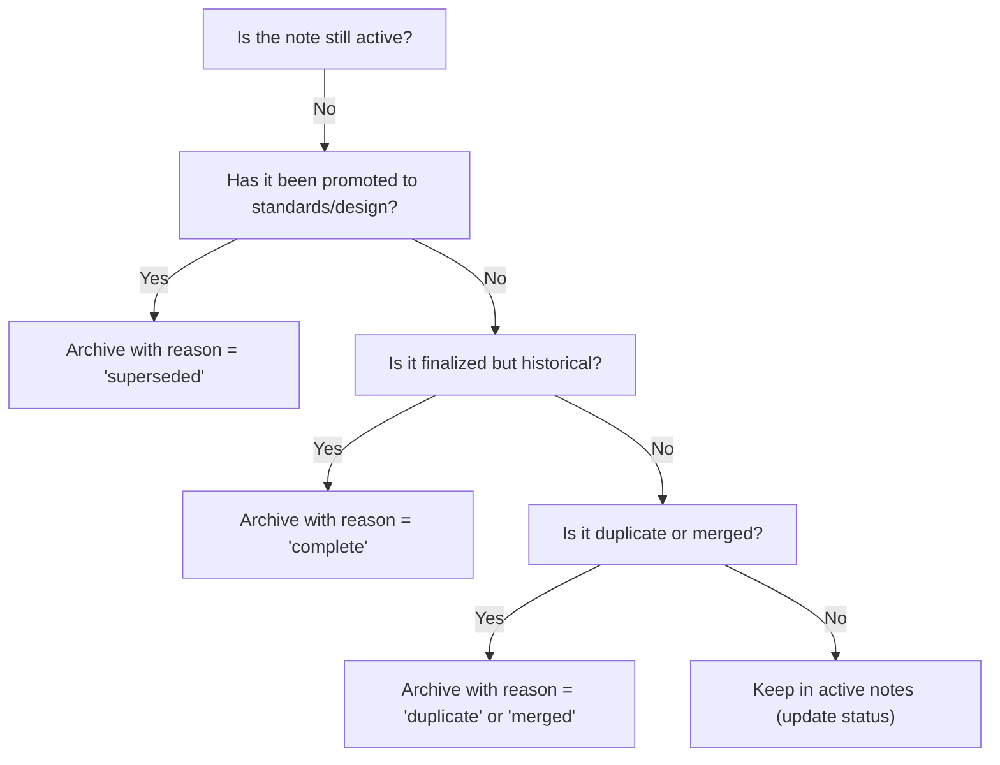
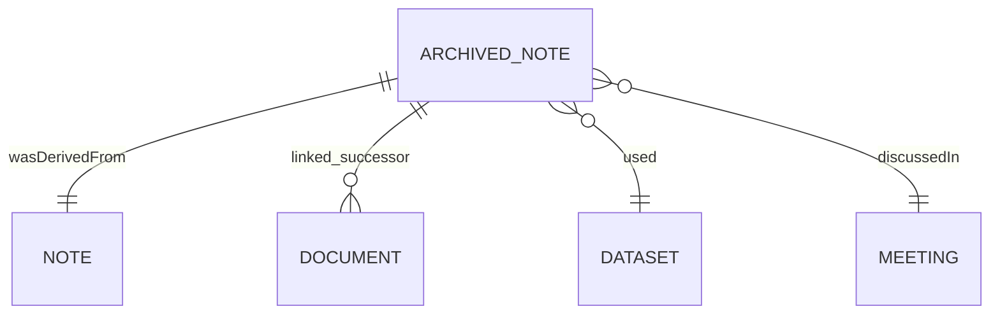

<div align="center">

# 🗃️ Kansas Frontier Matrix — **Notes Archive**  
`docs/notes/archive/README.md`

**Purpose:** Define how archived notes are **preserved, indexed, linked, and queried** in the  
**Kansas Frontier Matrix (KFM)** — ensuring that superseded or deprecated materials retain full  
**provenance, traceability, and version control** under **Master Coder Protocol (MCP-DL v6.3)**.

[](../../standards/documentation.md)
[](../../../.github/workflows/docs-validate.yml)
[](../../../.github/workflows/site.yml)
[](../../architecture/knowledge-graph.md)
[](README.md)
[](../../../LICENSE)

</div>

```yaml
---
title: "Kansas Frontier Matrix — Notes Archive"
document_type: "Archive Guide"
version: "v2.0.0"
last_updated: "2025-10-18"
created: "2025-10-05"
owners: ["@kfm-docs","@kfm-governance","@kfm-architecture"]
status: "Stable"
maturity: "Production"
scope: "Docs/Notes/Archive"
license: "CC-BY 4.0"
semver_policy: "MAJOR.MINOR.PATCH"
tags: ["archive","provenance","governance","mcp","knowledge-graph"]
audit_framework: "MCP-DL v6.3"
ci_required_checks:
  - docs-validate
  - site-build
  - pre-commit
  - codeql
  - trivy
semantic_alignment:
  - PROV-O
  - CIDOC CRM
  - OWL-Time
  - SKOS
  - JSON Schema
  - ISO 8601
schema:
  file: "docs/schemas/archive.schema.json"
  version: "1.0.0"
  validated_by: "jsonschema"
automation:
  - name: "Quarterly Archive Move"
    schedule: "0 8 1 */3 *"
    action: "tools/archive_notes.py"
  - name: "Archive Graph Sync"
    schedule: "0 6 * * MON"
    action: "tools/graph_ingest_notes.py"
retention_policy:
  archive_after: "90d"        # move from active → archive after 90 days of inactivity
  purge_after: "never"        # content retained indefinitely (immutable archive)
ai_assist:
  summarize: false
  embed_in_graph: false
---
```

---

## 📚 Table of Contents

- [Overview](#-overview)  
- [Directory Layout](#-directory-layout)  
- [Archival Process (MCP-DL Workflow)](#-archival-process-mcpdl-workflow)  
- [YAML Metadata for Archived Notes](#-yaml-metadata-for-archived-notes)  
- [Archive Selection Flow](#-archive-selection-flow)  
- [Knowledge Graph Mapping](#-knowledge-graph-mapping)  
- [Archive Rules](#-archive-rules)  
- [Example Archived Note](#-example-archived-note)  
- [CI Integration & Validation](#-ci-integration--validation)  
- [Governance Guidelines](#-governance-guidelines)  
- [Metrics & KPI Dashboard](#-metrics--kpi-dashboard)  
- [Related Documentation](#-related-documentation)  
- [Version History](#-version-history)

---

## 📚 Overview

The `/docs/notes/archive/` directory is a **long-term, read-only vault** for historical discussions, drafts, and design notes that have been **promoted, superseded, finalized, or deprecated**.

Archiving ensures **no loss of institutional memory** while keeping active note spaces focused and performant.

Every archived note remains:

* 🔒 **Immutable** — content is not rewritten; only metadata append allowed (e.g., successor links).  
* 🧾 **Versioned** — full Git history retained.  
* 🔗 **Linked** — to successor docs, datasets, issues/PRs, and decisions.  
* 🧠 **Indexed** — as PROV entities in the Knowledge Graph for provenance queries and audit.

---

## 🗂️ Directory Layout

```text
docs/notes/archive/
├── README.md                     # (this file)
├── 2024/                         # Archive by year (recommended structure)
│   ├── 2024-07-22_old_terrain_pipeline_draft.md
│   └── 2024-08-14_climate_data_ideas.md
├── 2025/
│   ├── 2025-01-10_meeting_notes_v1.md
│   └── 2025-05-03_ontology_discussion.md
└── legacy/                       # Optional: pre-MCP materials
```

> **Tip:** Organize by **year folders**. Prefix filenames with `YYYY-MM-DD_` for stable ordering and machine parsing.

---

## 🧾 Archival Process (MCP-DL Workflow)

| Step | Action | Responsibility |
| :-- | :-- | :-- |
| **1️⃣ Identify** | Note is superseded, promoted, finalized, or obsolete. | Author or Maintainer |
| **2️⃣ Move** | Move file to `docs/notes/archive/<year>/`. | Maintainer |
| **3️⃣ Prefix Rename** | Rename to `YYYY-MM-DD_<kebab-title>.md`. | Maintainer |
| **4️⃣ Update Metadata** | Set `status: archived` and add `archived_date:`. | Author |
| **5️⃣ Link Successor** | Add `linked_successor:` to replacement doc(s). | Author |
| **6️⃣ Commit & Push** | Commit message: `Archive note: <title>`. | Maintainer |
| **7️⃣ Validate** | CI checks YAML, dates, links, and graph sync. | CI/CD |

---

## 🧱 YAML Metadata for Archived Notes

Add/confirm final metadata block in each archived file:

```yaml
---
title: "LiDAR Pipeline Draft — Superseded"
author: "@kfm-data"
original_path: "docs/notes/ideas.md"
status: archived
archived_date: 2025-10-05
reason: superseded           # superseded | duplicate | merged | complete | reference
linked_successor:
  - ../../architecture/data-architecture.md
  - ../../standards/metadata.md
tags: ["archive","history","data"]
---
```

**Metadata Guidelines**

| Field | Description | Example |
| :-- | :-- | :-- |
| `title` | Original or descriptive title | “Ontology Discussion v1” |
| `original_path` | Source path before archival | `docs/notes/meetings.md` |
| `archived_date` | ISO 8601 date | `2025-10-05` |
| `reason` | Why archived | `superseded` |
| `linked_successor` | Replacement or promoted doc(s) | `../integration/new_etl_plan.md` |
| `status` | Must be `archived` | `archived` |

> CI rejects entries missing `status: archived` **and** a valid `archived_date`.

---

## 🧭 Archive Selection Flow


<!-- END OF MERMAID -->

---

## 🔗 Knowledge Graph Mapping

Archived notes remain **PROV-O entities** with lineage and successor relationships.  
Use `prov:invalidatedAtTime` to indicate archival and `prov:wasInfluencedBy`/`prov:wasDerivedFrom` for provenance.

**RDF (example)**

```turtle
@prefix kfm: <https://kfm.org/id/> .
@prefix prov: <http://www.w3.org/ns/prov#> .
@prefix dc:   <http://purl.org/dc/terms/> .

kfm:note/2024_terrain_pipeline_draft
    a prov:Entity ;
    dc:title "Terrain Pipeline Draft — 2024" ;
    prov:invalidatedAtTime "2025-10-05T00:00:00-05:00"^^xsd:dateTime ;
    prov:wasDerivedFrom kfm:note/ideas_terrain_pipeline ;
    prov:wasInfluencedBy kfm:document/data_architecture_v2 ;
    dc:description "Archived draft replaced by formal data architecture documentation." .
```

**ER relationships**


<!-- END OF MERMAID -->

---

## 🧩 Archive Rules

| Rule | Description |
| :-- | :-- |
| **No Deletion** | Notes are archived, never removed. |
| **Immutable Content** | After archival, only metadata may be appended (e.g., successors). |
| **Cross-Linking Required** | Each entry links to successor or promoted doc(s). |
| **Yearly Rollup** | Directories versioned annually (`/2024/`, `/2025/`). |
| **Legacy Migration** | Pre-MCP materials live under `/legacy/` with tags `["legacy","pre-MCP"]`. |

---

## 🧰 Example Archived Note

```markdown
---
title: "Meeting Notes — Data Schema Discussion"
author: "@kfm-metadata"
original_path: "docs/notes/meetings.md"
status: archived
archived_date: 2025-03-15
reason: superseded
linked_successor:
  - ../../standards/metadata.md
tags: ["archive","metadata"]
---

# 🗓️ Archived Meeting — Data Schema Discussion (March 2025)

Early discussion on STAC field naming conventions.

**Decision:** Adopt `properties.description` for dataset summaries.  
**Superseded by:** `docs/standards/metadata.md` (final schema).  
**Archived:** 2025-03-15 by @kfm-metadata
```

---

## 🤖 CI Integration & Validation

| Validation | Tool / Path | Enforcement |
| :-- | :-- | :-- |
| **YAML Syntax** | `yamllint` | Required on every file |
| **Schema Compliance** | `jsonschema` | Enforces `archive.schema.json` |
| **Status Check** | `scripts/check_archived_status.py` | Requires `status: archived` |
| **Date Validation** | `dateutil` | Valid ISO 8601 date(s) |
| **Cross-Link Check** | `remark-lint` | Successor paths must resolve |
| **Graph Ingestion** | `tools/graph_ingest_notes.py` | Updates Neo4j/RDF provenance |

**Run locally**
```bash
make docs-validate && make docs-lint
```

---

## 🧾 Governance Guidelines

- **Approvals:** Documentation Lead or Maintainer approves archive PRs.  
- **Peer Review:** Required before merge; CI must be green.  
- **Audits:** Quarterly archive audits verify links and schema conformance.  
- **Provenance:** All archived items counted in governance metrics and **Knowledge Graph** lineage.

---

## 📈 Metrics & KPI Dashboard

| Metric | Current | Target | Notes |
| :-- | :-- | :-- | :-- |
| Entries archived (Q) | 18 | — | Healthy curation |
| Successor link coverage | 100% | 100% | Required |
| Invalid metadata (CI) | 0 | 0 | Gate enforced |
| Archive move latency | 7d | ≤ 14d | From finalization → archive |

*Autogenerated by `tools/generate_archive_summary.py` during site build; written to `data/work/logs/docs/archive_summary_<YYYY_QN>.json`.*

---

## 📎 Related Documentation

| File | Description |
| :-- | :-- |
| `docs/notes/README.md` | Active notes workspace overview |
| `docs/notes/templates/README.md` | Templates for creating & archiving notes |
| `docs/notes/backlog.md` | Project backlog (actions & tasks) |
| `docs/notes/meetings.md` | Meetings & collaboration log |
| `docs/standards/documentation.md` | Writing & governance standards |
| `docs/architecture/knowledge-graph.md` | Graph ingestion & provenance semantics |

---

## 📅 Version History

| Version | Date | Author | Summary |
| :-- | :-- | :-- | :-- |
| v2.0.0 | 2025-10-18 | @kfm-docs | Added MCP-DL header, schema, automation, flow/ER diagrams, metrics, and governance controls. |
| v1.0.0 | 2025-10-05 | KFM Documentation Team | Initial archive guide with metadata schema, validation rules, and RDF linkage. |

---

<div align="center">

**Kansas Frontier Matrix** — *“Nothing Lost. Everything Proven.”*  
📍 `docs/notes/archive/README.md` · Maintained under MCP-DL v6.3 governance and CI validation.

</div>
