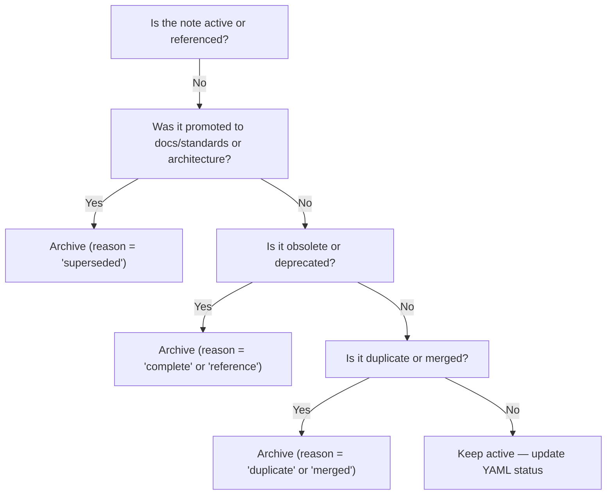
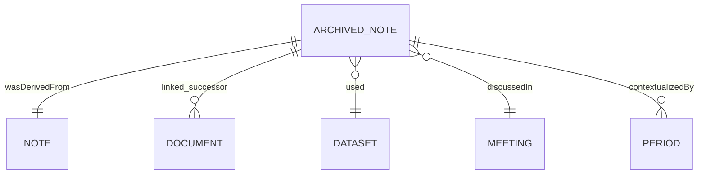

<div align="center">

# 🗃️ Kansas Frontier Matrix — **Notes Archive**  
`docs/notes/archive/README.md`

**Purpose:** Establish an **immutable, machine-readable, and semantically indexed archive** for all historical documentation within the **Kansas Frontier Matrix (KFM)** — preserving context, decisions, and evolution through verifiable **provenance and FAIR data compliance** under the **Master Coder Protocol (MCP-DL v6.3)**.

[](../../standards/documentation.md)
[](../../../.github/workflows/docs-validate.yml)
[](../../../.github/workflows/site.yml)
[](../../architecture/knowledge-graph.md)
[](README.md)
[](../../../LICENSE)

</div>

```yaml
---
title: "Kansas Frontier Matrix — Notes Archive"
document_type: "Archive Guide"
version: "v3.0.0"
last_updated: "2025-10-18"
created: "2025-10-05"
owners: ["@kfm-docs","@kfm-governance","@kfm-architecture"]
status: "Stable"
maturity: "Production"
scope: "Docs/Notes/Archive"
license: "CC-BY 4.0"
semver_policy: "MAJOR.MINOR.PATCH"
tags: ["archive","provenance","governance","preservation","mcp","knowledge-graph","fair","bagit","ai"]
audit_framework: "MCP-DL v6.3"
ci_required_checks:
  - docs-validate
  - site-build
  - pre-commit
  - codeql
  - trivy
semantic_alignment:
  - PROV-O
  - CIDOC CRM
  - OWL-Time
  - SKOS
  - JSON Schema
  - ISO 8601
  - DCAT 2.0
  - PREMIS 3.0
  - FAIR Principles
schema:
  file: "docs/schemas/archive.schema.json"
  version: "1.1.0"
  validated_by: "jsonschema"
automation:
  - name: "Quarterly Archive Move"
    schedule: "0 8 1 */3 *"
    action: "tools/archive_notes.py"
  - name: "Archive Graph Sync"
    schedule: "0 6 * * MON"
    action: "tools/graph_ingest_notes.py"
  - name: "Archive Metrics Summary"
    schedule: "0 7 1 * *"
    action: "tools/generate_archive_summary.py"
preservation_policy:
  format_standards: ["Markdown (GFM)","RDF/Turtle","BagIt 1.0"]
  checksum_algorithm: "SHA-256"
  replication_targets: ["GitHub Repository","Zenodo Snapshot","OSF Backup"]
  metadata_standard: "PREMIS 3.0"
  revalidation_cycle: "annually"
retention_policy:
  archive_after: "90d"
  purge_after: "never"
ai_index:
  embed_in_graph: true
  model: "sentence-transformers/all-MiniLM-L6-v2"
  store: "Neo4j Vector Index"
  searchable_fields: ["title","summary","tags"]
fair_alignment:
  findable: true
  accessible: true
  interoperable: true
  reusable: true
external_exports:
  zenodo:
    enabled: true
    doi_prefix: "10.5281/zenodo."
  osf:
    enabled: true
    project_id: "KFM-ARCHIVE"
---
```

---

## 📚 Overview

The `/docs/notes/archive/` directory functions as a **digital preservation system** for retired, replaced, or superseded notes.  
Each archived file remains **read-only, checksum-verified**, and **linked to its successor** in the MCP Knowledge Graph — preserving complete historical provenance.

* 🔒 **Immutable:** Archived content is never deleted or overwritten.  
* 🧾 **Versioned:** Commit history retained in Git.  
* 🧠 **Indexed:** Ingested to Neo4j/RDF with full lineage.  
* 🔗 **FAIR:** Findable, Accessible, Interoperable, Reusable metadata model.

---

## 🗂️ Directory Layout

```text
docs/notes/archive/
├── README.md                      # (this file)
├── 2024/                          # Archive by year (recommended)
│   ├── 2024-07-22_old_terrain_pipeline_draft.md
│   └── 2024-08-14_climate_data_ideas.md
├── 2025/
│   ├── 2025-01-10_meeting_notes_v1.md
│   └── 2025-05-03_ontology_discussion.md
├── legacy/                        # Optional: pre-MCP materials
│   ├── 2018-old-etl-notes.md
│   └── 2019-prototype-analysis.md
└── manifests/                     # Auto-generated provenance ledgers
    ├── manifest_2024.yml
    ├── manifest_2025.yml
    └── archive_index.json
```

> 📘 **Tip:** Archive by year and prefix filenames with `YYYY-MM-DD_` for automated chronology.

---

## 🧭 Archive Selection Flow


<!-- END OF MERMAID -->

---

## 🧩 Archival Workflow (MCP-DL Aligned)

| Step | Action | Responsible |
| :-- | :-- | :-- |
| **1️⃣ Identify** | Note flagged as outdated or finalized. | Author |
| **2️⃣ Move** | Relocate to `archive/<year>/`. | Maintainer |
| **3️⃣ Rename** | Apply prefix `YYYY-MM-DD_` to filename. | Maintainer |
| **4️⃣ Update Metadata** | Set `status: archived` + `archived_date:`. | Author |
| **5️⃣ Link Successor** | Add `linked_successor:` to replacement doc. | Author |
| **6️⃣ Validate & Commit** | Commit + push with CI validation. | Maintainer |
| **7️⃣ Graph Sync** | Neo4j ingestion via CI automation. | CI/CD |

---

## 🧱 YAML Metadata for Archived Notes

```yaml
---
title: "LiDAR Pipeline Draft — Superseded"
author: "@kfm-data"
original_path: "docs/notes/ideas.md"
status: archived
archived_date: 2025-10-05
reason: superseded
linked_successor:
  - ../../architecture/data-architecture.md
  - ../../standards/metadata.md
period_context:
  id: "perio.do/post-settlement-1850-1900"
  label: "Post-Settlement Kansas"
tags: ["archive","provenance","data","lineage"]
fair_alignment:
  findable: true
  accessible: true
  interoperable: true
  reusable: true
---
```

> ⚙️ **CI Enforcement:** Missing or invalid `archived_date`, `reason`, or `linked_successor` triggers pipeline failure.

---

## 🧬 Knowledge Graph Mapping

Archived notes are modeled as `prov:Entity` instances with lifecycle lineage.

**RDF Example**

```turtle
@prefix prov: <http://www.w3.org/ns/prov#> .
@prefix kfm: <https://kfm.org/id/> .
@prefix dc:   <http://purl.org/dc/terms/> .

kfm:note/2024_terrain_pipeline_draft
    a prov:Entity ;
    dc:title "Terrain Pipeline Draft — 2024" ;
    prov:invalidatedAtTime "2025-10-05T00:00:00-05:00"^^xsd:dateTime ;
    prov:wasDerivedFrom kfm:note/ideas_terrain_pipeline ;
    prov:wasInfluencedBy kfm:document/data_architecture_v2 ;
    dc:description "Archived draft replaced by data architecture standard." .
```

**ER Diagram**

<!-- END OF MERMAID -->

---

## 🧾 Manifests & Indexing

Each yearly folder includes a `manifest_<year>.yml` summarizing all archived notes.

```yaml
manifest_version: "1.0"
year: 2025
total_entries: 42
entries:
  - id: A-2025-001
    title: "Ontology Discussion"
    hash: "b9ac8d4f"
    archived_date: 2025-05-03
    reason: "superseded"
    successor: "../../standards/ontologies.md"
    ingested_to_graph: true
```

Additionally, `archive_index.json` provides a machine-parsable index for web dashboards and APIs.

```json
{
  "archives": [
    {
      "id": "A-2025-001",
      "title": "Ontology Discussion",
      "archived_date": "2025-05-03",
      "reason": "superseded",
      "successor": "docs/standards/ontologies.md",
      "hash": "b9ac8d4f"
    }
  ],
  "last_generated": "2025-10-18"
}
```

---

## 🧠 Digital Preservation & FAIR Compliance

Archived notes adhere to FAIR and PREMIS standards for scholarly preservation:

| FAIR Principle | Implementation |
| :-- | :-- |
| **Findable** | Indexed in archive manifest & Knowledge Graph |
| **Accessible** | Stored in Git + Zenodo/OSF mirror |
| **Interoperable** | PROV-O, CIDOC-CRM, SKOS mappings |
| **Reusable** | CC-BY 4.0 license + metadata completeness |

---

## 📦 BagIt/STAC Export Workflow

To ensure reproducibility and external preservation, archives are packaged using the [BagIt 1.0](https://datatracker.ietf.org/doc/html/draft-kunze-bagit-14) and STAC models.

```bash
make archive-export YEAR=2025 FORMAT=bagit
```

**Output Example**
```text
bags/
└── kfm_archive_2025_bagit/
    ├── bag-info.txt
    ├── data/
    │   ├── notes_archive/
    │   ├── RDF/
    │   └── checksums/
    └── manifest-sha256.txt
```

> Each bag is assigned a DOI via **Zenodo integration** for citation and reuse.

---

## 📈 Metrics & KPI Dashboard

| Metric | Current | Target | Description |
| :-- | :-- | :-- | :-- |
| Archived Notes (Q) | 22 | — | Total items archived this quarter |
| Successor Link Coverage | 100% | 100% | Each archive has successor link |
| BagIt Export Valid | 4 | ≥ 4 | Annual export compliance |
| FAIR Compliance | ✅ | ✅ | Verified via schema test |
| Vector Index Entries | 215 | — | Embedded in Neo4j search index |

---

## 🤖 CI Integration & Validation

| Validation | Tool / Path | Purpose |
| :-- | :-- | :-- |
| **YAML Syntax** | `yamllint` | Validates metadata |
| **Schema Compliance** | `jsonschema` | Enforces archive schema |
| **Status Check** | `scripts/check_archived_status.py` | Ensures `status: archived` |
| **Date Validation** | `dateutil` | Confirms valid ISO timestamps |
| **Successor Check** | `remark-lint` | Verifies successor paths |
| **Checksum Validation** | `scripts/verify_checksums.py` | Recomputes & confirms SHA-256 integrity |
| **Graph Sync** | `tools/graph_ingest_notes.py` | Ingests RDF triples into Neo4j |

---

## 🔒 Security, Ethics & Access Policy

> ⚠️ **Data Governance:**  
> - No PII, confidential, or embargoed materials allowed.  
> - Mark internal content with `access_policy.level: internal`.  
> - Apply `license: CC-BY 4.0` or appropriate open-access license.  
> - Honor Indigenous data sovereignty (per *Archaeology MCP Module*).

**Example Metadata Extension**
```yaml
access_policy:
  level: "public"
  embargo_until: null
  license: "CC-BY 4.0"
classification:
  sensitivity: "low"
  retention_class: "permanent"
```

---

## 🧩 Governance Guidelines

| Action | Frequency | Responsible |
| :-- | :-- | :-- |
| Archive Review | Quarterly | @kfm-governance |
| Graph Lineage Verification | Weekly | CI/CD |
| External Repository Sync | Quarterly | @kfm-docs |
| Zenodo DOI Export | Annual | @kfm-data |
| Health Check Report | Monthly | @kfm-audit |

---

## 📜 Example Governance Report Entry

```json
{
  "archive_health": {
    "checked": 47,
    "valid": 47,
    "broken_links": 0,
    "missing_dates": 0,
    "checksum_mismatches": 0,
    "last_checked": "2025-10-18T08:00:00Z"
  }
}
```

---

## 🧮 SPARQL Query — Archive Provenance Endpoint

```sparql
SELECT ?note ?successor ?archivedDate
WHERE {
  ?note a prov:Entity ;
        prov:invalidatedAtTime ?archivedDate ;
        prov:wasInfluencedBy ?successor .
}
ORDER BY DESC(?archivedDate)
```

> Exposed via local Fuseki or Neo4j RDF plugin for cross-year archival queries.

---

## 🧠 Future Roadmap

| Milestone | Target | Description |
| :-- | :-- | :-- |
| v3.1 | Q1 2026 | Integrate FAIR/BagIt export pipeline to Zenodo/OSF |
| v3.2 | Q2 2026 | Add vectorized AI search interface in KFM web UI |
| v3.3 | Q3 2026 | Implement Archive Browser dashboard with timeline filters |
| v3.4 | Q4 2026 | Add DOI auto-minting for yearly archive bags |
| v4.0 | 2027 | Immutable blockchain-backed provenance signatures |

---

## 📎 Related Documentation

| File | Description |
| :-- | :-- |
| `docs/notes/README.md` | Notes workspace overview |
| `docs/notes/templates/README.md` | Note and archive templates |
| `docs/notes/backlog.md` | Operational backlog tracking |
| `docs/standards/documentation.md` | MCP-DL writing and governance standards |
| `docs/architecture/knowledge-graph.md` | Knowledge Graph lineage & ingestion process |
| `data/work/logs/docs/archive_summary_<YYYY_QN>.json` | Quarterly metrics log |

---

## 📅 Version History

| Version | Date | Author | Summary |
| :-- | :-- | :-- | :-- |
| v3.0.0 | 2025-10-18 | @kfm-docs | Added FAIR/BagIt compliance, Zenodo exports, AI embeddings, manifest indexing, and governance metrics. |
| v2.0.0 | 2025-10-10 | @kfm-docs | Introduced yearly manifests, ER diagrams, and CI expansion. |
| v1.0.0 | 2025-10-05 | KFM Documentation Team | Initial archive guide with metadata schema, validation, and RDF linkage. |

---

<div align="center">

**Kansas Frontier Matrix** — *“Nothing Lost. Everything Proven.”*  
📍 `docs/notes/archive/README.md` · Maintained under MCP-DL v6.3 governance, FAIR compliance, and digital preservation standards.

</div>
