<div align="center">

# 🗃️ Kansas Frontier Matrix — **Notes Archive**  
`docs/notes/archive/README.md`

**Purpose:** Establish an **immutable, machine-readable, and semantically indexed archive** for all historical documentation within the **Kansas Frontier Matrix (KFM)** — preserving context, decisions, and evolution through verifiable **provenance and FAIR data compliance** under the **Master Coder Protocol (MCP-DL v6.3)**.

[](../../standards/documentation.md)
[](../../../.github/workflows/docs-validate.yml)
[](../../../.github/workflows/policy-check.yml)
[](../../../.github/workflows/site.yml)
[](../../architecture/knowledge-graph.md)
[](README.md)
[](../../../LICENSE)

</div>

```yaml
---
title: "Kansas Frontier Matrix — Notes Archive"
document_type: "Archive Guide"
version: "v3.1.0"
last_updated: "2025-10-18"
created: "2025-10-05"
owners: ["@kfm-docs","@kfm-governance","@kfm-architecture","@kfm-security"]
status: "Stable"
maturity: "Production"
scope: "Docs/Notes/Archive"
license: "CC-BY 4.0"
semver_policy: "MAJOR.MINOR.PATCH"
tags: ["archive","provenance","governance","preservation","mcp","knowledge-graph","fair","bagit","ai","policy"]
audit_framework: "MCP-DL v6.3"
ci_required_checks:
  - docs-validate
  - policy-check
  - site-build
  - pre-commit
  - codeql
  - trivy
semantic_alignment:
  - PROV-O
  - CIDOC CRM
  - OWL-Time
  - SKOS
  - JSON Schema
  - ISO 8601
  - DCAT 2.0
  - PREMIS 3.0
  - FAIR Principles
schema:
  file: "docs/schemas/archive.schema.json"
  version: "1.1.0"
  validated_by: "jsonschema"
automation:
  - name: "Quarterly Archive Move"
    schedule: "0 8 1 */3 *"
    action: "tools/archive_notes.py"
  - name: "Archive Graph Sync"
    schedule: "0 6 * * MON"
    action: "tools/graph_ingest_notes.py"
  - name: "Archive Metrics Summary"
    schedule: "0 7 1 * *"
    action: "tools/generate_archive_summary.py"
preservation_policy:
  format_standards: ["Markdown (GFM)","RDF/Turtle","BagIt 1.0"]
  checksum_algorithm: "SHA-256"
  replication_targets: ["GitHub Repository","Zenodo Snapshot","OSF Backup"]
  metadata_standard: "PREMIS 3.0"
  revalidation_cycle: "annually"
retention_policy:
  archive_after: "90d"
  purge_after: "never"
ai_index:
  embed_in_graph: true
  model: "sentence-transformers/all-MiniLM-L6-v2"
  store: "Neo4j Vector Index"
  searchable_fields: ["title","summary","tags"]
fair_alignment:
  findable: true
  accessible: true
  interoperable: true
  reusable: true
external_exports:
  zenodo:
    enabled: true
    doi_prefix: "10.5281/zenodo."
  osf:
    enabled: true
    project_id: "KFM-ARCHIVE"
---
```

---

## 📚 Overview

The `/docs/notes/archive/` directory functions as a **digital preservation system** for retired, replaced, or superseded notes.  
Each archived file remains **read-only, checksum-verified**, and **linked to its successor** in the MCP Knowledge Graph — preserving complete historical provenance.

- 🔒 **Immutable:** Archived content is never deleted or overwritten.  
- 🧾 **Versioned:** Commit history retained in Git.  
- 🧠 **Indexed:** Ingested to Neo4j/RDF with full lineage.  
- 🔗 **FAIR:** Findable, Accessible, Interoperable, Reusable metadata model.

---

## 🗂️ Directory Layout

```text
docs/notes/archive/
├── README.md                      # (this file)
├── 2024/
│   ├── README.md
│   ├── 2024-02-10_initial_design_discussion.md
│   ├── 2024-04-14_topographic_index_draft.md
│   ├── 2024-07-22_old_terrain_pipeline_draft.md
│   └── 2024-08-14_climate_data_ideas.md
├── 2025/
│   ├── README.md
│   ├── 2025-01-10_meeting_notes_v1.md
│   └── 2025-05-03_ontology_discussion.md
├── legacy/
│   ├── README.md
│   ├── 2018-old-etl-notes.md
│   ├── 2018_terrain_etl_prototype_notes.md
│   ├── 2019-prototype-analysis.md
│   └── 2019_data_ingest_strategy.md
└── manifests/
    ├── manifest_2024.yml
    ├── manifest_2025.yml
    └── archive_index.json
```

> 📘 **Tip:** Archive by year and prefix filenames with `YYYY-MM-DD_` for automated chronology.

---

## 🧭 Archive Selection Flow

```mermaid
flowchart TD
    A["Is the note active or referenced?"] -->|No| B["Was it promoted to docs/standards or architecture?"]
    B -->|Yes| C["Archive (reason = 'superseded')"]
    B -->|No| D["Is it obsolete or deprecated?"]
    D -->|Yes| E["Archive (reason = 'complete' or 'reference')"]
    D -->|No| F["Is it duplicate or merged?"]
    F -->|Yes| G["Archive (reason = 'duplicate' or 'merged')"]
    F -->|No| H["Keep active — update YAML status"]
%% END OF MERMAID
```



---

## 🧩 Archival Workflow (MCP-DL Aligned)

| Step | Action | Responsible |
| :-- | :-- | :-- |
| **1️⃣ Identify** | Note flagged as outdated or finalized. | Author |
| **2️⃣ Move** | Relocate to `archive/<year>/`. | Maintainer |
| **3️⃣ Rename** | Apply prefix `YYYY-MM-DD_` to filename. | Maintainer |
| **4️⃣ Update Metadata** | Set `status: archived` + `archived_date:`. | Author |
| **5️⃣ Link Successor** | Add `linked_successor:` to replacement doc. | Author |
| **6️⃣ Validate & Commit** | Commit + push with CI validation. | Maintainer |
| **7️⃣ Graph Sync** | Neo4j ingestion via CI automation. | CI/CD |

---

## 🧱 YAML Metadata for Archived Notes

```yaml
---
title: "LiDAR Pipeline Draft — Superseded"
author: "@kfm-data"
original_path: "docs/notes/ideas.md"
status: archived
archived_date: 2025-10-05
reason: superseded           # superseded | duplicate | merged | reference | complete
linked_successor:
  - ../../architecture/data-architecture.md
  - ../../standards/metadata.md
period_context:
  id: "perio.do/post-settlement-1850-1900"
  label: "Post-Settlement Kansas"
tags: ["archive","provenance","data","lineage"]
fair_alignment:
  findable: true
  accessible: true
  interoperable: true
  reusable: true
---
```

> ⚙️ **CI Enforcement:** Missing or invalid `archived_date`, `reason`, or `linked_successor` triggers pipeline failure.

---

## 🧬 Knowledge Graph Mapping

Archived notes are modeled as `prov:Entity` instances with lifecycle lineage.

**RDF Example**

```turtle
@prefix prov: <http://www.w3.org/ns/prov#> .
@prefix kfm: <https://kfm.org/id/> .
@prefix dc:   <http://purl.org/dc/terms/> .
@prefix xsd:  <http://www.w3.org/2001/XMLSchema#> .

kfm:note/2024_terrain_pipeline_draft
    a prov:Entity ;
    dc:title "Terrain Pipeline Draft — 2024" ;
    prov:invalidatedAtTime "2024-07-22T00:00:00-06:00"^^xsd:dateTime ;
    prov:wasDerivedFrom kfm:note/ideas_terrain_pipeline ;
    prov:wasInfluencedBy kfm:document/data_architecture_v1 ;
    dc:description "Archived draft replaced by data architecture standard." .
```

**ER Diagram**


---

## 🧾 Manifests & Indexing

Each yearly folder includes a `manifest_<year>.yml` summarizing all archived notes.

```yaml
manifest_version: "1.0"
year: 2025
total_entries: 2
entries:
  - id: A-2025-001
    title: "January 2025 Governance & Infrastructure Sync"
    hash: "91a7ef2c..."
    archived_date: "2025-01-10"
    reason: "complete"
    successor: "../../../architecture/knowledge-graph.md"
  - id: A-2025-004
    title: "Ontology Discussion — Unified Semantic Alignment"
    hash: "63bff7a1..."
    archived_date: "2025-05-03"
    reason: "superseded"
    successor: "../../../standards/ontologies.md"
```

Additionally, `archive_index.json` provides a machine-parsable index for web dashboards and APIs.

```json
{
  "archives": [
    {
      "id": "A-2025-001",
      "title": "January 2025 Governance & Infrastructure Sync",
      "archived_date": "2025-01-10",
      "reason": "complete",
      "successor": "docs/architecture/knowledge-graph.md",
      "hash": "91a7ef2c..."
    }
  ],
  "last_generated": "2025-10-18"
}
```

---

## 🧠 Digital Preservation & FAIR Compliance

| FAIR Principle | Implementation |
| :-- | :-- |
| **Findable** | Indexed in yearly manifests & Knowledge Graph |
| **Accessible** | Stored in Git + Zenodo/OSF mirrors |
| **Interoperable** | PROV-O, CIDOC-CRM, SKOS mappings |
| **Reusable** | CC-BY 4.0 license + complete metadata |

---

## 📦 BagIt/STAC Export Workflow

Archives are packaged via **BagIt** and may include STAC exports for datasets referenced in notes.

```bash
make archive-export YEAR=2025 FORMAT=bagit
```

**Output Example**

```
bags/
└── kfm_archive_2025_bagit/
    ├── bag-info.txt
    ├── manifest-sha256.txt
    └── data/
        ├── notes_archive/
        ├── RDF/
        └── checksums/
```

> Each bag is eligible for DOI minting via **Zenodo integration**.

---

## 📈 Metrics & KPI Dashboard

| Metric                 | Current | Target |
| :--------------------- | :------ | :----- |
| Successor Link Coverage| 100%    | 100%   |
| BagIt Export Valid     | ✅       | ≥ 1/yr |
| FAIR Compliance        | ✅       | ✅     |
| Vector Index Entries   | 200+    | —      |

---

## 🤖 CI Integration & Validation

| Validation            | Tool / Path                    |
| :-------------------- | :----------------------------- |
| YAML Syntax           | `yamllint`                     |
| Schema Compliance     | `jsonschema`                   |
| Status Check          | `scripts/check_archived_status.py` |
| Date Validation       | `dateutil`                     |
| Successor Check       | `remark-lint`                  |
| Checksum Validation   | `scripts/verify_checksums.py`  |
| Graph Sync            | `tools/graph_ingest_notes.py`  |

---

## 🔒 Security, Ethics & Access Policy

> **Data Governance**  
> - No PII, confidential, or embargoed materials allowed.  
> - For internal content, use `access_policy.level: internal`.  
> - Apply `license: CC-BY 4.0` or appropriate open-access license.  
> - Honor Indigenous data sovereignty (see *Archaeology MCP Module*).

```yaml
access_policy:
  level: "public"           # public | internal
  embargo_until: null
  license: "CC-BY 4.0"
classification:
  sensitivity: "low"        # low | medium | high
  retention_class: "permanent"
```

---

## 🧩 Governance Guidelines

| Action                     | Frequency  | Responsible     |
| :------------------------- | :--------- | :-------------- |
| Archive Review             | Quarterly  | @kfm-governance |
| Graph Lineage Verification | Weekly     | CI/CD           |
| External Repository Sync   | Quarterly  | @kfm-docs       |
| Zenodo DOI Export          | Annual     | @kfm-data       |
| Health Check Report        | Monthly    | @kfm-audit      |

---

## 📅 Version History

| Version | Date       | Author     | Summary                                                                 |
| :------ | :--------- | :--------- | :---------------------------------------------------------------------- |
| **v3.1.0** | 2025-10-18 | @kfm-docs  | Aligned directory tree, added yearly README links, and clarified examples. |
| v3.0.1  | 2025-10-18 | @kfm-docs  | Added policy gate badge, clarified validations, expanded security/ethics examples. |
| v3.0.0  | 2025-10-18 | @kfm-docs  | FAIR/BagIt compliance, Zenodo exports, AI embeddings, manifest indexing, governance metrics. |

---

<div align="center">

**Kansas Frontier Matrix** — *“Nothing Lost. Everything Proven.”*  
📍 `docs/notes/archive/README.md` · Maintained under MCP-DL v6.3 governance, FAIR compliance, and digital preservation standards.

</div>
