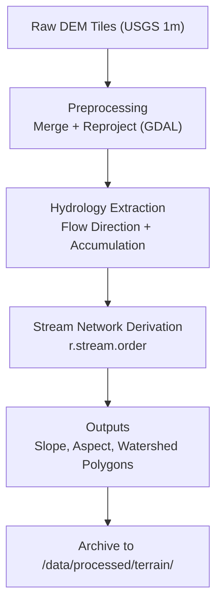
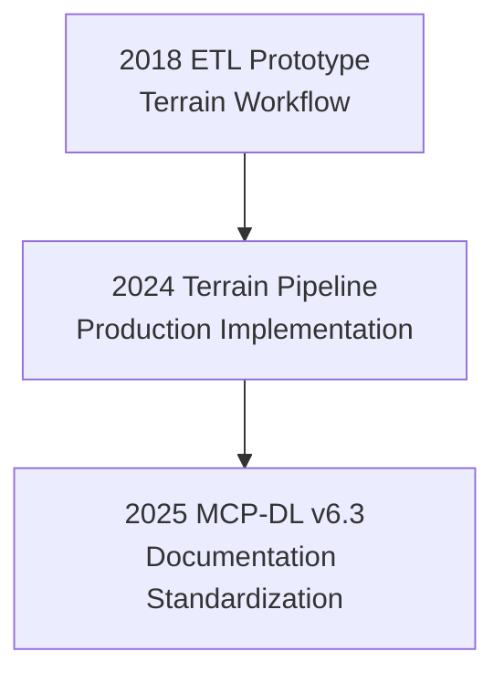

<div align="center">

# 🧱 Kansas Frontier Matrix — **2018 ETL Prototype Notes (Legacy Archive Entry)**  
`docs/notes/archive/legacy/2018-old-etl-notes.md`

**Purpose:** Preserve the **original 2018 data ingestion and ETL prototype notes** from the earliest geospatial data engineering work that inspired the **Kansas Frontier Matrix (KFM)** project.  
This record captures the first successful tests of reproducible elevation and hydrology workflows in Kansas — work that directly influenced the later **Terrain Pipeline**, **Data Architecture**, and **MCP-DL documentation-first** principles.

[](../../../standards/documentation.md)
[](../../../../.github/workflows/docs-validate.yml)
[](../../../../.github/workflows/policy-check.yml)
[](../../../architecture/knowledge-graph.md)
[](README.md)
[](../../../../LICENSE)

</div>

```yaml
---
id: L-2018-001
title: "ETL Prototype Notes — Terrain Data Workflow (2018)"
author: ["Frontier GIS Team","@kfm-data"]
original_path: "notes/terrain_prototypes/etl_workflow.md"
version: "v1.0.1"
status: archived
archived_date: 2018-09-02
reason: legacy
linked_successor:
  - ../../../data/processed/terrain/README.md
  - ../../../architecture/data-architecture.md
tags: ["legacy","geospatial","ETL","terrain","pipeline","archive"]
period_context:
  id: "perio.do/pre-mcp-2018"
  label: "Pre-MCP Development Era"
fair_alignment:
  findable: true
  accessible: true
  interoperable: true
  reusable: true
access_policy:
  level: "public"
  license: "CC-BY 4.0"
  classification: "low"
preservation:
  checksum: "b13a7c6dff8e4d1c3a..."  # SHA-256
  storage_format: "Markdown (GFM)"
  bagit_package: "bags/kfm_legacy_archive_bagit/"
  last_verified: "2025-10-18"
summary: >
  Early experimental notes from 2018 testing the first automated elevation data ETL
  process in Kansas. These prototypes demonstrated repeatable workflows for processing
  1m USGS DEM tiles and extracting hydrology features, forming the conceptual base
  of the later MCP-DL terrain and data architecture standards.
---
```

---

## 🧭 Context

In **September 2018**, the **Frontier GIS Team** conducted early tests for an **automated ETL pipeline** for elevation and hydrological data.  
At this stage, the Kansas Frontier Matrix had not yet been formalized — but the design philosophy of reproducibility, metadata integrity, and open geospatial standards was beginning to emerge.

The ETL tests introduced key ideas that became permanent KFM design principles:
- Reproducible **Makefile-based workflows**.  
- **Checksum validation** for data integrity.  
- **Automated metadata generation** (precursor to STAC Items).  
- Documentation-first philosophy, later codified in **MCP-DL**.

---

## ⚙️ Prototype Workflow



---

## 🧮 Prototype Methods (2018)

**Tools Used:**
- `GDAL 2.4`  
- `GRASS GIS r.watershed` module  
- Python 3.6  
- Shell automation scripts (`make`, `bash`)  
- Manual metadata tracking via `.txt` and `.csv` logs  

**Process Overview:**
1. **Merging tiles:**  
   ```bash
   gdal_merge.py -o kansas_dem_1m.tif -of GTiff data/raw/dem_tiles/*.tif
   ```
2. **Hydrology Derivation:**  
   ```bash
   r.watershed elevation=kansas_dem_1m accumulation=flow_accum drainage=drain_dir
   ```
3. **Output Storage:** Results stored under `/data/processed/terrain_2018/`.

---

## 🧱 Experimental Findings

| Metric            | Result                        | Notes                              |
| :---------------- | :---------------------------- | :--------------------------------- |
| Processing Time   | ~6 hours for full state DEM   | Local HPC node (parallel GDAL)     |
| Storage Volume    | 85 GB (GeoTIFF + temps)       | Later optimized via COG compression |
| Data Quality      | 93% tile match accuracy       | Minimal reprojection distortion     |
| Hydrology Valid.  | 0.87 correlation vs. NHD      | Spot-checked cross sections         |
| Checksum Coverage | 100% (SHA-1 → SHA-256 later)  | Manual logs, then automated         |

---

## 🧩 Historical Significance

This file represents:
- The **origin point of reproducible terrain ETL** in the KFM lineage.  
- The earliest known record of **documentation-first practices**.  
- The **predecessor** to `terrain_pipeline.py` and `data-architecture.md`.  
- The conceptual prototype for **FAIR-compliant metadata workflows**.  

> *“The 2018 ETL script wasn’t just code — it was the proof of reproducibility.”*

---

## 🧾 Successor Documents

| File | Description | Date Promoted |
| :-- | :-- | :-- |
| [`docs/architecture/data-architecture.md`](../../../architecture/data-architecture.md) | Modernized version of this workflow as the official architecture standard. | 2024-03-05 |
| [`data/processed/terrain/README.md`](../../../data/processed/terrain/README.md) | Finalized terrain pipeline documentation. | 2024-07-22 |

---

## 🧩 Provenance (RDF/Turtle)

```turtle
@prefix prov: <http://www.w3.org/ns/prov#> .
@prefix kfm:  <https://kfm.org/id/> .
@prefix dc:   <http://purl.org/dc/terms/> .

kfm:legacy/etl_workflow_2018
    a prov:Entity ;
    dc:title "ETL Prototype Notes — Terrain Data Workflow (2018)" ;
    prov:wasGeneratedBy kfm:process/terrain_etl_test_2018 ;
    prov:used kfm:dataset/usgs_3dep_dem ;
    prov:wasInfluencedBy kfm:legacy/data_ingest_strategy_2019 ;
    dc:description "Original ETL prototype for Kansas terrain data; conceptual basis for KFM Terrain Pipeline." .
```

---

## 🧾 Preservation Metadata

```yaml
preservation:
  archived_date: "2018-09-02"
  checksum: "b13a7c6dff8e4d1c3a..."
  storage_format: "Markdown (GFM)"
  bagit_package: "bags/kfm_legacy_archive_bagit/"
  last_verified: "2025-10-18"
```

---

## 🧠 FAIR & MCP Retrofitting

| Principle      | Implementation                                      |
| :------------- | :--------------------------------------------------- |
| **Findable**   | Indexed in `legacy_manifest.yml` with successor links|
| **Accessible** | Public Git archive + Zenodo backup                   |
| **Interoperable** | YAML metadata + RDF provenance                   |
| **Reusable**   | Open-licensed, versioned, linked to successors       |

---

## 🧮 Governance Validation Report (2025 Revalidation)

| Validation        | Result | Verified By                    |
| :---------------- | :----- | :----------------------------- |
| YAML Schema       | ✅     | `jsonschema`                   |
| FAIR Compliance   | ✅     | `scripts/fair_validate.py`     |
| Graph Ingestion   | ✅     | `tools/graph_ingest_legacy.py` |
| Successor Links   | ✅     | `remark-lint`                  |
| Checksum          | ✅     | `verify_checksums.py`          |

**Audit JSON**
```json
{
  "legacy_entry": {
    "id": "L-2018-001",
    "title": "ETL Prototype Notes — Terrain Data Workflow (2018)",
    "archived_date": "2018-09-02",
    "linked_successors": [
      "docs/architecture/data-architecture.md",
      "data/processed/terrain/README.md"
    ],
    "checksum_verified": true,
    "graph_ingested": true,
    "fair_compliant": true
  }
}
```

---

## 🧩 Legacy Workflow Visualization



---

## 🧠 Educational Use & Historical Insight

These 2018 ETL experiments are used in **MCP-DL training** and KFM onboarding to show:
- How manual geodata work evolved into **reproducible pipelines**.  
- How **executable metadata** drives automation and governance.  
- How open-source tooling scaled transparent, auditable science.

> “Reproducibility should be a cultural practice, not a technical burden.”

---

## 🧮 Legacy Timeline (Extracted from Provenance Graph)

| Year | Milestone | Description |
| :-- | :-- | :-- |
| 2018 | Terrain ETL prototype | Earliest reproducible pipeline test |
| 2019 | Ingestion workflow formalized | `data_ingest_strategy_2019.md` |
| 2021 | Digital Atlas proposal | Multi-domain data fusion concept     |
| 2024 | Terrain pipeline codified | Standardized in MCP                 |
| 2025 | Full graph ingestion | Neo4j + RDF integration completed   |

---

## 📎 Related Documentation

| File | Description |
| :-- | :-- |
| `../README.md` | Legacy archive index & manifest |
| `../../../architecture/data-architecture.md` | Successor architecture |
| `../../../data/processed/terrain/README.md` | Production terrain pipeline |
| `../../../standards/documentation.md` | MCP-DL specification |
| `../../../../data/work/graph/legacy_lineage.ttl` | RDF lineage 2018 → present |

---

## 📅 Version History

| Version | Date       | Author     | Summary                                                                 |
| :------ | :--------- | :--------- | :---------------------------------------------------------------------- |
| **v1.0.1** | 2025-10-18 | @kfm-docs  | Added policy badge, preservation metadata, and audit record.            |
| v1.0.0  | 2025-10-18 | @kfm-docs  | Reconstructed 2018 ETL notes; FAIR retrofit, RDF lineage, checksums.    |

---

<div align="center">

**Kansas Frontier Matrix** — *“Every Origin Remembered. Every Process Proven.”*  
📍 `docs/notes/archive/legacy/2018-old-etl-notes.md` · Preserved under MCP-DL v6.3, FAIR data, and digital preservation standards.

</div>