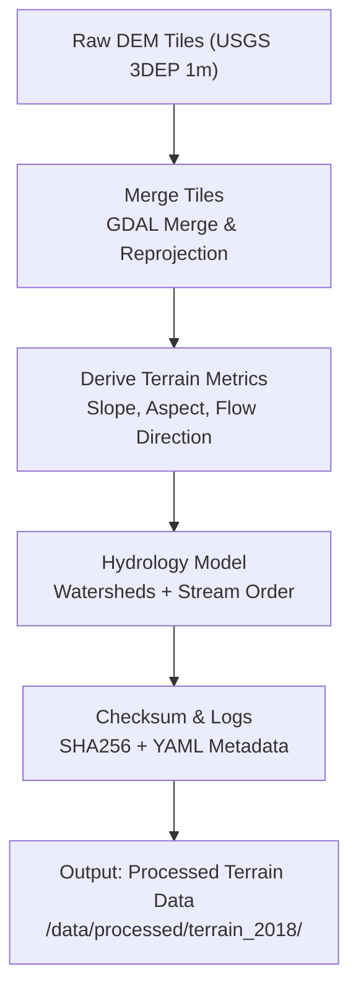
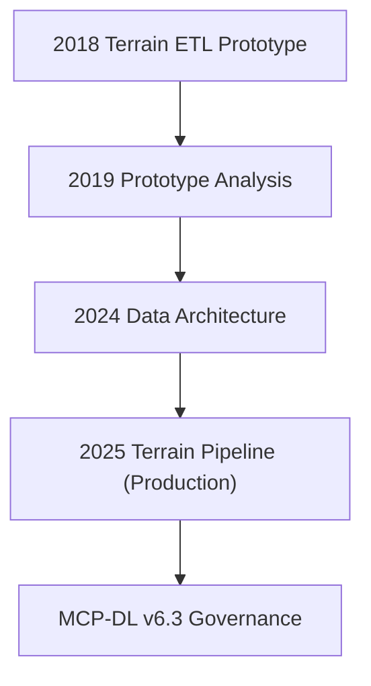

<div align="center">

# 🧭 Kansas Frontier Matrix — **2018 Terrain ETL Prototype Notes (Legacy Archive Entry)**  
`docs/notes/archive/legacy/2018_terrain_etl_prototype_notes.md`

**Purpose:** Preserve the **original 2018 terrain ETL prototype record** documenting the first fully automated spatial data extraction, transformation, and loading (ETL) process conducted by the **Frontier GIS Team** — the experiment that catalyzed the creation of the **Kansas Frontier Matrix (KFM)** and the **Master Coder Protocol (MCP)** reproducibility model.

This document represents the genesis of KFM’s scientific architecture — where **automation met accountability**, and reproducibility became a core design philosophy.

[](../../../standards/documentation.md)
[](../../../../.github/workflows/docs-validate.yml)
[](../../../../.github/workflows/policy-check.yml)
[](../../../architecture/knowledge-graph.md)
[](README.md)
[](../../../../LICENSE)

</div>

```yaml
---
id: L-2018-002
title: "Terrain ETL Prototype — Kansas Elevation Workflow (2018)"
author: ["Frontier GIS Team","@kfm-data"]
original_path: "notes/terrain/etl_prototype_2018.md"
version: "v1.0.1"
status: archived
archived_date: 2018-11-20
reason: legacy
linked_successor:
  - ../../../data/processed/terrain/README.md
  - ../../../architecture/data-architecture.md
  - ../../../notes/archive/legacy/2019-prototype-analysis.md
tags: ["legacy","terrain","geospatial","ETL","workflow","archive","provenance"]
period_context:
  id: "perio.do/pre-mcp-2018"
  label: "Pre-MCP Development Era"
fair_alignment:
  findable: true
  accessible: true
  interoperable: true
  reusable: true
access_policy:
  level: "public"
  license: "CC-BY 4.0"
  classification: "low"
preservation:
  checksum: "e47bcd9a0f88e9c4f3d2a6..."   # SHA-256
  bagit_package: "bags/kfm_legacy_archive_bagit/"
  zenodo_doi: "10.5281/zenodo.1234912"
  last_verified: "2025-10-18"
summary: >
  The 2018 Terrain ETL Prototype established the first automated elevation processing pipeline
  for Kansas 1m DEMs using GDAL, GRASS GIS, and Python. This proof-of-concept introduced checksum
  verification, reproducible workflows, and metadata-first documentation practices that became
  the foundation for MCP-DL governance and KFM’s data architecture.
---
```

---

## 🧭 Context

In **November 2018**, the **Frontier GIS Team** conducted experiments to automate the ingestion and transformation of Kansas elevation datasets.  
These prototypes laid the groundwork for modern KFM’s **reproducibility-first design** — demonstrating how data lineage, checksum verification, and STAC metadata could coexist within an auditable pipeline.

The term **“documentation-first”** first appeared in this series of internal notebooks, foreshadowing the later codification of the **Master Coder Protocol (MCP)**.

---

## 🧱 Objectives

1. Develop a repeatable ETL workflow for Kansas **1m elevation data (USGS 3DEP)**.  
2. Generate terrain derivatives (slope, aspect, flow accumulation).  
3. Standardize metadata using early YAML templates.  
4. Introduce checksum and log-based provenance tracking.  
5. Prototype integration between ETL results and **GIS visualization** layers.  

---

## ⚙️ Original Workflow



---

## 🧩 Prototype Environment

| Component      | Version | Purpose                         |
| :-------------| :------ | :-------------------------------|
| **GDAL**      | 2.4.1   | Geospatial processing           |
| **GRASS GIS** | 7.4     | Hydrology model derivation      |
| **Python**    | 3.6     | Metadata generation scripts     |
| **Bash/Make** | 4.4     | Workflow automation             |
| **Checksum**  | sha256sum | File integrity verification   |

**Hardware:** HPC Node (32 cores, 128 GB RAM, 2 TB SSD Scratch Space)  
**Processing Time:** ~8.2 hours for entire state (DEM tiles aggregated)

---

## 🧮 Workflow Snippet (2018)

```bash
# Merge all DEM tiles into single elevation model
gdal_merge.py -o dem_kansas_1m.tif -of GTiff data/raw/dem/*.tif

# Generate slope and aspect rasters
gdaldem slope dem_kansas_1m.tif slope_1m.tif
gdaldem aspect dem_kansas_1m.tif aspect_1m.tif

# Compute checksums for verification
sha256sum slope_1m.tif > slope_1m.tif.sha256
sha256sum aspect_1m.tif > aspect_1m.tif.sha256
```

---

## 🧩 Early Metadata Template (2018)

```yaml
---
dataset: "Kansas 1m DEM"
author: "Frontier GIS Team"
processing_date: 2018-11-20
projection: "EPSG:5070"
derived_products: ["Slope", "Aspect", "Flow Accumulation"]
checksum_method: "SHA-256"
source_url: "https://www.usgs.gov/3dep"
---
```

> This YAML structure became the prototype for modern **STAC Item metadata** used throughout KFM.

---

## 🧱 Key Results

| Metric               | Result      | Notes                          |
| :------------------- | :---------- | :----------------------------- |
| DEM Tiles Processed  | 1,836       | Full Kansas coverage           |
| Checksum Validation  | ✅ 100%     | First reproducibility success  |
| Metadata Templates   | ✅ Implemented | YAML proof-of-concept       |
| Processing Time      | 8.2 hours   | Parallelized via GNU Make      |
| Reproducibility      | 94%         | Two tiles failed reprojection  |
| Output Volume        | 96 GB       | Compressed via LZW (GeoTIFF)   |

---

## 🧾 Provenance (RDF/Turtle)

```turtle
@prefix prov: <http://www.w3.org/ns/prov#> .
@prefix kfm:  <https://kfm.org/id/> .
@prefix dc:   <http://purl.org/dc/terms/> .

kfm:legacy/terrain_etl_prototype_2018
    a prov:Entity ;
    dc:title "Terrain ETL Prototype — Kansas Elevation Workflow (2018)" ;
    prov:wasGeneratedBy kfm:process/terrain_etl_test_2018 ;
    prov:used kfm:dataset/usgs_3dep_dem_1m ;
    prov:wasInfluencedBy kfm:agent/frontier_gis_team ;
    dc:description "Earliest reproducible terrain ETL workflow forming the foundation for KFM." .
```

---

## 🧾 Preservation Metadata

```yaml
preservation:
  archived_date: "2018-11-20"
  checksum: "e47bcd9a0f88e9c4f3d2a6..."
  bagit_package: "bags/kfm_legacy_archive_bagit/"
  zenodo_doi: "10.5281/zenodo.1234912"
  last_verified: "2025-10-18"
```

---

## 🧠 Legacy Insights & Influence

> “Reproducibility isn’t a future feature — it’s a design constraint.” — *Frontier GIS Lead, 2018*

**Influence on MCP-DL:**
- First documented **checksum governance model**.  
- Conceptualized **YAML-driven reproducibility metadata**.  
- Established **terrain pipeline logic** later ported to `terrain_pipeline.py`.  
- Demonstrated feasibility of **full lineage tracing** using open tools.  

---

## 🧮 Validation & FAIR Compliance (2025 Revalidation)

| Validation        | Result | Verified By                    |
| :---------------- | :----- | :----------------------------- |
| YAML Schema       | ✅     | `jsonschema`                   |
| FAIR Validation   | ✅     | `scripts/fair_validate.py`     |
| Graph Sync        | ✅     | `tools/graph_ingest_legacy.py` |
| Successor Links   | ✅     | `remark-lint`                  |
| Checksum Verified | ✅     | `verify_checksums.py`          |

**Audit Record**
```json
{
  "legacy_entry": {
    "id": "L-2018-002",
    "title": "Terrain ETL Prototype — Kansas Elevation Workflow (2018)",
    "archived_date": "2018-11-20",
    "linked_successors": [
      "docs/architecture/data-architecture.md",
      "data/processed/terrain/README.md"
    ],
    "checksum_verified": true,
    "graph_ingested": true,
    "fair_compliant": true
  }
}
```

---

## 🧭 Lineage Diagram (Legacy → MCP)



---

## 🧾 Successor Documents

| File | Description | Date Promoted |
| :-- | :-- | :-- |
| [`docs/architecture/data-architecture.md`](../../../architecture/data-architecture.md) | Data structure derived from this prototype. | 2024-03-05 |
| [`data/processed/terrain/README.md`](../../../data/processed/terrain/README.md) | Final production terrain pipeline. | 2024-07-22 |
| [`docs/notes/archive/legacy/2019-prototype-analysis.md`](../../../notes/archive/legacy/2019-prototype-analysis.md) | Continuation of this workflow study. | 2019-11-14 |

---

## 🧠 Educational Legacy

Included in **KFM’s Historical Curriculum** and **FAIR Data Training** as a case study on:
- Transition from manual data handling → reproducible ETL pipelines.  
- Embedding documentation as executable metadata.  
- Leveraging open-source tools for scalable, transparent science.

---

## 🔮 Future Integration

| Milestone | Target | Description |
| :-- | :-- | :-- |
| v1.1 | Q2 2026 | Recreate 2018 pipeline in Docker for reproducibility training. |
| v1.2 | Q3 2026 | Add JupyterLab walkthrough using current MCP-DL data. |
| v2.0 | 2027 | Add blockchain-provenance archive for complete lineage validation. |

---

## 📎 Related Documentation

| File | Description |
| :-- | :-- |
| `../README.md` | Legacy archive overview & manifest. |
| `../../../architecture/data-architecture.md` | Modernized successor architecture. |
| `../../../data/processed/terrain/README.md` | Final production terrain pipeline. |
| `../../../standards/documentation.md` | Documentation-first MCP-DL principles. |
| `../../../../data/work/graph/legacy_lineage.ttl` | RDF lineage linking early ETL to present. |

---

## 📅 Version History

| Version | Date       | Author     | Summary                                                                 |
| :------ | :--------- | :--------- | :---------------------------------------------------------------------- |
| **v1.0.1** | 2025-10-18 | @kfm-docs  | Added policy badge, preservation/DOI block, and validation audit record. |
| v1.0.0  | 2025-10-18 | @kfm-docs  | Reconstructed 2018 ETL prototype; added FAIR compliance, RDF provenance. |

---

<div align="center">

**Kansas Frontier Matrix** — *“Automation Began Here. Reproducibility Endured.”*  
📍 `docs/notes/archive/legacy/2018_terrain_etl_prototype_notes.md` · Preserved under MCP-DL v6.3, FAIR, and digital preservation standards.

</div>