<div align="center">

# 🧩 Kansas Frontier Matrix — **2019 Prototype Analysis (Legacy Archive Entry)**  
`docs/notes/archive/legacy/2019-prototype-analysis.md`

**Purpose:** Preserve the **2019 Prototype Analysis** document — a pivotal pre-MCP technical record capturing the early evaluation of data ingestion strategies, checksum workflows, and metadata validation routines that led directly to the **Master Coder Protocol (MCP)** framework.  
This archive marks the formalization of reproducibility, provenance, and integrated data governance practices that defined the Kansas Frontier Matrix (KFM).

[](../../../standards/documentation.md)
[](../../../architecture/knowledge-graph.md)
[](README.md)
[](../../../../LICENSE)

</div>

```yaml
---
id: L-2019-001
title: "Prototype Analysis — Pre-MCP Data Ingestion Evaluation (2019)"
author: ["Frontier Data Engineering Team","@kfm-data"]
original_path: "notes/data_ingest_strategy.md"
status: archived
archived_date: 2019-11-14
reason: legacy
linked_successor:
  - ../../../architecture/data-architecture.md
  - ../../../standards/documentation.md
  - ../../../data/processed/metadata/README.md
tags: ["legacy","ingestion","checksum","metadata","validation","provenance","mcp"]
period_context:
  id: "perio.do/pre-mcp-2019"
  label: "Transition to Reproducibility Governance"
fair_alignment:
  findable: true
  accessible: true
  interoperable: true
  reusable: true
access_policy:
  level: "public"
  license: "CC-BY 4.0"
  classification: "low"
summary: >
  Early analysis of pre-MCP data ingestion pipelines and reproducibility protocols (2019).
  This document examined checksum validation, metadata structure, and pipeline automation
  for multi-source datasets — introducing the first unified concept of “data governance as code.”
---
```

---

## 🧭 Context

In **November 2019**, the **Frontier Data Engineering Team** analyzed several prototype ingestion workflows to improve consistency and auditability across heterogeneous data sources (terrain, hydrology, and historical records).  
This study introduced the earliest notion of **“data governance as code”**, later embedded into MCP-DL principles.

**Key Outcomes:**
- Demonstrated reproducibility through automated checksum validation.  
- Proposed **metadata templating** for all datasets.  
- Initiated formal tracking of lineage between raw and processed data.  
- Recommended **JSON Schema validation** for ingestion automation.  

---

## 🧱 Original Objectives

1. Evaluate ingestion strategies across **GIS, tabular, and archival datasets**.  
2. Prototype a **checksum generation system** using `sha256sum`.  
3. Define preliminary **YAML-based metadata templates** for future FAIR alignment.  
4. Introduce **link validation** to ensure data provenance and traceability.  
5. Draft design proposals for what would evolve into the **KFM Data Architecture**.

---

## ⚙️ Workflow Overview

```mermaid
flowchart TD
    A["Raw Data Sources<br/>Terrain, Hydrology, Climate"] --> B["ETL Process<br/>GDAL · Python Scripts"]
    B --> C["Checksum Generation<br/>sha256sum + logs"]
    C --> D["Metadata Template Draft<br/>YAML + JSON Schema v0.1"]
    D --> E["Validation Tests<br/>Manual Verification + File Logs"]
    E --> F["Final Report<br/>Prototype Analysis — 2019"]
```


<!-- END OF MERMAID -->

---

## 🧮 Technical Components

| Component | Tool | Function | Outcome |
| :-- | :-- | :-- | :-- |
| ETL | GDAL / OGR | Reprojection, merging, clipping | Consistent output tiles |
| Metadata | YAML / JSON | Manual schema | Introduced machine-readable docs |
| Checksum | `sha256sum` | Data integrity validation | 100% file coverage |
| Validation | Python 3.7 | Automated ingestion test | 92% pipeline reproducibility |
| Provenance | Manual log | Lineage documentation | Origin of PROV adoption |

---

## 🧩 Key Findings

- Metadata fields lacked consistency; schema standardization proposed for 2020.  
- Identified checksum verification as **core validation workflow**.  
- Introduced **data lineage tagging** and **dataset version logging**.  
- Outlined the first draft of **“MCP Principles”** for data reproducibility.  

> *“Automation without accountability is chaos. Provenance must be the checksum of intent.”*  
> — Frontier Data Engineering Team, 2019

---

## 🧩 Prototype Code Snippet

```python
import hashlib
import os

def compute_sha256(filepath):
    with open(filepath, "rb") as f:
        data = f.read()
    return hashlib.sha256(data).hexdigest()

for file in os.listdir("data/raw/"):
    checksum = compute_sha256(os.path.join("data/raw", file))
    print(file, checksum)
```

---

## 🧾 Legacy Provenance Example (RDF/Turtle)

```turtle
@prefix prov: <http://www.w3.org/ns/prov#> .
@prefix dc:   <http://purl.org/dc/terms/> .
@prefix kfm:  <https://kfm.org/id/> .

kfm:legacy/prototype_analysis_2019
    a prov:Entity ;
    dc:title "Prototype Analysis — Pre-MCP Data Ingestion Evaluation (2019)" ;
    prov:wasGeneratedBy kfm:process/data_ingest_prototype_2019 ;
    prov:used kfm:dataset/raw_hydrology_2019 ;
    prov:wasInfluencedBy kfm:legacy/etl_workflow_2018 ;
    dc:description "Analytical summary of pre-MCP ingestion workflows and checksum validation." .
```

---

## 🧾 Preservation Metadata

```yaml
preservation:
  archived_date: "2019-11-14"
  checksum: "aa49b6e2ddc13f8b..."
  storage_format: "Markdown (GFM)"
  bagit_package: "bags/kfm_legacy_archive_bagit/"
  last_verified: "2025-10-18"
```

---

## 🧱 Successor Documents

| File | Description | Date Promoted |
| :-- | :-- | :-- |
| [`docs/architecture/data-architecture.md`](../../../architecture/data-architecture.md) | Modernized ingestion architecture derived from this analysis. | 2024-03-05 |
| [`docs/standards/documentation.md`](../../../standards/documentation.md) | Governance and documentation practices evolved from MCP draft notes. | 2024-04-10 |
| [`data/processed/metadata/README.md`](../../../data/processed/metadata/README.md) | Metadata pipeline that operationalized these prototypes. | 2024-07-15 |

---

## 🧩 FAIR & Preservation Compliance

| Principle | Implementation |
| :-- | :-- |
| **Findable** | Indexed in `legacy_manifest.yml` and Knowledge Graph lineage. |
| **Accessible** | Archived in public Git and Zenodo bag export. |
| **Interoperable** | Rewritten with YAML metadata + RDF lineage. |
| **Reusable** | Licensed CC-BY 4.0; metadata validated and linked. |

---

## 🧩 Governance Audit (2025 Revalidation)

| Validation | Result | Verified By |
| :-- | :-- | :-- |
| YAML Schema | ✅ | `jsonschema` |
| FAIR Validation | ✅ | `scripts/fair_validate.py` |
| Graph Sync | ✅ | `tools/graph_ingest_legacy.py` |
| Checksum Verified | ✅ | `verify_checksums.py` |
| Successor Links | ✅ | `remark-lint` |

**Audit Record (JSON):**
```json
{
  "legacy_entry": {
    "id": "L-2019-001",
    "title": "Prototype Analysis — Pre-MCP Data Ingestion Evaluation (2019)",
    "archived_date": "2019-11-14",
    "reason": "legacy",
    "linked_successors": [
      "docs/architecture/data-architecture.md",
      "docs/standards/documentation.md"
    ],
    "checksum_verified": true,
    "graph_ingested": true,
    "fair_compliant": true
  }
}
```

---

## 🧩 Knowledge Graph Timeline


<!-- END OF MERMAID -->

---

## 🧠 Historical Impact

The **2019 Prototype Analysis** served as the **methodological keystone** of what would become the **Master Coder Protocol**.  
It was the first time data governance, validation, and metadata generation were treated as **first-class components of scientific software development**.

**Key Legacy Impacts:**
- Established reproducibility through code + metadata.  
- Introduced checksum-based governance verification.  
- Inspired the **data-architecture.md** document and **FAIR automation CI**.  
- Demonstrated practical cross-domain provenance tracking (hydrology, terrain, climate).  

---

## 🔮 Future Integration

| Milestone | Target | Description |
| :-- | :-- | :-- |
| v1.1 | Q2 2026 | Include this prototype as training material in MCP governance workshops. |
| v1.2 | Q3 2026 | Add AI vector similarity for early pipeline–modern workflow correlation. |
| v2.0 | 2027 | Include blockchain provenance of all legacy ETL → architecture transitions. |

---

## 📎 Related Documentation

| File | Description |
| :-- | :-- |
| `docs/notes/archive/legacy/README.md` | Legacy archive index and context |
| `docs/architecture/data-architecture.md` | Formalized version of 2019 ingestion prototype |
| `docs/standards/documentation.md` | Governance and MCP framework derived from early practices |
| `data/processed/metadata/README.md` | Finalized metadata structure from this analysis |
| `data/work/graph/legacy_lineage.ttl` | RDF lineage linking 2019 prototypes to present-day workflows |

---

## 📅 Version History

| Version | Date | Author | Summary |
| :-- | :-- | :-- | :-- |
| v1.0.0 | 2025-10-18 | @kfm-docs | Reconstructed 2019 ingestion analysis archive; added FAIR retrofitting, RDF provenance, and checksum verification metadata. |

---

<div align="center">

**Kansas Frontier Matrix** — *“From Prototype to Provenance.”*  
📍 `docs/notes/archive/legacy/2019-prototype-analysis.md` · Preserved under MCP-DL v6.3, FAIR principles, and historical data governance standards.

</div>
