<div align="center">

# 🧩 Kansas Frontier Matrix — **2019 Data Ingest Strategy (Legacy Archive Entry)**  
`docs/notes/archive/legacy/2019_data_ingest_strategy.md`

**Purpose:** Preserve the **2019 Data Ingestion Strategy document**, which formalized KFM’s earliest **data governance framework** for multi-source integration, validation, and metadata tracking — marking a critical step between the 2018 ETL prototypes and the emergence of the **Master Coder Protocol (MCP)**.  
This record demonstrates how reproducibility, automation, and provenance became institutionalized within the Kansas Frontier Matrix.

[](../../../standards/documentation.md)
[](../../../architecture/knowledge-graph.md)
[](README.md)
[](../../../../LICENSE)

</div>

```yaml
---
id: L-2019-002
title: "Data Ingest Strategy — Governance, Validation, and Automation (2019)"
author: ["Frontier Data Engineering Team","@kfm-architecture"]
original_path: "notes/data_ingest_strategy.md"
status: archived
archived_date: 2019-10-01
reason: legacy
linked_successor:
  - ../../../architecture/data-architecture.md
  - ../../../standards/documentation.md
  - ../../../data/processed/metadata/README.md
tags: ["legacy","data-ingest","governance","checksum","pipeline","provenance","mcp"]
period_context:
  id: "perio.do/pre-mcp-2019"
  label: "Transition to Standardized Governance"
fair_alignment:
  findable: true
  accessible: true
  interoperable: true
  reusable: true
access_policy:
  level: "public"
  license: "CC-BY 4.0"
  classification: "low"
summary: >
  The 2019 Data Ingest Strategy documented KFM’s first comprehensive data governance and
  ingestion pipeline plan. It established the foundational metadata schema, checksum
  validation policy, and automation framework that evolved into the KFM Data Architecture
  and MCP-DL documentation standards.
---
```

---

## 🧭 Context

During **Q3 2019**, the Frontier Data Engineering Team consolidated multiple ETL and ingestion efforts — originally independent — into a centralized data governance strategy.  
This was the first structured attempt to treat data pipelines, documentation, and validation as a **single reproducible system**.

The effort formalized key concepts that became pillars of MCP:
- Data lineage logging through checksums.  
- Metadata schema templating in YAML and JSON.  
- Integrated **CI/CD-based data validation**.  
- Controlled vocabularies and provenance tracking.

---

## 🧱 Primary Objectives

1. Define a standardized **data ingestion procedure** applicable across domains (terrain, hydrology, archival).  
2. Introduce checksum automation for every stage of ingestion.  
3. Establish **metadata templates** and controlled vocabularies.  
4. Automate documentation validation using Git-based workflows.  
5. Propose structure for what would become **`data/processed/metadata/`**.

---

## ⚙️ Workflow Overview

```mermaid
flowchart TD
    A["Raw Data Acquisition<br/>FTP · S3 · Public APIs"] --> B["ETL Scripts<br/>GDAL / OGR / Python"]
    B --> C["Checksum Validation<br/>sha256sum + manifest logs"]
    C --> D["Metadata Templates<br/>YAML · JSON Schema v0.1"]
    D --> E["CI Validation<br/>make data-validate"]
    E --> F["Archive + Documentation<br/>Git Commit + Provenance Log"]
```


<!-- END OF MERMAID -->

---

## 🧩 Tools & Stack (2019)

| Component | Version | Purpose |
| :-- | :-- | :-- |
| GDAL | 2.4.1 | Geospatial transformations |
| Python | 3.7 | Validation scripts |
| JSON Schema | Draft-07 | Metadata conformance testing |
| SHA256SUM | POSIX | Integrity verification |
| Makefile | GNU 4.2 | ETL automation |
| Git | 2.20 | Versioning & provenance |

---

## 🧾 Example Script

```python
import hashlib, json, os, yaml

def checksum(path):
    with open(path, "rb") as f:
        return hashlib.sha256(f.read()).hexdigest()

def validate_metadata(file):
    with open(file, "r") as f:
        data = yaml.safe_load(f)
    required = ["title","author","date","dataset"]
    return all(k in data for k in required)

for file in os.listdir("data/raw/"):
    sha = checksum(os.path.join("data/raw", file))
    print(f"{file}: {sha}")

for meta in os.listdir("data/metadata/"):
    assert validate_metadata(os.path.join("data/metadata", meta))
```

---

## 🧮 Key Outcomes

| Aspect | Description | Impact |
| :-- | :-- | :-- |
| **Checksums** | Implemented SHA-256 manifest per dataset. | Enabled reproducibility verification. |
| **Metadata** | YAML + JSON hybrid standard. | Prototype for `docs/standards/metadata.md`. |
| **Automation** | Make + Python ETL integration. | Basis for CI workflow (`make data-validate`). |
| **Provenance** | Commit logs used for lineage tracking. | Inspired adoption of PROV-O model. |
| **CI/CD** | Introduced local validation via Makefile. | Precursor to GitHub Actions validation. |

---

## 🧾 Provenance (RDF/Turtle)

```turtle
@prefix prov: <http://www.w3.org/ns/prov#> .
@prefix kfm:  <https://kfm.org/id/> .
@prefix dc:   <http://purl.org/dc/terms/> .

kfm:legacy/data_ingest_strategy_2019
    a prov:Entity ;
    dc:title "Data Ingest Strategy — Governance, Validation, and Automation (2019)" ;
    prov:wasGeneratedBy kfm:process/data_ingest_v0 ;
    prov:used kfm:dataset/raw_geospatial_2019 ;
    prov:wasInfluencedBy kfm:legacy/etl_workflow_2018 ;
    dc:description "Early unified data governance and ingestion protocol that evolved into the MCP data architecture." .
```

---

## 🧩 Preservation Metadata

```yaml
preservation:
  archived_date: "2019-10-01"
  checksum: "c4e5d3ba01ff892e..."
  storage_format: "Markdown (GFM)"
  bagit_package: "bags/kfm_legacy_archive_bagit/"
  zenodo_doi: "10.5281/zenodo.1234966"
  last_verified: "2025-10-18"
```

---

## 🧠 Legacy Impact

This document formally introduced the **concept of data governance as code**, connecting the principles of scientific transparency with automation and infrastructure reproducibility.

> “Governance and provenance are pipelines, not paperwork.”  
> — KFM Data Engineering Team, 2019

**Impact Areas:**
- Birthplace of **checksum + manifest pattern**.  
- Introduced **YAML schema validation** for ingestion workflows.  
- Precursor to **MCP-DL documentation-first governance**.  
- Inspired `architecture/data-architecture.md` structure.  

---

## 🧩 Successor Documents

| File | Description | Date Promoted |
| :-- | :-- | :-- |
| [`docs/architecture/data-architecture.md`](../../../architecture/data-architecture.md) | Formalized data ingestion pipeline derived from this strategy. | 2024-03-05 |
| [`data/processed/metadata/README.md`](../../../data/processed/metadata/README.md) | Modernized metadata validation and storage. | 2024-07-22 |
| [`docs/standards/documentation.md`](../../../standards/documentation.md) | Codified documentation-first workflow governance. | 2024-04-10 |

---

## 🧮 FAIR & Governance Validation (2025 Revalidation)

| Validation | Result | Verified By |
| :-- | :-- | :-- |
| YAML Schema | ✅ | `jsonschema` |
| FAIR Validation | ✅ | `scripts/fair_validate.py` |
| Graph Sync | ✅ | `tools/graph_ingest_legacy.py` |
| Successor Links | ✅ | `remark-lint` |
| Checksum Verified | ✅ | `verify_checksums.py` |

**Governance Audit Record**
```json
{
  "legacy_entry": {
    "id": "L-2019-002",
    "title": "Data Ingest Strategy — Governance, Validation, and Automation (2019)",
    "archived_date": "2019-10-01",
    "linked_successors": [
      "docs/architecture/data-architecture.md",
      "docs/standards/documentation.md"
    ],
    "checksum_verified": true,
    "graph_ingested": true,
    "fair_compliant": true
  }
}
```

---

## 🧭 Knowledge Graph Lineage


<!-- END OF MERMAID -->

---

## 🧠 Historical Legacy

The **2019 Data Ingest Strategy** was the moment Kansas Frontier Matrix shifted from **engineering experiments to systemic governance**.  
Its principles became the backbone of MCP’s reproducibility charter, inspiring later policies on data stewardship and validation.

**Legacy Innovations:**
- Introduction of **checksum manifesting** as a governance requirement.  
- Establishment of **metadata version control**.  
- Paved the way for **data audits, validation pipelines, and FAIR data certification**.  
- Connected early prototypes to modern AI-assisted metadata generation.

---

## 🔮 Future Integration

| Milestone | Target | Description |
| :-- | :-- | :-- |
| v1.1 | Q2 2026 | Integrate legacy ingestion notes into MCP training datasets. |
| v1.2 | Q3 2026 | Build AI correlation between legacy ingestion & current architecture lineage. |
| v2.0 | 2027 | Add blockchain provenance for early checksum manifests. |

---

## 📎 Related Documentation

| File | Description |
| :-- | :-- |
| `docs/notes/archive/legacy/README.md` | Legacy archive index and manifest |
| `docs/architecture/data-architecture.md` | Modernized ingestion system derived from this strategy |
| `docs/standards/documentation.md` | Governance framework originating from early practices |
| `data/processed/metadata/README.md` | Metadata validation and automation implementation |
| `data/work/graph/legacy_lineage.ttl` | RDF graph linking 2019 ingestion lineage to KFM Knowledge Graph |

---

## 📅 Version History

| Version | Date | Author | Summary |
| :-- | :-- | :-- | :-- |
| v1.0.0 | 2025-10-18 | @kfm-docs | Reconstructed archival record for 2019 Data Ingest Strategy; added FAIR retrofitting, RDF lineage, and checksum validation metadata. |

---

<div align="center">

**Kansas Frontier Matrix** — *“From Governance Concept to Provenance Practice.”*  
📍 `docs/notes/archive/legacy/2019_data_ingest_strategy.md` · Preserved under MCP-DL v6.3, FAIR principles, and KFM data governance standards.

</div>
