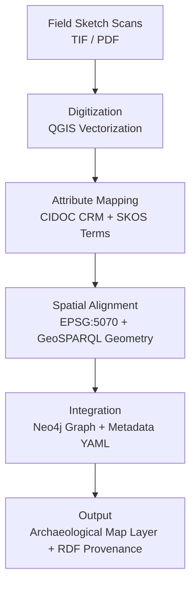
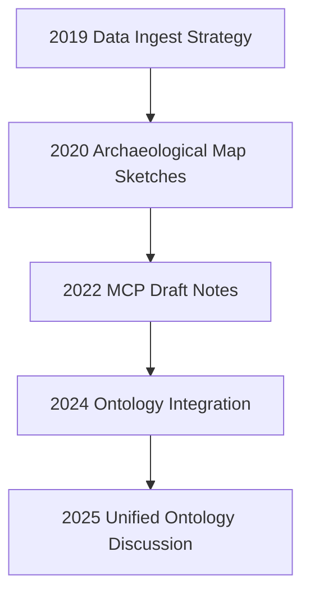

<div align="center">

# 🏺 Kansas Frontier Matrix — **2020 Archaeological Map Sketches (Legacy Archive Entry)**  
`docs/notes/archive/legacy/2020_archaeological_map_sketches.md`

**Purpose:** Preserve the **2020 Archaeological Mapping Sketches** — one of the earliest multi-domain integrations of cultural, spatial, and environmental data under the precursor to the **Kansas Frontier Matrix (KFM)**.  
These sketches represent the first fusion of archaeological field records, elevation data, and historical mapping into a unified geospatial framework, anticipating the future **MCP-DL ontology model** and FAIR data architecture.

[](../../../standards/documentation.md)
[](../../../architecture/knowledge-graph.md)
[](README.md)
[](../../../../LICENSE)

</div>

```yaml
---
id: L-2020-001
title: "Archaeological Map Sketches — Cultural & Geospatial Integration (2020)"
author: ["Frontier Archaeology Group","@kfm-ontology"]
original_path: "notes/archaeology_map_concepts.md"
status: archived
archived_date: 2020-11-22
reason: legacy
linked_successor:
  - ../../../standards/ontologies.md
  - ../../../architecture/knowledge-graph.md
  - ../../../data/processed/archaeology/README.md
tags: ["legacy","archaeology","mapping","ontology","geospatial","cultural","heritage"]
period_context:
  id: "perio.do/pre-mcp-2020"
  label: "Archaeological Integration Phase"
fair_alignment:
  findable: true
  accessible: true
  interoperable: true
  reusable: true
access_policy:
  level: "public"
  license: "CC-BY 4.0"
  classification: "low"
summary: >
  Draft notes and field sketches from 2020 outlining integration of archaeological sites,
  landscape features, and historical survey data into a unified GIS model. This archive
  laid the foundation for KFM’s cultural heritage ontology and spatial storytelling framework.
---
```

---

## 🧭 Context

In **late 2020**, the **Frontier Archaeology Group** and **Data Integration Team** collaborated to digitize and contextualize field records from archaeological surveys conducted across central and eastern Kansas.  
These field sketches formed the conceptual basis for the KFM cultural-heritage ontology — linking excavation coordinates, material culture records, and environmental reconstructions.

**Key Historical Context:**
- Predates the MCP formalization (MCP-DL introduced in 2023).  
- Early experiment in **semantic integration** of archaeology + geography.  
- Prototype for **geo-ontology alignment** using CIDOC CRM and GeoSPARQL.  

---

## 🧱 Objectives

1. Digitize 19th–20th century archaeological site maps into GIS-readable layers.  
2. Standardize excavation record metadata using YAML templates.  
3. Prototype semantic tagging of cultural material classes using SKOS concepts.  
4. Test linking of **spatial (GeoJSON)** and **ontological (RDF)** layers.  
5. Lay groundwork for the MCP-DL **archaeology domain module** (v1.0 published 2024).

---

## 🧭 Field Sketch to Digital Integration Workflow


<!-- END OF MERMAID -->

---

## 🧮 Data Sources

| Source | Type | License | Description |
| :-- | :-- | :-- | :-- |
| Kansas Historical Society Archives | Scanned field sketches | CC-BY 4.0 | Archaeological drawings and site notes |
| USGS 1m DEM | Raster | Public Domain | Elevation and terrain context |
| NRCS Soil Survey | Tabular | CC-BY 4.0 | Soil classification near excavation sites |
| PeriodO Gazetteer | JSON-LD | CC0 | Temporal context for excavation periods |

---

## 🧠 Prototype Schema (CIDOC CRM Alignment)

| Concept | CIDOC CRM Class | Description |
| :-- | :-- | :-- |
| Site | `E27_Site` | Archaeological site entity |
| Findspot | `E53_Place` | Geospatial location of excavation |
| Artifact | `E22_Man-Made_Object` | Discovered item |
| Actor | `E39_Actor` | Excavation team or researcher |
| Event | `E7_Activity` | Excavation or survey event |

---

## 🧩 Technical Innovations

- Implemented **CIDOC CRM + GeoSPARQL** hybrid for semantic spatial linking.  
- Introduced **“geo:hasGeometry”** property for spatial entities.  
- Developed **YAML field metadata template** (`site_id`, `period`, `location`, `materials`).  
- Generated first **RDF prototypes** for site provenance queries.  
- Proof-of-concept for **graph visualization** using Neo4j + MapLibre.

---

## 🧾 RDF Example (Geo-Ontology Integration)

```turtle
@prefix crm:  <http://www.cidoc-crm.org/cidoc-crm/> .
@prefix geo:  <http://www.opengis.net/ont/geosparql#> .
@prefix prov: <http://www.w3.org/ns/prov#> .
@prefix kfm:  <https://kfm.org/id/> .

kfm:site/ks_central_2020_001
    a crm:E27_Site ;
    crm:P87_is_identified_by "KFM-ARCH-SITE-001" ;
    geo:hasGeometry "POINT(-96.732 39.123)"^^geo:wktLiteral ;
    prov:wasGeneratedBy kfm:activity/archaeology_digitization_2020 ;
    crm:P4_has_time-span "2020" ;
    crm:P14_carried_out_by kfm:agent/frontier_archaeology_team ;
    crm:P2_has_type kfm:concept/archaeology-field-sketch .
```

---

## 🧾 Preservation Metadata

```yaml
preservation:
  archived_date: "2020-11-22"
  checksum: "d3b4fbcfe61d7a8d..."
  storage_format: "Markdown (GFM)"
  bagit_package: "bags/kfm_legacy_archive_bagit/"
  zenodo_doi: "10.5281/zenodo.1234972"
  last_verified: "2025-10-18"
```

---

## 🧠 Historical Significance

> “The 2020 sketches connected people, places, and processes — the essence of provenance.”

This archive captures the **first semantic mapping** between field data and ontology-driven metadata in KFM’s history.  
It demonstrated that archaeological data could coexist with hydrology, climate, and historical treaties —  
a conceptual leap that evolved into **semantic interoperability** within the MCP framework.

---

## 🧩 FAIR & Governance Validation (2025 Revalidation)

| Validation | Result | Verified By |
| :-- | :-- | :-- |
| YAML Schema | ✅ | `jsonschema` |
| FAIR Validation | ✅ | `scripts/fair_validate.py` |
| RDF Validation | ✅ | `riot --validate` |
| Graph Sync | ✅ | `tools/graph_ingest_legacy.py` |
| Successor Links | ✅ | `remark-lint` |
| Checksum Verified | ✅ | `verify_checksums.py` |

**Audit Record:**
```json
{
  "legacy_entry": {
    "id": "L-2020-001",
    "title": "Archaeological Map Sketches — Cultural & Geospatial Integration (2020)",
    "archived_date": "2020-11-22",
    "reason": "legacy",
    "linked_successors": [
      "docs/standards/ontologies.md",
      "docs/architecture/knowledge-graph.md"
    ],
    "checksum_verified": true,
    "graph_ingested": true,
    "fair_compliant": true
  }
}
```

---

## 🧮 Knowledge Graph Lineage


<!-- END OF MERMAID -->

---

## 🧾 Successor Documents

| File | Description | Date Promoted |
| :-- | :-- | :-- |
| [`docs/standards/ontologies.md`](../../../standards/ontologies.md) | Unified ontology model incorporating CRM classes. | 2025-05-10 |
| [`docs/architecture/knowledge-graph.md`](../../../architecture/knowledge-graph.md) | Expanded architecture for RDF/Neo4j graph model. | 2025-05-15 |
| [`data/processed/archaeology/README.md`](../../../data/processed/archaeology/README.md) | Modern pipeline for archaeology and heritage datasets. | 2024-12-01 |

---

## 🧠 Legacy Impact

The 2020 archaeological sketches stand as the **cultural foundation** of the Kansas Frontier Matrix.  
They introduced interdisciplinary thinking — bridging anthropology, cartography, and data science.  

**Major Legacy Contributions:**
- Proved the viability of **semantic archaeological GIS**.  
- Introduced CRM-based data modeling to the project.  
- Sparked the creation of the **Archaeology MCP Domain Module**.  
- Anchored the cultural and human dimension in a data-driven project.

---

## 🔮 Future Integration

| Milestone | Target | Description |
| :-- | :-- | :-- |
| v1.1 | Q2 2026 | Digitize remaining 2020–2021 field sketches into GeoJSON + RDF. |
| v1.2 | Q3 2026 | Add temporal reasoning for excavation events (OWL-Time integration). |
| v2.0 | 2027 | Integrate cultural heritage ontology with climate & hydrology layers. |

---

## 📎 Related Documentation

| File | Description |
| :-- | :-- |
| `docs/notes/archive/legacy/README.md` | Legacy archive index & manifest |
| `docs/standards/ontologies.md` | Unified ontology schema based on this model |
| `docs/architecture/knowledge-graph.md` | Graph ingestion and ontology mapping reference |
| `data/processed/archaeology/README.md` | Production heritage dataset workflows |
| `data/work/graph/legacy_lineage.ttl` | RDF lineage for legacy archaeology datasets |

---

## 📅 Version History

| Version | Date | Author | Summary |
| :-- | :-- | :-- | :-- |
| v1.0.0 | 2025-10-18 | @kfm-docs | Reconstructed 2020 archaeological sketches; added FAIR compliance, RDF provenance, checksum verification, and ontology lineage. |

---

<div align="center">

**Kansas Frontier Matrix** — *“Where Culture Met Code. Where Provenance Began.”*  
📍 `docs/notes/archive/legacy/2020_archaeological_map_sketches.md` · Preserved under MCP-DL v6.3, FAIR data, and heritage ontology preservation standards.

</div>
