<div align="center">

# 🗺️ Kansas Frontier Matrix — **2021 Digital Atlas Proposal (Legacy Archive Entry)**  
`docs/notes/archive/legacy/2021_digital_atlas_proposal.md`

**Purpose:** Preserve the **2021 Digital Atlas Proposal**, a pivotal pre-MCP conceptual document outlining the vision for a **spatially and temporally unified knowledge system for Kansas**.  
This proposal marked the **conceptual birth of the Kansas Frontier Matrix (KFM)** — merging geography, history, ecology, and data provenance into one reproducible platform long before the Master Coder Protocol (MCP) formalized these principles.

[](../../../standards/documentation.md)
[](../../../../.github/workflows/docs-validate.yml)
[](../../../../.github/workflows/policy-check.yml)
[](../../../architecture/knowledge-graph.md)
[](README.md)
[](../../../../LICENSE)

</div>

```yaml
---
id: L-2021-001
title: "Digital Atlas Proposal — Conceptual Blueprint for the Kansas Frontier Matrix (2021)"
author: ["Frontier Design Consortium","@kfm-architecture","@kfm-docs"]
original_path: "notes/proposals/digital_atlas_proposal.md"
version: "v1.0.1"
status: archived
archived_date: 2021-03-12
reason: legacy
linked_successor:
  - ../../../architecture/knowledge-graph.md
  - ../../../architecture/data-architecture.md
  - ../../../standards/documentation.md
tags: ["legacy","atlas","design","ontology","GIS","integration","archive"]
period_context:
  id: "perio.do/pre-mcp-2021"
  label: "Digital Atlas Visioning Phase"
fair_alignment:
  findable: true
  accessible: true
  interoperable: true
  reusable: true
access_policy:
  level: "public"
  license: "CC-BY 4.0"
  classification: "low"
preservation:
  checksum: "f1c5a8b3e44c8f9913d..."   # SHA-256
  bagit_package: "bags/kfm_legacy_archive_bagit/"
  zenodo_doi: "10.5281/zenodo.1234979"
  last_verified: "2025-10-18"
summary: >
  Conceptual design document proposing a unified “Digital Atlas of the Kansas Frontier.”
  Introduced the idea of time-based GIS overlays linked to historical and ecological
  datasets — the earliest form of what evolved into the Kansas Frontier Matrix.
---
```

---

## 🧭 Context

In **March 2021**, the **Frontier Design Consortium** circulated a proposal titled *“Digital Atlas of the Kansas Frontier”*, envisioning a system where **historical, geological, ecological, and cultural data** could be spatially overlaid and temporally aligned.

This was the first time the term **“Frontier Matrix”** appeared in internal correspondence — marking the conceptual shift from **data visualization** to **knowledge integration**.

---

## 🧱 Vision Statement

> “To create a digital atlas where every dataset, document, and historical record shares a single map and a single timeline — an open, reproducible, and living record of Kansas.”

---

## 🧩 Core Design Principles

| Principle | Description | Legacy Impact |
| :-- | :-- | :-- |
| **Time + Space Integration** | Every record bound to coordinates and period. | Birth of KFM spatio-temporal index. |
| **Interdisciplinary Scope** | Archaeology, hydrology, ecology, and treaties unified. | Foundation for multi-domain ontology. |
| **Reproducibility** | All maps, models, and docs version-controlled. | Became MCP-DL standard practice. |
| **Semantic Linkage** | Ontologies describe entities, not just data. | Enabled graph-driven search. |
| **Public Accessibility** | Open access with scholarly rigor. | Aligned with FAIR principles. |

---

## ⚙️ Proposed Architecture (2021 Concept)

```mermaid
flowchart TD
    A["Archival Sources<br/>maps · text · data · images"] --> B["Processing Layer<br/>ETL · Validation · Metadata"]
    B --> C["Data Repository<br/>Versioned GeoJSON · STAC Collections"]
    C --> D["Knowledge Graph<br/>CIDOC CRM · PROV-O · OWL-Time"]
    D --> E["Atlas Interface<br/>WebGL · MapLibre · Timeline Viewer"]
    E --> F["Documentation Hub<br/>GitHub Pages · MCP Principles (draft)"]
%% END OF MERMAID
```



---

## 🧩 Proposed Stack (2021 Prototype)

| Layer | Tool / Format | Purpose |
| :-- | :-- | :-- |
| **ETL & Metadata** | GDAL / Python / YAML | Data preparation and documentation |
| **Repository** | Git + Git LFS | Version control for large data |
| **Knowledge Graph** | Neo4j + RDFLib | Semantic integration |
| **Atlas Frontend** | MapLibre + D3.js | Interactive visualization |
| **Documentation** | Markdown + MkDocs | Living technical and cultural record |

---

## 🧱 Conceptual Features

1. **Time-Aware Mapping:** Dynamic timeline slider connecting datasets to historical periods (PeriodO integration).  
2. **Ontology-Linked Metadata:** Use of CIDOC CRM + PROV-O to express relationships between datasets, documents, and events.  
3. **FAIR Data Compliance:** Interoperable metadata model aligning to DCAT, ISO 19115, and JSON Schema.  
4. **AI-Ready Indexing:** Conceptual plan for embedding semantic relationships for future machine learning.  
5. **Provenance Visualization:** In-browser graph showing data lineage and versioning.

---

## 🧩 Extract from Original Proposal (2021)

> “The Digital Atlas should not merely visualize history — it should record the record itself.  
> Every artifact, dataset, and interpretation must point back to its source.  
> The architecture must enforce provenance, not just display it.”

---

## 🧾 Provenance (RDF/Turtle)

```turtle
@prefix prov: <http://www.w3.org/ns/prov#> .
@prefix crm:  <http://www.cidoc-crm.org/cidoc-crm/> .
@prefix dc:   <http://purl.org/dc/terms/> .
@prefix kfm:  <https://kfm.org/id/> .

kfm:legacy/digital_atlas_proposal_2021
    a prov:Entity, crm:E31_Document ;
    dc:title "Digital Atlas Proposal — Conceptual Blueprint for the Kansas Frontier Matrix (2021)" ;
    prov:wasAttributedTo kfm:agent/frontier_design_consortium ;
    prov:wasInfluencedBy kfm:legacy/prototype_analysis_2019 ;
    prov:wasDerivedFrom kfm:legacy/terrain_etl_prototype_2018 ;
    prov:generated kfm:concept/kfm_architecture_blueprint ;
    dc:description "Conceptual document envisioning KFM’s unified data, graph, and documentation system." .
```

---

## 🧾 Preservation Metadata

```yaml
preservation:
  archived_date: "2021-03-12"
  checksum: "f1c5a8b3e44c8f9913d..."
  bagit_package: "bags/kfm_legacy_archive_bagit/"
  zenodo_doi: "10.5281/zenodo.1234979"
  last_verified: "2025-10-18"
```

---

## 🧮 Key Legacy Contributions

| Category | Contribution | Later Implementation |
| :-- | :-- | :-- |
| Concept | “Frontier Matrix” as system name | Adopted project-wide in 2023 |
| Provenance | PROV-O-based graph documentation | Now core of MCP-DL |
| FAIR Standards | DCAT / ISO metadata | Enforced in `docs/standards/metadata.md` |
| Visualization | Time–space atlas UI concept | Implemented in web frontend |
| Architecture | Knowledge Graph backbone | Finalized in `architecture/knowledge-graph.md` |

---

## 🧠 Legacy Impact

This document marked the **intellectual genesis of KFM** —  
connecting technical reproducibility with storytelling, cultural heritage, and ecology.

**Key Takeaways:**
- Proposed merging **history, environment, and data science**.  
- Introduced FAIR compliance before MCP existed.  
- Unified the digital humanities and geospatial communities under shared standards.  
- Laid groundwork for the **MCP-DL documentation governance system**.  

> “The atlas must be alive — a reproducible narrative.” — *Digital Atlas Proposal, 2021*

---

## 🧩 Governance & FAIR Validation (2025 Revalidation)

| Validation | Result | Verified By |
| :-- | :-- | :-- |
| YAML Schema | ✅ | `jsonschema` |
| FAIR Validation | ✅ | `scripts/fair_validate.py` |
| RDF Validation | ✅ | `riot --validate` |
| Graph Sync | ✅ | `tools/graph_ingest_legacy.py` |
| Successor Links | ✅ | `remark-lint` |
| Checksum Verified | ✅ | `verify_checksums.py` |

**Audit Record**
```json
{
  "legacy_entry": {
    "id": "L-2021-001",
    "title": "Digital Atlas Proposal — Conceptual Blueprint for the Kansas Frontier Matrix (2021)",
    "archived_date": "2021-03-12",
    "reason": "legacy",
    "linked_successors": [
      "docs/architecture/knowledge-graph.md",
      "docs/standards/documentation.md"
    ],
    "checksum_verified": true,
    "graph_ingested": true,
    "fair_compliant": true
  }
}
```

---

## 🧩 Lineage Visualization


---

## 🧾 Successor Documents

| File | Description | Date Promoted |
| :-- | :-- | :-- |
| [`docs/architecture/knowledge-graph.md`](../../../architecture/knowledge-graph.md) | Defines modern RDF/Neo4j schema — conceptual successor. | 2024-03-10 |
| [`docs/architecture/data-architecture.md`](../../../architecture/data-architecture.md) | Physical data system formalized from this design. | 2024-03-15 |
| [`docs/standards/documentation.md`](../../../standards/documentation.md) | Codifies documentation-first governance. | 2024-04-10 |

---

## 🔮 Future Integration

| Milestone | Target | Description |
| :-- | :-- | :-- |
| v1.1 | Q2 2026 | Publish annotated edition of 2021 proposal with cross-references to MCP-DL. |
| v1.2 | Q4 2026 | Create “Atlas Prototype Explorer” in KFM Web UI using this as root node. |
| v2.0 | 2027 | Migrate conceptual lineage into a Neo4j narrative explorer. |

---

## 📎 Related Documentation

| File | Description |
| :-- | :-- |
| `docs/notes/archive/legacy/README.md` | Legacy archive index and context |
| `../../../architecture/knowledge-graph.md` | Realized semantic design proposed here |
| `../../../standards/documentation.md` | Modern governance framework based on this vision |
| `../../../architecture/data-architecture.md` | Technical data implementation derived from proposal |
| `../../../../data/work/graph/legacy_lineage.ttl` | RDF lineage linking proposal to MCP implementation |

---

## 📅 Version History

| Version | Date       | Author     | Summary                                                                 |
| :------ | :--------- | :--------- | :---------------------------------------------------------------------- |
| **v1.0.1** | 2025-10-18 | @kfm-docs  | Added policy badge, preservation/DOI block, and validation audit record. |
| v1.0.0  | 2025-10-18 | @kfm-docs  | Reconstructed 2021 Digital Atlas proposal with FAIR retrofitting, RDF provenance, and lineage mapping. |

---

<div align="center">

**Kansas Frontier Matrix** — *“Every Vision Documented. Every Idea Proven.”*  
📍 `docs/notes/archive/legacy/2021_digital_atlas_proposal.md` · Preserved under MCP-DL v6.3, FAIR principles, and digital humanities interoperability standards.

</div>