<div align="center">

# ⚙️ Kansas Frontier Matrix — **2022 MCP Draft Notes (Legacy Archive Entry)**  
`docs/notes/archive/legacy/2022_mcp_draft_notes.md`

**Purpose:** Preserve the **2022 Master Coder Protocol (MCP) Draft Notes**, the first formal documentation outlining the design philosophy, reproducibility principles, and documentation governance that later evolved into the **Master Coder Protocol – Documentation Language (MCP-DL)** adopted by the **Kansas Frontier Matrix (KFM)**.  
This archive represents the **intellectual and operational birth of KFM’s reproducibility doctrine**.

[](../../../standards/documentation.md)
[](../../../architecture/knowledge-graph.md)
[](README.md)
[](../../../../LICENSE)

</div>

```yaml
---
id: L-2022-001
title: "MCP Draft Notes — Documentation & Governance Blueprint (2022)"
author: ["Frontier Data Governance Group","@kfm-docs","@kfm-governance"]
original_path: "notes/governance/mcp_draft_notes.md"
status: archived
archived_date: 2022-12-11
reason: legacy
linked_successor:
  - ../../../standards/documentation.md
  - ../../../architecture/data-architecture.md
  - ../../../architecture/knowledge-graph.md
tags: ["legacy","mcp","governance","documentation","reproducibility","audit","archive"]
period_context:
  id: "perio.do/mcp-formulation-2022"
  label: "Master Coder Protocol Draft Phase"
fair_alignment:
  findable: true
  accessible: true
  interoperable: true
  reusable: true
access_policy:
  level: "public"
  license: "CC-BY 4.0"
  classification: "low"
summary: >
  The 2022 MCP Draft Notes are the first formal blueprint for documentation-first
  software and data governance. This document unified previous prototypes (2018–2021)
  into a single reproducibility framework — later codified as MCP-DL v6.3 within
  the Kansas Frontier Matrix.
---
```

---

## 🧭 Context

In **December 2022**, the **Frontier Data Governance Group** consolidated years of experimental documentation and reproducibility work into what became known as the **Master Coder Protocol (MCP)**.

This draft formalized:
- Governance roles and accountability structure.  
- Documentation-first, version-controlled workflows.  
- Provenance and reproducibility as auditable infrastructure.  
- The conceptual basis for **MCP-DL v6.x** and its integration into the **Kansas Frontier Matrix (KFM)** ecosystem.

---

## 🧩 Original Objectives

1. Define the **MCP governance hierarchy** for multidisciplinary data integration.  
2. Create documentation templates with mandatory YAML metadata.  
3. Formalize the **five pillars** of reproducibility.  
4. Integrate provenance (PROV-O), ontology (CIDOC CRM), and schema validation (JSON Schema).  
5. Establish **CI/CD enforcement policies** for documentation compliance.

---

## 🧱 MCP Prototype Structure (2022 Draft)

```mermaid
flowchart TD
    A["Documentation-First<br/>Markdown + YAML"] --> B["Validation<br/>JSON Schema · YAML Lint"]
    B --> C["Automation<br/>CI/CD · GitHub Actions"]
    C --> D["Provenance Graph<br/>Neo4j · RDF · PROV-O"]
    D --> E["Audit & FAIR Compliance<br/>ISO 8601 · DCAT · PREMIS"]
    E --> F["Continuous Reproducibility<br/>Version Control + Checksum Logs"]
```


<!-- END OF MERMAID -->

---

## ⚙️ Five Pillars of MCP (as Drafted in 2022)

| Pillar | Description | Legacy Impact |
| :-- | :-- | :-- |
| **Documentation-First** | Every process and dataset begins as a document. | Foundation of MCP-DL. |
| **Reproducibility** | All outputs traceable to inputs via checksum and metadata. | Ensured auditability. |
| **Provenance** | Every artifact linked through PROV-O entities and agents. | Core of Knowledge Graph. |
| **Governance** | Decision-making logged, versioned, and reviewable. | CI/CD + Documentation workflows. |
| **Transparency** | Open licenses, FAIR principles, and immutable archives. | Enshrined in KFM policy. |

---

## 🧾 MCP Draft Excerpt (2022)

> “Every file, process, and result must exist within a provable chain of documentation.  
>  A single missing commit breaks not only the data — it breaks the proof.”

> “Software without provenance is fiction. Documentation without versioning is entropy.”

---

## 🧠 Governance Hierarchy (as Proposed)

| Role | Responsibility | Description |
| :-- | :-- | :-- |
| **MCP Maintainer** | Oversees repository governance | Ensures compliance with documentation and reproducibility standards |
| **Data Steward** | Manages ingestion, checksum, and metadata quality | Custodian of FAIR compliance |
| **Reviewer / Auditor** | Validates documentation and graph integrity | Independent verification |
| **Contributor** | Writes new documentation or code | Must adhere to YAML + CI standards |

---

## 🧮 Technical Highlights

- Introduced **`docs/standards/documentation.md`** as governance anchor.  
- Proposed first **Mermaid-based architecture visualization** for data flow.  
- Designed early **`make docs-validate`** workflow (still active).  
- Authored prototype **templates for research, meeting, and backlog notes**.  
- Implemented **RDF exports** for provenance tracking (later automated in 2024).  

---

## 🧩 Provenance Record (RDF/Turtle)

```turtle
@prefix prov: <http://www.w3.org/ns/prov#> .
@prefix crm:  <http://www.cidoc-crm.org/cidoc-crm/> .
@prefix dc:   <http://purl.org/dc/terms/> .
@prefix kfm:  <https://kfm.org/id/> .

kfm:legacy/mcp_draft_notes_2022
    a prov:Entity, crm:E31_Document ;
    dc:title "MCP Draft Notes — Documentation & Governance Blueprint (2022)" ;
    prov:wasAttributedTo kfm:agent/frontier_data_governance_group ;
    prov:wasDerivedFrom kfm:legacy/digital_atlas_proposal_2021 ;
    prov:wasInfluencedBy kfm:legacy/data_ingest_strategy_2019 ;
    prov:generated kfm:standard/mcp_documentation_principles ;
    dc:description "Preliminary documentation of MCP standards and governance, forming the basis of MCP-DL v6.3." .
```

---

## 🧾 Preservation Metadata

```yaml
preservation:
  archived_date: "2022-12-11"
  checksum: "b3e7f98a9d11a89e..."
  bagit_package: "bags/kfm_legacy_archive_bagit/"
  zenodo_doi: "10.5281/zenodo.1234983"
  last_verified: "2025-10-18"
```

---

## 🧮 FAIR & Governance Validation (2025 Revalidation)

| Validation | Result | Verified By |
| :-- | :-- | :-- |
| YAML Schema | ✅ | `jsonschema` |
| FAIR Validation | ✅ | `scripts/fair_validate.py` |
| RDF Validation | ✅ | `riot --validate` |
| Graph Sync | ✅ | `tools/graph_ingest_legacy.py` |
| Successor Links | ✅ | `remark-lint` |
| Checksum Verified | ✅ | `verify_checksums.py` |

**Audit Record:**
```json
{
  "legacy_entry": {
    "id": "L-2022-001",
    "title": "MCP Draft Notes — Documentation & Governance Blueprint (2022)",
    "archived_date": "2022-12-11",
    "reason": "legacy",
    "linked_successors": [
      "docs/standards/documentation.md",
      "docs/architecture/data-architecture.md",
      "docs/architecture/knowledge-graph.md"
    ],
    "checksum_verified": true,
    "graph_ingested": true,
    "fair_compliant": true
  }
}
```

---

## 🧱 Key Legacy Contributions

| Contribution | Description | Successor Implementation |
| :-- | :-- | :-- |
| Defined MCP Principles | Outlined five reproducibility pillars. | Adopted in `docs/standards/documentation.md`. |
| Governance Hierarchy | Role structure for documentation management. | Implemented in CODEOWNERS and CI checks. |
| Metadata Templates | Introduced YAML schema + Markdown fusion. | Used in `/docs/notes/templates/README.md`. |
| Provenance Standards | Linked outputs to sources using PROV-O. | Implemented in graph ingestion pipelines. |
| Validation Workflow | Prototype for `make docs-validate`. | Still in use across MCP repositories. |

---

## 🧠 Legacy Significance

The **2022 MCP Draft Notes** transformed reproducibility from an idea into an enforceable framework.  
It unified the efforts of previous years — from ETL automation to FAIR compliance — into a living, evolving methodology that still defines the Kansas Frontier Matrix today.

> *“MCP is not a protocol; it’s an ecosystem of accountability.”* — 2022 Draft Notes

---

## 🧭 Lineage Diagram (Pre-MCP → MCP-DL)


<!-- END OF MERMAID -->

---

## 🧾 Successor Documents

| File | Description | Date Promoted |
| :-- | :-- | :-- |
| [`docs/standards/documentation.md`](../../../standards/documentation.md) | Modern MCP-DL documentation & governance guide. | 2024-04-10 |
| [`docs/architecture/data-architecture.md`](../../../architecture/data-architecture.md) | Modernized repository data structure built on this draft. | 2024-03-05 |
| [`docs/architecture/knowledge-graph.md`](../../../architecture/knowledge-graph.md) | Formal graph model for provenance tracking. | 2024-03-10 |

---

## 🧩 Governance Roles (Legacy → Present)

| 2022 Draft Role | 2025 Equivalent | Description |
| :-- | :-- | :-- |
| MCP Maintainer | @kfm-governance | Oversees repository compliance. |
| Data Steward | @kfm-data | Handles FAIR data quality and checksum verification. |
| Auditor | @kfm-docs | Performs quarterly documentation reviews. |
| Contributor | @kfm-community | Authors new docs under MCP-DL guidelines. |

---

## 🔮 Future Integration

| Milestone | Target | Description |
| :-- | :-- | :-- |
| v1.1 | Q1 2026 | Add annotated crosswalk between MCP v1 (2022) and MCP-DL v6.3. |
| v1.2 | Q3 2026 | Integrate AI model summarization of legacy governance notes. |
| v2.0 | 2027 | Publish MCP provenance timeline explorer in KFM web UI. |

---

## 📎 Related Documentation

| File | Description |
| :-- | :-- |
| `docs/notes/archive/legacy/README.md` | Legacy archive index and context. |
| `docs/architecture/data-architecture.md` | Derived from this governance draft. |
| `docs/architecture/knowledge-graph.md` | Graph ingestion standards rooted in this phase. |
| `docs/standards/documentation.md` | Codified MCP-DL standard replacing this draft. |
| `data/work/graph/legacy_lineage.ttl` | RDF lineage connecting all MCP-related documents. |

---

## 📅 Version History

| Version | Date | Author | Summary |
| :-- | :-- | :-- | :-- |
| v1.0.0 | 2025-10-18 | @kfm-docs | Reconstructed 2022 MCP Draft Notes; added FAIR compliance, RDF lineage, governance role crosswalk, and checksum metadata. |

---

<div align="center">

**Kansas Frontier Matrix** — *“Governance Began Here. Reproducibility Endures.”*  
📍 `docs/notes/archive/legacy/2022_mcp_draft_notes.md` · Preserved under MCP-DL v6.3, FAIR data, and governance reproducibility standards.

</div>
