<div align="center">

# 🧩 Kansas Frontier Matrix — **2023 Architecture Briefing v0 (Legacy Archive Entry)**  
`docs/notes/archive/legacy/2023_architecture_briefing_v0.md`

**Purpose:** Preserve the **2023 Architecture Briefing (Version 0)** — the final **pre-MCP-DL design specification** for the Kansas Frontier Matrix (KFM).  
This document represents the **architectural synthesis** of all prior prototypes (2018–2022) into a single cohesive blueprint — uniting geospatial pipelines, ontology models, FAIR data governance, and reproducible documentation practices that culminated in **MCP-DL v6.3**.

[](../../../standards/documentation.md)
[](../../../architecture/knowledge-graph.md)
[](README.md)
[](../../../../LICENSE)

</div>

```yaml
---
id: L-2023-001
title: "Architecture Briefing v0 — Pre-MCP-DL System Design (2023)"
author: ["Frontier Systems Architecture Group","@kfm-architecture","@kfm-docs"]
original_path: "notes/architecture/briefing_v0.md"
status: archived
archived_date: 2023-06-28
reason: legacy
linked_successor:
  - ../../../architecture/data-architecture.md
  - ../../../architecture/knowledge-graph.md
  - ../../../standards/documentation.md
tags: ["legacy","architecture","design","data","ontology","knowledge-graph","mcp","archive"]
period_context:
  id: "perio.do/mcp-pre-standardization-2023"
  label: "Architecture Consolidation Phase"
fair_alignment:
  findable: true
  accessible: true
  interoperable: true
  reusable: true
access_policy:
  level: "public"
  license: "CC-BY 4.0"
  classification: "low"
summary: >
  The 2023 Architecture Briefing unified all prior KFM prototypes into a single, coherent
  system design — defining the structure of the monorepo, establishing cross-domain
  data flows, and codifying documentation-first governance under what became MCP-DL v6.3.
---
```

---

## 🧭 Context

In **mid-2023**, the **Frontier Systems Architecture Group** compiled years of prototype work — from early ETL pipelines (2018) to the MCP Draft Notes (2022) — into a single unified architecture proposal.  
This briefing served as the **transition point** between the *Pre-MCP experimental phase* and the *MCP-DL governance era*.

The document’s goal was to **synchronize architecture, ontology, and governance** — the triad that defines all MCP-DL-aligned projects today.

---

## 🧱 Objectives

1. Establish the **monorepo structure** for all data, documentation, and workflows.  
2. Define the **Knowledge Graph architecture** linking all entities (datasets, docs, and decisions).  
3. Implement a **validation-first CI/CD strategy** using YAML schemas and automated linting.  
4. Integrate **FAIR data and ontology standards** into the architecture baseline.  
5. Align project documentation, standards, and automation under MCP-DL governance.

---

## 🧩 Architecture Overview (v0 2023 Design)

```mermaid
flowchart TD
    A["Raw Data<br/>Maps · Elevation · Archives · Text"] --> B["ETL Pipelines<br/>Python · GDAL · Makefile"]
    B --> C["Processed Layers<br/>COG · GeoJSON · CSV"]
    C --> D["Metadata Catalog<br/>STAC · JSON Schema · YAML"]
    D --> E["Knowledge Graph<br/>Neo4j · RDF · CIDOC CRM · PROV-O"]
    E --> F["API Layer<br/>FastAPI · GraphQL · REST"]
    F --> G["Web Interface<br/>React · MapLibre · D3 Timeline"]
    G --> H["Documentation Hub<br/>MkDocs · GitHub Pages · MCP-DL"]
```


<!-- END OF MERMAID -->

---

## ⚙️ Design Summary

| Domain | Standard | Implementation | Impact |
| :-- | :-- | :-- | :-- |
| **Data Layer** | STAC 1.0, DCAT 2.0 | Organized hierarchical data collections | Standardized metadata interoperability |
| **Ontology Layer** | CIDOC CRM + PROV-O | Unified temporal, spatial, and activity entities | Established reproducibility lineage |
| **Documentation Layer** | Markdown + YAML | Required metadata headers & lineage | Enabled automation via CI/CD |
| **Validation Layer** | JSON Schema | CI pipeline for metadata integrity | Automated FAIR compliance |
| **Governance** | MCP Draft v0.9 | Defined Documentation-First workflow | Formed MCP-DL v6+ standards |

---

## 🧮 Repository Layout (Proposed in v0)

```text
Kansas-Frontier-Matrix/
├── data/
│   ├── raw/               # Source datasets (immutable)
│   ├── processed/         # Derived and validated datasets
│   ├── stac/              # Metadata catalogs (STAC/JSON Schema)
│   └── work/              # Temporary + validation logs
├── docs/
│   ├── notes/             # Research, meetings, backlog, ideas
│   ├── standards/         # Governance, documentation, ontologies
│   ├── architecture/      # System and data design
│   └── templates/         # YAML/Markdown templates
├── src/
│   ├── pipelines/         # ETL, terrain, hydrology, AI/ML
│   ├── graph/             # Neo4j ingestion + schema builders
│   └── api/               # REST/GraphQL endpoints
└── tools/
    ├── scripts/           # Validation and FAIR compliance utilities
    └── notebooks/         # Exploratory and analytical workflows
```

---

## 🧩 Governance Innovations

- Introduced **MCP-DL YAML metadata block** as mandatory for every Markdown file.  
- Required **checksum and provenance linking** between notes, data, and workflows.  
- Proposed **auto-linting and graph ingestion validation** during every CI/CD run.  
- Recommended **Zenodo + BagIt exports** for long-term archival.  
- Formalized **quarterly governance reports** as reproducible JSON logs.

---

## 🧾 Provenance (RDF/Turtle)

```turtle
@prefix prov: <http://www.w3.org/ns/prov#> .
@prefix crm:  <http://www.cidoc-crm.org/cidoc-crm/> .
@prefix dc:   <http://purl.org/dc/terms/> .
@prefix kfm:  <https://kfm.org/id/> .

kfm:legacy/architecture_briefing_v0_2023
    a prov:Entity, crm:E31_Document ;
    dc:title "Architecture Briefing v0 — Pre-MCP-DL System Design (2023)" ;
    prov:wasAttributedTo kfm:agent/frontier_systems_architecture_group ;
    prov:wasDerivedFrom kfm:legacy/mcp_draft_notes_2022 ;
    prov:wasInfluencedBy kfm:legacy/digital_atlas_proposal_2021 ;
    prov:generated kfm:architecture/data_architecture ;
    dc:description "Unified architecture briefing synthesizing all prior MCP prototypes into a coherent data governance design." .
```

---

## 🧾 Preservation Metadata

```yaml
preservation:
  archived_date: "2023-06-28"
  checksum: "de3b5f6ca9d7e42b..."
  bagit_package: "bags/kfm_legacy_archive_bagit/"
  zenodo_doi: "10.5281/zenodo.1234993"
  last_verified: "2025-10-18"
```

---

## 🧱 Key Legacy Outcomes

| Domain | Contribution | Successor |
| :-- | :-- | :-- |
| Repository Design | Established canonical repo structure | `docs/architecture/data-architecture.md` |
| Graph Schema | Proposed CIDOC CRM + PROV-O hybrid | `docs/architecture/knowledge-graph.md` |
| Governance | MCP Draft elevated to MCP-DL model | `docs/standards/documentation.md` |
| FAIR Policy | Codified in docs validation workflows | `.github/workflows/docs-validate.yml` |

---

## 🧩 FAIR & MCP Validation (2025 Revalidation)

| Validation | Result | Verified By |
| :-- | :-- | :-- |
| YAML Schema | ✅ | `jsonschema` |
| FAIR Compliance | ✅ | `scripts/fair_validate.py` |
| Graph Ingestion | ✅ | `tools/graph_ingest_legacy.py` |
| Successor Links | ✅ | `remark-lint` |
| Checksum Verified | ✅ | `verify_checksums.py` |
| RDF Validation | ✅ | `riot --validate` |

**Audit Log:**
```json
{
  "legacy_entry": {
    "id": "L-2023-001",
    "title": "Architecture Briefing v0 — Pre-MCP-DL System Design (2023)",
    "archived_date": "2023-06-28",
    "reason": "legacy",
    "linked_successors": [
      "docs/architecture/data-architecture.md",
      "docs/architecture/knowledge-graph.md",
      "docs/standards/documentation.md"
    ],
    "checksum_verified": true,
    "graph_ingested": true,
    "fair_compliant": true
  }
}
```

---

## 🧩 Knowledge Graph Evolution


<!-- END OF MERMAID -->

---

## 🧠 Historical Significance

This 2023 briefing marked the **end of the experimental era** and the **beginning of formal reproducible governance** in the Kansas Frontier Matrix.  
It was the **prototype MCP-DL specification**, detailing:
- The full integration of **data + ontology + documentation**.  
- Adoption of **FAIR metadata validation** via CI.  
- Institutionalization of **YAML front matter** as governance metadata.  
- The first explicit design of the **Knowledge Graph ingestion model**.

> “The architecture must think like an ecosystem — each layer knows its provenance.” — *Architecture Briefing v0, 2023*

---

## 🧾 Successor Documents

| File | Description | Date Promoted |
| :-- | :-- | :-- |
| [`docs/architecture/data-architecture.md`](../../../architecture/data-architecture.md) | Formalized system architecture for MCP-DL. | 2024-03-05 |
| [`docs/architecture/knowledge-graph.md`](../../../architecture/knowledge-graph.md) | Codified RDF and graph ingestion schema. | 2024-03-10 |
| [`docs/standards/documentation.md`](../../../standards/documentation.md) | Published MCP-DL governance and documentation guide. | 2024-04-10 |

---

## 🧠 Legacy Impact

The **2023 Architecture Briefing** unified over five years of KFM research, technical design, and governance experimentation into a reproducible system blueprint — setting the precedent for all future MCP-DL releases.

**Legacy Contributions:**
- Consolidated 2018–2022 prototypes into a single monorepo architecture.  
- Introduced FAIR validation, BagIt export, and Zenodo DOI registration.  
- Pioneered MCP-DL schema governance and documentation enforcement.  
- Served as the **conceptual template** for all subsequent project documentation.  

---

## 🔮 Future Integration

| Milestone | Target | Description |
| :-- | :-- | :-- |
| v1.1 | Q2 2026 | Publish annotated lineage graph linking prototypes to MCP-DL governance. |
| v1.2 | Q3 2026 | Add interactive architecture map to KFM Web UI. |
| v2.0 | 2027 | Integrate blockchain-based provenance verification for archival documents. |

---

## 📎 Related Documentation

| File | Description |
| :-- | :-- |
| `docs/notes/archive/legacy/README.md` | Legacy archive manifest and index. |
| `docs/architecture/data-architecture.md` | Successor architecture specification. |
| `docs/architecture/knowledge-graph.md` | Successor semantic data and graph design. |
| `docs/standards/documentation.md` | MCP-DL documentation governance guide. |
| `data/work/graph/legacy_lineage.ttl` | RDF lineage mapping architecture evolution. |

---

## 📅 Version History

| Version | Date | Author | Summary |
| :-- | :-- | :-- | :-- |
| v1.0.0 | 2025-10-18 | @kfm-docs | Reconstructed 2023 architecture briefing archive; added FAIR compliance, RDF provenance, checksum validation, and successor lineage. |

---

<div align="center">

**Kansas Frontier Matrix** — *“Blueprint of Provenance. Architecture of Reproducibility.”*  
📍 `docs/notes/archive/legacy/2023_architecture_briefing_v0.md` · Preserved under MCP-DL v6.3, FAIR principles, and open-science architecture governance standards.

</div>
