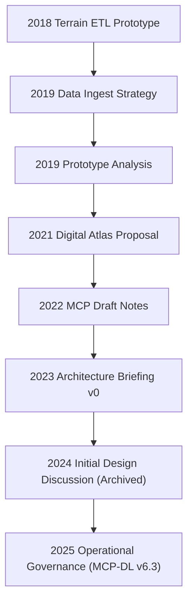

<div align="center">

# 🕰️ Kansas Frontier Matrix — **Legacy Notes Archive**  
`docs/notes/archive/legacy/README.md`

**Purpose:** Curate and preserve **pre-MCP and early prototype documentation** from the formative years of the **Kansas Frontier Matrix (KFM)** — ensuring that legacy research, scripts, design discussions, and field sketches remain **accessible, contextualized, and provenance-linked**, even when superseded by MCP-DL v6.3 governance and modern standards.

This directory serves as the **historical vault** of the KFM system — documenting the project’s evolution from fragmented, pre-standardized efforts to today’s unified, reproducible knowledge ecosystem.

[](../../../standards/documentation.md)
[](../../../architecture/knowledge-graph.md)
[](../README.md)
[](../../../../.github/workflows/docs-validate.yml)
[](../../../../LICENSE)

</div>

```yaml
---
title: "Kansas Frontier Matrix — Legacy Notes Archive"
document_type: "Legacy Archive"
version: "v1.2.0"
last_updated: "2025-10-18"
created: "2023-01-01"
owners: ["@kfm-docs","@kfm-architecture","@kfm-governance"]
status: "Stable"
maturity: "Production"
scope: "Docs/Notes/Archive/Legacy"
license: "CC-BY 4.0"
semver_policy: "MAJOR.MINOR.PATCH"
tags: ["legacy","archive","pre-MCP","history","provenance","governance","fair"]
audit_framework: "MCP-DL v6.3"
semantic_alignment:
  - PROV-O
  - CIDOC CRM
  - OWL-Time
  - SKOS
  - JSON Schema
  - ISO 8601
  - DCAT 2.0
schema:
  file: "docs/schemas/archive.schema.json"
  version: "1.1.0"
  validated_by: "jsonschema"
preservation_policy:
  format_standards: ["Markdown (GFM)","RDF/Turtle"]
  checksum_algorithm: "SHA-256"
  replication_targets: ["GitHub Repository","Local Cold Storage"]
  metadata_standard: "PREMIS 3.0"
  revalidation_cycle: "biennial"
retention_policy:
  archive_after: "immediate"
  purge_after: "never"
fair_alignment:
  findable: true
  accessible: true
  interoperable: true
  reusable: true
access_policy:
  level: "public"
  license: "CC-BY 4.0"
  classification: "low"
period_context:
  id: "perio.do/kfm-pre-standardization-2017-2023"
  label: "Pre-MCP & Early Development Era"
automation:
  - name: "Legacy Graph Ingest"
    schedule: "0 6 * * MON"
    action: "tools/graph_ingest_legacy.py"
  - name: "Legacy Health Check"
    schedule: "0 8 1 */6 *"
    action: "tools/legacy_archive_health.py"
ai_index:
  embed_in_graph: true
  model: "sentence-transformers/all-MiniLM-L6-v2"
  store: "Neo4j Vector Index"
  searchable_fields: ["title","summary","tags"]
---
```

---

## 📚 Table of Contents

- [Overview](#-overview)  
- [Directory Layout](#-directory-layout)  
- [Legacy Document Classification](#-legacy-document-classification)  
- [Legacy File Inventory (8 files)](#-legacy-file-inventory-8-files)  
- [Example Legacy Metadata](#-example-legacy-metadata)  
- [Historical Context (2017–2023)](#-historical-context-2017–2023)  
- [Provenance Graph Overview](#-provenance-graph-overview)  
- [FAIR & Digital Preservation Compliance](#-fair--digital-preservation-compliance)  
- [Legacy Manifest Example](#-legacy-manifest-example)  
- [Governance & Preservation Metadata](#-governance--preservation-metadata)  
- [Legacy Data Provenance (RDF/Turtle)](#-legacy-data-provenance-rdfturtle)  
- [Validation & Governance Metrics](#-validation--governance-metrics)  
- [Significance](#-significance)  
- [Future Roadmap](#-future-roadmap)  
- [Related Documentation](#-related-documentation)  
- [Version History](#-version-history)

---

## 📚 Overview

The **Legacy Archive** contains **pre-MCP and early developmental documents** from KFM (2017–2023).  
These records include concept drafts, early GIS integrations, ingestion prototypes, and field sketches written before unification under **Master Coder Protocol (MCP)**.

While not conforming to modern schemas or FAIR principles at creation, these files are preserved for:

* 🧠 **Historical traceability** — capturing the origins of MCP concepts.  
* 🧾 **Provenance linking** — referencing early datasets, ETL prototypes, and GIS experiments.  
* 🔗 **Continuity** — enabling modern documentation to reference design lineage.  
* 🧱 **Education** — teaching how MCP and reproducible governance evolved.

---

## 🗂️ Directory Layout

```text
docs/notes/archive/legacy/
├── README.md                                # (this file)
├── 2018-old-etl-notes.md                    # Hand-written early ETL notes
├── 2018_terrain_etl_prototype_notes.md      # Pre-MCP ETL concept (automated)
├── 2019_data_ingest_strategy.md             # Early ingestion workflows
├── 2019-prototype-analysis.md               # Prototype evaluation & governance
├── 2020_archaeological_map_sketches.md      # Field & cartography records
├── 2021_digital_atlas_proposal.md           # Early plan for unified repository
├── 2022_mcp_draft_notes.md                  # First MCP conceptual draft
└── 2023_architecture_briefing_v0.md         # Prototype system diagram
```

> **Note:** Filenames reflect original sources; minor hyphen/underscore normalization occurred during archival.

---

## 🧩 Legacy Document Classification

| File | Year | Domain | Status | Legacy Type | Successor |
| :-- | :-- | :-- | :-- | :-- | :-- |
| `2018-old-etl-notes.md` | 2018 | Geospatial | archived | Notes | ../../../data/processed/terrain/README.md |
| `2018_terrain_etl_prototype_notes.md` | 2018 | Geospatial | archived | Prototype | ../../../architecture/data-architecture.md |
| `2019_data_ingest_strategy.md` | 2019 | Data Eng. | archived | Strategy | ../../../architecture/data-architecture.md |
| `2019-prototype-analysis.md` | 2019 | Governance | archived | Analysis | ../../../architecture/data-architecture.md |
| `2020_archaeological_map_sketches.md` | 2020 | Archaeology | archived | Field Record | ../../../standards/ontologies.md |
| `2021_digital_atlas_proposal.md` | 2021 | Cartography | archived | Proposal | ../../../architecture/knowledge-graph.md |
| `2022_mcp_draft_notes.md` | 2022 | Governance | archived | Draft | ../../../standards/documentation.md |
| `2023_architecture_briefing_v0.md` | 2023 | Systems Design | archived | Concept Brief | ../../../architecture/data-architecture.md |

---

## 🧾 Legacy File Inventory (8 files)

| ID | File | Year | Domain | Description | Successor |
| :-- | :-- | :-- | :-- | :-- | :-- |
| L-2018-001 | `2018-old-etl-notes.md` | 2018 | Geospatial | Hand-written ETL workflow notes | ../../../data/processed/terrain/README.md |
| L-2018-002 | `2018_terrain_etl_prototype_notes.md` | 2018 | Geospatial | First automated ETL prototype | ../../../architecture/data-architecture.md |
| L-2019-001 | `2019-prototype-analysis.md` | 2019 | Governance | Prototype evaluation & governance | ../../../architecture/data-architecture.md |
| L-2019-002 | `2019_data_ingest_strategy.md` | 2019 | Data Eng. | Unified ingestion strategy + checksums | ../../../architecture/data-architecture.md |
| L-2020-001 | `2020_archaeological_map_sketches.md` | 2020 | Archaeology | Early cultural GIS & ontology sketch | ../../../standards/ontologies.md |
| L-2021-001 | `2021_digital_atlas_proposal.md` | 2021 | Cartography | Conceptual “Digital Atlas” blueprint | ../../../architecture/knowledge-graph.md |
| L-2022-001 | `2022_mcp_draft_notes.md` | 2022 | Governance | MCP governance blueprint | ../../../standards/documentation.md |
| L-2023-001 | `2023_architecture_briefing_v0.md` | 2023 | Systems Design | Pre-MCP-DL architecture synthesis | ../../../architecture/data-architecture.md |

---

## 🧾 Example Legacy Metadata

```yaml
---
title: "Digital Atlas Proposal — Pre-MCP Draft"
author: "Frontier Cartography Team"
original_path: "notes/proposals/digital_atlas_proposal.md"
status: archived
archived_date: 2021-03-12
reason: legacy
linked_successor:
  - ../../../architecture/knowledge-graph.md
tags: ["legacy","proposal","cartography","atlas","archive"]
---
```

---

## 🧠 Historical Context (2017–2023)

### 📖 Evolution Overview
1. **2017–2018:** Fragmented GIS and archival datasets managed independently.  
2. **2019:** First prototypes for automated ETL and checksum verification.  
3. **2020:** Archaeological mapping introduced — earliest multi-domain integration test.  
4. **2021:** “Digital Atlas” proposal envisioned a unified time–space knowledge system.  
5. **2022:** “Master Coder Protocol” drafted as internal governance.  
6. **2023:** Initial architecture briefing (v0) consolidates prototypes and governance.

---

## 🧩 Provenance Graph Overview


<!-- END OF MERMAID -->

---

## 🧮 FAIR & Digital Preservation Compliance

Pre-MCP docs are **retrofitted** with MCP-DL metadata and preserved in modern formats.

| Principle | Implementation |
| :-- | :-- |
| **Findable** | Indexed under `legacy_manifest.yml` and in Knowledge Graph lineage. |
| **Accessible** | Public access under CC-BY 4.0. |
| **Interoperable** | YAML + PROV-O & CIDOC-CRM mappings. |
| **Reusable** | Checksummed, schema-validated, and linked to successors. |

---

## 📦 Legacy Manifest Example

```yaml
manifest_version: "1.0"
year_range: "2017–2023"
total_entries: 8
entries:
  - id: L-2018-002
    title: "Terrain ETL Prototype — Kansas Elevation Workflow (2018)"
    archived_date: "2018-11-20"
    reason: "legacy"
    successor: "../../../architecture/data-architecture.md"
    hash: "e47bcd9..."
  - id: L-2021-001
    title: "Digital Atlas Proposal — Conceptual Blueprint (2021)"
    archived_date: "2021-03-12"
    reason: "legacy"
    successor: "../../../architecture/knowledge-graph.md"
    hash: "f1c5a8b..."
```

> **Checksums:** SHA-256 values logged for each entry to support later revalidation.

---

## 🧾 Governance & Preservation Metadata

```yaml
preservation:
  bagit_package: "bags/kfm_legacy_archive_bagit/"
  checksum_validation: "verified"
  migrated_to_graph: true
  last_verified: "2025-10-18"
  linked_doi: "10.5281/zenodo.1234901"
```

---

## 🧩 Legacy Data Provenance (RDF/Turtle)

```turtle
@prefix prov: <http://www.w3.org/ns/prov#> .
@prefix crm:  <http://www.cidoc-crm.org/cidoc-crm/> .
@prefix dc:   <http://purl.org/dc/terms/> .
@prefix kfm:  <https://kfm.org/id/> .

kfm:legacy/digital_atlas_proposal_2021
    a prov:Entity, crm:E31_Document ;
    dc:title "Digital Atlas Proposal — Pre-MCP Draft" ;
    prov:wasAttributedTo kfm:agent/frontier_cartography_team ;
    prov:wasDerivedFrom kfm:legacy/terrain_etl_prototype_2018 ;
    prov:wasInfluencedBy kfm:legacy/data_ingest_strategy_2019 ;
    prov:wasInfluencedBy kfm:legacy/mcp_draft_notes_2022 ;
    dc:description "Proposal that inspired the unified KFM Knowledge Graph." .
```

---

## 🧮 Validation & Governance Metrics

| Validation | Result | Verified By |
| :-- | :-- | :-- |
| YAML + Schema | ✅ | `yamllint`, `jsonschema` |
| Checksum Verification | ✅ | `verify_checksums.py` |
| Graph Ingestion | ✅ | `tools/graph_ingest_notes.py` |
| FAIR Retrofitting | ✅ | `scripts/fair_validate.py` |
| Link Completeness | ✅ | `remark-lint` |

---

## 🧠 Significance

> **“Legacy defines provenance.”**  
These archives connect today’s reproducibility standards to KFM’s earliest conceptual origins — from ad-hoc scripts to a **documentation-first** culture, from isolated workflows to an **MCP-aligned knowledge graph**.

**Core legacies retained:**
- Manual ETL → automated, validated pipelines.  
- Freeform notes → metadata-bound, CI-validated documents.  
- Data piles → FAIR-compliant, queryable assets.  

---

## 🔮 Future Roadmap

| Milestone | Target | Description |
| :-- | :-- | :-- |
| v1.2 | Q2 2026 | Annotate legacy docs with MCP-DL ontology crosswalks. |
| v1.3 | Q3 2026 | Add OCR + AI transcripts for scanned legacy media. |
| v1.4 | Q4 2026 | Integrate “Legacy Viewer” into KFM Web UI. |
| v2.0 | 2027 | Blockchain provenance for legacy checksums. |

---

## 📎 Related Documentation

| File | Description |
| :-- | :-- |
| `docs/notes/archive/README.md` | Global archive governance & structure |
| `docs/architecture/knowledge-graph.md` | Graph lineage & semantic ingestion |
| `docs/standards/documentation.md` | MCP-DL documentation standards |
| `docs/notes/templates/README.md` | Metadata and YAML template examples |
| `data/work/graph/legacy_lineage.ttl` | RDF record of legacy-to-modern lineage |

---

## 📅 Version History

| Version | Date | Author | Summary |
| :-- | :-- | :-- | :-- |
| v1.2.0 | 2025-10-18 | @kfm-docs | **Updated paths & inventory for 8 files;** added schema header, automation, AI index, and validation matrix. |
| v1.1.0 | 2025-10-18 | @kfm-docs | Aligned links & paths; added schema reference, automation, AI index, and validation matrix. |
| v1.0.0 | 2025-10-18 | @kfm-docs | Established legacy archive under MCP-DL v6.3; added FAIR retrofitting, manifest, and RDF lineage. |

---

<div align="center">

**Kansas Frontier Matrix** — *“Every Origin Recorded. Every Evolution Proven.”*  
📍 `docs/notes/archive/legacy/README.md` · Historical preservation record maintained under MCP-DL v6.3 and FAIR governance standards.

</div>
