<div align="center">

# 💡 Kansas Frontier Matrix — **Ideas & Concepts**  
`docs/notes/ideas.md`

**Purpose:** Provide a structured, version-controlled space for **brainstorming, experiments, and exploratory hypotheses** within the **Kansas Frontier Matrix (KFM)** — keeping creative thinking **documented, searchable, and linked** to datasets, discussions, CI, and future design documents.

[](../standards/documentation.md)
[](../../.github/workflows/docs-validate.yml)
[](../../.github/workflows/site.yml)
[](../../.github/workflows/stac-validate.yml)
[](../../.github/workflows/codeql.yml)
[](../../.github/workflows/trivy.yml)
[](../../LICENSE)

</div>

```yaml
---
title: "Kansas Frontier Matrix — Ideas & Concepts"
document_type: "Ideas"
version: "v1.4.0"
last_updated: "2025-10-18"
created: "2025-10-05"
owners: ["@kfm-docs","@kfm-architecture","@kfm-ontology","@kfm-web"]
status: "Stable"
maturity: "Production"
scope: "Docs/Notes"
license: "CC-BY 4.0"
semver_policy: "MAJOR.MINOR.PATCH"
tags: ["ideas","innovation","experiments","ontology","ui","ai","provenance"]
audit_framework: "MCP-DL v6.3"
ci_required_checks:
  - docs-validate
  - site-build
  - pre-commit
  - stac-validate
  - codeql
  - trivy
semantic_alignment:
  - PROV-O
  - CIDOC CRM
  - OWL-Time
  - SKOS
  - JSON-LD
  - STAC 1.0
  - JSON Schema
  - ISO 8601
provenance:
  workflow_pin_policy: "actions pinned by tag or commit SHA"
  artifact_retention_days: 90
id_naming:
  pattern: "I-YYYY-NNN"    # e.g., I-2025-003
  padding: 3
idea_stages:
  - draft
  - review
  - promoted
  - archived
schema:
  file: "docs/schemas/idea.schema.json"
  version: "1.0.0"
automation:
  - name: "Ideas → Graph Sync"
    schedule: "0 6 * * MON"
    action: "tools/graph_ingest_ideas.py"
  - name: "Ideas Metrics Summary"
    schedule: "0 8 1 */3 *"
    action: "tools/generate_ideas_summary.py"
---
```

---

## 📚 Table of Contents

- [🎯 Purpose](#-purpose)  
- [🧱 Structure](#-structure)  
- [🧩 YAML Metadata Schema (Per Idea)](#-yaml-metadata-schema-per-idea)  
- [🧪 Idea Lifecycle](#-idea-lifecycle)  
- [💭 Active Ideas](#-active-ideas)  
- [🧭 In Review](#-in-review)  
- [🚀 Promoted Ideas](#-promoted-ideas)  
- [🗃️ Archived Ideas](#-archived-ideas)  
- [🧰 Idea Template](#-idea-template)  
- [🔗 Linking Ideas to the Knowledge Graph](#-linking-ideas-to-the-knowledge-graph)  
- [🤖 CI Validation Hooks](#-ci-validation-hooks)  
- [🧠 Governance & Review Policy](#-governance--review-policy)  
- [🧮 Innovation Metrics (KPI)](#-innovation-metrics-kpi)  
- [🧮 MCP Compliance Summary](#-mcp-compliance-summary)  
- [📎 Related Documentation](#-related-documentation)  
- [📅 Version History](#-version-history)

---

## 🎯 Purpose

`/docs/notes/ideas.md` captures **the earliest stages of innovation** — rough concepts, potential features, data models, or integrations — before they are formalized.

Ideas are:

* 🧠 **Open-ended** — encourage creativity, exploration, and hypothesis testing.  
* 🔗 **Interconnected** — link to datasets, code, meetings, and standards for context.  
* 🧾 **Traceable** — each idea includes metadata, tags, and linked provenance.  
* 🧩 **Promotable** — once reproducible, ideas graduate to `/docs/design/` or `/docs/architecture/`.

> **Principle:** *Capture curiosity. Prove with data. Promote when reproducible.*

---

## 🧱 Structure

```text
docs/notes/ideas.md
├── Active Ideas         # Draft or in review
├── In Review            # Under discussion or testing
├── Promoted             # Accepted → Design/Architecture
└── Archived             # Declined or deprecated concepts
```

---

## 🧩 YAML Metadata Schema (Per Idea)

```yaml
---
id: I-2025-001
title: "Integrating PeriodO Historical Periods into Timeline Slider"
author: "@kfm-ontology"
status: draft            # draft | review | promoted | archived
priority: medium         # high | medium | low
project_area: ["ontology","web","docs"]  # optional: cross-domain tag
date_created: 2025-10-05
last_updated: 2025-10-18
tags: ["timeline","ontology","PeriodO","OWL-Time"]
linked_commits:
  - 9a4bced
linked_prs:
  - https://github.com/bartytime4life/Kansas-Frontier-Matrix/pull/432
linked_docs:
  - ../../standards/ontologies.md
  - ../../architecture/web-ui.md
linked_datasets:
  - ../../data/stac/events/periodo_era_catalog.json
linked_meetings:
  - meetings.md#2025-10-05-ontology-sync
ai_assist:
  summarize: true
  embed_in_graph: true
  vector_model: "sentence-transformers/all-MiniLM-L6-v2"
acceptance_criteria:
  - "Periods mapped to OWL-Time intervals with PeriodO refs"
  - "UI toggle for historical context layers"
  - "STAC extension fields `periodo:*` documented"
---
```

> **Validation:** CI enforces this schema (`docs/schemas/idea.schema.json` via `jsonschema` + `yamllint`).

---

## 🧪 Idea Lifecycle

```mermaid
flowchart LR
    A["✍️ Draft (idea captured)"] --> B["🗣️ Review (discussion & mock)"]
    B --> C["🧪 Validate (prototype/experiment)"]
    C --> D["🚀 Promote (design/architecture)"]
    D --> E["📦 Implement (artifact/entity)"]
    E --> F["🗃️ Archive (declined/superseded)"]
```


<!-- END OF MERMAID -->

---

## 💭 Active Ideas

### 💡 *Idea 001 — Integrating PeriodO Historical Periods into Timeline Slider* (`I-2025-001`)

**Goal:** Enhance the timeline with scholarly historical periods (PeriodO).  
**Motivation:** Context-aware storytelling (“Territorial Kansas”, “Dust Bowl”) for user comprehension.  
**Approach:**
- Pull PeriodO JSON-LD (`https://perio.do/api/periods/`) nightly.  
- Map periods to **OWL-Time** intervals, annotate with **SKOS** labels.  
- Extend STAC with `periodo:*` fields; toggle in MapLibre timeline for “Historical Context Layers”.

**Dependencies:** `docs/standards/ontologies.md`, `docs/architecture/web-ui.md`  
**Next Steps:**
- [ ] Validate with mock period items & UI spike.  
- [ ] Draft STAC extension and examples.  
- [ ] Add KG ingestion mapping & tests.

---

### 💡 *Idea 002 — Automated Provenance Graph Visualizer* (`I-2025-002`)

**Goal:** Generate live, interactive provenance diagrams from the graph.  
**Description:**  
- Use `prov:` relations to build Mermaid or Graphviz DOT from Neo4j exports.  
- Integrate outputs into docs site via `make site`.

**Tools:** `rdflib`, `py2neo`, `graphviz`, Jinja2 → Mermaid.  
**Linked Docs:** `docs/architecture/knowledge-graph.md`, `docs/standards/ontologies.md`  
**Status:** draft · **Owner:** @graph-engineering-team

---

### 💡 *Idea 003 — AI-Powered STAC Metadata Reviewer* (`I-2025-003`)

**Concept:** AI-assisted review of STAC Items to flag missing fields and inconsistencies.  
**Implementation Thoughts:**  
- Fine-tune on valid `data/stac/**` samples.  
- GitHub Action comment bot suggests improvements.  
- Output `stac_ai_review_<item>.json` under `data/work/logs/qa/`.

**Challenges:** Avoid hallucinations; enforce `jsonschema`; privacy for external calls.  
**Linked Docs:** `docs/standards/metadata.md`, `.github/workflows/stac-validate.yml`  
**Status:** draft · **Owner:** @kfm-data

---

## 🧭 In Review

| ID          | Title                          | Reviewer    | Status   |
| :---------- | :----------------------------- | :---------- | :------- |
| `I-2025-002`| Provenance Graph Visualizer    | @graph-team | 🟡 review |
| `I-2025-003`| AI STAC Reviewer               | @data-team  | 🟡 review |

---

## 🚀 Promoted Ideas

| ID          | Title                  | Promoted To                                   | Date       | Reviewer        |
| :---------- | :--------------------- | :-------------------------------------------- | :--------- | :-------------- |
| `I-2025-001`| PeriodO Integration    | [ontologies.md](../../standards/ontologies.md) | 2025-10-18 | @ontology-lead  |

---

## 🗃️ Archived Ideas

| ID          | Title                           | Reason                               | Archived Date |
| :---------- | :------------------------------ | :----------------------------------- | :------------ |
| `I-2024-004`| Historical DEM Resampling Method| Superseded by new terrain pipeline   | 2025-03-10    |

---

## 🧰 Idea Template

```markdown
## 💡 Idea: [Short Title] (`I-YYYY-NNN`)
*Status:* draft | review | promoted | archived  
*Priority:* High | Medium | Low  
*Owner:* @team-or-user  
*Date Created:* YYYY-MM-DD  
*Last Updated:* YYYY-MM-DD  

### Goal
What outcome does this idea achieve?

### Motivation
Why does this matter (user impact / scientific value)?

### Approach
Key steps, data flows, or architectural sketch.

### Linked Work
- **Dataset:** `data/stac/...`
- **Doc:** `docs/standards/...`
- **Commit/PR:** `<hash>` / `#123`
- **Meeting:** `meetings.md#YYYY-MM-DD-topic`

### Acceptance Criteria
- [ ] Idea documented with YAML header  
- [ ] Prototype/MVP validated or rationale logged  
- [ ] Provenance in `data/work/logs/`  
- [ ] Promotion decision recorded (design/architecture or archived)
```

---

## 🔗 Linking Ideas to the Knowledge Graph

Each idea is ingested as a **`prov:Plan`** and linked to agents, datasets, and eventual activities/entities.

```turtle
@prefix kfm: <https://kfm.org/id/> .
@prefix prov: <http://www.w3.org/ns/prov#> .
@prefix dc:   <http://purl.org/dc/terms/> .

kfm:idea/periodo_integration
    a prov:Plan ;
    dc:title "Integrating PeriodO Historical Periods into Timeline Slider" ;
    prov:wasAttributedTo kfm:agent/kfm-ontology ;
    prov:wasDerivedFrom kfm:dataset/periodo_era_catalog ;
    prov:generated kfm:feature/timeline_period_overlay ;
    dc:date "2025-10-18"^^xsd:date .
```

> **Lifecycle mapping:** `prov:Plan` (idea) → `prov:Activity` (work begins) → `prov:Entity` (artifact: doc/code/data).

---

## 🤖 CI Validation Hooks

| Validation            | Tool                             | Description                              |
| :-------------------- | :-------------------------------- | :--------------------------------------- |
| **Front-matter YAML** | `yamllint`                       | Ensures valid metadata fields.           |
| **Schema Check**      | `jsonschema`                     | Validates against `idea.schema.json`.    |
| **Link Validation**   | `remark-lint`                    | Confirms internal/relative links.        |
| **Tag Parser**        | `scripts/parse_tags.py`          | Updates SKOS vocabularies for topics.    |
| **Graph Sync**        | `tools/graph_ingest_ideas.py`    | Inserts ideas into Neo4j RDF.            |

**Run locally**
```bash
make docs-validate
```

---

## 🧠 Governance & Review Policy

- New ideas require **peer review** or discussion in `meetings.md`.  
- **Promotion**: set `status: promoted`, link to destination file (design/architecture), and record reviewer.  
- **Archival**: set `status: archived` with reason and date; keep in this file for audit.  
- The Documentation Lead reviews this file during **each sprint planning**.

**Contributor Workflow**


<!-- END OF MERMAID -->

---

## 🧮 Innovation Metrics (KPI)

| Metric | Current | Target | Notes |
| :-- | :-- | :-- | :-- |
| Active Ideas | 6 | ≤ 8 | Healthy pipeline. |
| In Review | 2 | ≤ 5 | Balanced. |
| Promoted (Quarter) | 4 | ≥ 3 | On track. |
| Archived (Quarter) | 1 | — | Captured learnings. |

*These can be autogenerated by `tools/generate_ideas_summary.py` and appended during site build.*

---

## 🧮 MCP Compliance Summary

| MCP Principle           | Implementation                                                         |
| :---------------------- | :---------------------------------------------------------------------- |
| **Documentation-first** | Ideas are authored/validated in docs before implementation.             |
| **Reproducibility**     | YAML schema, references, and acceptance criteria define testability.     |
| **Open Standards**      | Markdown, YAML, JSON-LD, SKOS, OWL-Time, PROV-O, STAC.                  |
| **Provenance**          | `prov:Plan` → `prov:Activity` → `prov:Entity` lineage in the graph.      |
| **Auditability**        | CI checks + metrics + graph lineage; reviews logged in Git.             |

---

## 📎 Related Documentation

| File                                   | Description                                   |
| :------------------------------------- | :-------------------------------------------- |
| `docs/notes/README.md`                 | Notes workspace overview.                     |
| `docs/notes/backlog.md`                | Project Backlog (tasks & actions).            |
| `docs/notes/templates/README.md`       | Idea & backlog templates.                     |
| `docs/architecture/knowledge-graph.md` | Semantic mapping (CIDOC-CRM · PROV-O).        |
| `docs/standards/ontologies.md`         | Ontology & period alignment (PeriodO, OWL-Time). |
| `docs/standards/documentation.md`      | Writing standards and governance.             |

---

## 📅 Version History

| Version | Date       | Author                | Summary                                                                 |
| :------ | :--------- | :-------------------- | :---------------------------------------------------------------------- |
| v1.4.0  | 2025-10-18 | @kfm-docs             | MCP-DL v6.3 alignment; YAML header; schema & automation; CI hooks; KPIs. |
| v1.0.0  | 2025-10-05 | KFM Documentation Team| Initial ideas log with metadata, lifecycle, and governance workflow.     |

---

<div align="center">

**Kansas Frontier Matrix** — *“Every Idea Captured. Every Insight Proven.”*  
📍 `docs/notes/ideas.md` · Maintained under MCP-DL v6.3 governance and CI validation.

</div>
