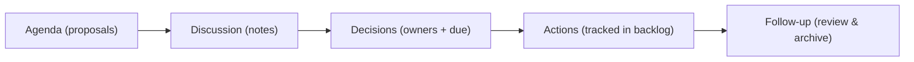
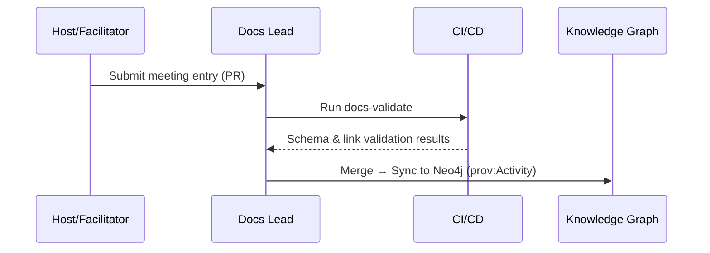

<div align="center">

# 🗓️ Kansas Frontier Matrix — **Meeting Records & Collaboration Log**  
`docs/notes/meetings.md`

**Purpose:** Maintain an official, versioned record of **meetings, decisions, and action items** for the **Kansas Frontier Matrix (KFM)** — ensuring transparent governance, traceable provenance, and reproducible documentation under **Master Coder Protocol (MCP-DL)** standards.

[](../standards/documentation.md)
[](../../.github/workflows/docs-validate.yml)
[](../../.github/workflows/site.yml)
[](../../.github/workflows/stac-validate.yml)
[](../../.github/workflows/codeql.yml)
[](../../.github/workflows/trivy.yml)
[](../../LICENSE)

</div>

```yaml
---
title: "Kansas Frontier Matrix — Meeting Records & Collaboration Log"
document_type: "Meetings"
version: "v1.6.0"
last_updated: "2025-10-18"
created: "2025-10-04"
owners: ["@kfm-docs","@kfm-architecture","@kfm-governance","@kfm-security"]
status: "Stable"
maturity: "Production"
scope: "Docs/Notes"
license: "CC-BY 4.0"
semver_policy: "MAJOR.MINOR.PATCH"
tags: ["meetings","governance","provenance","audit","mcp","ontology","web","data"]
audit_framework: "MCP-DL v6.3"
ci_required_checks:
  - docs-validate
  - site-build
  - pre-commit
  - stac-validate
  - codeql
  - trivy
semantic_alignment:
  - PROV-O
  - CIDOC CRM
  - OWL-Time
  - SKOS
  - JSON Schema
  - ISO 8601
provenance:
  workflow_pin_policy: "actions pinned by tag or commit SHA"
  artifact_retention_days: 180
id_naming:
  pattern: "M-YYYY-NNN"      # e.g., M-2025-012
  padding: 3
meeting_types:
  - governance
  - sprint
  - technical
  - review
  - outreach
schema:
  file: "docs/schemas/meeting.schema.json"
  version: "1.0.0"
automation:
  - name: "Meetings → Graph Sync"
    schedule: "0 6 * * MON"
    action: "tools/graph_ingest_meetings.py"
  - name: "Quarterly Meeting Archive"
    schedule: "0 8 1 */3 *"
    action: "tools/archive_meetings.py"
  - name: "Meeting Metrics Summary"
    schedule: "0 7 1 * *"
    action: "tools/generate_meeting_summary.py"
---
```

---

## 📚 Table of Contents

- [🎯 Purpose](#-purpose)  
- [🧱 Structure & Workflow](#-structure--workflow)  
- [🧩 YAML Metadata Header (Per Meeting)](#-yaml-metadata-header-per-meeting)  
- [🗓️ Example Meeting Entry](#️-example-meeting-entry)  
- [🧰 Meeting Template](#-meeting-template)  
- [🧭 Agenda → Decisions → Actions Lifecycle](#-agenda--decisions--actions-lifecycle)  
- [🔗 Knowledge Graph Mapping](#-knowledge-graph-mapping)  
- [📊 Meeting Log Index (Current Year)](#-meeting-log-index-current-year)  
- [📈 Metrics & KPI Dashboard](#-metrics--kpi-dashboard)  
- [🤖 CI Validation Hooks](#-ci-validation-hooks)  
- [🔒 Ethics & Data Sensitivity](#-ethics--data-sensitivity)  
- [🧠 MCP Compliance Summary](#-mcp-compliance-summary)  
- [📎 Related Documentation](#-related-documentation)  
- [📅 Version History](#-version-history)

---

## 🎯 Purpose

This file is the **official, living record** of KFM coordination meetings, design discussions, and sprint reviews. Each entry documents **who met**, **what decisions were made**, **why changes occurred**, and **how they connect** to datasets, code modules, or architectural components.

Meeting logs are:

* 🧾 **Versioned** — all updates tracked in Git.  
* 🔗 **Linked** — cross-referenced with commits, datasets, backlog, and idea entries.  
* 🧠 **Searchable** — structured YAML enables indexing into the Knowledge Graph.  
* ✅ **Auditable** — validated in CI (`make docs-validate`).  

> **Principle:** *If it wasn’t recorded, it wasn’t decided.*

---

## 🧱 Structure & Workflow

```text
docs/notes/meetings.md        ← Central index + most recent meetings (rolling window)
docs/notes/archive/meetings/  ← Archived meeting logs (auto-moved quarterly)
docs/notes/templates/         ← Templates for meetings/decisions/action items
```

**Workflow Overview**

1. Record each meeting with the **YAML header** and **Markdown body** (templates below).  
2. Use ISO 8601 for `date` and 24-hour local time for `time`.  
3. Cross-link related backlog or idea entries (IDs like `B-2025-003`, `I-2025-002`).  
4. After 3 months, move older entries to `/archive/meetings/` (keep an index in this file).  
5. CI validates metadata, links, and updates the Knowledge Graph.

---

## 🧩 YAML Metadata Header (Per Meeting)

```yaml
---
id: M-2025-001
title: "Q4 Planning & Ontology Integration Review"
date: 2025-10-05
time: "09:00-10:30 America/Chicago"
type: governance           # governance | sprint | technical | review | outreach
location: virtual          # physical | virtual | hybrid
attendees:
  - "Andy Barta"
  - "Data Integration Team"
  - "KFM Ontology Working Group"
quorum: true               # true if decision-making quorum met
facilitator: "@kfm-docs"
note_taker: "@kfm-docs"
recording:
  url: "https://example.com/recordings/2025-10-05.mp4"
  access: "internal"       # public | internal
linked_commits:
  - a3f29e9
linked_prs:
  - https://github.com/bartytime4life/Kansas-Frontier-Matrix/pull/420
linked_docs:
  - ../../standards/ontologies.md
  - ../../architecture/knowledge-graph.md
linked_backlog:
  - B-2025-004
linked_ideas:
  - I-2025-001
status: finalized          # draft | finalized | archived
tags: ["ontology","timeline","ETL","MCP"]
summary: >
  Adopt CIDOC CRM + OWL-Time into graph; validate PeriodO mapping; assign ETL and docs actions.
acceptance:
  - "Decisions recorded with owner + due date"
  - "CI hook added for ontology validation"
---
```

> **Validation:** CI enforces `meeting.schema.json` (required fields, enums, formats) + `yamllint`.

---

## 🗓️ Example Meeting Entry

### 🧩 Meeting — Q4 Planning & Ontology Integration Review (`M-2025-001`)

*Date:* 2025-10-05  
*Time:* 09:00–10:30 America/Chicago  
*Location:* Virtual  
*Type:* Governance + Technical  
*Attendees:* Andy Barta, Data Engineering Team, Ontology Working Group  
*Quorum:* Yes

---

#### 🧭 Agenda

1. Align ontology (CIDOC CRM + OWL-Time) with Neo4j schema.  
2. Review AI/ML enrichment pipeline progress.  
3. Validate historical period mappings with PeriodO.  
4. Assign doc upgrades (`docs/standards/ontologies.md`).  

---

#### 🧠 Discussion Summary

* Adopt **CIDOC CRM E5_Event** and **E53_Place** as core classes in the graph.  
* Adopt **OWL-Time intervals** for temporal reasoning in APIs and queries.  
* Confirm **PeriodO JSON-LD** alignment; map to SKOS labels and OWL-Time.  
* Plan integration of **AI-extracted events** with confidence scores for curator review.  
* Approve continuous ingestion for NOAA/USGS datasets.  

---

#### ⚙️ Decisions

| Decision                                              | Rationale                | Assigned To      | Due        |
| :---------------------------------------------------- | :----------------------- | :--------------- | :--------- |
| Integrate OWL-Time schema in graph backend            | Align with W3C standards | @kfm-ontology    | 2025-10-20 |
| Add validation step to ETL (`make validate-ontology`) | Prevent schema drift     | @kfm-data        | 2025-10-25 |
| Draft README for ontology layer                       | Documentation-first rule | @kfm-docs        | 2025-10-30 |

---

#### 📋 Action Items

* [x] Update ontology docs (`docs/standards/ontologies.md`)  
* [ ] Add STAC `periodo:*` extension to event assets under `data/stac/`  
* [ ] Merge OWL-Time CI validation into `.github/workflows/site.yml`  
* [ ] Publish follow-up meeting report to archive after 30 days  

---

#### 🧩 Linked Materials

- **Docs:** `docs/standards/ontologies.md`, `docs/architecture/knowledge-graph.md`  
- **Backlog:** `docs/notes/backlog.md` → `B-2025-004`  
- **Ideas:** `docs/notes/ideas.md` → `I-2025-001`  

---

## 🧰 Meeting Template

```markdown
## 🧩 Meeting — [Short Title] (`M-YYYY-NNN`)
*Date:* YYYY-MM-DD  
*Time:* HH:MM–HH:MM America/Chicago  
*Location:* Physical | Virtual | Hybrid  
*Type:* governance | sprint | technical | review | outreach  
*Attendees:* …  
*Quorum:* Yes | No  
*Facilitator:* @user  
*Note Taker:* @user  

### 🧭 Agenda
1. …
2. …

### 🧠 Discussion Summary
- Key points…

### ⚙️ Decisions
| Decision | Rationale | Assigned To | Due |
| :-- | :-- | :-- | :-- |
| … | … | … | … |

### 📋 Action Items
- [ ] Task · Owner · Due
- [ ] …

### 🧩 Linked Materials
- **Docs:** …
- **Backlog:** …
- **Ideas:** …
```

---

## 🧭 Agenda → Decisions → Actions Lifecycle


<!-- END OF MERMAID -->

---

## 🔗 Knowledge Graph Mapping

Meetings are ingested as **`prov:Activity`** with links to agents, documents, datasets, and outcomes.

```turtle
@prefix prov: <http://www.w3.org/ns/prov#> .
@prefix kfm:  <https://kfm.org/id/> .
@prefix dc:   <http://purl.org/dc/terms/> .

kfm:meeting/2025_10_05
    a prov:Activity ;
    dc:title "Q4 Planning & Ontology Integration Review" ;
    prov:wasAssociatedWith kfm:agent/kfm-ontology ;
    prov:used kfm:document/knowledge_graph_architecture ;
    prov:generated kfm:document/ontologies_v2_spec ;
    prov:atTime "2025-10-05T09:00:00-05:00"^^xsd:dateTime .
```

**Contributor workflow**


<!-- END OF MERMAID -->

---

## 📊 Meeting Log Index (Current Year)

> **Note:** Older entries are auto-archived under `docs/notes/archive/meetings/` each quarter; keep a lightweight index here.

| ID         | Date       | Title                              | Type        | Status      | Linked Docs                     |
| :--------- | :--------- | :--------------------------------- | :---------- | :---------- | :------------------------------ |
| M-2025-001 | 2025-10-05 | Q4 Planning & Ontology Integration | Governance  | ✅ Finalized | `ontologies.md`, `knowledge-graph.md` |
| M-2025-002 | 2025-09-20 | Web UI Architecture Sync           | Technical   | ✅ Finalized | `web-ui.md`                     |
| M-2025-003 | 2025-08-15 | Historical Dataset Integration     | Sprint      | 🟡 Draft    | `data-architecture.md`          |

---

## 📈 Metrics & KPI Dashboard

| Metric | Current | Target | Notes |
| :-- | :-- | :-- | :-- |
| Meetings logged (Q) | 9 | ≥ 8 | On track |
| Finalized ratio | 78% | ≥ 75% | Meets governance target |
| Action closure (30d) | 86% | ≥ 85% | Healthy follow-through |
| Archive latency (days) | 32 | ≤ 45 | Within SLA |

*Autogenerated by `tools/generate_meeting_summary.py` during site build.*

---

## 🤖 CI Validation Hooks

| Validation            | Tool/Path                        | Purpose                                                     |
| :-------------------- | :------------------------------- | :---------------------------------------------------------- |
| **YAML Header**       | `yamllint`                       | Ensures required fields (id, title, date, type, status).    |
| **Schema Check**      | `jsonschema`                     | Enforces `docs/schemas/meeting.schema.json`.                |
| **Link Validation**   | `remark-lint`                    | Verifies doc/backlog/ideas links are resolvable.            |
| **Graph Sync**        | `tools/graph_ingest_meetings.py` | Ingests meetings as `prov:Activity` into Neo4j.             |
| **Tag Consistency**   | `scripts/parse_tags.py`          | Updates SKOS vocab for semantic search.                     |

**Run locally**

```bash
make docs-validate && make docs-lint
```

---

## 🔒 Ethics & Data Sensitivity

> **Guidance:** Do **not** include confidential PII or restricted information in meeting notes or recordings.  
> Use summaries instead of verbatim transcripts for sensitive topics; mark `recording.access: internal` when required.  
> License external sources appropriately and cite them in the `linked_docs:` or `references:` of the meeting entry.

---

## 🧠 MCP Compliance Summary

| MCP Principle           | Implementation                                                        |
| :---------------------- | :-------------------------------------------------------------------- |
| **Documentation-first** | Agenda, discussion, decisions, and actions captured in this log.       |
| **Reproducibility**     | Machine-readable YAML + CI checks + Knowledge Graph lineage.           |
| **Open Standards**      | Markdown, YAML, RDF/PROV-O, OWL-Time, SKOS, JSON Schema.               |
| **Provenance**          | Each meeting maps to `prov:Activity` with `used`/`generated` links.     |
| **Auditability**        | Quarterly archive + metrics + CI validation + Neo4j lineage.            |

---

## 📎 Related Documentation

| File                                   | Description                                     |
| :------------------------------------- | :---------------------------------------------- |
| `docs/notes/README.md`                 | Notes workspace overview.                       |
| `docs/notes/backlog.md`                | Project backlog (tasks & actions).               |
| `docs/notes/ideas.md`                  | Ideas & exploratory concepts.                    |
| `docs/standards/documentation.md`      | Writing standards and governance (MCP-DL v6.3).  |
| `docs/standards/ontologies.md`         | CIDOC-CRM · PROV-O · OWL-Time · SKOS alignment.  |
| `docs/architecture/knowledge-graph.md` | Graph ingestion, mappings, and query semantics.  |

---

## 📅 Version History

| Version | Date       | Author           | Summary                                                                                 |
| :------ | :--------- | :--------------- | :-------------------------------------------------------------------------------------- |
| v1.6.0  | 2025-10-18 | @kfm-docs        | Added header YAML, schema & automation, lifecycle/diagrams, metrics, ethics, CI table.  |
| v1.0.0  | 2025-10-05 | @kfm-governance  | Initial formal meeting log with YAML metadata and RDF provenance support.               |

---

<div align="center">

**Kansas Frontier Matrix** — *“Every Decision Recorded. Every Conversation Proven.”*  
📍 `docs/notes/meetings.md` · Maintained under MCP-DL v6.3 governance and CI validation.

</div>
