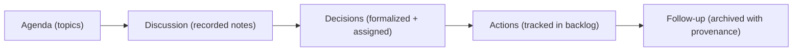

<div align="center">

# 🗓️ Kansas Frontier Matrix — **Meeting Records & Collaboration Log**  
`docs/notes/meetings.md`

**Purpose:** Maintain an official, versioned record of **meetings, decisions, and action items** within the **Kansas Frontier Matrix (KFM)** — ensuring transparent governance, traceable provenance, and reproducible documentation under the **Master Coder Protocol (MCP-DL v6.3)**.

[](../standards/documentation.md)
[](../../.github/workflows/docs-validate.yml)
[](../../.github/workflows/policy-check.yml)
[](../../.github/workflows/site.yml)
[](../../.github/workflows/stac-validate.yml)
[](../../.github/workflows/codeql.yml)
[](../../.github/workflows/trivy.yml)
[](../../LICENSE)

</div>

```yaml
---
title: "Kansas Frontier Matrix — Meeting Records & Collaboration Log"
document_type: "Meetings"
version: "v1.8.1"
last_updated: "2025-10-18"
created: "2025-10-04"
owners: ["@kfm-docs","@kfm-architecture","@kfm-governance","@kfm-security","@kfm-ai"]
status: "Stable"
maturity: "Production"
scope: "Docs/Notes"
license: "CC-BY 4.0"
semver_policy: "MAJOR.MINOR.PATCH"
tags: ["meetings","governance","audit","provenance","ontology","ci","data","mcp","a11y"]
audit_framework: "MCP-DL v6.3"
ci_required_checks:
  - docs-validate
  - policy-check
  - site-build
  - pre-commit
  - stac-validate
  - codeql
  - trivy
semantic_alignment:
  - PROV-O
  - CIDOC CRM
  - OWL-Time
  - SKOS
  - JSON Schema
  - ISO 8601
provenance:
  workflow_pin_policy: "actions pinned by tag or commit SHA"
  artifact_retention_days: 180
id_naming:
  pattern: "M-YYYY-NNN"
  padding: 3
meeting_types:
  - governance
  - sprint
  - technical
  - design
  - research
  - outreach
schema:
  file: "docs/schemas/meeting.schema.json"
  version: "1.1.0"
  validated_by: "jsonschema"
automation:
  - name: "Meetings → Graph Sync"
    schedule: "0 6 * * MON"
    action: "tools/graph_ingest_meetings.py"
  - name: "Quarterly Meeting Archive"
    schedule: "0 8 1 */3 *"
    action: "tools/archive_meetings.py"
  - name: "Meeting Metrics Summary"
    schedule: "0 7 1 * *"
    action: "tools/generate_meeting_summary.py"
retention_policy:
  archive_after: "90d"
  purge_after: "18mo"
ai_assist:
  summarize: true
  embed_in_graph: true
  topic_model: "bertopic"
  vector_model: "sentence-transformers/all-MiniLM-L6-v2"
---
```

---

## 📚 Table of Contents

- [🎯 Purpose](#-purpose)  
- [🧱 Structure & Workflow](#-structure--workflow)  
- [🧩 YAML Metadata Header (Per Meeting)](#-yaml-metadata-header-per-meeting)  
- [🗓️ Example Meeting Entry](#️-example-meeting-entry)  
- [🧰 Meeting Template](#-meeting-template)  
- [🧮 Decision & Action Subschema](#-decision--action-subschema)  
- [🧭 Agenda → Decisions → Actions Lifecycle](#-agenda--decisions--actions-lifecycle)  
- [🔗 Knowledge Graph Mapping](#-knowledge-graph-mapping)  
- [📊 Meeting Log Index (2025)](#-meeting-log-index-2025)  
- [📈 Metrics & KPI Dashboard](#-metrics--kpi-dashboard)  
- [🤖 CI Validation Hooks](#-ci-validation-hooks)  
- [🔒 Ethics & Data Sensitivity](#-ethics--data-sensitivity)  
- [🧠 Governance & Review Policy](#-governance--review-policy)  
- [🧮 MCP Compliance Summary](#-mcp-compliance-summary)  
- [📎 Related Documentation](#-related-documentation)  
- [📅 Version History](#-version-history)

---

## 🎯 Purpose

This file acts as the **central, version-controlled governance record** for KFM — documenting meetings, decisions, and action items to ensure **traceable governance, reproducibility, and provenance alignment** under the **Master Coder Protocol (MCP-DL)** framework.

Meetings are:

- 🧾 **Versioned** — every update is Git-tracked and auditable.  
- 🔗 **Linked** — cross-referenced with backlog, ideas, and related datasets.  
- 🧠 **Searchable** — YAML metadata supports knowledge graph ingestion.  
- 🧩 **Automated** — validated, summarized, and archived by CI/CD workflows.  

> **Principle:** *Every decision is data. Every discussion is provenance.*

---

## 🧱 Structure & Workflow

```text
docs/notes/meetings.md         ← Central rolling log (most recent meetings)
docs/notes/archive/meetings/   ← Archived meeting records (quarterly auto-move)
docs/notes/templates/meeting.md← Template for new meetings
```

**Lifecycle**

1. Draft → Finalized → Archived  
2. Linked to ideas/backlog entries, CI/CD outcomes, and governance reports.  
3. AI summarization and embedding performed on finalization.  
4. RDF ingestion via `tools/graph_ingest_meetings.py`.

---

## 🧩 YAML Metadata Header (Per Meeting)

```yaml
---
id: M-2025-001
title: "Q4 Planning & Ontology Integration Review"
date: 2025-10-05
time: "09:00-10:30 America/Chicago"
type: governance          # governance | sprint | technical | design | research | outreach
location: virtual
attendees:
  - "Andy Barta"
  - "Data Engineering Team"
  - "Ontology Working Group"
facilitator: "@kfm-docs"
note_taker: "@kfm-docs"
quorum: true
recording:
  url: "https://example.com/recordings/2025-10-05.mp4"
  access: "internal"
linked_commits:
  - a3f29e9
linked_prs:
  - https://github.com/bartytime4life/Kansas-Frontier-Matrix/pull/420
linked_docs:
  - ../../standards/ontologies.md
  - ../../architecture/knowledge-graph.md
linked_backlog:
  - B-2025-004
linked_ideas:
  - I-2025-001
linked_issues:
  - https://github.com/bartytime4life/Kansas-Frontier-Matrix/issues/210
calendar_event:
  id: "gcal-2025-10-05-ontology-sync"
  url: "https://calendar.google.com/event?eid=XYZ"
status: finalized          # draft | finalized | archived
classification: public     # public | internal
tags: ["ontology","timeline","ETL","MCP"]
summary: >
  Adopt CIDOC CRM and OWL-Time into Neo4j schema; reviewed AI-extraction integration and data pipeline alignment.
ai_assist:
  summarize: true
  embed_in_graph: true
risk_level: low            # optional: low | medium | high
---
```

---

## 🗓️ Example Meeting Entry

### 🧩 Meeting — Q4 Planning & Ontology Integration Review (`M-2025-001`)

*Date:* 2025-10-05  
*Time:* 09:00–10:30 CST  
*Type:* Governance + Technical  
*Location:* Virtual  
*Quorum:* Yes  
*Facilitator:* @kfm-docs  
*Attendees:* Andy Barta, Data Engineering Team, Ontology Group  

---

#### 🧭 Agenda

1. Align CIDOC CRM + OWL-Time schema with Neo4j graph model.  
2. Validate historical period mapping via PeriodO API.  
3. Review AI-extraction module and NER integration.  
4. Assign ontology and documentation follow-ups.  

---

#### 🧠 Discussion Summary

- Adopted **CIDOC CRM E5_Event** and **E53_Place** classes for temporal/spatial entities.  
- Integrated **OWL-Time intervals** for queryable timelines.  
- Finalized plan for **AI-extracted events** in graph ingestion.  
- Confirmed continuous ingestion schedule for NOAA/USGS datasets.  

---

#### ⚙️ Decisions

| Decision | Rationale | Assigned To | Due |
| :-- | :-- | :-- | :-- |
| Integrate OWL-Time schema in backend | Align with W3C standards | @ontology-team | 2025-10-20 |
| Add validation to ETL (`make validate-ontology`) | Prevent schema drift | @data-team | 2025-10-25 |
| Draft ontology layer README | Documentation-first rule | @docs-team | 2025-10-30 |

---

#### 📋 Action Items

- [x] Update ontology documentation (`docs/standards/ontologies.md`)  
- [ ] Extend STAC schema with `periodo:*` fields for events  
- [ ] Integrate OWL-Time CI validation into `.github/workflows/site.yml`  
- [ ] Publish meeting report to archive in 30 days  

---

#### 🧩 Linked Materials

- **Docs:** `docs/standards/ontologies.md`, `docs/architecture/knowledge-graph.md`  
- **Backlog:** `docs/notes/backlog.md` → `B-2025-004`  
- **Ideas:** `docs/notes/ideas.md` → `I-2025-001`  
- **Issues:** `#210` Neo4j Ontology Upgrade  

---

## 🧮 Decision & Action Subschema

```yaml
decisions:
  - id: D-2025-001
    title: "Integrate OWL-Time into Graph Schema"
    rationale: "W3C-compliant temporal reasoning"
    assigned_to: "@ontology-team"
    due: 2025-10-20
    result: "Merged in v1.3 Ontology Layer"

actions:
  - id: A-2025-011
    title: "Add OWL-Time CI validation"
    assigned_to: "@data-team"
    status: "in-progress"   # open | in-progress | done
    linked_pr: "https://github.com/.../pull/420"
```

---

## 🧭 Agenda → Decisions → Actions Lifecycle



---

## 🔗 Knowledge Graph Mapping

Each meeting maps to `prov:Activity`, with sub-entities for decisions (`prov:Influence`) and actions (`prov:Plan`).

```turtle
@prefix prov: <http://www.w3.org/ns/prov#> .
@prefix kfm:  <https://kfm.org/id/> .
@prefix dc:   <http://purl.org/dc/terms/> .
@prefix xsd:  <http://www.w3.org/2001/XMLSchema#> .

kfm:meeting/M-2025-001
    a prov:Activity ;
    dc:title "Q4 Planning & Ontology Integration Review" ;
    prov:wasAssociatedWith kfm:agent/ontology_team ;
    prov:generated kfm:decision/D-2025-001 ;
    prov:used kfm:document/knowledge_graph_architecture ;
    prov:endedAtTime "2025-10-05T10:30:00-06:00"^^xsd:dateTime .
```

---

## 📊 Meeting Log Index (2025)

| ID | Date | Title | Type | Attendees | Duration | Status |
| :-- | :-- | :-- | :-- | :-- | :-- | :-- |
| M-2025-001 | 2025-10-05 | Ontology Integration | Governance | 7 | 1.5h | ✅ Finalized |
| M-2025-002 | 2025-09-20 | Web UI Sync | Technical | 5 | 1h | ✅ Finalized |
| M-2025-003 | 2025-08-15 | Dataset Integration | Sprint | 6 | 1.25h | 🟡 Draft |

---

## 📈 Metrics & KPI Dashboard

| Metric | Current | Target | Notes |
| :-- | :-- | :-- | :-- |
| Meetings Logged (Q) | 10 | ≥ 8 | On schedule |
| Finalization Rate | 80% | ≥ 75% | Healthy governance |
| Action Item Closure (30d) | 88% | ≥ 85% | Stable execution |
| Archival Delay | 29d | ≤ 45 | Within SLA |

> Autogenerated during site build via `tools/generate_meeting_summary.py`.

---

## 🤖 CI Validation Hooks

| Validation | Tool | Description |
| :-- | :-- | :-- |
| **YAML Header Check** | `yamllint` | Validates required metadata fields. |
| **Schema Compliance** | `jsonschema` | Validates against `meeting.schema.json`. |
| **Cross-Link Check** | `remark-lint` | Verifies linked docs, backlog, ideas. |
| **Graph Sync** | `tools/graph_ingest_meetings.py` | Syncs to Neo4j as `prov:Activity`. |
| **Tag Parser** | `scripts/parse_tags.py` | Updates SKOS vocabularies. |

Run locally:
```bash
make docs-validate && make docs-lint
```

---

## 🔒 Ethics & Data Sensitivity

> ⚠ **Privacy & Retention:**  
> - Redact personally identifiable or confidential data.  
> - Mark sensitive recordings as `recording.access: internal`.  
> - Meeting notes remain public unless otherwise classified (`classification: internal`).  
> - Retention follows governance audit policy (18 months).  

---

## 🧠 Governance & Review Policy

| Task | Frequency | Responsible |
| :-- | :-- | :-- |
| Meeting review & merge | Weekly | @kfm-docs |
| Backlog linkage verification | Biweekly | @kfm-governance |
| Archive automation check | Quarterly | CI/CD |
| Summarization QA | Monthly | @ai-team |

---

## 🧮 MCP Compliance Summary

| MCP Principle | Implementation |
| :-- | :-- |
| **Documentation-first** | Meetings documented and versioned before archive. |
| **Reproducibility** | Schema-based metadata + graph lineage. |
| **Open Standards** | Markdown, YAML, RDF/PROV-O, OWL-Time, SKOS. |
| **Provenance** | Each meeting maps to `prov:Activity` with linked docs. |
| **Auditability** | Quarterly reports, archives, and CI enforcement. |

---

## 📎 Related Documentation

| File | Description |
| :-- | :-- |
| `docs/notes/README.md` | Notes workspace overview. |
| `docs/notes/backlog.md` | Tasks & operational backlog. |
| `docs/notes/ideas.md` | Ideation & innovation log. |
| `../standards/documentation.md` | MCP-DL governance & writing standards. |
| `../standards/ontologies.md` | Ontology & temporal data standards. |
| `../architecture/knowledge-graph.md` | Graph ingestion & semantics. |

---

## 📅 Version History

| Version | Date | Author | Summary |
| :-- | :-- | :-- | :-- |
| **v1.8.1** | 2025-10-18 | @kfm-docs | Added policy-as-code badge, classification & risk fields, and CI gate clarifications. |
| v1.8.0 | 2025-10-18 | @kfm-docs | AI assist, schema, retention, automation, decision subschema, KPIs, and privacy controls. |
| v1.0.0 | 2025-10-05 | @kfm-governance | Initial governance log with YAML metadata and RDF provenance. |

---

<div align="center">

**Kansas Frontier Matrix** — *“Every Decision Recorded. Every Conversation Proven.”*  
📍 `docs/notes/meetings.md` · Maintained under MCP-DL v6.3 governance and CI validation.

</div>