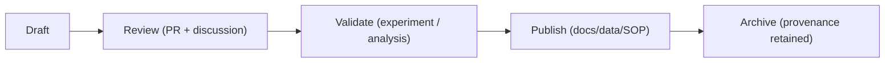

<div align="center">

# 🔬 Kansas Frontier Matrix — **Research Notes & Findings**  
`docs/notes/research.md`

**Purpose:** Serve as a **living research log** for discoveries, literature reviews, prototypes, and exploratory analyses supporting the **Kansas Frontier Matrix (KFM)** — ensuring all intellectual work is **transparent, reproducible, and provenance-linked**.

[](../standards/documentation.md)
[](../../.github/workflows/docs-validate.yml)
[](../../.github/workflows/site.yml)
[](../../.github/workflows/stac-validate.yml)
[](../../.github/workflows/codeql.yml)
[](../../.github/workflows/trivy.yml)
[](../../LICENSE)

</div>

```yaml
---
title: "Kansas Frontier Matrix — Research Notes & Findings"
document_type: "Research"
version: "v1.6.0"
last_updated: "2025-10-18"
created: "2025-10-04"
owners: ["@kfm-docs","@kfm-research","@kfm-ontology","@kfm-data"]
status: "Stable"
maturity: "Production"
scope: "Docs/Notes"
license: "CC-BY 4.0"
semver_policy: "MAJOR.MINOR.PATCH"
tags: ["research","experiments","ontology","geospatial","climate","NLP","AI","provenance"]
audit_framework: "MCP-DL v6.3"
ci_required_checks:
  - docs-validate
  - site-build
  - pre-commit
  - stac-validate
  - codeql
  - trivy
semantic_alignment:
  - PROV-O
  - CIDOC CRM
  - OWL-Time
  - SKOS
  - STAC 1.0
  - DCAT 2.0
  - JSON Schema
  - ISO 8601
provenance:
  workflow_pin_policy: "actions pinned by tag or commit SHA"
  artifact_retention_days: 365
id_naming:
  pattern: "R-YYYY-NNN"      # e.g., R-2025-003
  padding: 3
research_categories:
  - Archaeology
  - Ontology
  - Geospatial
  - Climate
  - Hydrology
  - NLP
  - AI/ML
  - Data Modeling
schema:
  file: "docs/schemas/research.schema.json"
  version: "1.1.0"
  validated_by: "jsonschema"
automation:
  - name: "Research → Graph Sync"
    schedule: "0 5 * * MON"
    action: "tools/graph_ingest_research.py"
  - name: "Research Metrics Summary"
    schedule: "0 6 1 * *"
    action: "tools/generate_research_summary.py"
retention_policy:
  archive_after: "180d"
  purge_after: "36mo"   # raw derived interim artifacts; entries remain
ai_assist:
  summarize: true
  embed_in_graph: true
  topic_model: "bertopic"
  vector_model: "sentence-transformers/all-MiniLM-L6-v2"
---
```

---

## 📚 Table of Contents

- [🎯 Purpose](#-purpose)  
- [🧱 File Structure](#-file-structure)  
- [🧩 YAML Metadata Header (Required)](#-yaml-metadata-header-required)  
- [🧪 Research Lifecycle](#-research-lifecycle)  
- [🔬 Research Entry Example](#-research-entry-example)  
- [🧰 Research Entry Template](#-research-entry-template)  
- [📖 Literature Review Template](#-literature-review-template)  
- [🧪 Reproducibility & Attachments](#-reproducibility--attachments)  
- [🔗 Knowledge Graph Mapping](#-knowledge-graph-mapping)  
- [📚 Current Research Log (2025)](#-current-research-log-2025)  
- [📈 Metrics & KPI Dashboard](#-metrics--kpi-dashboard)  
- [🤖 CI Validation & Provenance Integration](#-ci-validation--provenance-integration)  
- [🧠 Governance Rules](#-governance-rules)  
- [🔒 Ethics & Data Sensitivity](#-ethics--data-sensitivity)  
- [📎 Related Documentation](#-related-documentation)  
- [📅 Version History](#-version-history)

---

## 🎯 Purpose

`/docs/notes/research.md` is the **central ledger of research and analysis** across KFM. It captures hypotheses, literature syntheses, field/lab integration, and experimental notes **before** promotion into SOPs, datasets, standards, or published documentation.

Research notes are:

* 🧠 **Contextualized** — every finding links to datasets, experiments, meetings, or publications.  
* 🧾 **Reproducible** — metadata binds to scripts, notebooks, and environment specs.  
* 🧩 **Collaborative** — optimized for Git review and peer contribution.  
* 🔗 **Interoperable** — ingested to the Knowledge Graph as **`prov:Entity`** with CIDOC-CRM alignment.  

> **Principle:** *Hypothesize openly. Ground in evidence. Promote when reproducible.*

---

## 🧱 File Structure

```text
docs/notes/research.md         ← Main log (rolling window of latest entries)
docs/notes/archive/research/   ← Archived or superseded entries (by year)
docs/notes/templates/          ← Templates for research, literature, experiments
```

**Workflow**

1. Draft an entry with **YAML header + body** (templates below).  
2. Cross-link **experiments**, **datasets**, **meetings**, **ideas/backlog**.  
3. After publication or promotion, move to `archive/research/YYYY/`.  
4. CI checks metadata, links, and graph ingestion; AI summarization & embeddings update on merge.

---

## 🧩 YAML Metadata Header (Required)

```yaml
---
id: R-2025-001
title: "Mapping Kansas Frontier Treaties — CIDOC CRM Application"
author: "@kfm-ontology"
date: 2025-10-05
status: in-review         # draft | in-review | published | archived
category: "Data Modeling" # see research_categories above
project_area: ["ontology","geospatial","docs"]
linked_commits:
  - 1f2acb8
linked_prs:
  - https://github.com/bartytime4life/Kansas-Frontier-Matrix/pull/512
linked_docs:
  - ../../standards/ontologies.md
  - ../../architecture/data-architecture.md
linked_datasets:
  - ../../data/stac/collections/treaties.json
linked_experiments:
  - ../../docs/experiments/treaty_alignment_experiment.md
linked_meetings:
  - ../meetings.md#M-2025-001
tags: ["treaties","ontology","provenance","CIDOC_CRM","STAC"]
period:
  id: "perio.do/territorial-kansas-1854-1861"
  label: "Territorial Kansas"
summary: >
  Exploratory mapping of 1854–1870 Kansas land cession treaties to CIDOC CRM events/places for consistent graph reasoning.
ai_assist:
  summarize: true
  embed_in_graph: true
acceptance_criteria:
  - "All treaty events modeled as crm:E7_Activity with OWL-Time intervals"
  - "Cession polygons linked to crm:E53_Place with geo geometry"
  - "STAC collections include provenance and checksum"
---
```

> **Validation:** Enforced by `docs/schemas/research.schema.json` + `yamllint`.

---

## 🧪 Research Lifecycle


<!-- END OF MERMAID -->

---

## 🔬 Research Entry Example

### 🔬 *R-2025-001 — Mapping Kansas Frontier Treaties to CIDOC CRM*

**Category:** Ontology & Cultural Heritage  
**Date:** 2025-10-05 · **Author:** @kfm-ontology · **Status:** 🧩 In Review  
**Keywords:** `ontology`, `treaties`, `spatial`, `provenance`, `CRM`

---

#### 🧭 Objective
Model **Kansas treaty data (1854–1870)** as `crm:E7_Activity` (treaty signing events), link to `crm:E53_Place` (cession areas), `crm:E74_Group` (tribal groups), and `crm:E31_Document` (treaty text), with **OWL-Time** intervals and **SKOS** labels; ingest to Neo4j for spatial/temporal queries.

---

#### 📚 Background & Literature
- **CIDOC CRM**: events (`E5_Event`/`E7_Activity`) bind actors, places, time.  
- **PeriodO**: temporal definitions (e.g., Territorial Kansas).  
- **USFS / Kappler**: treaty polygons + authoritative texts for land cessions.  
- **KFM Design Audit**: advocates inclusion of oral histories, fire regimes, paleoclimate proxies.

---

#### ⚙️ Methods
1) **Acquire**: USFS Royce Maps (polygons), Kappler PDFs; metadata to STAC Collections.  
2) **Parse**: spaCy NER for actors/places/dates; Gazetteer match (USGS GNIS).  
3) **Map**: CRM entities (`E7`, `E53`, `E74`, `E31`), OWL-Time intervals, SKOS labels.  
4) **Ingest**: Neo4j nodes/edges with lineage (`prov:wasDerivedFrom`).  
5) **Validate**: JSON Schema + STAC validator; unit tests for mapping.

**Sample Cypher**
```cypher
MATCH (t:Event {kind:'Treaty'})-[:OCCURRED_AT]->(p:Place)
RETURN t.title, t.date, p.name LIMIT 25;
```

---

#### 🧮 Findings
- 37 treaty events mapped; polygons linked to places; NER+GNIS confidence > 0.92.  
- Period labels available via PeriodO; timeline overlay renders in MapLibre spike.  
- STAC `checksum:multihash` and `prov:lineage` added to treaty assets.

---

#### 🧩 Discussion & Next Steps
- Add enforcement period ranges for treaty applicability (OWL-Time).  
- Link post-treaty relocation events and reservation geometry evolution.  
- Author a **STAC extension** for `periodo:*` and `crm:*` hints.

---

#### 📜 References
1. CIDOC CRM v7.1 (2023).  
2. Kappler, *Indian Affairs: Laws and Treaties* Vol. 2 (1904).  
3. USFS, *Indian Land Cessions Digitization* (2019).  
4. PeriodO, Territorial Kansas entry (2020).

---

#### 🧾 Provenance (RDF Example)
```turtle
@prefix prov: <http://www.w3.org/ns/prov#> .
@prefix crm:  <http://www.cidoc-crm.org/cidoc-crm/> .
@prefix kfm:  <https://kfm.org/id/> .

kfm:research/treaty_mapping_2025_001
    a prov:Entity, crm:E7_Activity ;
    prov:wasGeneratedBy kfm:process/treaty_mapping_etl ;
    prov:used kfm:dataset/treaties_usfs_2019 ;
    prov:wasAttributedTo kfm:agent/kfm-ontology ;
    prov:wasDerivedFrom <https://perio.do/territorial-kansas> ;
    prov:generatedAtTime "2025-10-05T10:00:00-05:00"^^xsd:dateTime .
```

---

## 🧰 Research Entry Template

```markdown
## 🔬 [Title] (`R-YYYY-NNN`)
*Category:* … | *Date:* YYYY-MM-DD | *Author:* @user | *Status:* draft | in-review | published | archived  
*Keywords:* `tag1`, `tag2`, …

### 🧭 Objective
What research question or outcome?

### 📚 Background & Literature
Key references and rationale; cite datasets and standards.

### ⚙️ Methods
Data sources, code, parameters, environment, validation.

### 🧮 Findings
Quantitative/qualitative results; tables/figures (link artifacts).

### 🧩 Discussion
Interpretation, limitations, future directions.

### 📜 References
Numbered list or CSL JSON key references.

### 🧾 Provenance
RDF/PROV snippet or link to `data/work/graph/*.ttl`
```

---

## 📖 Literature Review Template

```markdown
## 📖 Literature Review — [Topic] (`R-YYYY-NNN`)
*Scope:* … | *Date:* … | *Author:* …

### Sources Surveyed
1. Author, Title (Year) — key contribution …
2. …

### Synthesis
- Themes; agreements; conflicts; gaps.

### Data & Standards Implications
- How STAC, CIDOC CRM, OWL-Time, SKOS, DCAT apply.

### Citations / CSL JSON
- `docs/bib/research.bib` or `docs/bib/research.json`
```

---

## 🧪 Reproducibility & Attachments

- **Code/Notebooks**: place under `tools/` or `notebooks/` with `environment.yml`/`requirements.txt`.  
- **Data Artifacts**: store in `data/processed/` (COG/GeoJSON/CSV) and register in **STAC**.  
- **Checksums**: include `.sha256` sidecars + `checksum:multihash` in STAC assets.  
- **Provenance bundles**: export RDF/Turtle to `data/work/graph/` per entry.  

```bash
# Example: run local repro pack
make research-pack ID=R-2025-001
```

---

## 🔗 Knowledge Graph Mapping

Research entries ingest as **`prov:Entity`**, linking to processes, datasets, docs, and agents.

```turtle
@prefix prov: <http://www.w3.org/ns/prov#> .
@prefix dc:   <http://purl.org/dc/terms/> .
@prefix kfm:  <https://kfm.org/id/> .

kfm:research/R-2025-001
    a prov:Entity ;
    dc:title "Mapping Kansas Frontier Treaties — CIDOC CRM Application" ;
    prov:wasGeneratedBy kfm:activity/treaty_mapping_etl ;
    prov:used kfm:dataset/treaties_usfs_2019 ;
    prov:wasAttributedTo kfm:agent/kfm-ontology .
```

**Query examples**

*Cypher*
```cypher
MATCH (r:Research)-[:USED]->(d:Dataset)
WHERE r.id = "R-2025-001"
RETURN r.title, d.id, d.stac_uri;
```

*SPARQL (conceptual)*
```sparql
SELECT ?title ?dataset
WHERE {
  ?r a prov:Entity ; dc:title ?title ; prov:used ?dataset .
  FILTER regex(str(?r), "R-2025-001")
}
```

---

## 📚 Current Research Log (2025)

| ID         | Date       | Title                                  | Category     | Status       | Linked Docs                     |
| :--------- | :--------- | :-------------------------------------- | :----------- | :----------- | :------------------------------ |
| R-2025-001 | 2025-10-05 | Mapping Kansas Treaties — CIDOC CRM     | Data Modeling| 🧩 In Review | `ontologies.md`                 |
| R-2025-002 | 2025-09-18 | NLP for Frontier Newspaper Corpus        | NLP / AI     | 🧠 Draft     | `metadata.md`                   |
| R-2025-003 | 2025-08-25 | LiDAR Elevation Validation (1m DEM)      | Geospatial   | ✅ Published  | `data-architecture.md`          |

> **Note:** Older entries move to `docs/notes/archive/research/YYYY/` each quarter.

---

## 📈 Metrics & KPI Dashboard

| Metric | Current | Target | Notes |
| :-- | :-- | :-- | :-- |
| Entries logged (Q) | 14 | ≥ 12 | On plan |
| Published ratio | 42% | ≥ 40% | Healthy pipeline |
| Linked dataset coverage | 100% | 100% | Required by governance |
| Repro packs available | 86% | ≥ 85% | Near target |

*Autogenerated by `tools/generate_research_summary.py` during site build.*

---

## 🤖 CI Validation & Provenance Integration

| Validation              | Tool / Path                       | Description                                               |
| :---------------------- | :-------------------------------- | :-------------------------------------------------------- |
| **Front-matter Syntax** | `yamllint`                        | Validates required fields and ISO/enum formats.           |
| **Schema Compliance**   | `jsonschema`                      | Enforces `docs/schemas/research.schema.json`.             |
| **Link Verification**   | `remark-lint`                     | Checks docs/datasets/experiments/meetings resolve.        |
| **Graph Sync**          | `tools/graph_ingest_research.py`  | Adds research entries as `prov:Entity` to Neo4j/RDF.      |
| **Tag Vocabulary**      | `scripts/parse_tags.py`           | Updates SKOS vocab for discovery.                         |

**Run locally**
```bash
make docs-validate && make docs-lint
```

---

## 🧠 Governance Rules

- Each research entry must link **≥ 1** dataset + **≥ 1** document (or experiment).  
- **Peer review** via PR is required for `status: published`.  
- Archive finalized entries quarterly under `docs/notes/archive/research/YYYY/`.  
- Store provenance materials under `data/work/graph/` and logs under `data/work/logs/research/`.  

---

## 🔒 Ethics & Data Sensitivity

> Avoid PII, culturally sensitive coordinates (e.g., sacred sites), or restricted data without redaction.  
> Cite licenses for datasets and publications; align with `LICENSE` and data-use policies.  
> Mark sensitive attachments with `classification: internal` in their metadata.

---

## 📎 Related Documentation

| File                                     | Description                                   |
| :--------------------------------------- | :-------------------------------------------- |
| `docs/notes/README.md`                   | Notes workspace overview.                     |
| `docs/notes/templates/README.md`         | Templates for research & meetings.            |
| `docs/notes/ideas.md`                    | Ideation & exploratory concepts.              |
| `docs/notes/backlog.md`                  | Project backlog (tasks & follow-through).     |
| `docs/standards/documentation.md`        | MCP-DL writing standards.                     |
| `docs/standards/ontologies.md`           | CIDOC-CRM · PROV-O · OWL-Time · SKOS.         |
| `docs/architecture/data-architecture.md` | Ingestion/normalization & STAC schema.        |
| `docs/architecture/knowledge-graph.md`   | Graph ingestion & query semantics.            |

---

## 📅 Version History

| Version | Date       | Author            | Summary                                                                 |
| :------ | :--------- | :---------------- | :---------------------------------------------------------------------- |
| v1.6.0  | 2025-10-18 | @kfm-docs         | Added schema/automation/AI assist; lifecycle, templates, KPIs, ethics.  |
| v1.0.0  | 2025-10-05 | @kfm-research     | Initial research ledger with CRM/PROV mapping and reproducibility rules.|

---

<div align="center">

**Kansas Frontier Matrix** — *“Every Hypothesis Logged. Every Discovery Proven.”*  
📍 `docs/notes/research.md` · Maintained under MCP-DL v6.3 governance and CI validation.

</div>
