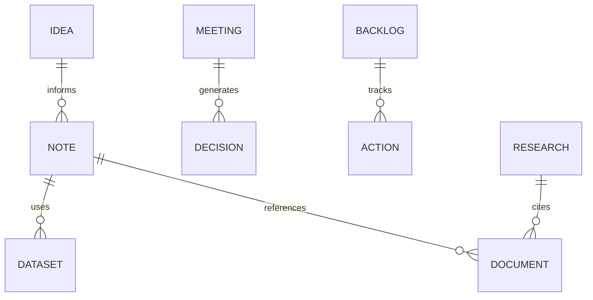

<div align="center">

# 🧩 Kansas Frontier Matrix — **Notes Templates**  
`docs/notes/templates/README.md`

**Purpose:** Provide reusable **Markdown + YAML templates** for research notes, meeting summaries, brainstorming ideas, and backlog entries — ensuring all informal work within `/docs/notes/` remains **structured, searchable, MCP-DL compliant, and knowledge-graph ready**.

[](../../standards/documentation.md)
[](../../../.github/workflows/docs-validate.yml)
[](../../../.github/workflows/site.yml)
[](../../../.github/workflows/stac-validate.yml)
[](../../../.github/workflows/codeql.yml)
[](../../../.github/workflows/trivy.yml)
[](../../../LICENSE)

</div>

```yaml
---
title: "Kansas Frontier Matrix — Notes Templates"
document_type: "Templates"
version: "v1.5.0"
last_updated: "2025-10-18"
created: "2025-10-05"
owners: ["@kfm-docs","@kfm-architecture","@kfm-research","@kfm-governance"]
status: "Stable"
maturity: "Production"
scope: "Docs/Notes/Templates"
license: "CC-BY 4.0"
semver_policy: "MAJOR.MINOR.PATCH"
tags: ["templates","notes","meetings","research","ideas","backlog","archive","mcp","provenance"]
audit_framework: "MCP-DL v6.3"
ci_required_checks:
  - docs-validate
  - site-build
  - pre-commit
  - codeql
  - trivy
schema_index:
  note:        { file: "docs/schemas/note.schema.json",        version: "1.1.0" }
  idea:        { file: "docs/schemas/idea.schema.json",        version: "1.0.0" }
  backlog:     { file: "docs/schemas/backlog.schema.json",     version: "1.0.0" }
  meeting:     { file: "docs/schemas/meeting.schema.json",     version: "1.1.0" }
  research:    { file: "docs/schemas/research.schema.json",    version: "1.1.0" }
  archive:     { file: "docs/schemas/archive.schema.json",     version: "1.0.0" }
semantic_alignment:
  - PROV-O
  - CIDOC CRM
  - OWL-Time
  - SKOS
  - JSON Schema
  - ISO 8601
automation:
  - name: "Template Lint"
    schedule: "on-push"
    action: "tools/lint_templates.py"
  - name: "Template Sync → Graph"
    schedule: "0 6 * * MON"
    action: "tools/graph_ingest_notes.py"
ai_assist:
  summarize: false
  embed_in_graph: false
---
```

---

## 📚 Table of Contents

- [Overview](#-overview)  
- [Directory Layout](#️-directory-layout)  
- [Template Structure & Front-Matter Rules](#-template-structure--front-matter-rules)  
- [Available Templates](#-available-templates)  
  - [1️⃣ `note_template.md` — General notes & hypotheses](#1️⃣-note_templatemd--general-notes--hypotheses)  
  - [2️⃣ `meeting_template.md` — Meetings & decisions](#2️⃣-meeting_templatemd--meetings--decisions)  
  - [3️⃣ `research_template.md` — Research summaries & reviews](#3️⃣-research_templatemd--research-summaries--reviews)  
  - [4️⃣ `backlog_template.md` — Tasks & debt](#4️⃣-backlog_templatemd--tasks--debt)  
  - [5️⃣ `archive_template.md` — Archived notes](#5️⃣-archive_templatemd--archived-notes)  
  - [6️⃣ `idea_template.md` — Ideas & concepts](#6️⃣-idea_templatemd--ideas--concepts)  
- [Linking to the Knowledge Graph](#-linking-to-the-knowledge-graph)  
- [Validation & CI Integration](#-validation--ci-integration)  
- [Governance & Usage Guidelines](#-governance--usage-guidelines)  
- [Related Documentation](#-related-documentation)  
- [Version History](#-version-history)

---

## 📚 Overview

These templates standardize **informal documentation** so it’s immediately usable by automation, searchable by humans, and ingestible by the **KFM Knowledge Graph**. They encode MCP-DL patterns used across the repo (front-matter, links, tags, ontology alignment, PROV-O mapping).

Templates provide:

* 🧱 **Consistent structure** for all note types  
* 🧾 **YAML front-matter** for traceability & graph ingestion  
* 🧩 **Tags & links** for discovery and provenance  
* 🔗 **Cross-linking** to datasets, commits, experiments, and formal docs  
* 🤖 **CI-ready** metadata validated on each PR

---

## 🗂️ Directory Layout

```text
docs/notes/templates/
├── README.md                    # (this file)
├── note_template.md             # Generic note / hypothesis
├── meeting_template.md          # Meeting & decision log
├── research_template.md         # Research summary / literature review
├── backlog_template.md          # Task / technical debt entry
├── archive_template.md          # Archiving & supersession record
└── idea_template.md             # Ideas & exploratory concepts
```

> **Tip:** Keep your first draft tiny. Promote when reproducible.

---

## 🧱 Template Structure & Front-Matter Rules

All templates begin with **YAML metadata** followed by Markdown content.

**Required fields (by type)** are defined in the schema files referenced above and enforced by CI. Common fields:

```yaml
---
title: "Short Descriptive Title"
author: "@user-or-team"
date: 2025-10-18
status: draft           # lifecycle varies by template
tags: ["topic","domain","process"]
linked_docs:
  - ../../architecture/knowledge-graph.md
linked_datasets:
  - data/stac/terrain/ks_1m_dem_2018_2020.json
linked_commits:
  - f3a91b2
---
```

**Front-matter rules**

| Field        | Description                                  | Example                                   |
| :----------- | :------------------------------------------- | :---------------------------------------- |
| `title`      | Clear, human-readable summary                | “LiDAR Pipeline Hypothesis”               |
| `author`     | Owner(s)                                      | `@kfm-data`                               |
| `date`       | ISO 8601                                      | `2025-10-18`                              |
| `status`     | Lifecycle (type-specific)                    | `draft`, `review`, `published`, `archived`|
| `tags`       | Keywords / ontology terms (SKOS)             | `["hydrology","qa","ETL"]`                |
| `linked_*`   | Cross-references (docs, commits, datasets)   | repo-relative paths and short hashes      |

> **Validation:** `yamllint` + `jsonschema` + link checks in CI (`make docs-validate`).

---

## 📄 Available Templates

### 1️⃣ `note_template.md` — General notes & hypotheses

```markdown
---
id: N-YYYY-NNN
title: "💡 [Note Title]"
author: "@user"
date: YYYY-MM-DD
status: draft           # draft | review | stable | archived
tags: ["idea","dataset","discussion"]
linked_docs:
  - ../../architecture/data-architecture.md
linked_datasets:
  - data/stac/.../item.json
linked_commits:
  - <hash>
---

# 💡 [Note Title]
*Date:* YYYY-MM-DD · *Author:* @user · *Status:* draft

## Context
What triggered this note (user story, bug, dataset, design prompt)?

## Hypothesis / Insight
What’s being tested, designed, or discussed?

## Linked Data & References
- Dataset: `data/stac/...`
- Document: `docs/...`
- Commit/PR: `<hash>` / `#123`

## Next Steps
1. …
2. …

## Change Log
| Date       | Author | Summary        |
| :--------- | :----- | :------------- |
| YYYY-MM-DD | @user  | Created note   |
```

---

### 2️⃣ `meeting_template.md` — Meetings & decisions

```markdown
---
id: M-YYYY-NNN
title: "🗓️ Meeting — [Topic]"
date: YYYY-MM-DD
time: "HH:MM–HH:MM America/Chicago"
type: governance         # governance | sprint | technical | design | research | outreach
location: virtual        # physical | virtual | hybrid
attendees: ["Person A","@user","Team Name"]
facilitator: "@user"
note_taker: "@user"
quorum: true
status: finalized        # draft | finalized | archived
linked_docs:
  - ../../standards/documentation.md
linked_backlog:
  - B-YYYY-NNN
linked_ideas:
  - I-YYYY-NNN
linked_commits:
  - <hash>
summary: >
  One-line meeting synopsis…
---

# 🗓️ Meeting — [Topic] (`M-YYYY-NNN`)
*Date:* YYYY-MM-DD · *Time:* HH:MM–HH:MM America/Chicago · *Type:* governance/technical · *Quorum:* Yes/No

## 🧭 Agenda
1. …
2. …

## 🧠 Discussion Summary
- …

## ⚙️ Decisions
| Decision | Rationale | Assigned To | Due |
| :-- | :-- | :-- | :-- |
| … | … | @user | YYYY-MM-DD |

## 📋 Action Items
- [ ] Task · Owner · Due
- [ ] …

## 🧩 Linked Materials
- **Docs:** …
- **Backlog:** …
- **Ideas:** …
```

---

### 3️⃣ `research_template.md` — Research summaries & reviews

```markdown
---
id: R-YYYY-NNN
title: "🔬 Research — [Topic]"
author: "@user-or-team"
date: YYYY-MM-DD
status: draft           # draft | in-review | published | archived
category: "Geospatial"  # Archaeology | Ontology | Geospatial | Climate | NLP | AI/ML | Data Modeling
tags: ["topic","method","standard"]
linked_docs:
  - ../../standards/ontologies.md
linked_datasets:
  - data/stac/.../collection.json
linked_experiments:
  - ../../docs/experiments/<name>.md
summary: >
  Short abstract…
---

## 🧭 Objective
Research question or outcome.

## 📚 Background & Literature
Short synthesis + citations/links (DOI, dataset, spec).

## ⚙️ Methods
Data sources, code, parameters, environment, validation.

## 🧮 Findings
Key results (tables/figures) with links to artifacts.

## 🧩 Discussion
Interpretation, limitations, future directions.

## 📜 References
1. …
2. …

## 🧾 Provenance
- RDF/Turtle: `data/work/graph/<id>.ttl`
- SPARQL/Cypher sample: …
```

---

### 4️⃣ `backlog_template.md` — Tasks & debt

```markdown
---
id: B-YYYY-NNN
title: "🧩 Backlog — [Task]"
author: "@user-or-team"
created: YYYY-MM-DD
updated: YYYY-MM-DD
priority: high          # high | medium | low
status: open            # open | in-progress | complete | archived
tags: ["ci","validation","stac"]
linked_issues:
  - https://github.com/.../issues/123
linked_docs:
  - ../../standards/metadata.md
linked_datasets:
  - data/stac/.../item.json
acceptance_criteria:
  - "Validation passes in CI"
  - "Checksum verified"
  - "Documentation updated"
---

# 🧩 Backlog Entry — [Task] (`B-YYYY-NNN`)
*Owner:* @team-or-user · *Priority:* High/Medium/Low · *Status:* open/in-progress

## Description
Concise description and expected impact.

## Related
- Issue/PR: …
- Doc: …
- Dataset: …

## Acceptance Criteria
- [ ] …
- [ ] …

## Change Log
| Date | Author | Summary |
| :-- | :-- | :-- |
| … | … | … |
```

---

### 5️⃣ `archive_template.md` — Archived notes

```markdown
---
id: A-YYYY-NNN
title: "🗃️ Archived — [Original Title]"
archived: YYYY-MM-DD
reason: superseded       # superseded | duplicate | merged | complete
original_path: "docs/notes/[filename].md"
linked_successor:
  - "docs/architecture/.../README.md"
---

# 🗃️ Archived — [Original Title] (`A-YYYY-NNN`)

## Summary
What this note covered and why it was archived.

## Linked Successor
- Promoted to: …
- Superseded by: …
```

---

### 6️⃣ `idea_template.md` — Ideas & concepts

```markdown
---
id: I-YYYY-NNN
title: "💡 Idea — [Concept]"
author: "@user"
date_created: YYYY-MM-DD
last_updated: YYYY-MM-DD
status: draft           # draft | review | promoted | archived
priority: medium        # high | medium | low
project_area: ["ontology","web","data","docs","ai"]
tags: ["innovation","prototype"]
linked_docs:
  - ../../standards/ontologies.md
linked_datasets:
  - data/stac/.../item.json
linked_commits:
  - <hash>
acceptance_criteria:
  - "Prototype spike completed"
  - "Decision recorded (promoted/archived)"
---

# 💡 Idea — [Concept] (`I-YYYY-NNN`)

## Goal
…

## Motivation
…

## Approach
…

## Linked Work
- Dataset: …
- Doc: …
- Commit/PR: …

## Acceptance Criteria
- [ ] …
```

---

## 🔍 Linking to the Knowledge Graph

All templates produce metadata that ingests into **Neo4j/RDF** with **PROV-O** semantics.

**Example triples (conceptual)**

```turtle
@prefix prov: <http://www.w3.org/ns/prov#> .
@prefix dc:   <http://purl.org/dc/terms/> .
@prefix kfm:  <https://kfm.org/id/> .

kfm:note/N-2025-012
    a prov:Entity ;
    dc:title "LiDAR Pipeline Hypothesis" ;
    prov:wasAttributedTo kfm:agent/kfm-data ;
    prov:used kfm:dataset/ks_1m_dem_2018_2020 ;
    dc:date "2025-10-18"^^xsd:date .
```

**ER view of relations**


<!-- END OF MERMAID -->

---

## 🧩 Validation & CI Integration

| Validation         | Tool / Path                        | Purpose                                   |
| :----------------- | :--------------------------------- | :---------------------------------------- |
| YAML syntax        | `yamllint`                         | Verifies front-matter structure           |
| Schema compliance  | `jsonschema`                       | Enforces template-specific schemas        |
| Link check         | `remark-lint`                      | Validates relative/absolute links         |
| SKOS tags          | `scripts/parse_tags.py`            | Updates controlled vocabulary             |
| Graph ingest       | `tools/graph_ingest_notes.py`      | Inserts entities into Neo4j/RDF           |

**Run manually**
```bash
make docs-validate && make docs-lint
```

---

## 🧠 Governance & Usage Guidelines

- Use the **correct template** for the work product (ideas vs. meetings vs. research).  
- **Always include** at least one cross-link to a dataset, document, or commit.  
- **Promote** notes to design/architecture once results are reproducible.  
- **Archive** deprecated notes with the archive template (don’t delete).  
- Respect **ethics & sensitivity** (no PII/sensitive coordinates; follow license terms).  

**Quick-start helper (optional)**

```bash
# Generate a new note scaffold (if available)
tools/new_note.sh --type meeting --title "Ontology Sync" --date 2025-10-18
```

---

## 📎 Related Documentation

| File                                   | Description                                           |
| :------------------------------------- | :---------------------------------------------------- |
| `docs/notes/README.md`                 | Notes workspace overview                              |
| `docs/notes/backlog.md`                | Project backlog & actions                             |
| `docs/notes/ideas.md`                  | Ideas & concepts                                      |
| `docs/notes/meetings.md`               | Meetings & collaboration log                          |
| `docs/notes/research.md`               | Research ledger & findings                            |
| `docs/standards/documentation.md`      | MCP-DL writing standards & governance                 |
| `docs/standards/ontologies.md`         | CIDOC-CRM · PROV-O · OWL-Time · SKOS alignment        |
| `docs/architecture/knowledge-graph.md` | Graph ingestion, mappings, query semantics            |

---

## 📅 Version History

| Version | Date       | Author        | Summary                                                                 |
| :------ | :--------- | :------------ | :---------------------------------------------------------------------- |
| v1.5.0  | 2025-10-18 | @kfm-docs     | Added schema index, automation, AI flags, ER diagram, and enriched templates. |
| v1.0.0  | 2025-10-05 | @kfm-docs     | Initial templates with YAML metadata and CI integration.                |

---

<div align="center">

**Kansas Frontier Matrix** — *“Every Idea Structured. Every Note Traceable.”*  
📍 `docs/notes/templates/README.md` · Maintained under MCP-DL v6.3 governance and CI validation.

</div>
