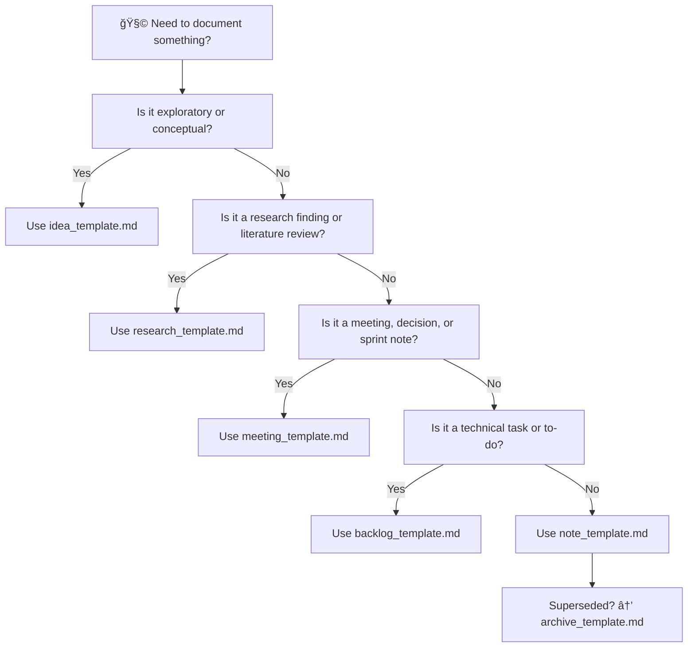

<div align="center">

# 🧩 Kansas Frontier Matrix — **Notes Templates**  
`docs/notes/templates/README.md`

**Purpose:** Provide reusable **Markdown + YAML templates** for research notes, meeting records, brainstorming ideas, and backlog entries — ensuring every informal artifact in `/docs/notes/` is **structured, validated, searchable, MCP-DL v6.3–compliant**, and ready for ingestion into the **Kansas Frontier Matrix (KFM) Knowledge Graph**.

[](../../standards/documentation.md)
[](../../../.github/workflows/docs-validate.yml)
[](../../../.github/workflows/site.yml)
[](../../../.github/workflows/stac-validate.yml)
[](../../../.github/workflows/codeql.yml)
[](../../../.github/workflows/trivy.yml)
[](../../../LICENSE)

</div>

```yaml
---
title: "Kansas Frontier Matrix — Notes Templates"
document_type: "Templates"
version: "v2.0.0"
last_updated: "2025-10-18"
created: "2025-10-05"
owners: ["@kfm-docs","@kfm-architecture","@kfm-research","@kfm-governance"]
status: "Stable"
maturity: "Production"
scope: "Docs/Notes/Templates"
license: "CC-BY 4.0"
semver_policy: "MAJOR.MINOR.PATCH"
tags: ["templates","notes","meetings","research","ideas","backlog","archive","provenance","governance"]
audit_framework: "MCP-DL v6.3"
ci_required_checks:
  - docs-validate
  - site-build
  - pre-commit
  - codeql
  - trivy
semantic_alignment:
  - PROV-O
  - CIDOC CRM
  - OWL-Time
  - SKOS
  - JSON Schema
  - ISO 8601
schema_index:
  note:        { file: "docs/schemas/note.schema.json",        version: "1.1.0" }
  idea:        { file: "docs/schemas/idea.schema.json",        version: "1.0.0" }
  backlog:     { file: "docs/schemas/backlog.schema.json",     version: "1.0.0" }
  meeting:     { file: "docs/schemas/meeting.schema.json",     version: "1.1.0" }
  research:    { file: "docs/schemas/research.schema.json",    version: "1.1.0" }
  archive:     { file: "docs/schemas/archive.schema.json",     version: "1.0.0" }
automation:
  - name: "Template Lint"
    schedule: "on-push"
    action: "tools/lint_templates.py"
  - name: "Template Sync → Graph"
    schedule: "0 6 * * MON"
    action: "tools/graph_ingest_notes.py"
ai_assist:
  summarize: false
  embed_in_graph: false
  classify: false
retention_policy:
  update_cycle: "Quarterly"
  archive_after: "18 months"
  purge_after: "48 months"
---
```

---

## 📚 Overview

These templates establish a **canonical format for informal documentation**—unifying research, collaboration, and creative work across the Kansas Frontier Matrix (KFM).  
Each template ensures your content can be parsed by machines, queried by humans, and preserved as part of **KFM’s long-term historical and technical provenance**.

Templates guarantee:

* 🧱 **Consistency** across all note types  
* 🔗 **Cross-linking** to datasets, code, and docs  
* 🧩 **YAML metadata** for traceable, auditable provenance  
* 🤖 **CI validation** & schema compliance  
* 🧠 **Knowledge Graph ingestion** using **PROV-O** and **CIDOC-CRM**

---

## 🗂️ Directory Layout

```text
docs/notes/templates/
├── README.md                    # (this file)
├── note_template.md             # General note / hypothesis
├── meeting_template.md          # Meeting & decision log
├── research_template.md         # Research summaries & reviews
├── backlog_template.md          # Task tracking / technical debt
├── archive_template.md          # Archiving & supersession record
└── idea_template.md             # Ideation / experimental concepts
```

---

## 🧭 Template Selection Flow


<!-- END OF MERMAID -->

---

## 🧩 Unified Metadata Reference

| Field | Applies To | Type | Description | Example |
| :-- | :-- | :-- | :-- | :-- |
| `id` | all | string | Unique identifier (`<prefix>-YYYY-NNN`) | `R-2025-001` |
| `title` | all | string | Document title | “Mapping Frontier Treaties” |
| `author` | all | string/array | Author or team handle | `@kfm-research` |
| `date` | note,research | date | ISO 8601 creation date | 2025-10-18 |
| `status` | all | enum | Lifecycle phase | `draft` |
| `priority` | backlog | enum | Task priority | `high` |
| `category` | research | enum | Research domain | `Ontology` |
| `type` | meeting | enum | Meeting classification | `governance` |
| `linked_docs` | all | array | Related documentation paths | `docs/standards/...` |
| `linked_datasets` | research,note | array | Data sources or STAC items | `data/stac/...` |
| `linked_commits` | all | array | Related Git commits | `["abc123"]` |
| `linked_ideas` | meeting,backlog | array | Ideas referenced | `I-2025-001` |
| `linked_backlog` | meeting,idea | array | Associated backlog items | `B-2025-004` |
| `linked_experiments` | research | array | Experimental notebooks | `docs/experiments/...` |
| `summary` | all | string | Short abstract for Knowledge Graph indexing | ... |
| `ai_assist` | all | map | Summarization/embedding control | `{ summarize: true }` |

---

## 📄 Template Catalog

```yaml
template_catalog:
  - id: T-001
    type: note
    file: "note_template.md"
    purpose: "General notes, ideas, and hypotheses."
  - id: T-002
    type: meeting
    file: "meeting_template.md"
    purpose: "Meeting documentation and decisions."
  - id: T-003
    type: research
    file: "research_template.md"
    purpose: "Scientific summaries and literature reviews."
  - id: T-004
    type: backlog
    file: "backlog_template.md"
    purpose: "Operational or technical tasks."
  - id: T-005
    type: idea
    file: "idea_template.md"
    purpose: "Brainstorming or innovation logs."
  - id: T-006
    type: archive
    file: "archive_template.md"
    purpose: "Record and preserve retired notes."
```

---

## 🧱 Core Template Components

1️⃣ **YAML Header** — defines metadata, links, and schema compliance  
2️⃣ **Markdown Body** — structured narrative content  
3️⃣ **CI Hooks** — validation (`yamllint`, `remark-lint`, `jsonschema`)  
4️⃣ **Graph Linkage** — PROV triples → Neo4j ingestion  

---

## 📘 Available Templates

Each of the following templates supports YAML schema validation, link checking, and graph ingestion.

### 🧩 1. `note_template.md` — General Notes & Hypotheses
(see [note_template.md](note_template.md))

### 🗓️ 2. `meeting_template.md` — Meetings & Decisions
(see [meeting_template.md](meeting_template.md))

### 🔬 3. `research_template.md` — Research Summaries & Reviews
(see [research_template.md](research_template.md))

### 🧱 4. `backlog_template.md` — Technical Tasks & Debt
(see [backlog_template.md](backlog_template.md))

### 💡 5. `idea_template.md` — Conceptual & Exploratory Entries
(see [idea_template.md](idea_template.md))

### 🗃️ 6. `archive_template.md` — Closing or Superseding Notes
(see [archive_template.md](archive_template.md))

---

## 🔍 Linking Templates to the Knowledge Graph

**Example Triples**
```turtle
@prefix prov: <http://www.w3.org/ns/prov#> .
@prefix dc:   <http://purl.org/dc/terms/> .
@prefix kfm:  <https://kfm.org/id/> .

kfm:note/N-2025-012
    a prov:Entity ;
    dc:title "LiDAR Pipeline Hypothesis" ;
    prov:wasAttributedTo kfm:agent/kfm-data ;
    prov:used kfm:dataset/ks_1m_dem_2018_2020 ;
    dc:date "2025-10-18"^^xsd:date .
```

**ER Graph Relationships**


<!-- END OF MERMAID -->

---

## 🧮 Metrics & Analytics

| Metric | Source | Target | Description |
| :-- | :-- | :-- | :-- |
| Template usage (PRs) | Git commits | 100% | Every informal doc uses correct template |
| Schema compliance | CI results | 100% | Zero invalid YAML or missing fields |
| Graph ingestion rate | Neo4j | ≥ 95% | Notes successfully synced into KG |
| SKOS tag alignment | `data/vocabularies/tags.skos.ttl` | ≥ 98% | Controlled vocabulary coverage |

---

## ⚙️ Template Testing Framework

```bash
pytest tools/tests/test_templates.py
```

Tests include:
- YAML loadability  
- Schema conformance  
- ISO 8601 date compliance  
- Tag vocabulary validation  
- Link resolution within repo

---

## 🧩 Automation & CLI Scaffolding

**CLI Tool:**
```bash
python tools/new_note.py --type meeting --title "Ontology Sync" --author @kfm-docs
```

Generates a new note file from the appropriate template, populates:
- `id` auto-incremented per type  
- `date` (UTC today)  
- `author` (from Git config)  
- Correct schema & linked_docs defaults  

**Sample Output**
```bash
✔ Created docs/notes/meetings/M-2025-007.md
✔ Validated schema docs/schemas/meeting.schema.json
✔ Added to knowledge graph (Neo4j)
```

---

## 🔒 Security & Ethics

> Templates must **never** store credentials, raw PII, or restricted datasets.  
> Meeting recordings marked `internal` require ACL-managed links.  
> Sensitive coordinates or cultural data must follow Indigenous data sovereignty guidelines (per *Archaeology MCP Module*).  

---

## 🌐 Localization & Accessibility

Templates are written in **plain technical English (WCAG 2.1 AA)**.  
To support multilingual expansion:

```yaml
language: en-US
alt_text: "Meeting notes template with accessible headings."
translation_available: ["es-ES","fr-FR"]
```

> Include this metadata for any translated templates in `docs/i18n/templates/`.

---

## 📊 Template Lifecycle & Roadmap


<!-- END OF MERMAID -->

---

## 🧠 Governance & Usage Guidelines

| Guideline | Description |
| :-- | :-- |
| Template Consistency | All informal docs must start from the appropriate template. |
| Metadata Completeness | Missing YAML fields cause CI failure. |
| Link Validity | Internal links must resolve within the repo. |
| Promotion & Archiving | Old notes archived; reproducible notes promoted to architecture. |
| Provenance Enforcement | Every note links to at least one dataset, doc, or commit. |

---

## 🤖 CI Validation Matrix

| Validation | Tool / Path | Description |
| :-- | :-- | :-- |
| **YAML syntax** | `yamllint` | Front-matter correctness |
| **Schema compliance** | `jsonschema` | Checks template-specific rules |
| **Link validation** | `remark-lint` | Internal link health |
| **Tag parsing** | `scripts/parse_tags.py` | SKOS vocabulary sync |
| **Graph ingestion** | `tools/graph_ingest_notes.py` | Adds entries to Neo4j |
| **Accessibility check** | `scripts/check_a11y_headers.py` | Validates headings/contrast |

**Run manually:**
```bash
make docs-validate && make docs-lint
```

---

## 📎 Related Documentation

| File                                   | Description                                   |
| :------------------------------------- | :-------------------------------------------- |
| `docs/notes/README.md`                 | Notes workspace overview                      |
| `docs/notes/backlog.md`                | Operational backlog (tasks/actions)            |
| `docs/notes/ideas.md`                  | Idea repository for innovation                 |
| `docs/notes/research.md`               | Research ledger & findings                     |
| `docs/notes/meetings.md`               | Meetings & decisions log                       |
| `docs/standards/documentation.md`      | Documentation & writing standards              |
| `docs/standards/ontologies.md`         | CIDOC-CRM · PROV-O · OWL-Time · SKOS alignment |
| `docs/architecture/knowledge-graph.md` | Knowledge graph ingestion & linkage semantics  |

---

## 🚀 Future Roadmap

| Milestone | Target | Description |
| :-- | :-- | :-- |
| v2.1 | Q1 2026 | Interactive template editor in KFM web UI |
| v2.2 | Q2 2026 | Automated documentation scaffolding via GitHub Action |
| v2.3 | Q3 2026 | Domain-specific extensions (Climate, AI, Archaeology) |
| v2.4 | Q4 2026 | Template analytics dashboard in Grafana/Bloom |

---

## 📅 Version History

| Version | Date | Author | Summary |
| :-- | :-- | :-- | :-- |
| v2.0.0 | 2025-10-18 | @kfm-docs | Added schema catalog, CLI scaffolding, metadata index, AI readiness, accessibility, and governance metrics. |
| v1.5.0 | 2025-10-17 | @kfm-docs | Introduced ER/flow diagrams, unified schema integration, and validation framework. |
| v1.0.0 | 2025-10-05 | @kfm-docs | Initial release of note templates with YAML metadata and CI integration. |

---

<div align="center">

**Kansas Frontier Matrix** — *“Every Idea Structured. Every Note Traceable.”*  
📍 `docs/notes/templates/README.md` · Maintained under MCP-DL v6.3 governance and CI validation.

</div>
