<div align="center">

# 💡 Kansas Frontier Matrix — **Idea Entry Template**  
`docs/notes/templates/idea_template.md`

**Purpose:** Provide a structured, version-controlled template for documenting **ideas, concepts, or innovation proposals** within the **Kansas Frontier Matrix (KFM)**.  
Each idea captured here contributes to KFM’s knowledge ecosystem, ensuring every concept — no matter how early — is **traceable, semantically linked, and reproducible** under **Master Coder Protocol – Documentation Language v6.3 (MCP-DL)**.

[](../../standards/documentation.md)
[](../../../.github/workflows/docs-validate.yml)
[](../../architecture/knowledge-graph.md)
[](../../../.github/workflows/policy-check.yml)
[](../../../LICENSE)

</div>

```yaml
---
id: I-YYYY-NNN
title: "<Idea Title>"
author: "@kfm-docs"
date_created: 2025-10-18
last_updated: 2025-10-18
status: draft            # draft | review | promoted | archived
priority: medium         # high | medium | low
project_area: ["ontology","web","data"]
tags: ["idea","innovation","mcp","ontology"]
linked_docs:
  - ../../architecture/knowledge-graph.md
linked_commits:
  - f4a72b1
linked_meetings:
  - M-2025-010
linked_backlog:
  - B-2025-004
linked_research:
  - R-2025-001
linked_datasets:
  - ../../data/stac/terrain/ks_1m_dem_2018_2020.json
summary: >
  Concise summary of the idea’s purpose, rationale, and potential contribution to KFM.
  Used for semantic search, AI embedding, and graph linkage.
ai_assist:
  summarize: true
  embed_in_graph: true
  vector_model: "sentence-transformers/all-MiniLM-L6-v2"
license: "CC-BY 4.0"
---
```

---

## 🧭 Context

Describe **how this idea originated** and **what problem or opportunity it addresses**.  
Provide background context, related discussions, or insights from previous work.

> Example:  
> “This idea proposes a geospatial-temporal overlay system for correlating Kansas treaty boundaries with environmental datasets.”

---

## 🧩 Objective

Define the **goal of the idea**:
- What problem does it solve?  
- How does it improve reproducibility, provenance, or user experience?  
- Is it meant to become a feature, dataset, standard, or governance enhancement?

---

## 🧠 Concept Overview

Summarize the high-level concept in structured form:

| Aspect | Description |
| :-- | :-- |
| **Core Concept** | What is the main idea? |
| **Motivation** | Why does this matter? |
| **Value** | What benefit does it provide to the project? |
| **Potential Impact** | Short and long-term value across MCP, governance, or research. |

---

## 🧮 Draft Implementation Notes

Add pseudocode, conceptual diagrams, or model outlines here.

**Example (Mermaid Diagram):**

```mermaid
flowchart TD
    A["User Input / Query"] --> B["AI Layer · Ontology Parser"]
    B --> C["Knowledge Graph Integration"]
    C --> D["STAC Dataset Cross-Reference"]
    D --> E["Web Frontend Visualization"]
```

<!-- END OF MERMAID -->

---

## 🔬 Technical Notes

| Field | Description |
| :-- | :-- |
| **Tech Stack** | Python · React · Neo4j · FastAPI |
| **Dependencies** | STAC API, GraphQL Gateway |
| **Standards Impacted** | CIDOC CRM, OWL-Time, PROV-O |
| **Schema Links** | `docs/schemas/idea.schema.json` |
| **FAIR Relevance** | Enhances findability or interoperability |

---

## 📊 Metrics for Evaluation

| Metric | Target | Description |
| :-- | :-- | :-- |
| **Feasibility** | 80% | Can it be implemented with existing architecture? |
| **Reproducibility Impact** | High | Does it improve data lineage or traceability? |
| **Governance Alignment** | Full | Does it align with MCP-DL principles? |
| **AI Readiness** | Yes | Can this be integrated into semantic embeddings? |

---

## 🧾 Provenance (RDF/Turtle)

```turtle
@prefix prov: <http://www.w3.org/ns/prov#> .
@prefix dc:   <http://purl.org/dc/terms/> .
@prefix kfm:  <https://kfm.org/id/> .

kfm:idea/I-2025-004
    a prov:Plan ;
    dc:title "AI Ontology Assistant Concept" ;
    prov:wasAttributedTo kfm:agent/kfm-docs ;
    prov:wasInfluencedBy kfm:meeting/M-2025-010 ;
    prov:generated kfm:document/ontology_ai_assistant_proposal ;
    dc:date "2025-10-18"^^xsd:date ;
    dc:description "Idea proposing integration of AI ontology assistant into MCP governance tooling." .
```

---

## 🧠 Promotion Path

| Phase | Trigger | Action | Output |
| :-- | :-- | :-- | :-- |
| **Draft** | Idea submitted | CI validates YAML schema | Saved to repo |
| **Review** | Discussion in meeting | Linked to agenda item | Comments added |
| **Promoted** | Approved & implemented | Becomes feature or doc update | Added to Knowledge Graph |
| **Archived** | Rejected or merged | Linked to successor | Moved to archive |

---

## ✅ Review Checklist

| Validation | Requirement | Status |
| :-- | :-- | :-- |
| YAML valid | `yamllint` + `jsonschema` | ✅ |
| Schema compliant | `idea.schema.json` | ✅ |
| Graph ingestion | `tools/graph_ingest_ideas.py` | ✅ |
| FAIR metadata present | Findable · Accessible · Interoperable · Reusable | ✅ |
| No sensitive data | Publicly releasable | ✅ |

---

## 🧩 FAIR Compliance

| Principle | Implementation |
| :-- | :-- |
| **Findable** | Indexed in Knowledge Graph (Neo4j) |
| **Accessible** | Publicly available in Git and Zenodo snapshot |
| **Interoperable** | PROV-O and CIDOC CRM ontology mapping |
| **Reusable** | Licensed CC-BY 4.0, with complete metadata |

---

## 🤖 Validation Commands

```bash
make docs-validate
pytest tools/tests/test_templates.py -k idea
```

---

## 📎 Related Templates

| Template | Purpose |
| :-- | :-- |
| [`note_template.md`](note_template.md) | For general or unstructured thoughts |
| [`meeting_template.md`](meeting_template.md) | For governance review sessions |
| [`archive_template.md`](archive_template.md) | For archiving declined or merged ideas |

---

## 📅 Version History

| Version | Date | Author | Summary |
| :-- | :-- | :-- | :-- |
| v1.0.0 | 2025-10-18 | @kfm-docs | Initial idea template with provenance model, FAIR alignment, AI embedding metadata, and promotion workflow. |

---

<div align="center">

**Kansas Frontier Matrix** — *“Every Thought Recorded. Every Idea Proven.”*  
📍 `docs/notes/templates/idea_template.md` · Maintained under MCP-DL v6.3 governance and AI-ready documentation standards.

</div>
