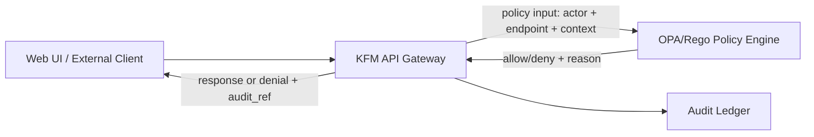
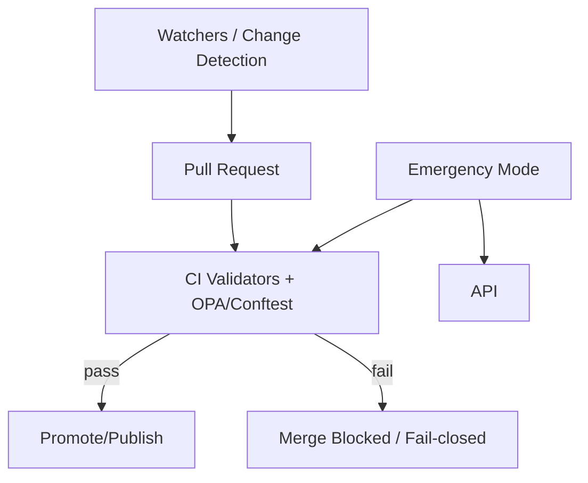

# 🚨 KFM Kill Switch (Emergency Deny Switch)

> **Purpose:** Provide a rapid, auditable, fail-closed mechanism to stop risky KFM behavior (especially **public endpoints** and **Focus Mode**) **without deploying code**, by using a **policy toggle** at the trust membrane boundary.  
> This requirement is explicitly called out as **“RISK: Emergency deny switch”** in the KFM Next-Gen Blueprint operations/risk guidance. :contentReference[oaicite:2]{index=2}

---

## 1. Executive Summary

KFM is designed around a **trust membrane**: clients and the Web UI must only access KFM through a governed API boundary with policy enforcement (OPA/Rego), and KFM must remain **evidence-first** with **fail-closed** behavior. :contentReference[oaicite:3]{index=3}

The **Kill Switch** (also called the **Emergency Deny Switch**) is the operational mechanism that:

- **Immediately reduces blast radius** during incidents (data leaks, unsafe AI output, suspected compromise).
- **Disables the highest-risk features first** (Focus Mode / AI query endpoint) and can expand to disable broader public access.
- Is **controlled via policy** so it can be triggered **without deploying application code**. :contentReference[oaicite:4]{index=4}
- Is **audited** and traceable, including the policy version that enforced decisions. :contentReference[oaicite:5]{index=5}

This document defines:
- **Requirements** and invariants for the kill switch,
- A **reference policy design** (OPA/Rego),
- **Operational playbooks** for activation/deactivation,
- **Validation & testing gates** (unit tests + CI + smoke tests),
- **Audit & observability** expectations,
- Governance controls (roles, approvals, break-glass).

---

## 2. Scope, Non-Goals, and Design Constraints

### 2.1 In-scope
The kill switch covers:

1) **Runtime request gating** at the API boundary (the most important layer)
   - Disable/deny **/api/v1/ai/query** (Focus Mode)
   - Disable/deny public endpoints broadly
   - Optionally allow “internal admin” access (break-glass) with audit

2) **Promotion / publishing / CI gates**
   - A merge-blocking **promotion contract** style gate that can be stopped (“kill-switch”) to prevent new artifacts from being promoted during instability. :contentReference[oaicite:6]{index=6}

3) **Incident response alignment**
   - Playbooks for “AI unsafe output” and “Data leak”
   - The blueprint explicitly prescribes:  
     - **AI unsafe output:** “disable /ai/query via policy; preserve audit logs; fix policy/validator/prompt; add regression test.” :contentReference[oaicite:7]{index=7}  
     - **Data leak:** “deny via policy toggle; rotate credentials; withdraw affected artifacts; publish redacted derivative.” :contentReference[oaicite:8]{index=8}

### 2.2 Out of scope (explicit)
- Replacing incident response, forensics, or root-cause analysis.
- Deleting evidence/audit logs.
- “Hiding” restricted content by obscurity—policy must remain the enforcement mechanism.

### 2.3 Constraints (KFM invariants)
- **Trust membrane** must hold: the UI cannot bypass API/policy. :contentReference[oaicite:9]{index=9}
- **Fail-closed** default: absence of signal or policy inputs must deny rather than allow. :contentReference[oaicite:10]{index=10}
- **No-code-deploy activation:** The kill switch must be enabled via a **policy toggle** rather than app redeploy. :contentReference[oaicite:11]{index=11}

> [!IMPORTANT]
> Treat kill-switch changes as **governed production changes**, even if “just a toggle.” The toggle must be auditable, minimally privileged, and reversible.

---

## 3. When to Use the Kill Switch (Triggers)

### 3.1 Primary triggers (explicitly referenced)
- **AI unsafe output event**
  - Example guidance in blueprint: disable AI endpoint via policy toggle; preserve logs; fix prompt/policy/validator; add regression tests. :contentReference[oaicite:12]{index=12}

- **Data leak / suspected sensitive disclosure**
  - Blueprint guidance: deny via policy toggle; rotate credentials; withdraw artifacts; publish redacted derivative. :contentReference[oaicite:13]{index=13}

### 3.2 Secondary triggers (recommended, but not confirmed in repo)
- Credential compromise suspicion
- Third-party dependency vulnerability affecting signature verification, policy evaluation, etc.
- Evidence resolver malfunction that breaks cite-or-abstain guarantees
- Unintentional release of restricted coordinate data (archaeology, private parcels, etc.)

---

## 4. Kill Switch Levels (Operational Modes)

The blueprint calls for an emergency policy switch to disable endpoints and Focus Mode. :contentReference[oaicite:14]{index=14}  
This runbook formalizes that into **levels** for predictable response.

| Level | Name | What is blocked | What remains available | Typical use |
|------:|------|------------------|------------------------|-------------|
| 0 | Normal | Nothing (beyond standard policy) | All standard capabilities | Normal ops |
| 1 | **AI Quarantine** | `/api/v1/ai/query` (Focus Mode) | Non-AI browsing, dataset catalog browsing per policy | Unsafe AI output incident :contentReference[oaicite:15]{index=15} |
| 2 | **Public Lockdown** | All “public” endpoints (or public actor role) | Admin/reviewer access only; health endpoints | Data leak / suspected compromise :contentReference[oaicite:16]{index=16} |
| 3 | **Full Lockdown** | Everything except health/readiness | `/healthz`, internal diagnostics only | Active breach containment |
| 4 | **Promotion Freeze** | CI promotion / merge-to-publish workflows | Read-only runtime (as configured by Levels 0–3) | Supply chain / provenance pipeline uncertainty; force fail-closed promotion gating :contentReference[oaicite:17]{index=17} |

> [!NOTE]
> Levels can be modeled as a single integer **`emergency_level`** and/or as granular feature toggles; the “least surprise” approach is to provide **both**: an easy default level and optional overrides.

---

## 5. Architecture Placement (Where the Kill Switch Lives)

### 5.1 Trust membrane enforcement point
KFM’s runtime policy enforcement design is explicitly based on calling an **OPA engine** at request/answer time with context (role, endpoint, answer metadata, sensitivity, citations). :contentReference[oaicite:18]{index=18}:contentReference[oaicite:19]{index=19}

That makes the kill switch a **policy decision**, not an application “if statement.”

#### Key architectural idea
- **The application asks OPA:** “Is this request allowed right now?”
- OPA evaluates:
  - actor role
  - endpoint
  - dataset sensitivity / classification
  - Focus Mode output properties (citations present, sensitivity_ok)
  - **emergency mode state**

If emergency mode indicates lockdown, OPA denies.

### 5.2 Pipeline/CI enforcement point
The “New Ideas Feb-2026” integration pattern explicitly includes **merge-blocking PR gates** with policy checks and **kill-switch** semantics. :contentReference[oaicite:20]{index=20}  
It also describes fail-closed orchestration using a GitHub App, with “kill-switch … deny by default.” :contentReference[oaicite:21]{index=21}

So the kill switch must be modeled **both**:
- at runtime request policy, and
- in CI promotion policy.

---

## 6. Control Plane Design (How You Flip the Switch)

### 6.1 Principle: toggle via policy data, not code deploy
The KFM Next-Gen blueprint requires an emergency switch that disables endpoints **without deploying code**. :contentReference[oaicite:22]{index=22}

**Recommended control plane** (proposal; not confirmed in repo):
- A single source of truth document (e.g., JSON) included in the OPA policy bundle:
  - `data.kfm.system.emergency = { level, reason, activated_at, activated_by, expires_at }`
- OPA is configured to **periodically pull** bundles from the governed policy artifact store (GitOps or object store).

**Why this works:**
- Updating the policy data causes OPA to enforce the new behavior immediately (depending on bundle refresh cadence).
- No application code changes are required.

### 6.2 Governance for activation/deactivation
- **Activation must be fast** but must remain auditable and controlled.
- Minimum governance posture (recommended):
  - **Single operator** may activate (to stop harm fast)
  - **Two-person review** required to deactivate (to prevent premature re-exposure)

> [!WARNING]
> If you allow “any admin can disable lockdown,” you risk “flip-flop” incidents under pressure.  
> Deactivation should require explicit sign-off and evidence of mitigations (tests + PR links).

---

## 7. Policy Model (OPA/Rego)

### 7.1 Input schema expectations
The KFM Next-Gen blueprint recommends a policy input shape including **actor**, **request endpoint**, and Focus Mode answer properties. :contentReference[oaicite:23]{index=23}

Example (illustrative; aligns to blueprint shape):
```json
{
  "actor": {"role":"public|reviewer|admin", "attributes": {}},
  "request": {"endpoint":"/api/v1/ai/query", "context": {}},
  "answer": {"has_citations":true, "citations":[{"ref":"..."}], "sensitivity_ok":true},
  "resource": {"kind":"dataset", "id":"dataset_123", "sensitivity":"public"}
}
```

### 7.2 Emergency state document (policy data)
**Proposed canonical structure** (not confirmed in repo):

```json
{
  "kfm": {
    "system": {
      "emergency": {
        "level": 0,
        "reason": "",
        "activated_at": null,
        "activated_by": null,
        "expires_at": null,
        "overrides": {
          "ai_enabled": true,
          "public_api_enabled": true,
          "promotion_enabled": true
        }
      }
    }
  }
}
```

### 7.3 Rego module: system emergency decision
**File path suggestion:** `policy/kfm/system.rego` (not confirmed in repo)

```rego
package kfm.system

default emergency_level := 0

# Read from OPA data store (bundle-provided).
emergency_level := level {
  level := data.kfm.system.emergency.level
}

# Convenience booleans
ai_quarantine { emergency_level >= 1 }
public_lockdown { emergency_level >= 2 }
full_lockdown { emergency_level >= 3 }
promotion_freeze { emergency_level == 4 }

# Allow health checks even in full lockdown
health_endpoint {
  input.request.endpoint == "/healthz"
}

# Deny-by-default posture is handled in the specific policy modules (ai/data/promotion).
```

### 7.4 Rego module: AI endpoint gating
The blueprint’s operations guidance explicitly prescribes disabling `/ai/query` via policy in unsafe output incidents. :contentReference[oaicite:24]{index=24}

**File path suggestion:** `policy/kfm/ai.rego` (not confirmed in repo)

```rego
package kfm.ai

import data.kfm.system

default allow := false

# Emergency deny: AI quarantine or stronger disables the endpoint.
deny_reason := "emergency_ai_quarantine" {
  input.request.endpoint == "/api/v1/ai/query"
  system.ai_quarantine
}

allow {
  not deny_reason
  input.request.endpoint == "/api/v1/ai/query"
  input.answer.has_citations == true
  input.answer.sensitivity_ok == true
}
```

> [!IMPORTANT]
> This preserves the existing cite-or-abstain contract pattern (citations + sensitivity_ok), while ensuring emergency mode can override it. :contentReference[oaicite:25]{index=25}:contentReference[oaicite:26]{index=26}

### 7.5 Rego module: public endpoint lockdown
**File path suggestion:** `policy/kfm/access.rego` (not confirmed in repo)

```rego
package kfm.access

import data.kfm.system

default allow := false

deny_reason := "emergency_public_lockdown" {
  system.public_lockdown
  input.actor.role == "public"
}

# Example allow rule (still subject to dataset/data module allow rules)
allow {
  not deny_reason
  input.actor.role != "public"
}
```

### 7.6 Rego module: CI/promotion kill switch
The “New Ideas Feb-2026” integration material explicitly describes merge-blocking gates and includes “kill-switch” as part of the fail-closed orchestration concept. :contentReference[oaicite:27]{index=27}:contentReference[oaicite:28]{index=28}

**File path suggestion:** `policy/kfm/promotion.rego` (not confirmed in repo)

```rego
package kfm.promotion

import data.kfm.system

default allow := false

deny_reason := "emergency_promotion_freeze" {
  system.promotion_freeze
}

allow {
  not deny_reason
  # ...normal promotion contract checks...
  input.has_required_receipts == true
  input.has_required_attestations == true
  input.rights_ok == true
}
```

---

## 8. Auditing & Provenance Requirements

### 8.1 Policy decisions must be auditable
The comprehensive technical blueprint notes the value of tracking decisions against a policy version/hash for accountability. :contentReference[oaicite:29]{index=29}

**Requirement:**
- Every denial due to emergency mode should emit an audit record including:
  - endpoint
  - actor role
  - emergency level
  - policy bundle hash/version
  - reason code
  - correlation/request id

### 8.2 Audit record format alignment
The KFM Next-Gen blueprint includes an audit record schema requiring fields such as `audit_ref`, `timestamp`, `event_type`, `subject`, and `event_hash`. :contentReference[oaicite:30]{index=30}

**Kill-switch event types (recommended):**
- `policy.emergency.set`
- `policy.emergency.clear`
- `request.denied.emergency`
- `promotion.denied.emergency`

**Example subject payload (recommended):**
```json
{
  "event_type": "policy.emergency.set",
  "subject": {
    "level": 2,
    "reason": "suspected_data_leak",
    "scope": ["public_api", "focus_mode"],
    "policy_bundle_hash": "sha256:..."
  }
}
```

---

## 9. Operational Playbooks

> [!IMPORTANT]
> The blueprint already prescribes what to do for core incidents (data leak / unsafe AI output). These playbooks are the concrete, step-by-step “muscle memory” version. :contentReference[oaicite:31]{index=31}

### 9.1 Activation playbook: AI unsafe output (Level 1)
**Trigger:** any confirmed or suspected unsafe output event.

**Goal:** disable `/api/v1/ai/query` immediately while preserving evidence.

**Steps:**
1. Set emergency level to **1 (AI Quarantine)** via policy toggle.
2. Validate:
   - `/api/v1/ai/query` is denied for all roles except (optional) admin break-glass.
   - Non-AI browsing endpoints remain functional.
3. Preserve evidence:
   - snapshot audit logs (immutable retention if available)
   - preserve prompt/version and policy bundle hash used for denial (policy hash requirement aligns with blueprint design guidance). :contentReference[oaicite:32]{index=32}
4. Begin remediation:
   - fix validator/policy/prompt
   - add regression test that reproduces the unsafe output and ensures it is blocked.
5. Prepare deactivation (Section 9.4).

**Blueprint alignment:** “AI unsafe output: disable /ai/query via policy; preserve audit logs; fix policy/validator/prompt; add regression test.” :contentReference[oaicite:33]{index=33}

---

### 9.2 Activation playbook: Data leak / suspected sensitive disclosure (Level 2)
**Trigger:** suspected leak of restricted data (e.g., restricted coordinates, private info).

**Goal:** stop public access immediately and rotate secrets.

**Steps:**
1. Set emergency level to **2 (Public Lockdown)** via policy toggle.
2. Validate public access is denied.
3. Rotate credentials/secrets (platform runbook; not confirmed in repo).
4. Withdraw affected artifacts:
   - remove from public catalogs (do not destroy evidence)
   - publish a redacted derivative if needed (with explicit redaction provenance)
5. Preserve audit logs and chain-of-custody.

**Blueprint alignment:** “Data leak: deny via policy toggle; rotate credentials; withdraw affected artifacts; publish redacted derivative.” :contentReference[oaicite:34]{index=34}

---

### 9.3 Activation playbook: Promotion freeze (Level 4)
**Trigger:** supply-chain doubt, signature verification instability, or CI/promotion pipeline uncertainty.

**Goal:** prevent any new promotion/publishing until confidence is restored.

**Steps:**
1. Set emergency level to **4 (Promotion Freeze)**.
2. Validate CI gates fail closed for promotion merges/dispatch.
   - “Merge-blocking PR gate requiring receipts + attestations + signatures (plus kill-switch)” supports this posture. :contentReference[oaicite:35]{index=35}
3. Ensure runtime read access behavior is unchanged unless separately escalated.

---

### 9.4 Deactivation playbook (Return to Normal)
**Principle:** deactivation should be slower and evidence-based.

**Minimum exit criteria (recommended):**
- Root cause identified and mitigated
- Regression tests added and passing
- Policy bundle hash reviewed
- Audit trail preserved and linked

**Steps:**
1. Prepare a “deactivation PR” (or governed change record) that:
   - references the incident ticket (not confirmed in repo)
   - links evidence and tests
2. Change emergency level to 0.
3. Run smoke tests:
   - load home map
   - open provenance panel
   - run one Focus Mode query (if AI quarantine was used)  
   (Operations runbook recommends smoke tests including a Focus Mode query in normal ops.) :contentReference[oaicite:36]{index=36}
4. Monitor deny metrics and error rates for 30–60 minutes (recommended).
5. Close incident.

---

## 10. Observability & Monitoring

### 10.1 Required signals (recommended)
- Counter: `kfm_policy_denies_total{reason="emergency_*"}`
- Gauge: `kfm_emergency_level`
- Alert: emergency level != 0 for > N minutes
- Dashboard widget: “Policy status / emergency mode” (UI top bar suggestion aligns with governance-visible UI patterns; not confirmed in repo)

### 10.2 Audit-driven investigation
Because KFM encourages policy versioning in audit logs, incident review must include:
- policy hash in effect
- reason codes
- actors/roles impacted
- endpoints blocked

(Policy version tracking expectation: :contentReference[oaicite:37]{index=37})

---

## 11. Testing & Validation Gates

### 11.1 OPA unit tests
The KFM Next-Gen blueprint includes examples of OPA unit tests and emphasizes default deny patterns. :contentReference[oaicite:38]{index=38}

Add kill-switch tests such as:
- AI endpoint denied when emergency level ≥ 1
- Public actor denied when emergency level ≥ 2
- Health endpoint allowed when emergency level ≥ 3
- Promotion denied when emergency level = 4

### 11.2 CI checks
The “New Ideas Feb-2026” integration concept sets CI as a merge-blocking gate with policy and attestation checks, explicitly including kill-switch semantics. :contentReference[oaicite:39]{index=39}

**Recommended CI rule:**
- If emergency level indicates Promotion Freeze, CI fails promotion jobs by default unless explicitly overridden under break-glass procedure.

---

## 12. Governance & Access Control

### 12.1 Roles (recommended; not confirmed in repo)
- **IC (Incident Commander):** can activate emergency mode immediately
- **Governance Owner:** reviews deactivation + postmortems
- **SRE/Platform Owner:** operates deployment/policy bundles and secret rotation

### 12.2 Break-glass rules
- Break-glass should be:
  - time-bounded
  - logged and hash-chained
  - limited to remediation tasks (not routine usage)

---

## 13. Implementation Notes & Tradeoffs

### 13.1 Policy toggle transport
Options (ranked):
1) **OPA bundle refresh** (best): policy/data update propagates without app deploy.
2) Dynamic OPA data API update (fast, but must be tightly restricted and audited).
3) Environment-variable toggle (simple, but might require restarts → slower and more error-prone).

> [!NOTE]
> The KFM blueprint requirement is “without deploying code,” which OPA bundle refresh satisfies cleanly. :contentReference[oaicite:40]{index=40}

### 13.2 Single toggle vs granular flags
- **Single toggle (levels)** is operationally simpler.
- **Granular flags** reduce collateral disruption but increase complexity and testing surface.

Recommended compromise: use levels + optional overrides (Section 7.2).

---

## 14. Verification Steps (Minimum Work to Confirm Unknowns)

The blueprint itself notes some details may not be fully specified and calls for verification steps when implementations are not confirmed. :contentReference[oaicite:41]{index=41}

**Verify in repo / environment:**
- [ ] Actual endpoint paths for Focus Mode (`/api/v1/ai/query` is referenced in blueprint examples). :contentReference[oaicite:42]{index=42}
- [ ] How OPA is deployed (sidecar vs centralized) and how policy bundles are loaded. :contentReference[oaicite:43]{index=43}
- [ ] Audit ledger storage location + retention policy (object store vs DB) (not confirmed in repo)
- [ ] Existing CI workflows and where to hook the “promotion freeze” check (not confirmed in repo)
- [ ] Role/claims model for “public|reviewer|admin” (not confirmed in repo)

---

## 15. Appendix A — Reference Flow Diagrams

### 15.1 Runtime request path (Trust membrane)


### 15.2 CI/promotion path (Fail-closed orchestration)


---

## 16. Appendix B — “Boss-ready” One-paragraph explanation

KFM’s kill switch is a policy-driven emergency deny mechanism at the platform’s trust membrane that can disable high-risk capabilities—especially Focus Mode and public endpoints—without deploying code, enabling rapid containment of unsafe AI output or data-leak scenarios while preserving audit logs and provenance. This is explicitly required in the KFM Next-Gen operations/risk guidance as an “emergency policy switch” that can disable public endpoints and Focus Mode, and it aligns with KFM’s fail-closed design and merge-blocking CI/promotion governance posture. :contentReference[oaicite:44]{index=44}:contentReference[oaicite:45]{index=45}

---

## 17. References (KFM internal artifacts)

- KFM Next-Generation Blueprint & Primary Guide (Prepared 2026-02-12) — emergency deny switch + incident response guidance. :contentReference[oaicite:46]{index=46}:contentReference[oaicite:47]{index=47}
- Integrating “New Ideas Feb-2026” Into Knowledge-First Management — CI fail-closed orchestration and merge-blocking gates that include kill-switch semantics. :contentReference[oaicite:48]{index=48}:contentReference[oaicite:49]{index=49}
- KFM Comprehensive Technical Blueprint — runtime OPA enforcement patterns + policy-version auditing guidance. :contentReference[oaicite:50]{index=50}

Additional infra reference available in this workspace:
- Docker-GitOps-OpenShift.pdf :contentReference[oaicite:51]{index=51}


