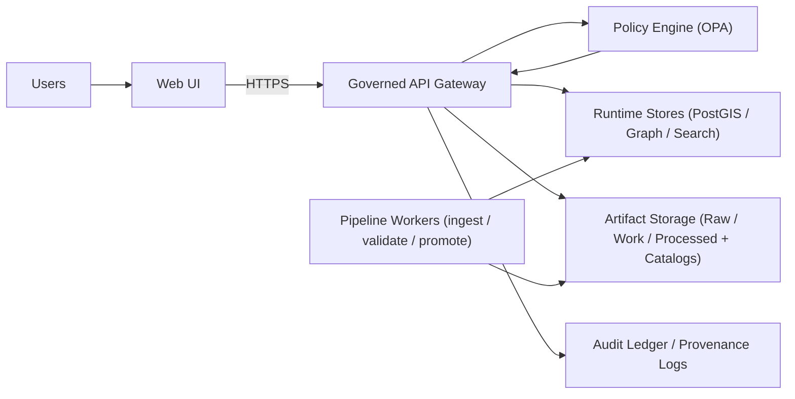

# KFM Operations 🛠️

This directory is the **operational control plane** for running Kansas Frontier Matrix (KFM) environments (dev/staging/prod) **without breaking governance guarantees**.

KFM is *governance-first*: production behavior is a function of **validated processed artifacts + catalogs + policy-as-code**, not ad-hoc DB edits or manual patching.

---

## Contents

- [System at a glance](#system-at-a-glance)
- [Operational invariants](#operational-invariants)
- [Production readiness definition](#production-readiness-definition)
- [Start/stop and health checks](#startstop-and-health-checks)
- [Backups, restore, and disaster recovery](#backups-restore-and-disaster-recovery)
- [Incident response](#incident-response)
- [Observability and SLOs](#observability-and-slos)
- [Backfill strategy](#backfill-strategy)
- [CI/CD gates as operational controls](#cicd-gates-as-operational-controls)
- [Governance review triggers](#governance-review-triggers)
- [Templates](#templates)

---

## System at a glance

**Trust membrane intent:** UI/external clients never touch databases directly; all read/write paths go through the governed API boundary.

---

## Operational invariants

> [!IMPORTANT]
> These are **non-negotiable**. If an operational action violates an invariant, it is not “ops”—it is a governance incident.

### 1) Trust membrane is always enforced
- All reads/writes crossing the boundary must go through:
  - authentication/authorization
  - policy evaluation (default deny)
  - query shaping / redaction
  - audit/provenance logging

### 2) Fail-closed behavior
- If policy, catalogs, or evidence are missing/invalid → **deny** or **abstain** (never “best guess” in production outputs).
- Focus Mode must be **cite-or-abstain** and must emit an **audit reference** for every response.

### 3) Raw/work artifacts are never served to end users
- **Raw**: immutable inputs and original copies.
- **Work**: intermediate artifacts; may be overwritten; not public.
- **Processed**: promoted artifacts and final catalogs; eligible for serving.

### 4) Runtime stores are rebuildable caches (artifacts are the source of truth)
- Backups must treat the object store (processed artifacts + catalogs + audit checkpoints) as **authoritative**.
- PostGIS/Graph/Search may be restored, but must also be **rebuildable from processed**.

### 5) Promotion is gated
Promotion to **processed** is only allowed when:
- checksums exist and match,
- schemas validate,
- policy labels exist and pass,
- catalog links resolve,
- contract/e2e tests pass,
- a backfill strategy exists (when relevant).

### 6) Emergency deny switch exists
- Operations must include a “big red button” to disable public endpoints / Focus Mode *without deploying code*.

---

## Production readiness definition

A KFM environment is “production-ready” only when the following are true:

- [ ] **Health endpoints** exist and are wired into readiness/liveness checks.
- [ ] **Smoke test** is automated and documented.
- [ ] **Backups** are scheduled, retention is defined, and restore is tested.
- [ ] **Incident playbooks** exist for data leak, AI unsafe output, and corrupted artifacts.
- [ ] **CI merge gate** blocks schema/policy/catalog violations.
- [ ] **CI deploy gate** runs environment smoke tests + migration checks + backup verification.
- [ ] **Evidence resolution** works end-to-end (citations resolve; Focus Mode abstains without evidence).
- [ ] **Emergency deny switch** is tested and documented.

---

## Start/stop and health checks

### Start order (recommended)
1. Bring up **web + API + policy engine**
2. Bring up **stores** (PostGIS / graph / search)
3. Bring up **pipeline workers**

> [!NOTE]
> Readiness checks must prevent “green” status until store connectivity and policy load checks pass.

### Required health checks
Minimum expectations (exact endpoints may vary by implementation):
- API: `GET /healthz`
- Readiness verifies:
  - store connectivity
  - policy bundle loaded
  - critical catalogs present (processed/public)

### Smoke test (minimum)
Run after every deploy and after any migration:
- Load home map
- Toggle a layer
- Open provenance panel
- Run one Focus Mode query (verify citations or abstention)

---

## Backups, restore, and disaster recovery

### Backup layers (required)
| Layer | What | Why | Minimum practice |
|---|---|---|---|
| **Artifact backups** (authoritative) | processed artifacts + catalogs + audit checkpoints | Source of truth | object storage snapshots/versioning + retention + checksum integrity |
| **Runtime store backups** (rebuildable caches) | PostGIS + graph + search indexes | Faster recovery | backups + restore drills; confirm rebuild-from-processed works |

### Minimum schedules (baseline)
- PostGIS backups: **daily**
- Retention: **30 days**
- Restore verification: **quarterly**
- Object storage: versioning on; immutable retention for catalogs + audit checkpoints
- Graph backups aligned with “rebuild from canonical catalogs” strategy
- After restore: verify audit ledger checkpoints / hash chain (if used)

### Restore drill expectations
- A restore drill is not “done” until:
  - the environment serves tiles from processed artifacts
  - citations resolve
  - Focus Mode produces either cited answers or abstains
  - audit ledger integrity checks pass (if applicable)

---

## Incident response

> [!IMPORTANT]
> Incidents are governed artifacts. Preserve evidence (logs + audit ledger + relevant catalogs) before making destructive changes.

### Severity rubric (recommended)
| Severity | Example | Target action |
|---|---|---|
| SEV-1 | Sensitive data exposure; policy bypass | Immediate deny switch, rotate credentials, preserve evidence |
| SEV-2 | Corrupted processed artifacts; widespread 5xx | Rollback to last-good processed, rebuild indexes |
| SEV-3 | Partial degradation; isolated dataset issues | Triage, patch pipeline, schedule backfill |

### Playbooks (minimum)

#### A) Data leak / sensitive location exposure
1. **Deny via policy toggle** (emergency switch if needed)
2. Rotate credentials / keys (if relevant)
3. Withdraw affected artifacts (unpublish / revoke processed artifacts)
4. Publish redacted derivative (new processed version)
5. Add regression tests: sensitivity propagation + redaction enforcement

#### B) AI unsafe output (Focus Mode)
1. Disable `/ai/query` via policy
2. Preserve audit logs + prompt/policy versions
3. Fix policy/validator/prompt
4. Add regression test that reproduces the failure mode
5. Re-enable only after merge + deploy gate passes

#### C) Corrupted processed artifacts
1. Verify checksums
2. Roll back dataset version (processed)
3. Rebuild indexes (graph/search)
4. Re-run validation gates and re-publish catalogs

### Emergency deny switch
Maintain and periodically test an emergency switch that can disable:
- public endpoints
- Focus Mode
without deploying code.

---

## Observability and SLOs

> [!NOTE]
> Targets are environment-dependent. Define SLO targets in a separate governed doc once baseline telemetry exists.

### Recommended SLIs (starter set)
| Area | SLI | Why it matters |
|---|---|---|
| Availability | API success rate; UI load success | User access to core system |
| Latency | p95/p99 for key endpoints | UX + reliability |
| Governance | policy deny counts; promotion failures by reason | Detect bypass attempts + regressions |
| Evidence UX | citation resolve rate; evidence endpoint latency | “evidence-first” must be measurable |
| Data freshness | time since last successful pipeline run per dataset | Detect staleness |
| Integrity | checksum mismatch counts; audit chain verification failures | Detect corruption/tampering |

### Alerting principles
- Alert on **user-visible symptoms** and **governance violations**.
- Prefer actionable alerts: “what broke + where to look + what to do first.”

---

## Backfill strategy

Backfills are not optional glue—they are governed workflows.

### Backfill plan template (copy/paste)
| Field | Value |
|---|---|
| Dataset ID | |
| Backfill range (time) | |
| Backfill range (space) | |
| Expected runtime | |
| Resource profile | |
| Throttling strategy | |
| Validation gates | |
| Rollback plan | |
| Approvals required (if sensitive) | |

### Backfill acceptance criteria
- Backfill produces processed artifacts with:
  - checksums
  - valid catalogs
  - passing schema + policy checks
- Rebuild-from-processed remains possible after the backfill

---

## CI/CD gates as operational controls

CI is part of operations. It is the *prevention layer*.

### Required CI checks (baseline)
- Schema validation for DCAT/STAC/PROV artifacts (pinned versions)
- Policy tests (OPA/Rego), including:
  - default deny behavior
  - sensitivity propagation
- Golden tests for `spec_hash` stability (canonical spec → stable hash)
- End-to-end tests verifying:
  - tiles served correspond to processed artifacts
  - citations resolve via evidence endpoints
  - Focus Mode refuses/abstains without citations

### Two-gate model
- **Merge gate:** correctness (schemas, policies, tests)
- **Deploy gate:** environment smoke tests + migration checks + backup verification

---

## Governance review triggers

Escalate to governance review when a change:
- alters policy-as-code (Rego), especially default allow/deny logic
- changes sensitivity classification or redaction rules
- changes what is considered “public/processed”
- reduces backup retention or removes restore verification
- modifies evidence/citation resolution behavior
- changes audit ledger structure or retention

---

## Templates

<strong>Incident report template</strong>

### Incident report (template)

- **Incident ID:**  
- **Date/time (UTC):**  
- **Severity:**  
- **Summary:**  
- **User impact:**  
- **Detection:** (alert / user report / audit anomaly)  
- **Timeline:**  
- **Root cause:**  
- **Mitigations applied:**  
- **Evidence preserved:** (logs, audit refs, catalog versions)  
- **Corrective actions:**  
- **Preventive actions:** (tests, policy changes, runbook updates)  

<strong>Restore drill report template</strong>

### Restore drill report (template)

- **Drill date:**  
- **Scenario:** (artifact restore / runtime store restore / full)  
- **RTO observed:**  
- **RPO observed:**  
- **Steps executed:**  
- **Smoke test results:**  
- **Rebuild-from-processed validated:** (yes/no + notes)  
- **Audit integrity validated:** (yes/no + notes)  
- **Follow-ups:**  

