<!--
File: docs/operations/README.md
Purpose: Operational entrypoint + index for KFM platform runbooks, checklists, and day-2 operations.
Status: Draft (bootstrap doc)
-->

# 🧭 KFM Operations

This folder is the **operations spine** for the Kansas Frontier Matrix (KFM): how we deploy, observe, secure, back up, and recover the platform **without violating governance** or the **trust membrane**.

> [!IMPORTANT]
> **KFM Operations is governed documentation.**
> If an operational step can change system behavior, public narratives, datasets/catalogs, or Focus Mode responses:
> - Treat it like a production change (review + CI gates + auditability).
> - Prefer evidence-backed procedures and “fail-closed” defaults.

---

## Document metadata

| Field | Value |
|---|---|
| Doc | `docs/operations/README.md` |
| Status | Draft / bootstrap |
| Audience | Platform/SRE, Data Eng, Security, Governance stewards |
| Applies to | local • dev • stage • prod |
| Last reviewed | 2026-02-18 |
| Source baseline | KFM Masterpiece Vision (Generated 2026-02-16) + KFM Data Source Integration Blueprint v1.0 (2026-02-12) |

---

## What lives here

- **Runbooks** (incident response, backup/restore, DR, pipeline failures, policy denials)
- **Checklists** (release promotion, governance reviews, restore drills, access changes)
- **Operational standards** (SLOs, observability, access control, change management)

---

## Non-negotiables

> [!NOTE]
> These are operational invariants. If any of these are violated, treat as a **Sev-0 governance breach**.

1. **Trust membrane is enforced**
   - Frontend/external clients do **not** access databases directly.
   - All access is mediated by governed APIs + policy boundary.
2. **Fail-closed governance**
   - If policy/label/license/provenance is missing or invalid → deny access / block promotion.
3. **Provenance is not optional**
   - Every promoted artifact has deterministic checksums + provenance chain + catalog linkage.
4. **GitOps for change control**
   - Desired state lives in Git; changes flow through PR review; drift is detected and corrected.
5. **Sensitive data handling is operational work**
   - Redaction/generalization + access controls are part of incident response and day-2 operations.

---

## Ops view: how the platform “moves”

```mermaid
flowchart LR
  subgraph ChangeControl["Change Control (GitOps + CI)"]
    PR["Pull Request (policy/config/app)"] --> CI["CI gates: tests + policy checks"]
    CI --> Merge["Merge to main (desired state)"]
    Merge --> Reconcile["GitOps reconcile (continuous)"]
  end

  subgraph DataPlane["Data Plane (governed ingestion)"]
    Sources["External data sources"] --> Discover["Discover/Acquire"]
    Discover --> Raw["Raw storage (immutable)"]
    Raw --> Validate["Validate (schema/geo/time/license/policy)"]
    Validate --> Work["Work (transform/enrich)"]
    Work --> Processed["Processed (publish-ready)"]
    Processed --> Catalogs["Catalogs: DCAT/STAC/PROV"]
  end

  subgraph ServePlane["Serve Plane (governed access)"]
    Catalogs --> API["Governed API gateway"]
    API --> UI["UI / Focus Mode"]
    API --> Clients["External clients"]
  end

  Reconcile --> Platform["Cluster runtime (apps + infra)"]
  Platform --> API
  Platform --> DataPlane
```



---

## Environments

> [!WARNING]
> Environment naming and cluster topology vary by deployment.
> If your repo uses different names (e.g., `dev`, `stage`, `prod` namespaces/projects), update this table.

| Environment | Purpose | Change policy | Data policy |
|---|---|---|---|
| `local` | Developer stack (containers) | Direct local changes allowed | Use synthetic/safe samples (avoid sensitive) |
| `dev` | Integration + feature testing | PR required | Limited datasets; redaction enforced |
| `stage` | Release candidate validation | PR + approvals | Prod-like policy checks; restore drills |
| `prod` | Public/mission operations | PR + approvals + change window | Strictest fail-closed governance |

---

## Local operations quickstart (developer + operator)

This is the **minimum** to validate the system works end-to-end on a laptop.

### Start / stop

```bash
# start stack
docker-compose up --build

# stop stack
docker-compose down
```

### Default local ports (documented baseline)

| Component | Default |
|---|---|
| PostGIS | `5432` |
| Neo4j Browser | `7474` |
| Neo4j Bolt | `7687` |
| Backend API (FastAPI) | `8000` |
| Frontend UI | `3000` |

> [!TIP]
> If you see port conflicts, stop the other process or change the `.env` / compose ports and document the override here.

### Local “health checks”

- API docs (Swagger): `http://localhost:8000/docs`
- Backend health endpoint: **(not confirmed in repo — add a `/healthz` endpoint if missing)**
- UI loads: `http://localhost:3000`

---

## Deployment model (GitOps)

KFM operations prefer **GitOps** for deployments and configuration to make every change:
- reviewable (PR),
- reproducible (desired state),
- auditable (history),
- auto-healing (drift correction).

### Practical rules

- **Promote manifests, not code**
  - Code is built into immutable images; deploy by updating the desired-state manifests.
- **Avoid “floating tags” in production**
  - Prefer immutable digests or versioned tags that are only produced by CI.
- **One source of truth**
  - The cluster runtime should reconcile against Git, not ad-hoc `kubectl apply` changes.

### Suggested GitOps repo layout (example)

> This is an *example* layout; align to your actual repo structure.

```text
gitops/
  bootstrap/              # GitOps controller install + base config
  components/             # shared building blocks (networking, operators, base RBAC)
  core/                   # platform core (ingress, certs, observability)
  apps/                   # KFM apps (api, ui, pipelines) by env overlays
    kfm/
      base/
      overlays/
        dev/
        stage/
        prod/
```

### Change flow (operator view)

1. PR opened → CI validates (tests + policy checks + schema checks).
2. Merge updates **desired state**.
3. GitOps controller reconciles the cluster.
4. Post-deploy verification gates run (smoke tests + contract tests + dashboards).

---

## Secrets management

> [!IMPORTANT]
> **Never commit plaintext secrets** to Git.

Pick one approach and standardize:

- **Sealed secrets**: encrypted secrets are stored in Git; controller decrypts in-cluster (requires key management + rotation).
- **External secrets**: secrets remain in an external secret store (Vault/cloud KMS); cluster injects into runtime secrets.

Operational standards:
- Document **rotation cadence** and who can rotate.
- Enforce **least privilege** for secret access.
- Audit secret reads in the secret manager (where supported).

---

## Observability and SLOs

Operational truth requires:
- **metrics** (latency, error rates, resource saturation),
- **logs** (app logs, audit logs, pipeline logs),
- **traces** (request flows across services),
- **governance events** (policy decisions + provenance bundles).

### Minimum dashboards (starter set)

| Area | Key signals |
|---|---|
| API gateway | p50/p95 latency, error rate, auth failures, rate-limit hits |
| Ingestion pipeline | job success/failure, retry rate, queue depth, run duration |
| Catalog freshness | last successful publish per dataset, lag vs schedule |
| Datastores | Postgres connections/slow queries; Neo4j memory/page-cache pressure |
| Governance | policy denies by rule, redaction counts, sensitive access requests |

### SLO placeholders (fill in with real targets)

> [!NOTE]
> Start with “monitoring objectives” before committing to public SLOs.

| SLO | Suggested metric | Target | Notes |
|---|---|---:|---|
| API availability | successful requests / total | TBD | define error budget |
| API latency | p95 latency | TBD | split read vs heavy queries |
| Data freshness | dataset publish lag | TBD | per dataset cadence |
| Pipeline reliability | successful runs / total | TBD | include retries policy |

---

## Backup, restore, and disaster recovery

Backups are only real if **restore works**.  
Every environment ≥ `stage` should run **restore drills**.

### PostGIS (logical + physical)

- **Logical backups**: `pg_dump` + `pg_restore` for consistent exports while in use.
- **Physical backups / replication bootstrapping**: `pg_basebackup` supports base backups and ties into PITR/standby creation.

> [!IMPORTANT]
> Keep backup artifacts encrypted at rest, with access logged and least-privileged.

### Neo4j (deployment-dependent)

Your approach depends on deployment mode:
- Docker/self-managed: ensure persistent volumes are backed up; document downtime tolerance.
- Kubernetes: prefer vendor-recommended Helm/ops patterns; document backup strategy and restore steps.
- Managed (Aura): understand tier-based retention + export/restore workflows.

### Backup strategy template (copy/paste)

```text
System: ______________________________
Data classes: [Public | Sensitive | Highly Sensitive]
RPO: ________    RTO: ________
Scope:
  - PostGIS: [logical | physical | both]
  - Neo4j:   [online backup | snapshot | managed export]
  - Object storage: [raw/work/processed + catalogs + provenance]
Schedule:
  - Frequency: ________
  - Retention: ________
Storage:
  - Location: ________
  - Encryption: ________
Restore drills:
  - Frequency: ________
  - Owner: ________
Success criteria:
  - App boots, health checks pass
  - Sample queries match expected results
  - Provenance/catalog links remain valid
```

---

## Incident response

### Severity model (starter)

| Severity | Meaning | Example triggers |
|---|---|---|
| Sev-0 | Trust membrane/governance breach | direct DB exposure; policy bypass; sensitive leak |
| Sev-1 | Production outage / major degradation | API down; ingest blocked for priority datasets |
| Sev-2 | Partial outage / data quality regression | one dataset publish failing; search stale |
| Sev-3 | Minor bug / non-urgent | docs issue; cosmetic UI regression |

### Minimum incident steps

1. **Detect / confirm**
2. **Contain**
   - Prefer reversible mitigations (feature flags, rollback, disable connector)
3. **Mitigate**
4. **Recover**
5. **Validate**
   - verify policy enforcement + provenance correctness post-recovery
6. **Post-incident review**
   - include governance steward if data/policy involved

> [!WARNING]
> Any incident involving **sensitive data** requires governance involvement and a written record (what was exposed, for how long, who accessed, what was remediated).

---

## Data pipeline operations (Raw → Work → Processed)

Operationally, ingestion should follow a stable workflow:

- Discover → Acquire → Normalize → Validate → Enrich → Publish
- Promotion to **Processed** requires validation gates, provenance completeness, and catalog updates.

### Validation gates (minimum)

- schema validation
- geometry validity + bounds checks (where applicable)
- temporal consistency checks
- license + attribution captured and policy restrictions encoded
- provenance completeness + deterministic checksums

### Backfill + reprocessing

Every dataset integration should include:
- a backfill plan (historical ranges),
- expected runtime/compute,
- idempotency strategy,
- regression metrics (counts, null rates, min/max, key cardinalities).

---

## Governance, sensitivity, and redaction

Some data is sensitive by nature:
- private ownership
- precise archaeological site locations
- certain health/public-safety indicators

Operational handling:
- policy labels at dataset/record/field level
- derivative datasets with explicit redaction provenance
- fail-closed policy checks

> [!IMPORTANT]
> If an operator is asked to “just publish it,” the default answer is **no** unless policy labels + redaction provenance + approval are in place.

---

## Security operations (day-2)

### Access control (principles)

- Least privilege everywhere (cluster RBAC, secret access, DB roles)
- Separate duties where possible (e.g., stewards approve policy changes)
- Audit:
  - deployment changes (Git history)
  - policy decisions (OPA logs / policy engine logs)
  - data promotions (provenance + catalogs)

### Database access (baseline stance)

- Only backend services should hold DB credentials.
- Human direct DB access should be time-bound (“breakglass”), logged, and approved.
- Prefer read-only roles for routine inspection.

---

## Runbook writing standard (LLM-friendly + human-friendly)

All runbooks in this folder should be:
- stepwise checklists,
- deterministic commands,
- explicit “if/then” branches,
- include verification and rollback,
- include governance checkpoints.

<details>
<summary><strong>Runbook template (copy/paste)</strong></summary>

```markdown
# Runbook: <short name>

## Context
- What this runbook covers
- Preconditions / scope
- Safety notes (policy, sensitive data)

## Symptoms
- What alerts look like
- What users observe

## Impact
- What breaks
- Severity guidance

## Triage checklist
- [ ] Confirm issue
- [ ] Determine blast radius
- [ ] Check recent deployments (Git SHA / release)
- [ ] Check data promotions (latest DatasetVersion)

## Mitigation steps
1. ...
2. ...

## Verification
- [ ] Health checks
- [ ] Sample queries (known-good)
- [ ] Provenance bundle validates
- [ ] Policy enforcement validated (deny test)

## Rollback
- Steps to revert safely

## Post-incident actions
- [ ] Write incident record
- [ ] Create follow-up tickets
- [ ] Update this runbook if gaps found
```

</details>

---

## Proposed directory layout

> This is a suggested structure. Add files as you operationalize each area.

```text
docs/operations/
  README.md

  runbooks/
    incident-response.md
    backup-restore.md
    disaster-recovery.md
    data-pipeline-failures.md
    policy-denials-and-redaction.md
    api-outage-and-rollback.md

  checklists/
    change-management.md
    release-promotion.md
    access-requests.md
    restore-drills.md
    governance-review.md

  standards/
    slo-and-monitoring.md
    logging-and-audit.md
    secrets-management.md

  diagrams/
    ops-architecture.mmd
    data-promotion-flow.mmd
```

---

## Contributing (operations docs)

1. Make the smallest change that improves safety and repeatability.
2. Prefer **checklists + explicit commands** over narrative.
3. Include:
   - assumptions
   - risks
   - rollback steps
   - verification steps
4. If a procedure touches sensitive data, add a governance checkpoint.

---

## Glossary

| Term | Meaning |
|---|---|
| GitOps | Desired state stored in Git; reconciled continuously by a controller |
| SLO | Service Level Objective (measurable target) |
| RPO | Recovery Point Objective (max acceptable data loss) |
| RTO | Recovery Time Objective (time to restore service) |
| DCAT | Data Catalog Vocabulary (dataset metadata) |
| STAC | SpatioTemporal Asset Catalog (geospatial asset metadata) |
| PROV | Provenance model (activities, entities, agents) |
| RLS | Row Level Security (DB-level access control) |

---