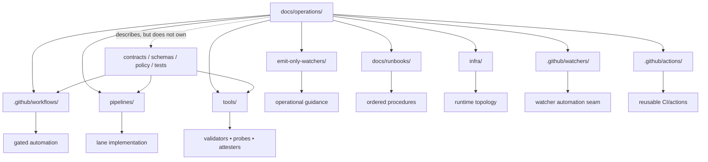

<!-- [KFM_META_BLOCK_V2]
doc_id: kfm://doc/NEEDS-VERIFICATION-UUID
title: operations
type: standard
version: v1
status: draft
owners: @bartytime4life
created: YYYY-MM-DD
updated: YYYY-MM-DD
policy_label: public
related: [docs/README.md, docs/runbooks/README.md, docs/operations/emit-only-watchers/README.md, .github/README.md, .github/workflows/README.md, .github/watchers/README.md, .github/actions/README.md, infra/README.md, pipelines/README.md]
tags: [kfm, operations, docs, trust, execution]
notes: [doc_id and dates need verification before merge; current public-main inventory was used for path grounding]
[/KFM_META_BLOCK_V2] -->

# operations

Governed operational documentation for KFM runtime posture, watcher behavior, promotion/rollback coordination, and other trust-significant execution boundaries.

> **Status:** experimental  
> **Owners:** `@bartytime4life`  
> **Repo fit:** `docs/operations/README.md`  
> **Upstream:** [`../README.md`](../README.md) · [`../../README.md`](../../README.md)  
> **Adjacent:** [`../runbooks/README.md`](../runbooks/README.md) · [`../../infra/README.md`](../../infra/README.md) · [`../../.github/README.md`](../../.github/README.md) · [`../../.github/workflows/README.md`](../../.github/workflows/README.md) · [`../../.github/watchers/README.md`](../../.github/watchers/README.md) · [`../../.github/actions/README.md`](../../.github/actions/README.md) · [`../../pipelines/README.md`](../../pipelines/README.md) · [`../../tools/README.md`](../../tools/README.md) · [`../../contracts/README.md`](../../contracts/README.md) · [`../../policy/README.md`](../../policy/README.md) · [`../../tests/README.md`](../../tests/README.md) · [`../../data/README.md`](../../data/README.md)


**Quick jumps:** [Scope](#scope) · [Repo fit](#repo-fit) · [Inputs](#accepted-inputs) · [Exclusions](#exclusions) · [Current public inventory](#current-public-inventory) · [Directory tree](#directory-tree) · [Quickstart](#quickstart) · [Usage](#usage) · [Diagram](#diagram) · [Task list](#task-list) · [FAQ](#faq) · [Appendix](#appendix)

> [!IMPORTANT]
> Treat this directory as a **documentation control surface**, not as the quiet storage location for machine truth. Contracts, policy bundles, release evidence, receipts, schemas, manifests, and runtime code should stay in their owning lanes unless a human-readable operational companion is genuinely needed here.

> [!NOTE]
> This README uses KFM truth labels inline where they help:
> **CONFIRMED**, **INFERRED**, **PROPOSED**, **UNKNOWN**, and **NEEDS VERIFICATION**.

> [!CAUTION]
> A path belonging to operations does **not** by itself prove a live workflow, scheduler, watcher, or runtime. Public-tree documentation, checked-in automation, and observed runtime behavior are different evidence classes.

---

## Scope

`docs/operations/` is the human-readable operations layer for KFM material that is:

- broader than a single incident or step-by-step procedure,
- narrower than whole-system doctrine,
- adjacent to runtime truth, promotion, correction, rollback, watcher behavior, and trust-preserving execution,
- worth keeping visible to maintainers without pretending to be the machine-enforced source of truth.

In practice, this directory should explain **how operational behavior is meant to hang together** across watcher lanes, promotion surfaces, review-bearing execution paths, and correction-aware release handling.

[Back to top](#operations)

---

## Repo fit

### Boundary map

| Surface | Primary job | Keep here | Do not move here |
|---|---|---|---|
| `docs/operations/` | Cross-lane operational guidance and coordination docs | watcher posture, evidence-packaging notes, operational registries, release/correction coordination docs | runtime code, contracts, schemas, policy bundles, deployment manifests |
| `docs/runbooks/` | Ordered operator procedures | incident steps, manual rollback steps, promotion steps, restore drills | broad lane doctrine or directory-wide topology |
| `infra/` | Runtime topology and bring-up | Compose/systemd/Kubernetes/Terraform, monitoring, backup, rollout surfaces | human-readable operational overview in place of actual infra artifacts |
| `.github/workflows/` | CI/CD and gated automation | workflow definitions, gate sequencing, promotion mechanics | prose doctrine standing in for real checks |
| `.github/watchers/` | Watcher automation surface | watcher implementations or watcher-specific automation scaffolds | repo-wide watcher doctrine without implementation context |
| `pipelines/` | Lane implementation | fetch / normalize / validate / emit code paths | operations-wide coordination docs |
| `tools/` | Reusable helpers | validators, probes, attesters, diffs, catalog QA, CI helpers | lane ownership or product runtime logic |
| `contracts/`, `schemas/`, `policy/`, `tests/` | Machine-checkable truth | schemas, fixtures, decision grammar, executable validation | duplicated prose mirrors unless review value is clear |

### Why this directory exists even with `runbooks/` and `infra/`

Operations docs fill the middle layer:

- **Doctrine** says what KFM must preserve.
- **Operations** explains how trust-significant execution surfaces relate.
- **Runbooks** say what to do in order.
- **Infra / workflows / pipelines** carry the versioned implementation.

That separation keeps the trust membrane readable **without** turning prose into fake implementation evidence.

[Back to top](#operations)

---

## Accepted inputs

Material that belongs here usually has most of these traits:

- It explains a trust-significant execution surface that spans multiple files or lanes.
- It coordinates humans and systems around promotion, rollback, correction, watcher behavior, runtime safety, or evidence-bearing publication.
- It is more stable than a one-off incident note, but more operational than a doctrine manual.
- It helps reviewers understand how adjacent code, policy, receipts, or release artifacts are expected to work together.
- It can be linked from sibling lanes without duplicating their machine-owned truth.

Typical examples:

- watcher-family overview docs,
- evidence-packaging notes for operational outputs,
- release or correction coordination docs,
- runtime trust-surface explanations,
- lane registries that are operationally useful to humans,
- execution sequencing notes that sit above a single runbook.

---

## Exclusions

| This does **not** belong here | Put it here instead |
|---|---|
| Step-by-step human procedures | [`../runbooks/`](../runbooks/) |
| Contracts, schemas, fixtures, examples for validation | [`../../contracts/`](../../contracts/) · [`../../schemas/`](../../schemas/) · [`../../tests/`](../../tests/) |
| Executable policy and decision logic | [`../../policy/`](../../policy/) |
| Runtime manifests, deployment overlays, host topology | [`../../infra/`](../../infra/) |
| Pipeline implementation and lane executors | [`../../pipelines/`](../../pipelines/) |
| Reusable validators, attesters, probes, CI helpers | [`../../tools/`](../../tools/) |
| General doctrine, master architecture, governance charters | [`../architecture/`](../architecture/) · [`../governance/`](../governance/) · [`../standards/`](../standards/) |
| Release proof packs, receipts, bundles, publishable artifacts | owning release/data lane; link here only when an operations explanation adds value |

> [!IMPORTANT]
> `docs/operations/` may **describe** proof objects such as `SourceDescriptor`, `DecisionEnvelope`, `EvidenceBundle`, `ReleaseManifest`, `CorrectionNotice`, or `RuntimeResponseEnvelope`; it should not quietly replace their canonical machine home.

[Back to top](#operations)

---

## Current public deltas

The public-main snapshot that grounded this README yields a narrow, useful conclusion:

| Public-main observation | Why it matters | Status |
|---|---|---|
| `docs/operations/README.md` was effectively empty when this revision was prepared | the parent lane lacked a usable directory contract | **CONFIRMED** |
| `docs/operations/` currently exposes one checked-in child family: `emit-only-watchers/` | this lane is real, but still narrow in visible scope | **CONFIRMED** |
| `emit-only-watchers/` already carries governance, registry, next-steps, evidence-packaging, and schema-stub docs | the parent README should route and clarify, not overwrite local substance | **CONFIRMED** |
| `.github/workflows/` is README-only on current public main | do not imply mounted workflow YAML from prose alone | **CONFIRMED** |
| `.github/watchers/` is README-only on current public main | watcher runtime depth remains bounded in visible public-tree evidence | **CONFIRMED** |
| `.github/actions/` is present but placeholder-heavy | action seams are visible, but full implemented action inventory should not be overstated | **CONFIRMED** |

---

## Current public inventory

### Child lane currently visible

| Path | Role in the current tree | Status |
|---|---|---|
| [`./emit-only-watchers/README.md`](./emit-only-watchers/README.md) | parent explainer for the watcher-family concept | **CONFIRMED** |
| [`./emit-only-watchers/NEXT_STEPS.md`](./emit-only-watchers/NEXT_STEPS.md) | implementation order and thin-slice sequencing notes | **CONFIRMED** |
| [`./emit-only-watchers/REGISTRY.md`](./emit-only-watchers/REGISTRY.md) | proposed registry structure for watcher inputs and outputs | **CONFIRMED** |
| [`./emit-only-watchers/GOVERNANCE_NOTES.md`](./emit-only-watchers/GOVERNANCE_NOTES.md) | refusal, correction, review, and exposure rules | **CONFIRMED** |
| [`./emit-only-watchers/EVIDENCE_PACKAGING.md`](./emit-only-watchers/EVIDENCE_PACKAGING.md) | human-readable expectations for watcher evidence payloads | **CONFIRMED** |
| [`./emit-only-watchers/SCHEMA_STUBS.md`](./emit-only-watchers/SCHEMA_STUBS.md) | starter schema thoughts and related structure notes | **CONFIRMED** |

### Adjacent surfaces worth reading with this directory

| Path | Why it is adjacent |
|---|---|
| [`../runbooks/README.md`](../runbooks/README.md) | operator procedures and execution drills |
| [`../../infra/README.md`](../../infra/README.md) | deployment, bring-up, observability, restore, and rollback topology |
| [`../../.github/workflows/README.md`](../../.github/workflows/README.md) | workflow inventory boundary and historical/public-main distinction |
| [`../../.github/watchers/README.md`](../../.github/watchers/README.md) | watcher automation boundary |
| [`../../.github/actions/README.md`](../../.github/actions/README.md) | reusable CI/action seam |
| [`../../pipelines/README.md`](../../pipelines/README.md) | implementation lanes that operational docs often describe from above |
| [`../../tools/README.md`](../../tools/README.md) | validation, attestation, diff, probe, and CI helper surface |

[Back to top](#operations)

---

## Directory tree

### Current public snapshot

```text
docs/
└── operations/
    ├── README.md
    └── emit-only-watchers/
        ├── README.md
        ├── EVIDENCE_PACKAGING.md
        ├── GOVERNANCE_NOTES.md
        ├── NEXT_STEPS.md
        ├── REGISTRY.md
        └── SCHEMA_STUBS.md
```

<details>
<summary><strong>Proposed parent-lane growth rule</strong></summary>

Future siblings should be added only when they satisfy all of the following:

1. They document an operational concern broader than one runbook and narrower than repo-wide doctrine.
2. They have a clear upstream/downstream relationship to runtime, release, correction, or watcher behavior.
3. They name the trust-significant objects they depend on.
4. They keep machine-owned truth in the owning surface.
5. They do not imply mounted implementation that has not been verified.

A reasonable starter shape is:

```text
docs/operations/<lane>/
├── README.md
├── NEXT_STEPS.md              # only if a staged implementation sequence exists
├── GOVERNANCE_NOTES.md        # only if the lane has distinct refusal/review/correction logic
├── REGISTRY.md                # only if a human-readable operational registry adds value
└── EVIDENCE_PACKAGING.md      # only if outward artifacts need explicit packaging guidance
```

</details>

[Back to top](#operations)

---

## Quickstart

Use this directory when you need to answer one of these questions quickly:

- *Where is the human-readable operational contract for this lane?*
- *Is the current visible evidence documentation-only, implementation-backed, or mixed?*
- *What is the nearest sibling surface for runbooks, workflows, infra, policy, contracts, tests, or tools?*

### Fast inspection commands

```bash
# inspect the current operations surface
ls -la docs/operations
find docs/operations -maxdepth 2 -type f | sort

# read the current child lane in dependency order
sed -n '1,220p' docs/operations/emit-only-watchers/README.md
sed -n '1,220p' docs/operations/emit-only-watchers/GOVERNANCE_NOTES.md
sed -n '1,220p' docs/operations/emit-only-watchers/NEXT_STEPS.md
sed -n '1,220p' docs/operations/emit-only-watchers/REGISTRY.md

# inspect adjacent execution surfaces
sed -n '1,220p' docs/runbooks/README.md
sed -n '1,220p' infra/README.md
sed -n '1,220p' .github/workflows/README.md
sed -n '1,220p' .github/watchers/README.md
sed -n '1,220p' .github/actions/README.md
sed -n '1,220p' pipelines/README.md
sed -n '1,220p' tools/README.md
```

### Reading order

1. Start here for lane boundaries.
2. Move to the child operations lane you actually care about.
3. Jump sideways to `runbooks/` for ordered procedures.
4. Jump downward to `infra/`, `.github/workflows/`, `pipelines/`, or `tools/` for implementation and automation surfaces.
5. Jump upward to `architecture/`, `governance/`, or `standards/` when a local operational question becomes doctrinal.

[Back to top](#operations)

---

## Usage

### Use `docs/operations/` when you are writing for maintainers who need to understand:

- how a trust-significant execution lane fits the repo,
- what the lane owns and does not own,
- how watcher or release behavior should remain evidence-first,
- what adjacent surfaces must be consulted before a change becomes publishable,
- what must stay visible when the system denies, abstains, quarantines, rolls back, or corrects.

### Do **not** use `docs/operations/` as:

- a substitute for release evidence,
- a substitute for contract examples or schemas,
- a substitute for actual CI/workflow inventory,
- a substitute for runtime implementation proof,
- a place to log likely future operational ideas as though they already exist.

### Admission test for a new page under this directory

A new document is a good fit here when the answer to both questions is “yes”:

1. Does this page explain **trust-significant operational behavior** that spans more than one concrete artifact?
2. Would putting the page in `runbooks/`, `infra/`, `pipelines/`, `tools/`, `contracts/`, or `policy/` make the owning boundary less clear?

If either answer is “no,” the page probably belongs elsewhere.

---

## Diagram


```mermaid
flowchart TD
    A[docs/operations/] --> B[emit-only-watchers/]
    A --> C[docs/runbooks/]
    A --> D[infra/]
    A --> E[.github/workflows/]
    A --> F[.github/watchers/]
    A --> G[.github/actions/]
    A --> H[pipelines/]
    A --> I[tools/]

    B --> J[operational guidance]
    C --> K[ordered procedures]
    D --> L[runtime topology]
    E --> M[gated automation]
    F --> N[watcher automation seam]
    G --> O[reusable CI/actions]
    H --> P[lane implementation]
    I --> Q[validators • probes • attesters]

    R[contracts / schemas / policy / tests] --> E
    R --> H
    R --> I
    A -. describes, but does not own .-> R
```

### Reading the diagram

- `docs/operations/` sits **between** doctrine and implementation.
- It describes how trust-significant execution surfaces relate.
- It does **not** replace the machine-owned surfaces that actually validate, decide, publish, or deny.

[Back to top](#operations)

---

## Operational object families

These object families are part of the KFM operating model and are worth naming here because operations docs often need to explain how they hang together.

| Object family | Why operations docs mention it | Canonical machine home | Posture |
|---|---|---|---|
| `SourceDescriptor` | intake identity, rights posture, cadence, validation plan | contracts / schemas / ingest lanes | **CONFIRMED doctrine** · exact checked-in path **NEEDS VERIFICATION** |
| `ValidationReport` | quarantine, failure, or pass conditions during intake/build | tests / validators / ingest or build lanes | **CONFIRMED doctrine** · exact checked-in path **NEEDS VERIFICATION** |
| `DecisionEnvelope` | machine-readable policy result and obligations | policy / contracts / review-bearing lanes | **CONFIRMED doctrine** · exact checked-in path **NEEDS VERIFICATION** |
| `EvidenceBundle` | runtime support package for a claim, export, story, or answer | runtime / contracts / data or release surfaces | **CONFIRMED doctrine** · exact checked-in path **NEEDS VERIFICATION** |
| `ReleaseManifest` / `ReleaseProofPack` | publishable release scope, docs/accessibility gates, rollback posture | release / data / policy / CI surfaces | **CONFIRMED doctrine** · mounted example **UNKNOWN** |
| `CorrectionNotice` | visible supersession, withdrawal, narrowing, or rebuild linkage | release / correction / docs / data linkage | **CONFIRMED doctrine** · mounted example **UNKNOWN** |
| `RuntimeResponseEnvelope` | accountable outward runtime outcome | runtime / contracts / API surfaces | **CONFIRMED doctrine** · mounted example **UNKNOWN** |

> [!NOTE]
> Operations docs should explain how these objects affect behavior at the directory or lane level. They should not become the quiet canonical registry for those objects.

---

## Task list

### For this directory

- [ ] Keep **current verified inventory** separate from **proposed growth**.
- [ ] Link operational docs outward to the real owning surfaces.
- [ ] Name trust, review, correction, rollback, and denial behavior where relevant.
- [ ] Avoid free-floating “ops” prose with no clear upstream/downstream path.
- [ ] Keep watcher or promotion language proportional to verified implementation evidence.
- [ ] Add diagrams only when they clarify real structure.
- [ ] Preserve local lane substance instead of flattening everything into a parent README.

### For any new child lane

- [ ] States its purpose in one line.
- [ ] Declares accepted inputs and exclusions.
- [ ] Names its upstream and downstream surfaces.
- [ ] Distinguishes **CONFIRMED** from **PROPOSED** behavior.
- [ ] Names its evidence-bearing or decision-bearing objects.
- [ ] Keeps contracts, policy, code, and manifests in owning lanes.
- [ ] Includes at least one compact diagram or table that materially improves scanning.

### Definition of done

An operations-lane doc is complete when:

- maintainers can tell what belongs there,
- adjacent boundaries are clearer after reading it,
- no implementation maturity is implied beyond the evidence,
- negative outcomes and correction posture are visible where they matter,
- and the page helps reviewers move from prose to the real owning artifacts without confusion.

[Back to top](#operations)

---

## FAQ

### Is this the place for incident response steps?

No. Put ordered procedures in [`../runbooks/`](../runbooks/). `docs/operations/` may explain *why* a runbook family exists, but the step list belongs in the runbook surface.

### Is this the place for deployment instructions or manifests?

No. Put runtime topology, deployment overlays, host bring-up, and observability wiring in [`../../infra/`](../../infra/).

### If a watcher lane exists only as docs, can this README call it implemented?

No. Documentation can prove intent, vocabulary, and design pressure. It does not by itself prove mounted automation or runtime depth.

### Can this directory own release receipts, proof packs, or policy bundles?

No. It can explain how they are supposed to interact, but the canonical artifacts belong in the release, data, contract, policy, CI, or runtime surfaces that actually produce and validate them.

### Why keep both `operations/` and `.github/workflows/` documentation?

Because they answer different questions:

- `operations/` explains the human-readable operating model.
- `.github/workflows/` explains or contains automation sequencing.
- Neither should silently stand in for the other.

### Why is the current tree described so cautiously?

Because KFM’s own doctrine prefers visible uncertainty over persuasive overclaiming. Public-tree documentation, checked-in YAML, and observed runtime behavior are not the same evidence class.

[Back to top](#operations)

---

## Appendix

<details>
<summary><strong>Appendix A — lane admission checklist</strong></summary>

Use this before creating a new subdirectory under `docs/operations/`:

| Question | Why it matters |
|---|---|
| Does this lane explain a trust-significant operational surface? | prevents generic “ops” sprawl |
| Is it broader than a single runbook? | otherwise use `docs/runbooks/` |
| Is it narrower than whole-repo doctrine? | otherwise use `docs/architecture/`, `docs/governance/`, or `docs/standards/` |
| Does it have real upstream/downstream neighbors? | keeps the page native to the repo |
| Does it name its machine-owned companions? | prevents prose from replacing contracts, policy, or code |
| Can it distinguish current fact from future shape? | preserves KFM truth posture |

</details>

<details>
<summary><strong>Appendix B — compact authoring template for new child-lane READMEs</strong></summary>

```md
# <lane-name>

One-line purpose.

> **Status:** experimental|active|stable|deprecated  
> **Owners:** ...  
> **Repo fit:** ...  
> **Quick jumps:** ...

## Scope
## Repo fit
## Accepted inputs
## Exclusions
## Current inventory
## Directory tree
## Quickstart
## Usage
## Diagram
## Task list
## FAQ
```

</details>

<details>
<summary><strong>Appendix C — authoring guardrails for this directory</strong></summary>

- Prefer short, decision-useful paragraphs over broad operational essaying.
- Keep path claims specific and reviewable.
- Mark speculative structure as **PROPOSED**.
- When a child lane already has stronger local substance, route to it instead of rewording it flatly.
- Do not use this directory as a backlog dump.
- When a change affects trust posture, evidence resolution, or correction behavior, say so explicitly.

</details>

[Back to top](#operations)
