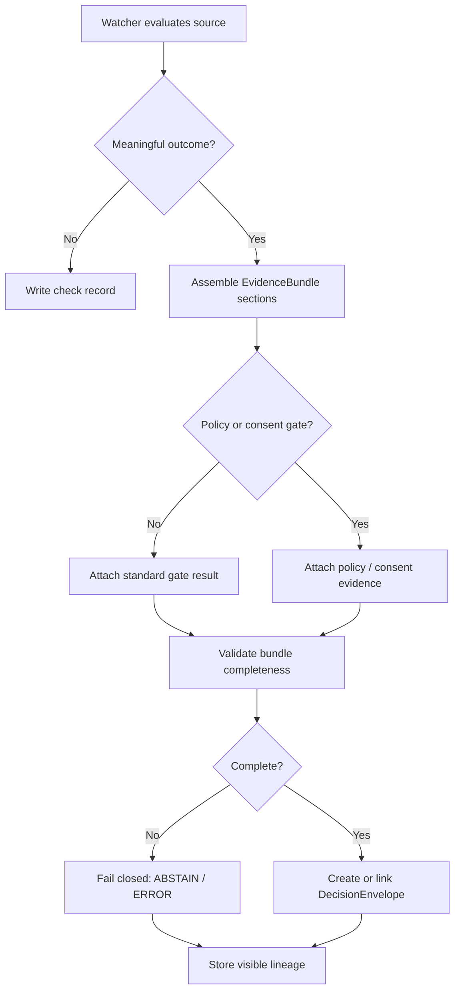

<!-- FILE: docs/operations/emit-only-watchers/EVIDENCE_PACKAGING.md -->

<!--
doc_id: NEEDS VERIFICATION
title: Emit-Only Watchers Evidence Packaging
type: standard
version: v1
status: draft
owners: [@bartytime4life, NEEDS VERIFICATION]
created: 2026-04-01
updated: 2026-04-01
policy_label: restricted
related: [
  "docs/governance/ROOT_GOVERNANCE.md",
  "docs/governance/ETHICS.md",
  "docs/operations/emit-only-watchers/README.md",
  "docs/operations/emit-only-watchers/NEXT_STEPS.md",
  "docs/operations/emit-only-watchers/REGISTRY.md",
  "NEEDS VERIFICATION: DecisionEnvelope contract path",
  "NEEDS VERIFICATION: EvidenceRef contract path",
  "NEEDS VERIFICATION: EvidenceBundle contract path",
  "NEEDS VERIFICATION: CorrectionNotice contract path"
]
tags: [kfm, operations, watchers, evidence, provenance, packaging, governance, lineage]
notes: [
  "Path is PROPOSED and NEEDS VERIFICATION against mounted repo.",
  "This document defines the minimum evidence payload rules for watcher emits.",
  "All contract shapes here are PROPOSED unless verified in-repo."
]
-->

# Emit-Only Watchers Evidence Packaging

**Purpose:** define the minimum evidence package that every governed watcher emit must carry so that change claims remain inspectable, reproducible, and trust-visible.

| Status | Owners | Quick fit |
|---|---|---|
|     | @bartytime4life, NEEDS VERIFICATION | Minimum payload rules between watcher evaluation and DecisionEnvelope issuance |

**Repo fit:** proposed operations standard for watcher evidence payload construction.  
**Accepted inputs:** dataset registry entries, prior accepted snapshots, new observations, threshold evaluations, policy class, consent state where applicable, source descriptors, hash outputs.  
**Exclusions:** not a release manifest, not a public presentation layer, not a substitute for raw source retention policy, not a claim of live repo enforcement.

**Quick jumps:** [Scope](#scope) · [Repo fit](#repo-fit) · [What must be packaged](#what-must-be-packaged) · [Minimum bundle](#minimum-bundle) · [Trigger-specific additions](#trigger-specific-additions) · [Control flow](#control-flow) · [Schemas](#proposed-contract-shapes) · [Validation rules](#validation-rules) · [Examples](#examples)

---

## Scope

A watcher emit without packaged evidence is only an assertion.

This document defines the minimum proof surface required for watcher outputs so that downstream systems and human reviewers can answer:

- what source was checked,
- what prior accepted state was used,
- what changed,
- why the change mattered,
- whether policy or consent gates were applied,
- what finite outcome was reached,
- how a later correction would preserve lineage.

The standard here is **not** “capture everything.”  
The standard is **capture enough to resolve consequential claims without guesswork**.

---

## Repo fit

| Component | Role | Status |
|---|---|---|
| `README.md` | overview of watcher behavior | **PROPOSED** |
| `NEXT_STEPS.md` | implementation order | **PROPOSED** |
| `REGISTRY.md` | dataset/threshold/policy inputs | **PROPOSED** |
| `EVIDENCE_PACKAGING.md` | minimum proof payload rules | **PROPOSED** |

This file should sit at the seam between watcher execution and downstream decision/correction/release contracts.

---

## Inputs

| Input | Why it is needed | Status |
|---|---|---|
| Dataset registry entry | identifies authority class, policy class, watch strategy | **PROPOSED** |
| Prior accepted snapshot | establishes trusted comparison baseline | **PROPOSED** |
| Current observation | supplies fresh source state | **PROPOSED** |
| Hash outputs | prove structural and/or content drift | **PROPOSED** |
| Threshold evaluation | proves significance, not just difference | **PROPOSED** |
| Consent gate result | required for sensitive overlays | **PROPOSED** |
| Policy gate result | proves handling/exposure path | **PROPOSED** |
| Runtime metadata | proves when and how the watcher ran | **PROPOSED** |

---

## Exclusions

Evidence packaging does **not** itself decide publication, human consequence, or map exposure. It also does **not** replace:

- source retention policy,
- catalog promotion logic,
- release proof packs,
- interactive trust drawers,
- public-safe summarization or generalization logic.

It is the **minimum machine-auditable proof layer**.

---

## Why this document exists

Watcher systems tend to fail trust in one of four ways:

1. they emit but cannot reconstruct why,
2. they compare against the wrong baseline,
3. they collapse provisional, modeled, and authoritative states,
4. they silently discard denied or abstained evaluations.

This packaging standard exists to prevent those failures.

> [!IMPORTANT]
> A non-emitted check may still need a record.
>
> “No emit” is a runtime result.  
> “No evidence retained” is a trust failure.

---

## What must be packaged

Every watcher evaluation should produce either:

- a **check record** (for no-change / no-emit cases), or
- an **EvidenceBundle** suitable for a `DecisionEnvelope`.

The heavier packaging requirement applies when a watcher reaches:

- `SCHEMA_CHANGE`
- `DOMAIN_DELTA`
- `CONSENT_EVENT`
- `ABSTAIN`
- `DENY`
- `ERROR`

Visible negative outcomes are still evidence-bearing outcomes.

---

## Minimum bundle

Every emitted watcher decision should be resolvable to an evidence bundle with these minimum sections.

| Section | Required | Purpose |
|---|---|---|
| Source identity | yes | prove what was checked |
| Observation metadata | yes | prove when/how it was checked |
| Prior accepted baseline | yes | prove comparison anchor |
| Comparison results | yes | prove difference or non-difference |
| Trigger reasoning | yes | prove why the watcher emitted |
| Policy/consent evaluation | conditional | prove handling gates |
| Outcome metadata | yes | prove finite result |
| Lineage links | yes | support correction/supersession |
| Human-readable summary | yes | trust-visible explanation |
| Machine-readable payload | yes | deterministic downstream use |

---

## Required evidence sections

### 1) Source identity

Every bundle must identify the checked source unambiguously.

Required concepts:

- `dataset_id`
- `domain`
- `authority_class`
- `upstream_locator`
- `source_descriptor_hash` or equivalent descriptor identity
- `coverage_scope` where relevant

### 2) Observation metadata

Every bundle must state:

- `observed_at`
- `watcher_run_id`
- `watcher_version` or equivalent runtime identifier
- `normalization_version` if source shaping is applied
- `timezone` or timestamp standard
- `input_materialization_ref` if raw fetches are stored separately

### 3) Prior accepted baseline

Every bundle must identify the trusted comparison target:

- prior `accepted_snapshot_id`
- prior `accepted_at`
- prior `spec_hash`
- prior `content_hash` if used

This prevents accidental comparison against “last seen” rather than “last accepted.”

### 4) Comparison results

Every bundle must show what was compared and the outcome:

- new `spec_hash`
- new `content_hash` if used
- changed fields or change summary
- threshold metric/value if applicable
- masking rules or exclusion notes if applicable

### 5) Trigger reasoning

Every emit must state:

- `trigger_type`
- `reason_code`
- `reason_summary`

Examples:
- `spec_hash_changed`
- `pm25_threshold_crossed`
- `consent_revoked`
- `insufficient_evidence_for_emit`
- `policy_blocked_precise_exposure`

### 6) Policy and consent evaluation

Conditional, but mandatory when relevant:

- `policy_class`
- `publication_mode`
- `requires_human_review`
- `consent_gate_required`
- `consent_status`
- `revocation_status`
- `fail_closed_applied`

### 7) Outcome metadata

Every bundle must carry a finite result:

- `outcome`
- `decision_id` or bundle-linked future decision identifier
- `emit_status`
- `created_at`

### 8) Lineage links

Every bundle must support later correction:

- `supersedes`
- `replaces`
- `related_decision_ids`
- `correction_chain_root` where applicable

### 9) Human-readable summary

A short trust-visible explanation suitable for operator and reviewer inspection.

### 10) Machine-readable payload

A deterministic serialization used by downstream validators, CI, or release gates.

---

## Packaging levels

### Level 0 — Check record only

Use when:
- no meaningful change occurred,
- no emit is warranted,
- no policy/consent conflict arose,
- no operational failure occurred.

Carries:
- source identity
- observed_at
- prior accepted snapshot id
- comparison status
- no-emit reason

### Level 1 — Standard emit bundle

Use when:
- schema change,
- threshold crossing,
- non-sensitive domain delta,
- no heightened review or consent burden beyond ordinary policy checks.

### Level 2 — Sensitive or blocked bundle

Use when:
- consent gating applies,
- policy denies publication,
- exact exposure is blocked,
- data class is restricted/withheld,
- human review is mandatory.

### Level 3 — Error or correction bundle

Use when:
- watcher failed operationally,
- upstream source was incomplete or corrupted,
- a prior decision is withdrawn, narrowed, or replaced.

---

## Trigger-specific additions

### Schema change

Additional required evidence:

- previous schema signature
- current schema signature
- field-level difference summary or structural delta summary
- migration risk note if known

### Domain delta

Additional required evidence:

- metric name
- observed value
- threshold value
- comparison operator
- evaluation window
- masking/exclusion notes

### Consent event

Additional required evidence:

- consent token or consent token hash reference
- revocation state
- allowed scope
- reason the event changes exposure eligibility

### Abstain

Additional required evidence:

- insufficiency reason
- missing evidence list
- fail-closed rule applied

### Deny

Additional required evidence:

- policy rule or consent rule causing block
- whether alternative generalized publication remains possible
- whether human review is required for override

### Error

Additional required evidence:

- failing stage
- error class
- whether partial evidence was preserved
- whether baseline remained unchanged

---

## Control flow



---

## Proposed contract shapes

### EvidenceRef

```json
{
  "evidence_ref": "evidence://bundle/uuid",
  "bundle_id": "uuid",
  "kind": "watcher_evidence_bundle",
  "created_at": "2026-04-01T00:00:00Z"
}
```

### EvidenceBundle

```json
{
  "bundle_id": "uuid",
  "bundle_kind": "watcher_evidence_bundle",
  "dataset": {
    "dataset_id": "soils.ssurgo",
    "domain": "soils",
    "authority_class": "authoritative",
    "upstream_locator": "NEEDS VERIFICATION",
    "source_descriptor_hash": "sha256:..."
  },
  "observation": {
    "observed_at": "2026-04-01T00:00:00Z",
    "watcher_run_id": "uuid",
    "watcher_version": "NEEDS VERIFICATION",
    "normalization_version": "NEEDS VERIFICATION"
  },
  "baseline": {
    "accepted_snapshot_id": "uuid",
    "accepted_at": "2026-03-20T00:00:00Z",
    "spec_hash": "sha256:old",
    "content_hash": "sha256:old-content"
  },
  "comparison": {
    "new_spec_hash": "sha256:new",
    "new_content_hash": "sha256:new-content",
    "change_summary": ["field_x changed", "field_y added"]
  },
  "trigger": {
    "trigger_type": "SCHEMA_CHANGE",
    "reason_code": "spec_hash_changed",
    "reason_summary": "Source schema signature changed from accepted baseline."
  },
  "gates": {
    "policy_class": "public",
    "publication_mode": "public",
    "requires_human_review": false
  },
  "outcome": {
    "outcome": "ANSWER",
    "emit_status": "emitted",
    "created_at": "2026-04-01T00:00:00Z"
  },
  "lineage": {
    "supersedes": null,
    "related_decision_ids": []
  },
  "human_summary": "SSURGO watcher emitted because the accepted schema signature changed and the comparison is backed by source and baseline hashes."
}
```

### CheckRecord

```json
{
  "check_id": "uuid",
  "dataset_id": "hydrology.nwis.station_meta",
  "observed_at": "2026-04-01T00:00:00Z",
  "accepted_snapshot_id": "uuid",
  "comparison_status": "no_meaningful_change",
  "emit_status": "not_emitted",
  "reason_summary": "Hashes matched accepted baseline and no thresholds were triggered."
}
```

### Sensitive/blocked bundle

```json
{
  "bundle_id": "uuid",
  "bundle_kind": "watcher_evidence_bundle",
  "dataset": {
    "dataset_id": "genealogy.overlay.v1",
    "domain": "genealogy",
    "authority_class": "derived",
    "upstream_locator": "NEEDS VERIFICATION"
  },
  "trigger": {
    "trigger_type": "CONSENT_EVENT",
    "reason_code": "consent_revoked",
    "reason_summary": "Overlay eligibility changed because revocation state no longer permits exposure."
  },
  "gates": {
    "policy_class": "restricted",
    "publication_mode": "steward_only",
    "requires_human_review": true,
    "consent_gate_required": true,
    "consent_status": "revoked",
    "fail_closed_applied": true
  },
  "outcome": {
    "outcome": "DENY",
    "emit_status": "emitted",
    "created_at": "2026-04-01T00:00:00Z"
  },
  "human_summary": "Genealogy overlay emit was denied because consent state is revoked and the overlay is fail-closed under restricted policy."
}
```

---

## Human-readable summary requirements

Every emitted bundle should include a short explanation that answers:

1. what changed,
2. why it mattered,
3. whether any gate affected the result.

Keep it:

- short,
- plain-language,
- non-promotional,
- explicit about uncertainty when present.

### Good example

> Air watcher emitted because the 7-day PM2.5 change exceeded the configured threshold, but the source remains provisional and should not be treated as validated regulatory truth.

### Bad example

> Major air quality event detected and confirmed across the region.

Why bad:
- overstates certainty,
- hides source quality class,
- compresses threshold logic into unsupported narrative language.

---

## Machine-readable requirements

Machine payloads should be:

- deterministic,
- schema-validatable,
- complete enough for CI replay checks,
- explicit about missing values,
- explicit about outcome and gate state.

Do not rely on free-text summaries as the only proof surface.

---

## Validation rules

### Bundle completeness rules

- every emitted bundle must have a unique `bundle_id`
- every emitted bundle must include `dataset`, `observation`, `baseline` or explicit reason baseline is unavailable, `trigger`, `outcome`, and `human_summary`
- every emitted bundle must include finite `outcome`
- every emitted bundle must include at least one reproducible comparison artifact:
  - hash comparison,
  - threshold evaluation,
  - consent/policy state comparison,
  - or explicit operational error metadata

### Trust rules

- provisional sources must be labeled as provisional
- modeled or derived sources must not be labeled authoritative
- denied and abstained outcomes must not be silently dropped
- unknown consent state on restricted overlays must fail closed
- corrections must preserve visible lineage to the original decision/bundle

### CI-oriented rules

- unchanged fixtures should generate check records, not emit bundles
- emitted fixtures should fail validation if `human_summary` is missing
- sensitive fixtures should fail validation if gate evidence is missing
- error fixtures should fail validation if failing stage is absent

---

## Storage and retention posture

**PROPOSED guidance:**

- keep bundle payloads immutable once written,
- use correction records rather than mutation when interpretation changes,
- store heavy raw artifacts separately if necessary,
- keep resolvable references stable even if backing storage changes,
- retain denied and abstained evidence long enough to preserve auditability.

Exact retention periods are **NEEDS VERIFICATION**.

---

## Examples

### Example 1 — No emit, check record only

```yaml
check_id: uuid
dataset_id: soils.ssurgo
observed_at: "2026-04-01T00:00:00Z"
accepted_snapshot_id: uuid
comparison_status: no_meaningful_change
emit_status: not_emitted
reason_summary: Accepted spec and content hashes matched current observation.
```

### Example 2 — Standard schema-change bundle

```yaml
bundle_id: uuid
bundle_kind: watcher_evidence_bundle
dataset:
  dataset_id: soils.ssurgo
  domain: soils
  authority_class: authoritative
observation:
  observed_at: "2026-04-01T00:00:00Z"
baseline:
  accepted_snapshot_id: uuid
  spec_hash: sha256:old
comparison:
  new_spec_hash: sha256:new
  change_summary:
    - component schema changed
trigger:
  trigger_type: SCHEMA_CHANGE
  reason_code: spec_hash_changed
gates:
  policy_class: public
outcome:
  outcome: ANSWER
  emit_status: emitted
human_summary: SSURGO schema changed relative to the accepted baseline, so a governed emit was created with source and baseline hashes attached.
```

### Example 3 — Threshold-crossing bundle with provisional caution

```yaml
bundle_id: uuid
dataset:
  dataset_id: air.airnow.pm25
  domain: air
  authority_class: provisional
comparison:
  metric: weekly_change
  observed_value: 12.4
  threshold_value: 10.0
  comparison: gte
trigger:
  trigger_type: DOMAIN_DELTA
  reason_code: pm25_threshold_crossed
gates:
  policy_class: public
outcome:
  outcome: ANSWER
human_summary: AirNow PM2.5 crossed the configured weekly-change threshold, but the source remains provisional and should not be described as validated regulatory truth.
```

### Example 4 — Consent-denied sensitive bundle

```yaml
bundle_id: uuid
dataset:
  dataset_id: genealogy.overlay.v1
  domain: genealogy
  authority_class: derived
trigger:
  trigger_type: CONSENT_EVENT
  reason_code: consent_revoked
gates:
  policy_class: restricted
  consent_gate_required: true
  consent_status: revoked
  fail_closed_applied: true
outcome:
  outcome: DENY
human_summary: Overlay exposure is blocked because consent is revoked and the restricted policy requires fail-closed handling.
```

---

## Suggested file and data layout

```text
docs/
└── operations/
    └── emit-only-watchers/
        ├── README.md
        ├── NEXT_STEPS.md
        ├── REGISTRY.md
        └── EVIDENCE_PACKAGING.md

ops/
└── watchers/
    ├── evidence/
    │   ├── bundles/
    │   ├── checks/
    │   └── corrections/
    └── snapshots/
```

**Status:** **PROPOSED** and **NEEDS VERIFICATION** against repo reality.

---

## FAQ

### Why require human-readable summaries if the machine payload is complete?
Because KFM trust surfaces should remain inspectable by operators and reviewers without decoding raw internals.

### Why package denied or abstained outcomes?
Because negative outcomes are part of the trust record, not noise to discard.

### Why separate check records from emitted bundles?
Because most checks should stay lightweight, while consequential emits need richer proof packaging.

### Why emphasize prior accepted baseline instead of last observed state?
Because governance should compare against trusted state, not just the most recent poll result.

---

## Truth labels used here

| Label | Meaning |
|---|---|
| **CONFIRMED** | directly supported by visible doctrine or repo evidence |
| **INFERRED** | strongly implied by doctrine, not live-verified as implementation |
| **PROPOSED** | recommended target shape consistent with doctrine |
| **UNKNOWN** | no reliable session evidence |
| **NEEDS VERIFICATION** | paths, owners, schema locations, runtime identifiers, or retention periods require in-repo confirmation |

---

[Back to top](#emit-only-watchers-evidence-packaging)
