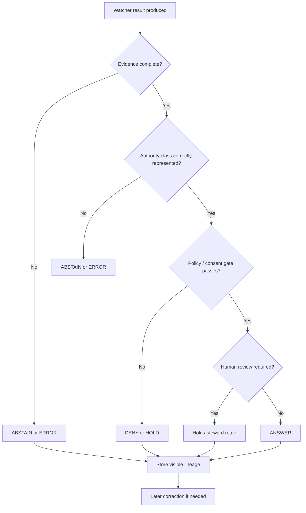

<!-- FILE: docs/operations/emit-only-watchers/GOVERNANCE_NOTES.md -->

<!--
doc_id: NEEDS VERIFICATION
title: Emit-Only Watchers Governance Notes
type: standard
version: v1
status: draft
owners: [@bartytime4life, NEEDS VERIFICATION]
created: 2026-04-01
updated: 2026-04-01
policy_label: restricted
related: [
  "docs/governance/ROOT_GOVERNANCE.md",
  "docs/governance/ETHICS.md",
  "docs/governance/SOVEREIGNTY.md",
  "docs/operations/emit-only-watchers/README.md",
  "docs/operations/emit-only-watchers/NEXT_STEPS.md",
  "docs/operations/emit-only-watchers/REGISTRY.md",
  "docs/operations/emit-only-watchers/EVIDENCE_PACKAGING.md",
  "NEEDS VERIFICATION: DecisionEnvelope contract path",
  "NEEDS VERIFICATION: CorrectionNotice contract path",
  "NEEDS VERIFICATION: EvidenceBundle contract path"
]
tags: [kfm, operations, watchers, governance, ethics, correction, abstain, deny, evidence, trust]
notes: [
  "Path is PROPOSED and NEEDS VERIFICATION against mounted repo.",
  "This document defines governance-side runtime notes for watcher behavior.",
  "All implementation and enforcement details here are PROPOSED unless verified in repo."
]
-->

# Emit-Only Watchers Governance Notes

**Purpose:** define the governance-side rules for watcher behavior so that change detection remains subordinate to evidence, policy, correction lineage, and human consequence.

| Status | Owners | Quick fit |
|---|---|---|
|     | @bartytime4life, NEEDS VERIFICATION | Governance companion for watcher runtime, refusal modes, correction, and sensitive-lane handling |

**Repo fit:** proposed governance-facing companion for watcher operations.  
**Accepted inputs:** watcher outputs, evidence bundles, policy classes, consent-state evaluations, correction requests, authority classes, release routing decisions.  
**Exclusions:** not a scheduler spec, not a parser spec, not a public map rendering guide, not a replacement for root governance doctrine.

**Quick jumps:** [Scope](#scope) · [Repo fit](#repo-fit) · [Governing principles](#governing-principles) · [Finite outcomes](#finite-outcomes) · [Refusal and hold behavior](#refusal-and-hold-behavior) · [Correction and lineage](#correction-and-lineage) · [Sensitive lanes](#sensitive-lanes) · [Control flow](#control-flow) · [Examples](#examples)

---

## Scope

Watcher code can tell you that **something changed**.  
Governance has to answer whether that change is:

- evidentially supportable,
- safe to surface,
- correctly classified,
- subordinate to upstream authority,
- suitable for correction if later narrowed or withdrawn.

This document is the governance-side restraint layer for watcher operations.

It exists to prevent the common failure mode where a technically correct detector produces a socially or epistemically incorrect output.

---

## Repo fit

| Component | Role | Status |
|---|---|---|
| `README.md` | operational overview | **PROPOSED** |
| `NEXT_STEPS.md` | implementation sequence | **PROPOSED** |
| `REGISTRY.md` | inputs and configuration | **PROPOSED** |
| `EVIDENCE_PACKAGING.md` | minimum proof payload | **PROPOSED** |
| `GOVERNANCE_NOTES.md` | refusal, correction, exposure, authority, consequence | **PROPOSED** |

---

## Inputs

| Input | Why it matters | Status |
|---|---|---|
| Authority class | prevents derived layers from masquerading as source truth | **INFERRED** |
| Policy class | constrains allowed exposure and publication modes | **INFERRED** |
| EvidenceBundle | allows consequential claims to be resolved | **INFERRED** |
| Trigger type | frames why watcher reached a result | **PROPOSED** |
| Consent state | blocks or narrows sensitive outputs | **PROPOSED** |
| Correction request or upstream revision | preserves visible lineage instead of silent overwrite | **INFERRED** |

---

## Exclusions

These notes do **not** claim:

- that watcher governance is already enforced in code,
- that a given domain is approved for publication,
- that automated reviewer bypass exists,
- that all negative outcomes become public-facing notices,
- that sensitive overlays are currently enabled.

All such claims remain **NEEDS VERIFICATION** unless proven in-repo.

---

## Governing principles

Watcher behavior should be governed by the same posture that applies elsewhere in KFM:

### 1) Evidence before persuasion
No consequential watcher output should outrun its evidence.

### 2) Context before compression
A threshold crossing should not be compressed into a stronger narrative than the data supports.

### 3) Derived stays subordinate
Modeled, derived, or convenience layers must remain visibly subordinate to authoritative truth unless explicitly promoted.

### 4) Stewardship before exposure
When disclosure increases risk or consequence, the watcher path should prefer:
- narrow,
- generalize,
- hold,
- quarantine,
- deny,
- abstain.

### 5) Correction before quiet supersession
Later changes to watcher interpretation must remain visible through lineage, not overwrite.

### 6) Human consequence over automation momentum
The fact that a trigger fired is never enough, by itself, to justify exposure.

---

## Finite outcomes

Watcher governance should preserve a finite runtime vocabulary.

| Outcome | Meaning | Governance posture |
|---|---|---|
| `ANSWER` | evidence and gates support a governed emit | eligible for downstream evaluation |
| `ABSTAIN` | evidence is insufficient, ambiguous, stale, or unsafe to interpret | visible non-assertion |
| `DENY` | policy, consent, or protection rules block the output | visible refusal |
| `ERROR` | operational failure prevented safe evaluation | visible failure; no silent drop |

> [!IMPORTANT]
> “No output” is not an acceptable hidden governance state.
>
> The system should fail calmly but visibly.

---

## When to ANSWER

Use `ANSWER` only when all of the following are true:

- the source identity is known,
- the comparison baseline is the accepted baseline,
- the evidence bundle is complete enough to resolve the claim,
- the trigger logic is valid,
- the authority class is correctly represented,
- no policy or consent gate blocks the outcome,
- no stronger uncertainty label is required.

### Examples of acceptable `ANSWER`
- authoritative soils schema changed and the hash comparison is reproducible
- hydrology station metadata changed and the source remains authoritative
- vegetation threshold crossed with masking-aware comparison and clear derived labeling
- air threshold crossed, with provisional labeling preserved and no false “validated” claim

---

## When to ABSTAIN

Use `ABSTAIN` when the system should explicitly not answer, even if a watcher ran.

Common abstain conditions:

- evidence bundle incomplete
- baseline unavailable or untrusted
- source freshness uncertain
- authority class unclear
- trigger ambiguous
- provisional data present but interpretation would overstate certainty
- comparison invalid because masking, coverage, or source continuity is broken

### Governance meaning of abstain
Abstention is not failure.  
It is a trust-preserving refusal to convert weak evidence into stronger narrative.

### Example abstain cases
- NDVI delta crossed threshold but cloud-mask coverage makes comparison unsafe
- AirNow spike observed but downstream text would imply validated regulatory truth
- upstream source partially failed and change cannot be confidently attributed

---

## When to DENY

Use `DENY` when a watcher result is blocked by policy or protection logic, even if the evidence is otherwise complete.

Common deny conditions:

- consent revoked
- consent unknown and fail-closed applies
- exact-location exposure prohibited
- restricted or withheld policy class blocks downstream routing
- sensitive overlay would increase re-identification risk
- protected contextual rule forbids the requested precision

### Governance meaning of deny
Denial is not a technical statement that the observation is false.  
It is a governance statement that the system may not expose or route the result as requested.

### Example deny cases
- genealogy overlay state changes but consent is revoked
- sensitive occurrence delta exists but precise exposure is blocked
- restricted watcher output requires steward review before any downstream surface may consume it

---

## When to ERROR

Use `ERROR` when the watcher cannot safely evaluate due to operational failure.

Common error conditions:

- fetch failure
- corrupted input materialization
- hash computation failure
- registry inconsistency
- impossible state in bundle assembly
- runtime exception that prevents safe outcome selection

### Governance meaning of error
Errors should preserve partial evidence where safe, and should not silently advance the accepted baseline.

---

## Refusal and hold behavior

Governance should recognize that “emit” and “publish” are different stages.

A watcher may emit a governed result that is still:

- held for review,
- generalized before release,
- quarantined from public surfaces,
- denied from exact output,
- retained only as internal evidence.

### Preferred negative path order

When consequence or uncertainty rises, prefer:

1. **Generalize**
2. **Narrow**
3. **Hold**
4. **Quarantine**
5. **Deny**
6. **Withdraw**

The correct path depends on policy class and human consequence.

---

## Authority-class handling

Authority class must remain explicit at point of use.

| Authority class | Governance rule |
|---|---|
| `authoritative` | may anchor truth claims, subject to evidence and policy |
| `provisional` | must not be described as validated or final |
| `modeled` | must remain visibly modeled |
| `derived` | must remain subordinate to source truth unless explicitly promoted |

### Non-negotiable rule
A watcher must not allow derived convenience layers to become sovereign truth through repetition or UI prominence.

---

## Policy-class handling

Policy class governs whether a technically valid watcher result may move further downstream.

| Policy class | Typical handling |
|---|---|
| `public` | may continue to downstream governed release steps |
| `generalized` | may require precision reduction or human review |
| `restricted` | steward-only or controlled access path |
| `withheld` | no public route; internal evidence only |

### Important distinction
A `public` policy class does **not** erase uncertainty.  
A `restricted` policy class does **not** mean the data are false.

---

## Sensitive lanes

Sensitive lanes carry extra burden because harm can come from correct information surfaced in the wrong way.

### Genealogy overlays
Should remain blocked by default until all are machine-checkable:

- consent state
- revocation state
- exposure scope
- fail-closed behavior
- lineage-preserving correction

### Rare/sensitive ecological or cultural overlays
Should prefer:

- generalized output,
- precision suppression,
- steward-only routes,
- visible uncertainty,
- explicit denial when precision would increase harm.

> [!WARNING]
> Exact-site or re-identification risks are not softened merely because the watcher is technically correct.

---

## Correction and lineage

Watcher governance should treat correction as first-class, not exceptional.

### A later correction may:
- withdraw a prior decision,
- narrow a prior decision,
- replace a prior decision,
- supersede a prior decision with better evidence.

### A correction must not:
- silently delete the old record,
- erase the original outcome,
- blur the distinction between original and corrected interpretation.

### Minimum correction concepts

| Field | Meaning | Status |
|---|---|---|
| `correction_id` | unique correction identity | **PROPOSED** |
| `applies_to` | prior decision or bundle | **PROPOSED** |
| `action` | withdraw / narrow / replace / supersede | **PROPOSED** |
| `reason` | why the change happened | **PROPOSED** |
| `replacement_ref` | pointer to successor, if any | **PROPOSED** |

---

## Baseline protection rules

The accepted baseline is a trust boundary.

A watcher should **not** advance the accepted baseline when:

- outcome is `ERROR`
- outcome is `DENY`
- outcome is `ABSTAIN` due to insufficient evidence
- source materialization is incomplete or corrupted
- gate evaluation failed
- reviewer hold is unresolved, where review is required

This protects against baseline drift caused by untrusted observations.

---

## Human review rules

Certain watcher outputs should require human review before downstream routing.

### Recommended review-required cases

- restricted or withheld policy classes
- consent-gated overlays
- exact-location implications
- high-consequence derived interpretations
- corrections that materially change meaning
- upstream retractions or reversals

### Review should not become invisible automation
If review is required, downstream state should remain visibly pending rather than implying completion.

---

## Control flow



---

## Trust-visible language guidance

Watcher summaries should avoid overstating certainty.

### Prefer
- “crossed configured threshold”
- “source remains provisional”
- “comparison was generalized”
- “emit denied due to consent state”
- “abstained because evidence was incomplete”

### Avoid
- “confirmed event”
- “definitive change”
- “validated impact”
- “safe to expose”
- “no issue” when the real condition is “not enough evidence”

---

## Examples

### Example 1 — Provisional air result that still answers

**Good governance outcome:** `ANSWER`

Reason:
- threshold logic valid,
- evidence present,
- source clearly labeled provisional,
- no policy block,
- downstream text avoids validated/regulatory language.

### Example 2 — Vegetation threshold with masking ambiguity

**Good governance outcome:** `ABSTAIN`

Reason:
- metric crossed threshold,
- masking undermines comparison reliability,
- a stronger claim would outrun evidence.

### Example 3 — Consent-revoked genealogy overlay

**Good governance outcome:** `DENY`

Reason:
- evidence complete,
- policy class restricted,
- consent revoked,
- fail-closed handling applies.

### Example 4 — Upstream schema changed, later reverted

**Good governance outcome:** initial `ANSWER`, later correction with `supersede` or `withdraw`

Reason:
- initial emit was evidence-supported at the time,
- later upstream revision requires visible correction rather than quiet deletion.

---

## Anti-patterns

### 1) Silent non-outcomes
Watcher runs, nothing is surfaced, no trace remains.

Why bad:
- hides operational state,
- weakens trust,
- destroys auditability.

### 2) Narrative inflation
A threshold crossing becomes a broad factual claim unsupported by evidence.

Why bad:
- persuasion outruns evidence,
- creates false confidence.

### 3) Authority collapse
Derived or provisional layers are presented like authoritative truth.

Why bad:
- confuses trust hierarchy,
- encourages downstream misuse.

### 4) Quiet supersession
A prior emit is replaced without visible lineage.

Why bad:
- erases accountability,
- breaks correction law.

### 5) Exposure by technical inertia
Because a watcher result exists, it automatically propagates.

Why bad:
- ignores stewardship,
- weakens protection rules.

---

## Suggested decision notes template

```yaml
decision_notes:
  outcome: ABSTAIN
  reason_code: insufficient_evidence_for_emit
  authority_class: provisional
  policy_class: public
  human_review_required: false
  trust_summary: >
    Watcher abstained because the observed change could not be safely interpreted
    from the available provisional evidence without overstating certainty.
```

---

## Suggested correction notice template

```yaml
correction_notice:
  correction_id: uuid
  applies_to: decision-uuid
  action: supersede
  reason: >
    Upstream provider revised the schema metadata, invalidating the prior change summary.
  replacement_ref: decision-uuid-2
```

---

## Relationship to release routing

Watcher governance should sit **before** any release or public-routing step.

That means:

- watcher `ANSWER` is not automatic publication,
- watcher `DENY` should block downstream publication paths,
- watcher `ABSTAIN` should not be rewritten as a weak answer,
- watcher `ERROR` should not be treated as “no change.”

---

## FAQ

### Why separate governance notes from evidence packaging?
Because proof completeness and governance permissibility are related but not identical. A bundle may be complete and still denied.

### Why is abstain so important?
Because many trust failures begin when a system feels compelled to answer.

### Why preserve denied outcomes?
Because a visible protection rule is part of the trust model.

### Why not let accepted baselines advance on every observed run?
Because a bad observation should not become the new trust anchor.

---

## Truth labels used here

| Label | Meaning |
|---|---|
| **CONFIRMED** | directly supported by visible doctrine or repo evidence |
| **INFERRED** | strongly implied by doctrine, not live-verified as implementation |
| **PROPOSED** | recommended shape consistent with doctrine |
| **UNKNOWN** | no reliable session evidence |
| **NEEDS VERIFICATION** | paths, owners, schema locations, review workflow names, or runtime enforcement require in-repo confirmation |

---

[Back to top](#emit-only-watchers-governance-notes)
