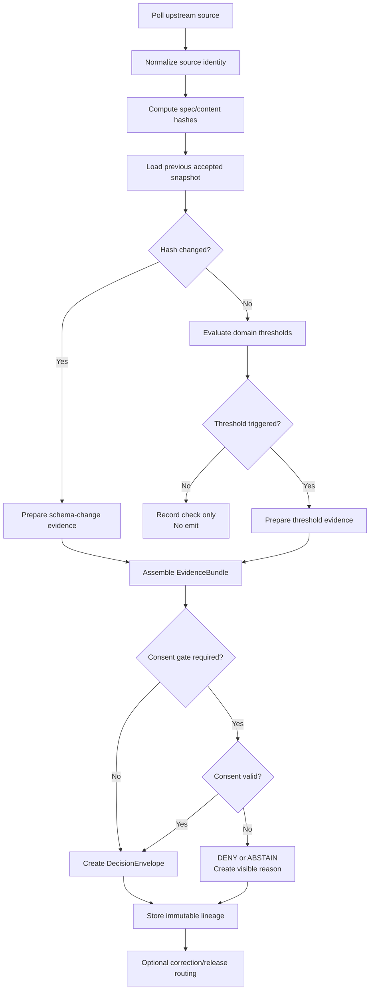

<!--
doc_id: NEEDS VERIFICATION
title: Emit-Only Watchers — Next Logical Steps
type: standard
version: v1
status: draft
owners: [@bartytime4life, NEEDS VERIFICATION]
created: 2026-04-01
updated: 2026-04-01
policy_label: restricted
related: [
  "docs/governance/ROOT_GOVERNANCE.md",
  "docs/governance/ETHICS.md",
  "docs/domains/README.md",
  "NEEDS VERIFICATION: watcher registry path",
  "NEEDS VERIFICATION: DecisionEnvelope contract path",
  "NEEDS VERIFICATION: EvidenceRef / EvidenceBundle contract path"
]
tags: [kfm, operations, watchers, provenance, evidence, catalog, governance, change-detection]
notes: [
  "Repo paths beyond governance/domain anchors NEEDS VERIFICATION in mounted repo.",
  "This document defines the next implementation sequence after the emit-only watcher scaffold.",
  "All implementation claims are PROPOSED unless verified in repo."
]
-->

# Emit-Only Watchers — Next Logical Steps

**Purpose:** define the immediate implementation sequence for governed, emit-only watcher operations across soils, air, vegetation, hydrology, and consent-gated genealogy overlays.

| Status | Owners | Quick fit |
|---|---|---|
|     | @bartytime4life, NEEDS VERIFICATION | Operationalization plan after watcher concept approval |

**Repo fit:** Proposed operations/governance implementation note for watcher execution, evidence capture, and release gating.  
**Accepted inputs:** prior watcher scaffold, KFM governance doctrine, domain dataset registries, release/correction contracts, CI workflow conventions.  
**Exclusions:** does **not** claim live implementation, production enforcement, active schedulers, or verified path ownership unless explicitly marked **CONFIRMED**.

**Quick jumps:** [Scope](#scope) · [Repo fit](#repo-fit) · [Execution order](#execution-order) · [Contracts to define first](#contracts-to-define-first) · [CI sequence](#ci-sequence) · [Directory shape](#proposed-directory-shape) · [Mermaid](#control-flow) · [Definition of done](#definition-of-done) · [Open verification items](#open-verification-items)

---

## Scope

This document moves the watcher idea from a conceptual scaffold into an implementation order that respects KFM doctrine:

- **truth path first**
- **evidence before persuasion**
- **derived remains subordinate**
- **finite runtime outcomes**
- **correction before quiet supersession**
- **consent and exposure controls before overlay publication**

The next logical move is **not** “build every watcher.”  
The next logical move is to establish the **minimum governed substrate** that makes any watcher output trustworthy.

---

## Repo fit

| Dimension | Guidance | Status |
|---|---|---|
| Likely home | `docs/operations/` or adjacent governance/engineering path | **PROPOSED** |
| Upstream docs | `docs/governance/ROOT_GOVERNANCE.md`, `docs/governance/ETHICS.md`, `docs/domains/README.md` | **INFERRED** |
| Downstream artifacts | watcher registry, spec-hash snapshots, EvidenceBundle outputs, DecisionEnvelope records, correction notices | **PROPOSED** |
| Runtime relationship | watcher outputs should route into catalog/evidence/release surfaces, not directly into public publication | **INFERRED** |

> [!IMPORTANT]
> A watcher that can emit without producing resolvable evidence is not ready for consequential use.

---

## Inputs

| Input | Why it matters | Status |
|---|---|---|
| Upstream dataset identity rules | Determines what counts as a version/spec boundary | **PROPOSED** |
| Spec hash strategy | Prevents silent schema drift | **PROPOSED** |
| Threshold registry | Separates domain significance from raw change noise | **PROPOSED** |
| DecisionEnvelope contract | Forces finite, visible outcomes | **INFERRED** |
| EvidenceRef / EvidenceBundle contract | Makes each emit auditable | **INFERRED** |
| Correction/supersession model | Preserves visible lineage when emits are narrowed or replaced | **INFERRED** |
| Consent gating rules for genealogy | Prevents overlays from outrunning permission | **PROPOSED** |

---

## Exclusions

This plan does **not** assume any of the following are already present unless verified in-repo:

- a working scheduler
- a live hash registry
- dataset-specific parsers
- release proof pack automation
- public map publication wiring
- DNA or genealogy processing implementation
- active CI enforcement

---

## Execution order

The implementation order below is designed to reduce governance risk before runtime expansion.

### Phase 1 — Lock the contracts first

Before any domain watcher is treated as meaningful, define and stabilize these contracts:

1. **Dataset identity**
2. **Spec hash snapshot**
3. **Threshold evaluation record**
4. **DecisionEnvelope**
5. **EvidenceRef / EvidenceBundle**
6. **CorrectionNotice / supersession linkage**

Why first: without these, watchers become opaque notification code rather than governed operational surfaces.

---

### Phase 2 — Stand up the registry substrate

Create a small registry that can answer:

- what upstream source was checked
- when it was checked
- what was hashed
- what hash was last accepted
- what policy class applies
- whether the source is authoritative, provisional, modeled, or derived

Why second: the registry becomes the trust-visible boundary between source polling and downstream claims.

---

### Phase 3 — Implement one authoritative pilot lane

Start with **one** lane that has strong public authority and manageable schema shape.

Recommended first pilot:

1. **Soils / SSURGO or gSSURGO**  
2. **Hydrology / NWIS metadata**  
3. **Vegetation / HLS NDVI tile/version watch**  
4. **Air / AQS station metadata or AirNow provisional feed separation**

Recommended first choice: **SSURGO/gSSURGO** because the domain is authoritative, structured, and less operationally volatile than real-time air feeds.

---

### Phase 4 — Add evidence packaging before release hooks

A watcher emit should produce a package that can be inspected without rerunning the poller:

- source descriptor
- timestamps
- prior hash
- new hash
- threshold comparison
- human-readable reason
- machine-readable outcome
- links/refs to raw and processed source traces

Why now: packaging trust evidence before publication prevents “it changed because the watcher said so.”

---

### Phase 5 — Wire CI for validation, not just execution

The first CI goal is **verification of watcher integrity**, not cadence.

CI should initially answer:

- does the registry schema validate
- do hash snapshots round-trip
- do thresholds parse
- do emits always include evidence
- do outcomes remain finite
- do correction records preserve lineage

Only after this should scheduled runs or release-affecting gates be added.

---

### Phase 6 — Add multi-domain watchers

Once a pilot lane is stable, add the remaining environmental lanes in order of authority and operational complexity:

| Order | Lane | Why |
|---|---|---|
| 1 | Soils | authoritative, structured, lower cadence |
| 2 | Hydrology | authoritative, clear station/watershed semantics |
| 3 | Vegetation | higher data volume, masking/version concerns |
| 4 | Air | provisional vs validated distinctions raise trust complexity |
| 5 | Genealogy overlay | highest governance burden; consent and exposure controls must already exist |

---

### Phase 7 — Only then connect to public or map-facing surfaces

Public or map-facing surfaces should consume watcher results only through governed contracts, never by reading raw watcher logs directly.

---

## Contracts to define first

### 1) DatasetVersion

```json
{
  "dataset_id": "soils.ssurgo",
  "source_authority": "authoritative",
  "upstream_locator": "NEEDS VERIFICATION",
  "observed_at": "2026-04-01T00:00:00Z",
  "spec_hash": "sha256:...",
  "content_hash": "sha256:...",
  "coverage_scope": "national|regional|tile|station",
  "notes": []
}
```

### 2) ThresholdEvaluation

```json
{
  "dataset_id": "vegetation.hls_ndvi",
  "evaluation_id": "uuid",
  "metric": "ndvi_delta",
  "window": "NEEDS VERIFICATION",
  "observed_value": 0.18,
  "threshold_value": 0.15,
  "comparison": "gte",
  "result": "triggered"
}
```

### 3) DecisionEnvelope

```json
{
  "decision_id": "uuid",
  "outcome": "ANSWER",
  "trigger_type": "SCHEMA_CHANGE|DOMAIN_DELTA|CONSENT_EVENT",
  "dataset_id": "soils.ssurgo",
  "reason_code": "spec_hash_changed",
  "evidence_refs": ["evidence://bundle/uuid"],
  "supersedes": null,
  "created_at": "2026-04-01T00:00:00Z"
}
```

### 4) CorrectionNotice

```json
{
  "correction_id": "uuid",
  "applies_to": "decision-uuid",
  "action": "withdraw|narrow|replace|supersede",
  "reason": "upstream source retracted provisional metadata",
  "replacement_decision_id": "uuid-or-null",
  "created_at": "2026-04-01T00:00:00Z"
}
```

### 5) ConsentGate (genealogy overlay only)

```json
{
  "overlay_id": "genealogy.overlay.v1",
  "consent_token_hash": "sha256:...",
  "kit_salt_version": "v3",
  "revocation_root": "sha256:...",
  "lineage_scope": "generalized",
  "status": "active|revoked|expired",
  "checked_at": "2026-04-01T00:00:00Z"
}
```

> [!WARNING]
> Genealogy overlay emission should be blocked by default until consent state, revocation state, and exposure scope are all machine-checkable.

---

## Proposed directory shape

**Status:** PROPOSED

```text
docs/
└── operations/
    ├── README.md
    ├── emit-only-watchers/
    │   ├── README.md
    │   ├── NEXT_STEPS.md
    │   ├── REGISTRY.md
    │   ├── THRESHOLDS.md
    │   ├── EVIDENCE_PACKAGING.md
    │   └── GOVERNANCE_NOTES.md
    └── schemas/
        ├── dataset-version.schema.json
        ├── threshold-evaluation.schema.json
        ├── decision-envelope.schema.json
        ├── correction-notice.schema.json
        └── consent-gate.schema.json

ops/
└── watchers/
    ├── registry/
    │   ├── datasets.yaml
    │   ├── thresholds.yaml
    │   └── policies.yaml
    ├── snapshots/
    │   └── .gitkeep
    ├── evidence/
    │   └── .gitkeep
    ├── emitters/
    │   └── NEEDS VERIFICATION
    └── tests/
        └── NEEDS VERIFICATION
```

---

## Quickstart

> [!NOTE]
> This quickstart is a **PROPOSED** implementation path, not a claim about existing commands.

1. Create the registry and schema stubs.
2. Add a single pilot dataset entry.
3. Generate an initial accepted baseline hash snapshot.
4. Run a dry evaluation against the same source.
5. Confirm that no emit occurs on unchanged input.
6. Mutate a fixture to simulate change.
7. Confirm that:
   - a threshold or schema trigger fires,
   - an EvidenceBundle is created,
   - a DecisionEnvelope is emitted,
   - no public-facing publish step occurs automatically.

---

## Usage

### Proposed minimum registry example

```yaml
datasets:
  - dataset_id: soils.ssurgo
    authority_class: authoritative
    upstream_locator: NEEDS VERIFICATION
    policy_class: public
    spec_hash_strategy: schema-and-catalog
    enabled: true

thresholds:
  - dataset_id: vegetation.hls_ndvi
    metric: ndvi_delta
    threshold_value: 0.15
    comparison: gte
    enabled: true

  - dataset_id: air.aqs.pm25
    metric: weekly_change
    threshold_value: 10.0
    comparison: gte
    enabled: true
```

### Proposed emit invariants

```text
emit is allowed only if:
  (spec_hash changed)
  OR
  (threshold triggered)
  OR
  (consent state changed)

emit is denied if:
  evidence bundle cannot be formed
  OR
  outcome is non-finite
  OR
  consent gate fails
```

---

## Control flow



---

## CI sequence

### Stage 1 — Static integrity

- validate schema files
- validate registry YAML/JSON
- reject unknown authority classes
- reject missing policy labels
- reject non-finite outcome enums

### Stage 2 — Deterministic watcher tests

- unchanged fixture must not emit
- changed schema fixture must emit exactly one schema-change envelope
- threshold-crossing fixture must emit exactly one domain-delta envelope
- missing evidence fixture must fail closed
- consent-failed fixture must deny or abstain visibly

### Stage 3 — Packaging checks

- every emitted decision must resolve to at least one EvidenceBundle
- every correction must point to prior decision lineage
- every evidence bundle must include source timestamps and hash details

### Stage 4 — Optional scheduled runs

Only after Stages 1–3 are stable.

> [!CAUTION]
> Schedule frequency is an operational tuning question, not a documentation claim. Keep cadence **NEEDS VERIFICATION** until workflow files exist.

---

## Recommended first implementation backlog

- [ ] Define registry schema for datasets, thresholds, and policy classes
- [ ] Define `DatasetVersion` contract
- [ ] Define `DecisionEnvelope` contract
- [ ] Define `EvidenceBundle` minimum contents
- [ ] Define `CorrectionNotice` contract
- [ ] Add one pilot dataset entry (`soils.ssurgo` recommended)
- [ ] Create baseline accepted snapshot fixture
- [ ] Build deterministic hash computation fixture tests
- [ ] Prove no-emit behavior on unchanged input
- [ ] Prove fail-closed behavior when evidence is incomplete
- [ ] Add trust-visible output examples for ANSWER / ABSTAIN / DENY / ERROR
- [ ] Document authority-class distinctions: authoritative / provisional / modeled / derived
- [ ] Hold genealogy overlay until consent and revocation checks are machine-testable

---

## Domain-specific implementation notes

### Soils
Use soils first to establish stable registry semantics:
- schema snapshots
- map unit/component drift
- release/version traceability

### Hydrology
Use hydrology second for station and watershed identity:
- station metadata changes
- watershed boundary revisions
- clear provenance between measured and derived states

### Vegetation
Add vegetation once masking/version discipline is ready:
- tile/version drift
- cloud-mask-aware comparisons
- threshold semantics that avoid cosmetic noise

### Air
Treat air carefully because trust labels matter:
- provisional vs validated
- station outage vs actual environmental change
- public-facing messaging must surface data quality class

### Genealogy overlay
Do not connect to public surfaces until:
- consent state is machine-verifiable,
- revocation state is machine-verifiable,
- generalized exposure rules are enforced,
- exact identity inference paths are blocked.

---

## Trust labels to use in implementation docs

| Label | Meaning |
|---|---|
| **CONFIRMED** | directly supported by visible doctrine or repo evidence |
| **INFERRED** | strongly implied by doctrine, not verified as implementation |
| **PROPOSED** | recommended target shape consistent with doctrine |
| **UNKNOWN** | no reliable evidence in current session |
| **NEEDS VERIFICATION** | owners, paths, workflow names, or dates require repo confirmation |

---

## Example trust-visible outcomes

| Outcome | When to use | Public trust stance |
|---|---|---|
| `ANSWER` | evidence present and watcher conditions valid | may proceed to downstream governed surfaces |
| `ABSTAIN` | evidence insufficient or interpretation unsafe | visible non-answer; preserve trust |
| `DENY` | policy or consent gate blocks output | visible refusal with reason class |
| `ERROR` | operational failure prevented safe evaluation | visible operational failure, not silent drop |

---

## FAQ

### Why not start with all domains at once?
Because governance complexity rises faster than implementation speed. One pilot lane proves the contracts.

### Why is CI before scheduling?
Because a fast untrusted watcher is worse than a slow trusted one.

### Why hold genealogy overlays back?
Because consent, revocation, and exposure failures have human consequence beyond ordinary environmental change detection.

### Why emphasize correction lineage?
Because “fixed silently later” violates the KFM trust posture.

---

## Definition of done

A minimally credible watcher foundation is done when all items below are true:

- one pilot domain watcher exists
- unchanged input produces no emit
- meaningful change produces exactly one governed emit
- every emit resolves to evidence
- outcomes remain finite
- correction lineage is preserved
- no watcher bypasses policy or consent gates
- no direct public publication occurs from raw watcher output
- docs clearly distinguish authoritative, provisional, modeled, and derived states

---

## Open verification items

| Item | Status |
|---|---|
| Final path for watcher docs | **NEEDS VERIFICATION** |
| Existing schema/contract locations | **NEEDS VERIFICATION** |
| Existing CI workflow names | **NEEDS VERIFICATION** |
| Actual registry file format preferences | **NEEDS VERIFICATION** |
| Whether `DecisionEnvelope` already exists in-repo | **NEEDS VERIFICATION** |
| Whether `EvidenceBundle` already exists in-repo | **NEEDS VERIFICATION** |
| Whether release proof pack wiring already exists | **NEEDS VERIFICATION** |

---

## Appendix A — Suggested first pilot decision

**Recommendation:** implement **Soils / SSURGO** first.

Rationale:

- strong authority class
- relatively stable schema shape
- lower real-time volatility
- good proving ground for spec-hash, snapshot, and correction flows

---

## Appendix B — Suggested follow-on documents

- `REGISTRY.md` — dataset registry rules and field definitions
- `THRESHOLDS.md` — threshold semantics by domain
- `EVIDENCE_PACKAGING.md` — minimum evidence payload rules
- `GOVERNANCE_NOTES.md` — denial, abstention, and correction behavior
- `README.md` — operator-facing watcher overview

---

[Back to top](#emit-only-watchers--next-logical-steps)
