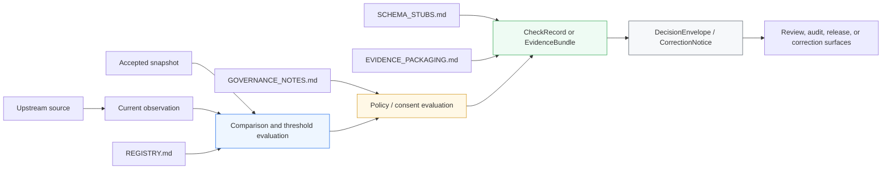

<!-- [KFM_META_BLOCK_V2]
doc_id: NEEDS VERIFICATION
title: Emit-Only Watchers
type: standard
version: v1
status: draft
owners: [@bartytime4life, NEEDS VERIFICATION]
created: 2026-04-01
updated: 2026-04-07
policy_label: restricted
related: [docs/README.md, .github/watchers/README.md, docs/operations/emit-only-watchers/NEXT_STEPS.md, docs/operations/emit-only-watchers/REGISTRY.md, docs/operations/emit-only-watchers/EVIDENCE_PACKAGING.md, docs/operations/emit-only-watchers/GOVERNANCE_NOTES.md, docs/operations/emit-only-watchers/SCHEMA_STUBS.md]
tags: [kfm, operations, watchers, evidence, provenance, governance, change-detection]
notes: [Public-main path and sibling markdown set confirmed in this revision, doc_id still needs verification, runtime watcher implementation depth remains unknown]
[/KFM_META_BLOCK_V2] -->

# Emit-Only Watchers

Governed operator-facing overview of how KFM watcher flows detect meaningful upstream change, emit only when warranted, and hand off proof-bearing outputs without bypassing policy, correction, or release gates.

> **Status:** experimental directory · draft README revision  
> **Owners:** `@bartytime4life`, `NEEDS VERIFICATION`  
>        
> **Quick jumps:** [Scope](#scope) · [Repo fit](#repo-fit) · [Accepted inputs](#accepted-inputs) · [Exclusions](#exclusions) · [Directory tree](#directory-tree) · [Quickstart](#quickstart) · [Usage](#usage) · [Diagram](#diagram) · [Tables](#tables) · [Task list](#task-list--definition-of-done) · [FAQ](#faq) · [Appendix](#appendix)  
> **Repo fit:** `docs/operations/emit-only-watchers/README.md` · docs index [../../README.md](../../README.md) · gatehouse watcher lane [../../../.github/watchers/README.md](../../../.github/watchers/README.md) · adjacent [NEXT_STEPS.md](./NEXT_STEPS.md), [REGISTRY.md](./REGISTRY.md), [EVIDENCE_PACKAGING.md](./EVIDENCE_PACKAGING.md), [GOVERNANCE_NOTES.md](./GOVERNANCE_NOTES.md), [SCHEMA_STUBS.md](./SCHEMA_STUBS.md)  
> **Accepted here:** watcher doctrine, current public-tree boundary, finite outcome rules, evidence handoff expectations, and review-facing operational guidance  
> **Not here:** live scheduler claims, workflow YAML certainty, canonical schemas, policy bundle truth, runtime code, or release-proof automation not directly verified in the checked-in public tree  
>
> [!IMPORTANT]
> Current public `main` confirms this directory and its sibling watcher docs. It does **not** confirm checked-in watcher runtimes, schedulers, workflow YAML, or release-proof automation in this path.

---

## Scope

Emit-only watchers are KFM’s low-noise change-detection surface.

They answer one question only:

**Did something meaningful change, and can KFM prove that change without overstating certainty or bypassing governance?**

That makes a watcher more than a poller. In KFM terms, a watcher is a derived operational boundary that must stay subordinate to upstream authority, evidence packaging, policy gates, correction lineage, and finite runtime outcomes.

A healthy watcher lane therefore separates four things that are easy to collapse by mistake:

- **observation** — a source was checked
- **difference** — something changed
- **significance** — the change crossed a declared threshold or policy boundary
- **publication eligibility** — downstream systems may now evaluate whether anything should be surfaced

---

## Repo fit

### Path and placement

| Field | Value | Status |
| --- | --- | --- |
| Path | `docs/operations/emit-only-watchers/README.md` | **CONFIRMED** |
| Directory role | watcher-facing operations README inside `docs/operations/emit-only-watchers/` | **CONFIRMED** |
| Public-tree posture | checked-in documentation surface | **CONFIRMED** |
| Runtime ownership in this path | not proven by current public-tree inspection | **UNKNOWN** |
| Canonical machine surfaces | `../../../contracts/`, `../../../schemas/`, `../../../policy/`, `../../../tests/`, `../../../pipelines/` | **CONFIRMED** root surfaces |

### Upstream and downstream anchors

| Direction | Path | Why it matters | Status |
| --- | --- | --- | --- |
| Upstream | [../../README.md](../../README.md) | treats `docs/` as a production-facing trust surface rather than decorative packaging | **CONFIRMED** |
| Upstream | [../../../README.md](../../../README.md) | root repo posture: governed, evidence-first, map-first, time-aware | **CONFIRMED** |
| Upstream | [../../../.github/watchers/README.md](../../../.github/watchers/README.md) | gatehouse watcher lane documents repo-side watcher control and current public inventory | **CONFIRMED** |
| Adjacent | [./NEXT_STEPS.md](./NEXT_STEPS.md) | sequencing, phase order, and definition of done | **CONFIRMED** |
| Adjacent | [./REGISTRY.md](./REGISTRY.md) | dataset, threshold, policy, and snapshot inputs | **CONFIRMED** |
| Adjacent | [./EVIDENCE_PACKAGING.md](./EVIDENCE_PACKAGING.md) | minimum proof payload between evaluation and decision | **CONFIRMED** |
| Adjacent | [./GOVERNANCE_NOTES.md](./GOVERNANCE_NOTES.md) | refusal, hold, correction, and sensitive-lane restraint rules | **CONFIRMED** |
| Adjacent | [./SCHEMA_STUBS.md](./SCHEMA_STUBS.md) | bridge from narrative watcher doctrine to formal contracts | **CONFIRMED** |
| Downstream | [../../../contracts/](../../../contracts/) and [../../../schemas/](../../../schemas/) | future canonical home of real watcher contracts and validators | **CONFIRMED** root surfaces |
| Downstream | [../../../policy/](../../../policy/) | future canonical home of executable watcher policy bundles | **CONFIRMED** root surface |
| Downstream | [../../../tests/](../../../tests/) | future home of valid/invalid fixtures, contract tests, and negative-path verification | **CONFIRMED** root surface |
| Downstream | [../../../pipelines/](../../../pipelines/) | potential runtime owner surface outside this docs lane | **CONFIRMED** root surface |

### Current public inventory

| Item | Role in this lane | Status |
| --- | --- | --- |
| `README.md` | overview and boundary document | **CONFIRMED** |
| `NEXT_STEPS.md` | implementation order and done criteria | **CONFIRMED** |
| `REGISTRY.md` | watcher input surfaces | **CONFIRMED** |
| `EVIDENCE_PACKAGING.md` | minimum proof payload rules | **CONFIRMED** |
| `GOVERNANCE_NOTES.md` | governance restraint companion | **CONFIRMED** |
| `SCHEMA_STUBS.md` | proposed contract bridge | **CONFIRMED** |
| `THRESHOLDS.md` | named in proposed directory shape, not present in current public inventory | **PROPOSED** |

> [!NOTE]
> This directory now has enough checked-in sibling material to behave like a real documentation lane. It still does not, by itself, prove checked-in runtime watcher code or active automation.

---

## Accepted inputs

Content that belongs in this README and its sibling lane should stay narrowly operational and review-friendly.

| Input class | What belongs here | Why |
| --- | --- | --- |
| Watcher doctrine | emit-only posture, finite outcomes, current public-tree boundary | keeps behavioral claims explicit |
| Review-facing operations notes | handoff rules to contracts, policy, tests, and runtime owner surfaces | prevents prose from quietly becoming sovereign truth |
| Public inventory statements | exactly which watcher-facing docs exist in this directory right now | keeps repo claims inspectable |
| Proof-handoff guidance | how `CheckRecord`, `EvidenceBundle`, `DecisionEnvelope`, and `CorrectionNotice` relate | aligns overview language with sibling docs |
| Sequencing guidance | first-wave contract and pilot-lane priorities | keeps implementation order close to the doctrine it depends on |

---

## Exclusions

This README can describe watcher behavior, but it must not quietly replace the surfaces that actually govern or execute that behavior.

| Keep out of this file as canonical truth | Keep it here instead |
| --- | --- |
| machine-enforced schema definitions | [../../../contracts/](../../../contracts/) and [../../../schemas/](../../../schemas/) |
| executable policy bundles, reason codes, obligation vocabularies | [../../../policy/](../../../policy/) |
| runtime watcher code, adapters, schedulers, queue consumers | owning runtime surface outside this docs lane |
| emitted artifacts, receipts, proof packs, release outputs | governed artifact or release surface outside `docs/` |
| claims that a workflow, scheduler, or public publication path is already running | only after direct repo/runtime verification |
| sensitive overlay publication logic that needs real consent state | stewarded runtime and policy surfaces, not overview prose |

---

## Directory tree

### Current public `main` inventory

```text
docs/
└── operations/
    └── emit-only-watchers/
        ├── README.md
        ├── NEXT_STEPS.md
        ├── REGISTRY.md
        ├── EVIDENCE_PACKAGING.md
        ├── GOVERNANCE_NOTES.md
        └── SCHEMA_STUBS.md
```

### Proposed near-term expansion named elsewhere in this lane

```text
docs/
└── operations/
    └── emit-only-watchers/
        └── THRESHOLDS.md   # proposed in NEXT_STEPS.md; not confirmed on current public main
```

---

## Quickstart

### Read the lane in dependency order

1. Read this file for the boundary, scope, and truth posture.
2. Read [REGISTRY.md](./REGISTRY.md) for what is being watched and how significance is declared.
3. Read [EVIDENCE_PACKAGING.md](./EVIDENCE_PACKAGING.md) for what a consequential watcher result must carry.
4. Read [GOVERNANCE_NOTES.md](./GOVERNANCE_NOTES.md) for restraint, refusal, correction, and sensitive-lane handling.
5. Read [SCHEMA_STUBS.md](./SCHEMA_STUBS.md) before claiming machine-checkable watcher maturity.
6. Read [NEXT_STEPS.md](./NEXT_STEPS.md) before proposing implementation order, CI gates, or directory growth.

### Minimal local inspection

```bash
sed -n '1,220p' docs/operations/emit-only-watchers/README.md
sed -n '1,220p' docs/operations/emit-only-watchers/REGISTRY.md
sed -n '1,220p' docs/operations/emit-only-watchers/EVIDENCE_PACKAGING.md
sed -n '1,220p' docs/operations/emit-only-watchers/GOVERNANCE_NOTES.md
sed -n '1,220p' docs/operations/emit-only-watchers/SCHEMA_STUBS.md
sed -n '1,220p' docs/operations/emit-only-watchers/NEXT_STEPS.md
```

### Before making stronger runtime claims

Confirm all three of these first:

1. the owning runtime surface is checked in and visible,
2. the policy / contract / test surfaces are linked to something more than prose,
3. any workflow or scheduler claim points to an actual checked-in asset or is clearly labeled **PROPOSED**.

---

## Usage

Use this README when you need to keep watcher language honest.

### Use it for

- defining what emit-only means in KFM
- keeping the docs lane aligned with current public-tree reality
- routing future watcher work toward contracts, policy, tests, and runtime owner surfaces
- explaining why no-change, abstain, deny, and error states are still operationally meaningful

### Do not use it for

- claiming a live scheduler exists
- implying this directory owns the canonical runtime
- treating a check as publishable merely because it ran
- treating documentation as sufficient evidence of enforcement

---

## Diagram



The README explains the lane. The sibling docs define its supporting inputs and proof expectations. Canonical contracts, policy bodies, tests, and runtime code still belong downstream of this documentation surface.

---

## Tables

### Finite outcomes

| Outcome | Meaning in this lane | Expected posture |
| --- | --- | --- |
| `ANSWER` | evidence and gates support a governed emit | eligible for downstream evaluation |
| `ABSTAIN` | evidence is insufficient, ambiguous, stale, or unsafe to interpret | visible non-assertion |
| `DENY` | policy, consent, or protection rules block the output | visible refusal |
| `ERROR` | operational failure prevented safe evaluation | visible failure without silent drop |

### Trigger classes

| Trigger class | What it means | Notes |
| --- | --- | --- |
| `SCHEMA_CHANGE` | upstream structure or declared spec changed | should not auto-publish on shape change alone |
| `DOMAIN_DELTA` | a domain threshold crossed | significance must be declared, not improvised |
| `CONSENT_EVENT` | consent, revocation, or scope state changed | sensitive lanes should fail closed on unknown state |
| no emit | routine check did not justify a consequential outward result | still deserves a `CheckRecord` or equivalent retained record |

### Current public claim posture

| Claim | Status | Why the README treats it this way |
| --- | --- | --- |
| This directory exists on public `main` and contains six watcher-facing markdown files | **CONFIRMED** | directly visible in the current public tree |
| This directory is a real documentation lane, not a one-file stub | **CONFIRMED** | sibling docs are checked in and named |
| `THRESHOLDS.md` is part of the current checked-in directory | **PROPOSED** | named in `NEXT_STEPS.md`, not visible in current public inventory |
| This path proves live watcher schedulers, workflow YAML, or emit automation | **UNKNOWN** | current public-tree inspection does not confirm them here |
| This path should be the canonical home of runtime watcher code | **INFERRED — no** | sibling docs consistently hand off to contracts, policy, tests, and runtime owner surfaces outside this lane |

### Confirmed sibling-doc roles

| File | Primary role | Best read after |
| --- | --- | --- |
| [README.md](./README.md) | scope, boundary, and posture | docs index |
| [REGISTRY.md](./REGISTRY.md) | watched inputs and significance surfaces | README |
| [EVIDENCE_PACKAGING.md](./EVIDENCE_PACKAGING.md) | minimum proof payload | REGISTRY |
| [GOVERNANCE_NOTES.md](./GOVERNANCE_NOTES.md) | restraint, refusal, correction | EVIDENCE_PACKAGING |
| [SCHEMA_STUBS.md](./SCHEMA_STUBS.md) | bridge to formal contracts | GOVERNANCE_NOTES |
| [NEXT_STEPS.md](./NEXT_STEPS.md) | sequencing and definition of done | all of the above |

---

## Task list / definition of done

A minimally credible watcher foundation is not done when prose sounds convincing. It is done when the lane can prove its own restraint.

- [ ] one pilot watcher exists on a public-safe or otherwise clearly governed lane
- [ ] unchanged input produces no consequential emit
- [ ] meaningful change produces exactly one governed emit
- [ ] every consequential emit resolves to an inspectable evidence package
- [ ] no-change results still retain a lightweight `CheckRecord` or equivalent
- [ ] outcomes remain finite: `ANSWER`, `ABSTAIN`, `DENY`, `ERROR`
- [ ] correction lineage survives supersession, narrowing, or withdrawal
- [ ] no watcher bypasses policy or consent gates
- [ ] no direct public publication occurs from raw watcher output
- [ ] docs keep authoritative, provisional, modeled, and derived states visibly distinct

> [!TIP]
> If the lane cannot yet satisfy the checklist above, document that gap explicitly instead of compensating with stronger prose.

---

## FAQ

### Why emit-only?

Because most checks are routine, and routine observation is not the same thing as a public consequence. Emitting on every poll creates noise, weakens trust, and hides the difference between “noticed,” “significant,” and “publishable.”

### Why keep no-emit records?

Because “no emit” is still a runtime result. A missing outward change may be correct, but a missing audit trail is still a trust failure.

### Why not treat this README as runtime proof?

Because checked-in prose can explain expected behavior without proving a scheduler, validator, policy bundle, or release path exists. KFM’s trust posture depends on keeping that difference visible.

### Why is hydrology usually named as the first pilot lane?

Because the attached KFM doctrine repeatedly treats hydrology and adjacent environmental lanes as the most tractable first proof slice for contracts, time semantics, evidence visibility, and correction without immediately colliding with the heaviest rights burden.

### Why keep watcher docs under both `docs/` and `.github/`?

Because the repo now exposes two different watcher-facing surfaces. `docs/operations/emit-only-watchers/` holds the operational doctrine lane, while `.github/watchers/README.md` holds the repo-side gatehouse boundary. Those surfaces are adjacent, but they are not the same owner surface.

---

## Appendix

<details>
<summary><strong>Truth labels used in this README</strong></summary>

| Label | Meaning here |
| --- | --- |
| **CONFIRMED** | directly supported by the current public repo tree or checked-in watcher docs |
| **INFERRED** | conservative interpretation of confirmed repo evidence |
| **PROPOSED** | doctrine-consistent addition or target shape not yet proven as checked-in behavior |
| **UNKNOWN** | not verified strongly enough to present as current reality |
| **NEEDS VERIFICATION** | explicit placeholder that should be closed before stronger merge or release claims |

</details>

<details>
<summary><strong>Open verification items before stronger runtime claims</strong></summary>

| Item | Current state |
| --- | --- |
| stable `doc_id` / UUID | **NEEDS VERIFICATION** |
| owner set beyond `@bartytime4life` | **NEEDS VERIFICATION** |
| canonical policy-label taxonomy for this doc | carried forward as `restricted`; broader label confirmation still **NEEDS VERIFICATION** |
| checked-in runtime owner surface for watcher code | **UNKNOWN** |
| checked-in workflow YAML or scheduler wiring for this lane | **UNKNOWN** |
| release-proof pack or real watcher receipt examples in repo | **UNKNOWN** |
| whether `THRESHOLDS.md` should be added or folded into existing docs | **PROPOSED** |

</details>

<details>
<summary><strong>Recommended reading order for reviewers</strong></summary>

1. [../../../README.md](../../../README.md)
2. [../../README.md](../../README.md)
3. [../../../.github/watchers/README.md](../../../.github/watchers/README.md)
4. [./README.md](./README.md)
5. [./REGISTRY.md](./REGISTRY.md)
6. [./EVIDENCE_PACKAGING.md](./EVIDENCE_PACKAGING.md)
7. [./GOVERNANCE_NOTES.md](./GOVERNANCE_NOTES.md)
8. [./SCHEMA_STUBS.md](./SCHEMA_STUBS.md)
9. [./NEXT_STEPS.md](./NEXT_STEPS.md)

</details>

[Back to top](#emit-only-watchers)
