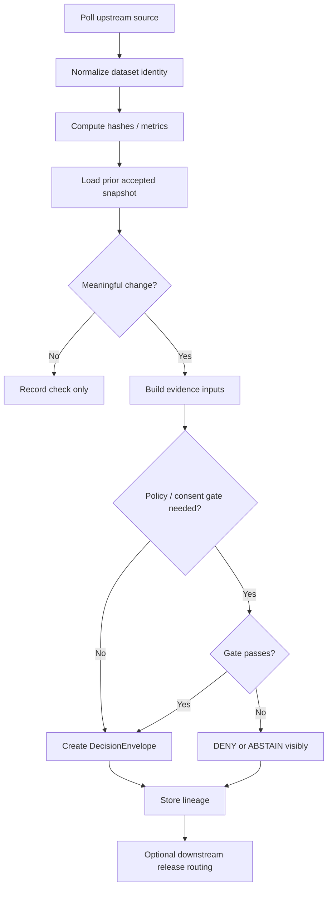

<!-- FILE: docs/operations/emit-only-watchers/README.md -->

<!--
doc_id: NEEDS VERIFICATION
title: Emit-Only Watchers
type: standard
version: v1
status: draft
owners: [@bartytime4life, NEEDS VERIFICATION]
created: 2026-04-01
updated: 2026-04-01
policy_label: restricted
related: [
  "docs/governance/ROOT_GOVERNANCE.md",
  "docs/governance/ETHICS.md",
  "docs/domains/README.md",
  "docs/operations/emit-only-watchers/NEXT_STEPS.md",
  "docs/operations/emit-only-watchers/REGISTRY.md"
]
tags: [kfm, operations, watchers, evidence, provenance, governance, change-detection]
notes: [
  "Path is PROPOSED and NEEDS VERIFICATION against mounted repo.",
  "This is the operator-facing overview for governed, emit-only watcher behavior.",
  "Implementation and enforcement details remain PROPOSED unless verified in repo."
]
-->

# Emit-Only Watchers

**Purpose:** provide a governed, trust-visible overview of how KFM watcher processes detect meaningful upstream change, emit only when warranted, and preserve auditable lineage.

| Status | Owners | Quick fit |
|---|---|---|
|     | @bartytime4life, NEEDS VERIFICATION | Cross-domain operational surface between upstream source checks and downstream governed release |

**Repo fit:** proposed operations documentation for watcher behavior across soils, air, vegetation, hydrology, and consent-gated overlays.  
**Accepted inputs:** authoritative dataset metadata, threshold registries, hash snapshots, policy classes, EvidenceRef/EvidenceBundle inputs, consent-state checks where required.  
**Exclusions:** not a promise of live production scheduling, not a bypass around catalog/release governance, not a public publication contract by itself.

**Quick jumps:** [Scope](#scope) · [Repo fit](#repo-fit) · [What a watcher is](#what-a-watcher-is) · [What emits are allowed](#what-emits-are-allowed) · [Control flow](#control-flow) · [Domain lanes](#domain-lanes) · [Outcome model](#outcome-model) · [Directory tree](#directory-tree) · [FAQ](#faq)

---

## Scope

Emit-only watchers exist to answer one operational question well:

**Did something meaningful change, and can KFM prove it without overstating certainty?**

A watcher is not just a poller.  
A watcher is a governed boundary that must:

- detect change or threshold crossings,
- produce resolvable evidence,
- return finite outcomes,
- preserve visible lineage,
- fail calmly and visibly when trust conditions are not met.

---

## Repo fit

| Dimension | Guidance | Status |
|---|---|---|
| Likely path | `docs/operations/emit-only-watchers/` | **PROPOSED** |
| Adjacent docs | `NEXT_STEPS.md`, `REGISTRY.md` | **PROPOSED** |
| Upstream doctrine | governance and domain docs | **INFERRED** |
| Downstream artifacts | snapshots, evidence bundles, decision envelopes, correction notices | **PROPOSED** |

---

## Inputs

| Input | Role | Status |
|---|---|---|
| Upstream source descriptor | identifies what is being checked | **PROPOSED** |
| Accepted prior snapshot | defines the last trusted baseline | **PROPOSED** |
| Spec/content hash strategy | detects structural or content drift | **PROPOSED** |
| Threshold registry | distinguishes meaningful change from noise | **PROPOSED** |
| Policy class | constrains exposure and publication | **INFERRED** |
| Evidence bundle rules | make emits auditable | **INFERRED** |
| Consent state | required for genealogy overlays | **PROPOSED** |

---

## Exclusions

Watchers do **not**:

- declare sovereignty over authoritative sources,
- directly publish to public surfaces without downstream policy checks,
- silently overwrite prior interpretations,
- collapse provisional and validated states,
- infer consent where consent has not been machine-checked.

---

## What a watcher is

A watcher is a narrow operational component that:

1. checks a known upstream source,
2. computes a stable comparison against a prior accepted state,
3. evaluates domain thresholds or policy gates,
4. emits **only** when warranted,
5. produces trust-visible evidence and lineage.

This is different from continuous status streaming.  
The design intent is **low-noise, evidence-bearing change recognition**.

---

## What emits are allowed

A watcher may emit when one or more of the following conditions hold:

| Trigger class | Meaning | Status |
|---|---|---|
| `SCHEMA_CHANGE` | upstream structure/spec changed | **PROPOSED** |
| `DOMAIN_DELTA` | domain threshold crossed | **PROPOSED** |
| `CONSENT_EVENT` | consent or revocation state changed | **PROPOSED** |

A watcher should **not** emit simply because it ran.

> [!IMPORTANT]
> “Checked” is not the same thing as “changed,” and “changed” is not the same thing as “publishable.”

---

## Outcome model

Watcher execution should terminate in finite, trust-visible outcomes aligned with KFM runtime doctrine.

| Outcome | Meaning | Trust stance |
|---|---|---|
| `ANSWER` | sufficient evidence exists and a governed emit is justified | downstream systems may evaluate further |
| `ABSTAIN` | evidence is insufficient or interpretation is unsafe | visible non-assertion preserves trust |
| `DENY` | policy or consent blocks the emit | visible refusal with reason class |
| `ERROR` | operational failure prevented safe evaluation | visible failure, no silent drop |

---

## Domain lanes

| Lane | Typical authority class | Example watch focus | Status |
|---|---|---|---|
| Soils | authoritative | SSURGO/gSSURGO spec or content drift | **PROPOSED** |
| Hydrology | authoritative | station metadata, watershed revision, discharge anomaly | **PROPOSED** |
| Vegetation | authoritative/derived mix | HLS tile/version and NDVI threshold changes | **PROPOSED** |
| Air | provisional + validated split | AQS/AirNow station and PM2.5 threshold behavior | **PROPOSED** |
| Genealogy overlay | consent-gated sensitive overlay | consent/revocation/scope state only | **PROPOSED** |

---

## Control flow



---

## Trust-visible rules

### 1) Evidence before persuasion
No consequential emit should exist without resolvable evidence.

### 2) Derived stays subordinate
Derived or modeled interpretations must not quietly outrank authoritative source state.

### 3) Correction before quiet supersession
If an earlier emit is later narrowed, withdrawn, or replaced, the lineage must remain visible.

### 4) Consent before exposure
Sensitive overlays must fail closed when consent state, revocation state, or exposure scope are uncertain.

---

## Directory tree

```text
docs/
└── operations/
    └── emit-only-watchers/
        ├── README.md
        ├── NEXT_STEPS.md
        └── REGISTRY.md
```

**Status:** **PROPOSED** pathing, pending repo verification.

---

## Quickstart

1. Read `NEXT_STEPS.md` for sequencing.
2. Read `REGISTRY.md` for dataset, threshold, and policy fields.
3. Start with one pilot lane.
4. Prove:
   - unchanged input does not emit,
   - meaningful change emits exactly once,
   - every emit resolves to evidence,
   - failure states are visible.

---

## Usage boundaries

Use watchers when you need:

- stable change detection,
- low-noise operational signals,
- trust-visible evidence packaging,
- cross-domain monitoring that still respects authority classes.

Do **not** use watchers as a substitute for:

- interactive analytics,
- ad hoc research interpretation,
- direct public storytelling,
- sensitive overlay publication without policy review.

---

## Relationship to adjacent docs

| File | Role |
|---|---|
| `NEXT_STEPS.md` | implementation order and adoption sequence |
| `REGISTRY.md` | field-level registry rules and examples |

---

## FAQ

### Why emit-only?
Because most checks are routine. Emitting on every poll creates noise and weakens trust.

### Why finite outcomes?
Because “silent maybe” is not operationally governable.

### Why start with one lane?
Because trust contracts should stabilize before watcher count grows.

### Why hold genealogy overlays back?
Because consent and revocation are not cosmetic requirements; they are gating requirements.

---

## Truth labels used here

| Label | Meaning |
|---|---|
| **CONFIRMED** | directly supported by visible doctrine or repo evidence |
| **INFERRED** | strongly implied by doctrine, not live-verified as implementation |
| **PROPOSED** | recommended shape consistent with doctrine |
| **UNKNOWN** | no reliable session evidence |
| **NEEDS VERIFICATION** | owners, paths, contracts, or workflows require in-repo confirmation |

---

[Back to top](#emit-only-watchers)
