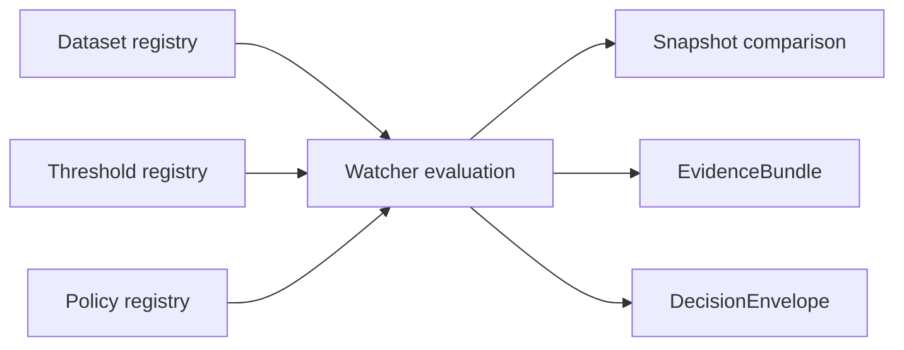

<!-- FILE: docs/operations/emit-only-watchers/REGISTRY.md -->

<!--
doc_id: NEEDS VERIFICATION
title: Emit-Only Watchers Registry
type: standard
version: v1
status: draft
owners: [@bartytime4life, NEEDS VERIFICATION]
created: 2026-04-01
updated: 2026-04-01
policy_label: restricted
related: [
  "docs/governance/ROOT_GOVERNANCE.md",
  "docs/governance/ETHICS.md",
  "docs/operations/emit-only-watchers/README.md",
  "docs/operations/emit-only-watchers/NEXT_STEPS.md",
  "NEEDS VERIFICATION: schema path for DecisionEnvelope",
  "NEEDS VERIFICATION: schema path for EvidenceBundle"
]
tags: [kfm, operations, watchers, registry, thresholds, hashes, governance]
notes: [
  "Path and adjacent schema locations NEEDS VERIFICATION.",
  "Registry fields and examples are PROPOSED target shape.",
  "No claim is made here that these files or schemas already exist in the repo."
]
-->

# Emit-Only Watchers Registry

**Purpose:** define the proposed registry structure for datasets, thresholds, policies, and snapshot semantics used by governed, emit-only watchers.

| Status | Owners | Quick fit |
|---|---|---|
|     | @bartytime4life, NEEDS VERIFICATION | Field definitions and examples for watcher runtime inputs |

**Repo fit:** proposed registry and schema reference for watcher runtime inputs and validation.  
**Accepted inputs:** dataset descriptors, threshold definitions, authority classes, snapshot records, consent-gate settings, policy labels.  
**Exclusions:** not a claim of active implementation; not a substitute for EvidenceBundle or DecisionEnvelope contracts.

**Quick jumps:** [Scope](#scope-1) · [Registry model](#registry-model) · [Dataset registry](#dataset-registry) · [Threshold registry](#threshold-registry) · [Policy registry](#policy-registry) · [Snapshot semantics](#snapshot-semantics) · [Examples](#examples) · [Validation rules](#validation-rules)

---

## Scope

The registry is the watcher system’s trust-visible configuration surface.

It answers questions such as:

- what exactly is being watched,
- which upstream source is authoritative,
- what counts as meaningful change,
- which exposure/policy class applies,
- whether consent checks are required,
- how prior accepted state is stored and compared.

Without a registry, watcher behavior becomes implicit and hard to audit.

---

## Repo fit

| Component | Intended role | Status |
|---|---|---|
| Dataset registry | declares source identity and watch strategy | **PROPOSED** |
| Threshold registry | defines trigger semantics | **PROPOSED** |
| Policy registry | binds watcher outputs to exposure controls | **PROPOSED** |
| Snapshot store | preserves accepted prior state for comparison | **PROPOSED** |

---

## Inputs

| Input | Used for | Status |
|---|---|---|
| Dataset identifiers | stable source identity | **PROPOSED** |
| Upstream locator | source fetch target or catalog descriptor | **PROPOSED** |
| Authority class | trust hierarchy and messaging discipline | **INFERRED** |
| Hash strategy | schema/content drift detection | **PROPOSED** |
| Threshold fields | domain significance evaluation | **PROPOSED** |
| Policy class | public/generalized/restricted behavior | **INFERRED** |
| Consent requirement | sensitive overlay gating | **PROPOSED** |

---

## Exclusions

This registry does **not** itself carry:

- full evidence bundles,
- full decision lineage,
- release proof packs,
- public presentation logic,
- free-form human interpretation.

It is a controlled input surface, not the whole watcher system.

---

## Registry model

The proposed registry is split into four parts:

1. **datasets**
2. **thresholds**
3. **policies**
4. **snapshots**



---

## Dataset registry

### Required concepts

| Field | Meaning | Status |
|---|---|---|
| `dataset_id` | stable internal identifier | **PROPOSED** |
| `display_name` | human-readable name | **PROPOSED** |
| `domain` | soils / air / vegetation / hydrology / genealogy | **PROPOSED** |
| `authority_class` | authoritative / provisional / modeled / derived | **INFERRED** |
| `upstream_locator` | canonical source locator | **PROPOSED** |
| `watch_strategy` | schema, content, threshold, consent, or mixed | **PROPOSED** |
| `spec_hash_strategy` | how structural drift is computed | **PROPOSED** |
| `policy_class` | public / generalized / restricted / withheld | **INFERRED** |
| `enabled` | watcher active flag | **PROPOSED** |

### Proposed example

```yaml
datasets:
  - dataset_id: soils.ssurgo
    display_name: SSURGO
    domain: soils
    authority_class: authoritative
    upstream_locator: NEEDS VERIFICATION
    watch_strategy: schema_and_content
    spec_hash_strategy: schema-and-catalog
    policy_class: public
    enabled: true

  - dataset_id: air.airnow.pm25
    display_name: AirNow PM2.5
    domain: air
    authority_class: provisional
    upstream_locator: NEEDS VERIFICATION
    watch_strategy: threshold_and_metadata
    spec_hash_strategy: metadata-shape
    policy_class: public
    enabled: true

  - dataset_id: genealogy.overlay.v1
    display_name: Genealogy Overlay
    domain: genealogy
    authority_class: derived
    upstream_locator: NEEDS VERIFICATION
    watch_strategy: consent_only
    spec_hash_strategy: consent-state
    policy_class: restricted
    enabled: false
```

---

## Threshold registry

Thresholds define **meaningful** change, not just detectable change.

### Required concepts

| Field | Meaning | Status |
|---|---|---|
| `dataset_id` | link to dataset registry | **PROPOSED** |
| `metric` | value being evaluated | **PROPOSED** |
| `window` | comparison scope or time window | **PROPOSED** |
| `threshold_value` | trigger boundary | **PROPOSED** |
| `comparison` | gt / gte / lt / lte / neq | **PROPOSED** |
| `masking_rule` | optional exclusion logic | **PROPOSED** |
| `enabled` | active threshold flag | **PROPOSED** |

### Proposed example

```yaml
thresholds:
  - dataset_id: vegetation.hls_ndvi
    metric: ndvi_delta
    window: rolling_scene_compare
    threshold_value: 0.15
    comparison: gte
    masking_rule: unmasked_only
    enabled: true

  - dataset_id: air.aqs.pm25
    metric: weekly_change
    window: trailing_7d
    threshold_value: 10.0
    comparison: gte
    enabled: true

  - dataset_id: hydrology.nwis.discharge
    metric: discharge_zscore
    window: station_recent_vs_baseline
    threshold_value: 2.5
    comparison: gte
    enabled: true
```

---

## Policy registry

The policy registry binds watcher outputs to exposure and handling rules.

### Proposed concepts

| Field | Meaning | Status |
|---|---|---|
| `policy_class` | label used by dataset entries | **PROPOSED** |
| `publication_mode` | public / generalized / steward-only / withheld | **PROPOSED** |
| `requires_human_review` | reviewer gate required | **PROPOSED** |
| `exact_location_allowed` | whether precise coordinates may propagate | **PROPOSED** |
| `consent_gate_required` | whether machine-checkable consent is mandatory | **PROPOSED** |

### Proposed example

```yaml
policies:
  - policy_class: public
    publication_mode: public
    requires_human_review: false
    exact_location_allowed: false
    consent_gate_required: false

  - policy_class: generalized
    publication_mode: generalized
    requires_human_review: true
    exact_location_allowed: false
    consent_gate_required: false

  - policy_class: restricted
    publication_mode: steward_only
    requires_human_review: true
    exact_location_allowed: false
    consent_gate_required: true

  - policy_class: withheld
    publication_mode: withheld
    requires_human_review: true
    exact_location_allowed: false
    consent_gate_required: true
```

---

## Snapshot semantics

A snapshot is the last **accepted** comparison state, not just the last observed raw state.

That distinction matters because a watcher may observe a source but still:

- abstain,
- deny,
- reject the observation as incomplete,
- decline to promote it as the new accepted baseline.

### Proposed snapshot fields

| Field | Meaning | Status |
|---|---|---|
| `dataset_id` | stable linkage key | **PROPOSED** |
| `accepted_at` | when this baseline became accepted | **PROPOSED** |
| `observed_at` | when source was observed | **PROPOSED** |
| `spec_hash` | structural hash | **PROPOSED** |
| `content_hash` | optional content hash | **PROPOSED** |
| `source_descriptor_hash` | optional source descriptor hash | **PROPOSED** |
| `accepted_by` | automated rule / reviewer / workflow identifier | **PROPOSED** |

### Proposed example

```yaml
snapshots:
  - dataset_id: soils.ssurgo
    accepted_at: "2026-04-01T00:00:00Z"
    observed_at: "2026-04-01T00:00:00Z"
    spec_hash: "sha256:..."
    content_hash: "sha256:..."
    source_descriptor_hash: "sha256:..."
    accepted_by: "NEEDS VERIFICATION"
```

---

## Consent-gated settings

Sensitive overlay lanes need explicit machine-checkable registry hooks.

### Proposed concepts

| Field | Meaning | Status |
|---|---|---|
| `consent_gate_required` | block emits until consent is checked | **PROPOSED** |
| `revocation_source` | source of revocation truth | **PROPOSED** |
| `scope_field` | field defining allowed exposure scope | **PROPOSED** |
| `fail_closed_on_unknown` | unknown consent state becomes deny/abstain | **PROPOSED** |

### Proposed example

```yaml
consent_settings:
  - dataset_id: genealogy.overlay.v1
    consent_gate_required: true
    revocation_source: NEEDS VERIFICATION
    scope_field: lineage_scope
    fail_closed_on_unknown: true
```

---

## Examples

### Minimal single-lane pilot registry

```yaml
datasets:
  - dataset_id: soils.ssurgo
    display_name: SSURGO
    domain: soils
    authority_class: authoritative
    upstream_locator: NEEDS VERIFICATION
    watch_strategy: schema_and_content
    spec_hash_strategy: schema-and-catalog
    policy_class: public
    enabled: true

thresholds: []

policies:
  - policy_class: public
    publication_mode: public
    requires_human_review: false
    exact_location_allowed: false
    consent_gate_required: false
```

### Mixed-lane registry

```yaml
datasets:
  - dataset_id: soils.ssurgo
    display_name: SSURGO
    domain: soils
    authority_class: authoritative
    upstream_locator: NEEDS VERIFICATION
    watch_strategy: schema_and_content
    spec_hash_strategy: schema-and-catalog
    policy_class: public
    enabled: true

  - dataset_id: vegetation.hls_ndvi
    display_name: HLS NDVI
    domain: vegetation
    authority_class: derived
    upstream_locator: NEEDS VERIFICATION
    watch_strategy: threshold_and_version
    spec_hash_strategy: tile-version-and-mask-shape
    policy_class: generalized
    enabled: true

thresholds:
  - dataset_id: vegetation.hls_ndvi
    metric: ndvi_delta
    window: rolling_scene_compare
    threshold_value: 0.15
    comparison: gte
    masking_rule: unmasked_only
    enabled: true

policies:
  - policy_class: public
    publication_mode: public
    requires_human_review: false
    exact_location_allowed: false
    consent_gate_required: false

  - policy_class: generalized
    publication_mode: generalized
    requires_human_review: true
    exact_location_allowed: false
    consent_gate_required: false
```

---

## Validation rules

### Registry-level rules

- every `dataset_id` must be unique
- every threshold must reference an existing `dataset_id`
- every dataset must reference an existing `policy_class`
- every enabled dataset must declare an `authority_class`
- every enabled dataset must declare a `watch_strategy`
- every consent-gated dataset must fail closed on unknown consent state

### Trust rules

- authoritative and provisional states must not be collapsed
- modeled or derived outputs must not masquerade as source authority
- watcher emits must not be allowed without evidence packaging
- restricted or withheld policy classes must not bypass review

---

## Suggested file layout

```text
ops/
└── watchers/
    ├── registry/
    │   ├── datasets.yaml
    │   ├── thresholds.yaml
    │   ├── policies.yaml
    │   └── consent-settings.yaml
    └── snapshots/
        └── .gitkeep
```

**Status:** **PROPOSED** operational layout.

---

## FAQ

### Why split datasets, thresholds, and policies?
Because source identity, significance rules, and exposure rules change at different rates and should be reviewable independently.

### Why store accepted snapshots separately?
Because the last observed state is not always the last trusted baseline.

### Why mark so many values NEEDS VERIFICATION?
Because mounted repo confirmation was not available in this session, and the registry should not fabricate implementation specifics.

---

## Truth labels used here

| Label | Meaning |
|---|---|
| **CONFIRMED** | directly supported by visible doctrine or repo evidence |
| **INFERRED** | strongly implied by doctrine, not live-verified as implementation |
| **PROPOSED** | recommended target shape consistent with doctrine |
| **UNKNOWN** | no reliable session evidence |
| **NEEDS VERIFICATION** | owners, paths, locators, or workflow names require in-repo confirmation |

---

[Back to top](#emit-only-watchers-registry)
