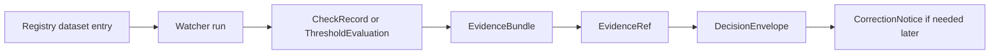

<!-- FILE: docs/operations/emit-only-watchers/SCHEMA_STUBS.md -->

<!--
doc_id: NEEDS VERIFICATION
title: Emit-Only Watchers Schema Stubs
type: standard
version: v1
status: draft
owners: [@bartytime4life, NEEDS VERIFICATION]
created: 2026-04-01
updated: 2026-04-01
policy_label: restricted
related: [
  "docs/governance/ROOT_GOVERNANCE.md",
  "docs/governance/ETHICS.md",
  "docs/governance/SOVEREIGNTY.md",
  "docs/operations/emit-only-watchers/README.md",
  "docs/operations/emit-only-watchers/NEXT_STEPS.md",
  "docs/operations/emit-only-watchers/REGISTRY.md",
  "docs/operations/emit-only-watchers/EVIDENCE_PACKAGING.md",
  "docs/operations/emit-only-watchers/GOVERNANCE_NOTES.md",
  "NEEDS VERIFICATION: schema directory path",
  "NEEDS VERIFICATION: contract ownership path"
]
tags: [kfm, operations, watchers, schemas, contracts, evidence, governance, lineage]
notes: [
  "Path is PROPOSED and NEEDS VERIFICATION against mounted repo.",
  "This document provides proposed schema stubs before repo-native JSON Schema files are split out.",
  "All schema shapes here are PROPOSED unless verified in repo."
]
-->

# Emit-Only Watchers Schema Stubs

**Purpose:** define proposed contract stubs for the minimum watcher runtime records needed to support governed emit-only behavior, evidence packaging, and visible correction lineage.

| Status | Owners | Quick fit |
|---|---|---|
|     | @bartytime4life, NEEDS VERIFICATION | Contract staging document before formal schema files and validators |

**Repo fit:** proposed contract staging file for watcher schemas and validation semantics.  
**Accepted inputs:** dataset registry entries, snapshot records, watcher observations, threshold evaluations, policy/consent gate results, correction actions.  
**Exclusions:** not a claim that these contracts already exist, not a full JSON Schema implementation set, not a release manifest, not an API guarantee without repo verification.

**Quick jumps:** [Scope](#scope) · [Why stubs first](#why-stubs-first) · [Contract set](#contract-set) · [Schema conventions](#schema-conventions) · [Stubs](#stub-1-checkrecord) · [Validation notes](#validation-notes) · [Split plan](#recommended-split-into-real-schema-files)

---

## Scope

This document is the bridge between narrative watcher documentation and real schema files.

It provides a proposed canonical shape for the core watcher records:

- `CheckRecord`
- `ThresholdEvaluation`
- `EvidenceRef`
- `EvidenceBundle`
- `DecisionEnvelope`
- `CorrectionNotice`
- `ConsentGateState`

These stubs are intentionally conservative:

- finite outcomes only,
- trust-visible negative states,
- explicit authority and policy classes,
- visible lineage,
- fail-closed handling for sensitive overlays.

---

## Repo fit

| Component | Role | Status |
|---|---|---|
| `README.md` | overview | **PROPOSED** |
| `NEXT_STEPS.md` | implementation sequencing | **PROPOSED** |
| `REGISTRY.md` | runtime inputs and configuration | **PROPOSED** |
| `EVIDENCE_PACKAGING.md` | payload requirements | **PROPOSED** |
| `GOVERNANCE_NOTES.md` | refusal/correction/exposure behavior | **PROPOSED** |
| `SCHEMA_STUBS.md` | contract staging layer | **PROPOSED** |

---

## Inputs

| Input | Why needed | Status |
|---|---|---|
| Registry dataset entry | source identity, authority, policy | **PROPOSED** |
| Accepted snapshot | trusted baseline | **PROPOSED** |
| Current observation | fresh source state | **PROPOSED** |
| Threshold config | meaningful-change logic | **PROPOSED** |
| Consent/policy state | gate logic | **PROPOSED** |
| Runtime metadata | replay/audit discipline | **PROPOSED** |

---

## Exclusions

These stubs do **not** yet define:

- repo-native `$id` conventions,
- formal JSON Schema draft version choice,
- codegen targets,
- API serialization guarantees,
- storage backend rules,
- migration strategy between schema versions.

All of those remain **NEEDS VERIFICATION** or future work.

---

## Why stubs first

Schema stubs are the next logical move because they force precision on the questions that matter most:

- What is the minimum valid watcher record?
- What fields are required for trust?
- What states are finite?
- What information must exist before an emit is allowed?
- What must be preserved when a correction occurs?

Without these answers, CI and implementation drift too easily into implicit behavior.

---

## Contract set

| Contract | Role | Status |
|---|---|---|
| `CheckRecord` | lightweight no-emit or routine check record | **PROPOSED** |
| `ThresholdEvaluation` | structured threshold comparison | **PROPOSED** |
| `EvidenceRef` | stable pointer to evidence | **PROPOSED** |
| `EvidenceBundle` | full proof package for consequential outputs | **PROPOSED** |
| `DecisionEnvelope` | finite decision outcome surface | **PROPOSED** |
| `CorrectionNotice` | visible lineage for later changes | **PROPOSED** |
| `ConsentGateState` | sensitive overlay gate status | **PROPOSED** |

---

## Schema conventions

These stubs assume the following contract conventions.

### Finite enums only

Where an outcome or class is important, use a finite enumerated vocabulary.

### Explicit nullability

If a field can be absent, prefer explicit `null` handling rather than implicit omission when omission would hide meaning.

### Versioned contracts

Each contract should have a `schema_version` field even before real JSON Schemas are split into files.

### Trust labels are metadata, not substitutes

A contract may carry labels such as `authority_class` or `policy_class`, but those do not replace evidence requirements.

### No silent negative-state collapse

`ABSTAIN`, `DENY`, and `ERROR` are first-class outputs, not exceptional afterthoughts.

---

## Enumerations

### Outcome enum

```json
["ANSWER", "ABSTAIN", "DENY", "ERROR"]
```

### Trigger enum

```json
["SCHEMA_CHANGE", "DOMAIN_DELTA", "CONSENT_EVENT", "NO_EMIT", "OPERATIONAL_FAILURE"]
```

### Authority class enum

```json
["authoritative", "provisional", "modeled", "derived"]
```

### Policy class enum

```json
["public", "generalized", "restricted", "withheld"]
```

### Correction action enum

```json
["withdraw", "narrow", "replace", "supersede"]
```

---

## Stub 1 — CheckRecord

**Role:** minimal record for a watcher run that did not produce a consequential emit, or for a routine logged check.

### Required fields

- `schema_version`
- `check_id`
- `dataset_id`
- `observed_at`
- `accepted_snapshot_id`
- `comparison_status`
- `emit_status`
- `reason_code`
- `reason_summary`

### Proposed stub

```json
{
  "schema_version": "v1",
  "check_id": "uuid",
  "dataset_id": "soils.ssurgo",
  "observed_at": "2026-04-01T00:00:00Z",
  "accepted_snapshot_id": "uuid",
  "comparison_status": "no_meaningful_change",
  "emit_status": "not_emitted",
  "reason_code": "hashes_match_baseline",
  "reason_summary": "Accepted baseline matched the current observation and no thresholds were triggered."
}
```

### Notes

- `comparison_status` should remain finite in implementation.
- `emit_status` should distinguish `not_emitted` from failed assembly states.

---

## Stub 2 — ThresholdEvaluation

**Role:** structured proof that a domain threshold was or was not crossed.

### Required fields

- `schema_version`
- `evaluation_id`
- `dataset_id`
- `metric`
- `window`
- `observed_value`
- `threshold_value`
- `comparison`
- `result`

### Proposed stub

```json
{
  "schema_version": "v1",
  "evaluation_id": "uuid",
  "dataset_id": "vegetation.hls_ndvi",
  "metric": "ndvi_delta",
  "window": "rolling_scene_compare",
  "observed_value": 0.18,
  "threshold_value": 0.15,
  "comparison": "gte",
  "result": "triggered",
  "masking_rule": "unmasked_only",
  "notes": []
}
```

### Notes

- `comparison` should be finite: `gt`, `gte`, `lt`, `lte`, `eq`, `neq`.
- `result` should be finite: `triggered`, `not_triggered`, `invalid`.

---

## Stub 3 — EvidenceRef

**Role:** stable machine-resolvable pointer to a watcher evidence package.

### Required fields

- `schema_version`
- `evidence_ref`
- `bundle_id`
- `kind`
- `created_at`

### Proposed stub

```json
{
  "schema_version": "v1",
  "evidence_ref": "evidence://bundle/uuid",
  "bundle_id": "uuid",
  "kind": "watcher_evidence_bundle",
  "created_at": "2026-04-01T00:00:00Z"
}
```

### Notes

- `evidence_ref` should remain stable even if underlying storage layout changes.
- `kind` should remain finite in implementation.

---

## Stub 4 — ConsentGateState

**Role:** explicit machine-checkable consent and revocation state for sensitive overlays.

### Required fields

- `schema_version`
- `overlay_id`
- `consent_status`
- `revocation_status`
- `lineage_scope`
- `checked_at`
- `fail_closed_applied`

### Proposed stub

```json
{
  "schema_version": "v1",
  "overlay_id": "genealogy.overlay.v1",
  "consent_status": "revoked",
  "revocation_status": "revoked",
  "lineage_scope": "generalized",
  "checked_at": "2026-04-01T00:00:00Z",
  "consent_token_hash": "sha256:...",
  "revocation_root": "sha256:...",
  "fail_closed_applied": true
}
```

### Notes

- `consent_status` should be finite: `active`, `revoked`, `expired`, `unknown`.
- `lineage_scope` should remain finite and policy-compatible.
- Unknown consent on restricted overlays should not be silently coerced into usable state.

---

## Stub 5 — EvidenceBundle

**Role:** minimum consequential proof package linking source identity, baseline, comparison, gates, outcome, and human-readable explanation.

### Required fields

- `schema_version`
- `bundle_id`
- `bundle_kind`
- `dataset`
- `observation`
- `baseline` or explicit `baseline_unavailable_reason`
- `trigger`
- `outcome`
- `human_summary`

### Proposed stub

```json
{
  "schema_version": "v1",
  "bundle_id": "uuid",
  "bundle_kind": "watcher_evidence_bundle",
  "dataset": {
    "dataset_id": "air.airnow.pm25",
    "domain": "air",
    "authority_class": "provisional",
    "policy_class": "public",
    "upstream_locator": "NEEDS VERIFICATION",
    "source_descriptor_hash": "sha256:..."
  },
  "observation": {
    "observed_at": "2026-04-01T00:00:00Z",
    "watcher_run_id": "uuid",
    "watcher_version": "NEEDS VERIFICATION",
    "normalization_version": "NEEDS VERIFICATION"
  },
  "baseline": {
    "accepted_snapshot_id": "uuid",
    "accepted_at": "2026-03-25T00:00:00Z",
    "spec_hash": "sha256:old",
    "content_hash": "sha256:old-content"
  },
  "comparison": {
    "new_spec_hash": "sha256:new",
    "new_content_hash": "sha256:new-content",
    "change_summary": [
      "weekly_change metric crossed configured threshold"
    ],
    "threshold_evaluation_ref": "evaluation://uuid"
  },
  "trigger": {
    "trigger_type": "DOMAIN_DELTA",
    "reason_code": "pm25_threshold_crossed",
    "reason_summary": "Observed PM2.5 weekly change exceeded the configured threshold."
  },
  "gates": {
    "requires_human_review": false,
    "consent_gate_required": false,
    "publication_mode": "public"
  },
  "outcome": {
    "outcome": "ANSWER",
    "emit_status": "emitted",
    "created_at": "2026-04-01T00:00:00Z"
  },
  "lineage": {
    "supersedes": null,
    "related_decision_ids": []
  },
  "human_summary": "Air watcher emitted because the configured weekly-change threshold was crossed, but the source remains provisional and should not be treated as validated regulatory truth."
}
```

### Notes

- `dataset.authority_class` and `dataset.policy_class` should be mandatory for emitted bundles.
- `baseline` should not be omitted without an explicit reason.
- `human_summary` is required because trust-visible inspection is a design goal, not a cosmetic add-on.

---

## Stub 6 — DecisionEnvelope

**Role:** finite, downstream-consumable decision surface tied to watcher evidence.

### Required fields

- `schema_version`
- `decision_id`
- `dataset_id`
- `trigger_type`
- `outcome`
- `reason_code`
- `evidence_refs`
- `created_at`

### Proposed stub

```json
{
  "schema_version": "v1",
  "decision_id": "uuid",
  "dataset_id": "soils.ssurgo",
  "trigger_type": "SCHEMA_CHANGE",
  "outcome": "ANSWER",
  "reason_code": "spec_hash_changed",
  "reason_summary": "Accepted schema signature changed relative to the prior baseline.",
  "evidence_refs": [
    "evidence://bundle/uuid"
  ],
  "policy_class": "public",
  "authority_class": "authoritative",
  "requires_human_review": false,
  "supersedes": null,
  "created_at": "2026-04-01T00:00:00Z"
}
```

### Notes

- `DecisionEnvelope` should remain smaller than `EvidenceBundle`; it is the decision surface, not the full proof payload.
- `evidence_refs` should never be empty for consequential outputs.

---

## Stub 7 — CorrectionNotice

**Role:** explicit visible lineage when a prior watcher result is narrowed, withdrawn, replaced, or superseded.

### Required fields

- `schema_version`
- `correction_id`
- `applies_to`
- `action`
- `reason`
- `created_at`

### Proposed stub

```json
{
  "schema_version": "v1",
  "correction_id": "uuid",
  "applies_to": "decision-uuid",
  "action": "supersede",
  "reason": "Upstream provider revised the source metadata, invalidating the prior schema-change interpretation.",
  "replacement_ref": "decision-uuid-2",
  "created_at": "2026-04-01T00:00:00Z"
}
```

### Notes

- A correction should not mutate the original decision in place.
- `replacement_ref` may be null for `withdraw`.

---

## Cross-contract invariants

### Invariant 1 — Finite outcomes only
`DecisionEnvelope.outcome` must be one of:
- `ANSWER`
- `ABSTAIN`
- `DENY`
- `ERROR`

### Invariant 2 — No consequential decision without evidence
If outcome is consequential, `evidence_refs` must be non-empty.

### Invariant 3 — Sensitive overlays fail closed
If `policy_class` is `restricted` or `withheld` and consent is required, unknown consent must not result in `ANSWER`.

### Invariant 4 — Authority class must remain explicit
Every consequential decision must carry an `authority_class`.

### Invariant 5 — Corrections preserve lineage
If a correction occurs, the original decision remains addressable.

### Invariant 6 — Baseline and last-seen are not synonyms
Accepted baseline identifiers must not be silently replaced by raw last-observed state.

---

## Validation notes

### Contract-level validation

| Contract | Key validation rule |
|---|---|
| `CheckRecord` | no `emitted` status if no bundle/evidence exists |
| `ThresholdEvaluation` | numeric comparison fields must be present when `result = triggered` |
| `EvidenceRef` | must resolve to exactly one bundle |
| `ConsentGateState` | unknown consent with fail-closed cannot be treated as usable |
| `EvidenceBundle` | emitted bundles require human summary and finite outcome |
| `DecisionEnvelope` | consequential outcomes require non-empty evidence refs |
| `CorrectionNotice` | `action` must be finite and original record must remain identifiable |

### CI-oriented validation

- unchanged fixtures produce valid `CheckRecord` only
- threshold fixtures produce valid `ThresholdEvaluation` and `EvidenceBundle`
- emitted fixtures without `authority_class` fail validation
- consent-denied fixtures must not validate as `ANSWER`
- corrections must not overwrite original decision identifiers

---

## Recommended split into real schema files

Once repo paths are verified, this staging doc should be split into individual schema files.

### Proposed split

```text
docs/
└── operations/
    └── emit-only-watchers/
        ├── SCHEMA_STUBS.md
        └── schemas/
            ├── check-record.schema.json
            ├── threshold-evaluation.schema.json
            ├── evidence-ref.schema.json
            ├── consent-gate-state.schema.json
            ├── evidence-bundle.schema.json
            ├── decision-envelope.schema.json
            └── correction-notice.schema.json
```

**Status:** **PROPOSED** and **NEEDS VERIFICATION**.

---

## Example end-to-end chain



---

## Example minimal end-to-end payload set

### 1) Check record

```yaml
schema_version: v1
check_id: uuid
dataset_id: hydrology.nwis.station_meta
observed_at: "2026-04-01T00:00:00Z"
accepted_snapshot_id: uuid
comparison_status: no_meaningful_change
emit_status: not_emitted
reason_code: metadata_match
reason_summary: No meaningful station metadata change detected against accepted baseline.
```

### 2) Evidence bundle + decision

```yaml
bundle:
  schema_version: v1
  bundle_id: uuid
  bundle_kind: watcher_evidence_bundle
  dataset:
    dataset_id: soils.ssurgo
    domain: soils
    authority_class: authoritative
    policy_class: public
  trigger:
    trigger_type: SCHEMA_CHANGE
    reason_code: spec_hash_changed
  outcome:
    outcome: ANSWER
    emit_status: emitted
  human_summary: SSURGO schema changed relative to the accepted baseline.

decision:
  schema_version: v1
  decision_id: uuid
  dataset_id: soils.ssurgo
  trigger_type: SCHEMA_CHANGE
  outcome: ANSWER
  reason_code: spec_hash_changed
  evidence_refs:
    - evidence://bundle/uuid
```

### 3) Later correction

```yaml
schema_version: v1
correction_id: uuid
applies_to: decision-uuid
action: supersede
reason: Upstream metadata revision changed the interpretation of the earlier schema delta.
replacement_ref: decision-uuid-2
created_at: "2026-04-02T00:00:00Z"
```

---

## FAQ

### Why define `SCHEMA_STUBS.md` before raw `.schema.json` files?
Because the narrative contract needs to stabilize before implementation details harden.

### Why keep both `EvidenceBundle` and `DecisionEnvelope`?
Because the bundle is the proof payload, while the envelope is the concise finite decision surface.

### Why require `authority_class` on consequential outputs?
Because without it, downstream systems can silently flatten important truth distinctions.

### Why make corrections explicit contracts?
Because quiet supersession breaks lineage and weakens trust.

---

## Truth labels used here

| Label | Meaning |
|---|---|
| **CONFIRMED** | directly supported by visible doctrine or repo evidence |
| **INFERRED** | strongly implied by doctrine, not live-verified as implementation |
| **PROPOSED** | recommended shape consistent with doctrine |
| **UNKNOWN** | no reliable session evidence |
| **NEEDS VERIFICATION** | paths, schema file locations, ownership, validator tooling, or draft versions require in-repo confirmation |

---

[Back to top](#emit-only-watchers-schema-stubs)
