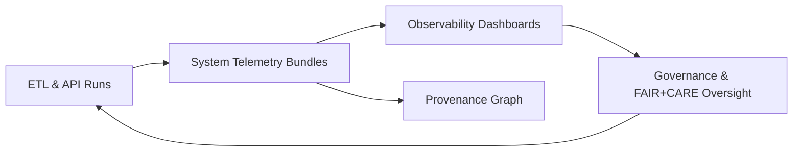

<div align="center">

# 🌐 Kansas Frontier Matrix (KFM v11) — Core System Overview  
`docs/overview/README.md`

**Purpose:**  
Provide a single, authoritative overview of the Kansas Frontier Matrix (KFM v11) — its mission, architecture, data domains, governance, and telemetry — so all teams share the same mental model of the deterministic, provenance-driven, FAIR+CARE-governed system.

</div>

---

## 📘 Overview

The Kansas Frontier Matrix (KFM) is a **unified geospatial, historical, cultural, and scientific knowledge system** designed to integrate:

- **Open data** across many domains (environmental, archaeological, historical, cultural).  
- **AI-assisted reasoning** through Story Nodes and Focus Mode.  
- **FAIR+CARE-aligned governance** and Indigenous data sovereignty.  
- **Deterministic, provenance-driven pipelines** from ingest to user-facing maps and narratives.  

KFM v11 introduces:

- The **Diamond⁹ Ω / Crown∞Ω trust layer** for end-to-end provenance and integrity.  
- Event-time and record-time determinism across ETL and graph layers.  
- Multi-layer provenance (STAC → DCAT → PROV) with catalog + graph alignment.  
- A fully typed operational backbone for AI-augmented narrative exploration and analysis.

### 🧠 Mission

KFM exists to:

- Integrate **environmental, archaeological, historical, climatological, and cultural datasets** into a verifiable shared model.  
- Provide **transparent provenance**, reproducible ETL, and **governed data transformations**.  
- Enable **AI-assisted Story Nodes**, spatial analytics, and Focus Mode narrative immersion.  
- Support **Indigenous sovereignty and ethical handling of sensitive cultural information**, including robust privacy-aligned H3 generalization and masking rules.  
- Offer a durable, open-source framework capable of scientific audit, longitudinal study, and community use.

---

## 🗂️ Directory Layout

High-level monorepo layout relevant to this overview:

```text
📂 KansasFrontierMatrix/
├── 📂 docs/                                  # Documentation (this overview + standards, architecture, guides)
│   ├── 📂 overview/                          # 🌐 Core system overview & high-level narratives
│   │   └── 📄 README.md                      # 🌐 Core System Overview (this file)
│   ├── 📂 standards/                         # 📑 Governance, markdown, security, geospatial standards
│   ├── 📂 architecture/                      # 🧱 Detailed subsystem designs (ETL, graph, API, web, Focus Mode)
│   ├── 📂 analyses/                          # 🔬 Domain analyses & case studies (archaeology, hydrology, etc.)
│   └── 📂 guides/                            # 📘 How-to guides & SOP-style walkthroughs
├── 📂 src/                                   # 💻 Source code (pipelines, graph, API, web)
│   ├── 📂 pipelines/                         # ⚙️ Deterministic ETL & orchestration
│   ├── 📂 graph/                             # 🧠 Neo4j schema, loaders, queries
│   ├── 📂 api/                               # 🔌 API layer (REST/GraphQL, STAC/DCAT proxy)
│   └── 📂 web/                               # 🖥️ React · MapLibre · Cesium frontend
├── 📂 data/                                  # 🗃️ Data lifecycle: raw → work → processed → stac
│   ├── 📂 sources/                           # 📜 Source manifests (STAC/DCAT-aligned)
│   ├── 📂 raw/                               # 📥 Ingested raw data (LFS/DVC; not committed directly)
│   ├── 📂 work/                              # 🧪 Intermediate normalized/enriched data
│   ├── 📂 processed/                         # ✅ Production-ready data exports
│   └── 📂 stac/                              # 🌐 STAC Collections & Items indexing processed assets
├── 📂 schemas/                               # 📐 JSON, STAC, DCAT, PROV, telemetry schemas
├── 📂 mcp/                                   # 🧬 Master Coder Protocol experiments, model cards, SOPs
├── 📂 releases/                              # 📦 Versioned releases, SBOMs, manifests, telemetry bundles
└── 📂 .github/workflows/                     # 🔁 CI/CD: kfm-ci, docs-lint, lineage-audit, energy/carbon checks
```

Any new top-level module or directory must extend this tree and be documented here or under `docs/architecture/`.

---

## 🧭 Context

KFM’s operational pipeline is:

> Deterministic ETL → STAC/DCAT/PROV catalogs → Neo4j knowledge graph → API layer → React/MapLibre/Cesium frontend → Story Nodes → Focus Mode.

Key contextual elements:

- **Deterministic ETL**  
  - All transformations are config-driven and repeatable.  
  - Inputs are hash-locked; outputs can be reproduced from manifests, schemas, and commit IDs.  

- **Catalog layer (STAC/DCAT/PROV)**  
  - STAC for spatial assets and scenes.  
  - DCAT for datasets and catalogs.  
  - PROV for activities, derivations, and agents.  

- **Graph backbone (Neo4j)**  
  - Represents entities (places, events, people, datasets, Story Nodes).  
  - Links to catalog records and provenance entities.  

- **Frontend + narrative layer**  
  - Web client (React · MapLibre · Cesium) provides maps, 3D scenes, and narrative interfaces.  
  - Story Nodes and Focus Mode use graph + catalog views to drive narrative exploration.

The system overview ties these components together, setting the frame for more detailed docs in `docs/architecture/` and `docs/standards/`.

---

## 🗺️ Diagrams

### 1. High-level system flow

```mermaid
flowchart TD
    Ingest[Source Data & Streams] --> ETL[Deterministic ETL Pipelines]
    ETL --> Catalogs[STAC / DCAT / PROV Catalogs]
    Catalogs --> Graph[Neo4j Knowledge Graph]
    ETL --> Graph
    Graph --> API[API Layer (Graph + STAC Fusion)]
    Catalogs --> API
    API --> Frontend[React · MapLibre · Cesium]
    Frontend --> StoryNodes[Story Nodes]
    Frontend --> FocusMode[Focus Mode v3]
```

### 2. Telemetry & governance loop (conceptual)



Diagrams are illustrative; more detailed subsystem diagrams live under `docs/architecture/`.

---

## 🧠 Story Node & Focus Mode Integration

KFM v11 treats Story Nodes and Focus Mode as **first-class citizens**:

- **Story Nodes**
  - Narrative objects that bind text, media, spatial extent, temporal extent, and graph links.  
  - Backed by ETL- and graph-generated metadata (e.g., `kfm_geoethics`, geoprivacy labels).  
  - Appear in map sidebars, detail pages, and catalog cross-links.  

- **Focus Mode**
  - A scoped workspace centered on a Story Node, place, or event.  
  - Combines:
    - Local graph neighborhood.  
    - Related datasets (via STAC/DCAT).  
    - Geoethical and geoprivacy overlays.  
    - Timelines, maps, and 3D scenes.  

Integration expectations:

- The **core system architecture** (this document) defines the **allowed data flows** into Story Nodes and Focus Mode.  
- Story Node and Focus Mode docs (under `docs/frontend/story-nodes/` and `docs/frontend/focus-mode/`) provide detailed contracts that must remain consistent with this overview.  
- AI agents operating within Focus Mode must honor:
  - Geoprivacy and masking standards.  
  - Geoethical Reflection Layer declarations.  
  - Governance constraints described here and in `docs/standards/`.

---

## 🧪 Validation & CI/CD

KFM treats system architecture and overview assumptions as **testable contracts**:

- **CI workflows** (`.github/workflows/*`) must:
  - Validate ETL, catalog, graph, API, and frontend components against their schemas and standards.  
  - Run lineage audits to ensure PROV, STAC, and DCAT links are intact.  
  - Enforce Markdown protocol compliance (`KFM-MDP v11.2.4`) for docs like this overview.  

- **System-level checks** should cover:
  - Determinism of ETL pipelines (same inputs → same outputs).  
  - Presence and consistency of catalog entries for key datasets.  
  - Connectivity of graph nodes to catalog/provenance entities.  
  - Telemetry emission rates and schema conformance.  

- **Release gating**:
  - v11.2.4 and later releases rely on SBOM, manifest, and telemetry bundles referenced in this front matter to validate the integrity of the deployed system.

Details of specific test profiles live in `docs/standards/` and `docs/architecture/`; this overview states the expectation that **all layers participate in CI/CD validation**.

---

## 📦 Data & Metadata

### 1. Integrated data domains

KFM aggregates multiple domain datasets into a single governed system:

#### 🌱 Environmental & physical systems

- Soils (SSURGO, gNATSGO, SDA automated pulls).  
- Hydrology (NHD, groundwater, aquifers, river networks).  
- Climatology and weather (HRRR, ERA5, GOES/NEXRAD event streams).  
- Land cover, fire history, topography, geology, and terrain models.  

#### 🏺 Archaeology & cultural heritage

- Stratigraphic analyses and context models.  
- Artifact distributions and generalized site models (H3 masking + sovereignty rules).  
- Protohistoric interaction networks and cultural landscapes.  

#### 📜 Historical & narrative sources

- Exploration routes and travel accounts.  
- County-level historical atlases and gazetteers.  
- Period newspapers (OCR + NLP pipelines for entity/timeline extraction).  
- Migration timelines and settlement patterns.  

### 2. Telemetry & observability data

Every pipeline and API run contributes metadata and telemetry:

- Energy usage (kWh) and carbon equivalent (CO₂e).  
- Runtime reliability metrics (latency, error rates, retries).  
- Cache hit/miss ratios and data volume processed.  
- CI/CD provenance (commit → artifact → attestation).  

These flow into:

- `releases/v11.2.4/system-telemetry.json` (aggregated bundles).  
- Telemetry indexes defined under `schemas/telemetry/`.  
- Observability dashboards and the provenance graph for governance review.

---

## 🌐 STAC, DCAT & PROV Alignment

KFM’s core system is explicitly aligned with **STAC**, **DCAT**, and **PROV-O**:

- **STAC (SpatioTemporal Asset Catalog)**  
  - Used for spatial and spatiotemporal assets (rasters, vector layers, scenes).  
  - Each asset:
    - Has a STAC Item with geometry, bbox, datetime, and licensing.  
    - May carry KFM-specific fields (geoprivacy, geoethics, energy metrics).  

- **DCAT (Data Catalog Vocabulary)**  
  - Used for logical datasets, collections, and data services.  
  - Links STAC Items, analyses, and derived products into dataset-level views.  
  - Records dataset-level license, access, and spatial/temporal coverage.  

- **PROV-O (W3C Provenance Ontology)**  
  - Used for representing:
    - ETL runs as `prov:Activity`.  
    - Inputs and outputs as `prov:Entity`.  
    - Services, authors, and tools as `prov:Agent`.  
  - Connects:
    - Source datasets → ETL runs → processed assets → graph nodes → Story Nodes.  

The core overview establishes that **no major system artifact is “opaque”**: everything is cataloged (STAC/DCAT) and traceable (PROV).

---

## 🧱 Architecture

### 1. System pipeline

Conceptually, KFM’s architecture can be summarized:

```text
Deterministic ETL Pipelines
        ↓
STAC / DCAT / PROV catalogs
        ↓
Neo4j Knowledge Graph (temporal + spatial)
        ↓
API Layer (Graph + STAC fusion services)
        ↓
Web Frontend (React · MapLibre · Cesium)
        ↓
Story Nodes + Focus Mode v3
```

### 2. Key subsystems

#### 2.1 Deterministic ETL

- Hash-locked inputs and config-driven runs.  
- WAL-safe processing and idempotent upserts.  
- Versioned environments (container images, dependencies) per release.  

#### 2.2 Metadata & ontology layer

- **STAC 1.x** for spatial assets.  
- **DCAT 3.0** for dataset catalogs.  
- **PROV-O** for activity and derivation graphs.  
- **CIDOC-CRM** alignment for heritage contexts.  
- **OWL-Time** for temporal semantics.  
- **GeoSPARQL** for spatial reasoning in the graph.  

#### 2.3 Knowledge graph (Neo4j)

- Bitemporal modeling (record time vs. event time).  
- Spatial anchoring via GeoSPARQL-compatible representations.  
- Narrative linking for Story Nodes and Focus Mode.  
- Multi-layer provenance edges linking graph entities to STAC/DCAT/PROV records.  

#### 2.4 API layer

- GraphQL/REST endpoints for:
  - STAC search and dataset discovery.  
  - Graph queries (place → events → narratives → datasets).  
  - Focus Mode data bundles (graph + catalog + telemetry summaries).  

#### 2.5 Frontend (React · MapLibre · Cesium)

- Multi-resolution 2D/3D maps and scenes.  
- Narrative-first exploration (Story Nodes and Focus Mode).  
- Governance overlays (geoethics, access labels, masking indicators).  
- Deep-linkable URLs for nodes, datasets, and scenes.

### 3. Roadmap (v11 → v12) — high-level

As of v11.2.4, roadmap themes include:

- Full PROV-O reification in the graph (fine-grained lineage for key pipelines).  
- Enhanced Story Node auto-generation from cross-domain evidence.  
- Real-time atmospheric ingestion and replay engines.  
- Integrated AI inference for pattern detection (e.g., archaeology, hydrology) under strict governance.  
- Multi-scale modeling (hydrology, climate, infrastructure).  
- Focus Mode v3+ semantic timeline and scenario views.

---

## ⚖ FAIR+CARE & Governance

KFM’s core architecture is built on FAIR and CARE principles and explicitly respects Indigenous data sovereignty:

- **FAIR**
  - *Findable*: STAC/DCAT catalogs and graph indexes make entities and datasets discoverable.  
  - *Accessible*: governed access paths via API and frontend, with clear rights and licenses.  
  - *Interoperable*: alignment with widely-used standards (STAC, DCAT, PROV, CIDOC-CRM, GeoSPARQL).  
  - *Reusable*: documented lineage, masking rules, and licensing support responsible reuse.  

- **CARE**
  - *Collective Benefit*: shared infrastructure for community, research, and educational uses.  
  - *Authority to Control*: sovereignty policies and review boards govern sensitive data and narratives.  
  - *Responsibility*: masking, geoethics, and AI-supply-chain standards enforce responsible operation.  
  - *Ethics*: system design explicitly considers risks of re-identification, misrepresentation, or cultural harm.  

Governance hooks:

- This overview is subordinate to:
  - KFM Governance Framework (`docs/standards/governance/ROOT-GOVERNANCE.md`).  
  - Markdown Authoring Protocol (`docs/standards/kfm_markdown_protocol_v11.2.4.md`).  
  - Domain-specific standards (geoprivacy, geoethical reflection, AI supply-chain security, etc.).  

Architecture changes that impact these guarantees must be accompanied by:

- Updated standards or architecture docs.  
- Governance review and sign-off.  
- Updated telemetry and provenance expectations where relevant.

---

## 🕰️ Version History

| Version | Date       | Status            | Notes                                           |
|--------:|------------|-------------------|-------------------------------------------------|
| v11.2.4 | 2025-12-05 | Active / Enforced | Initial consolidated KFM v11.2.4 core overview. |
| v11.2.3 | 2025-12-01 | Superseded        | Metadata unification and catalog alignment.     |
| v11.2.2 | 2025-11-28 | Superseded        | Governance and compliance expansion.            |

Future revisions must:

- Document any changes to the high-level pipeline, standards stack, or core subsystems.  
- Keep directory layout and architectural descriptions in sync with `docs/architecture/`.  
- Update references to telemetry, governance, and standards when underlying schemas or policies change.

---

<div align="center">

🌐 **Kansas Frontier Matrix (KFM v11.2.4) — Core System Overview**  
Scientific Insight · FAIR+CARE Governance · Deterministic Pipelines  

[📘 Docs Root](..) · [📂 Standards Index](../standards/README.md) · [⚖ Governance](../standards/governance/ROOT-GOVERNANCE.md)

</div>