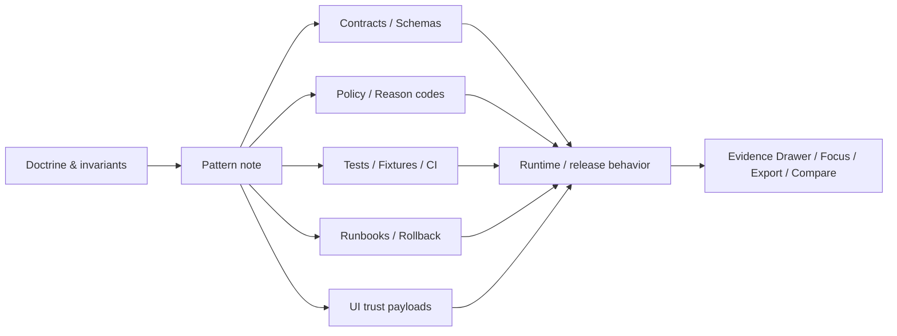

# Patterns

Reusable pattern lane for KFM implementation shapes that must stay evidence-first, trust-visible, and downstream of doctrine, contracts, policy, tests, and released proof.

> [!NOTE]
> **Status:** experimental  
> **Owners:** `@bartytime4life` · lane-level ownership beyond broad `/docs/` coverage is **NEEDS VERIFICATION**  
>      
> **Quick jumps:** [Scope](#scope) · [Repo fit](#repo-fit) · [Accepted inputs](#accepted-inputs) · [Exclusions](#exclusions) · [Current verified snapshot](#current-verified-snapshot) · [Directory tree](#directory-tree) · [Quickstart](#quickstart) · [Usage](#usage) · [Diagram](#diagram) · [Pattern map](#pattern-map) · [Routing matrix](#put-it-here-or-elsewhere) · [Task list](#task-list--definition-of-done) · [FAQ](#faq) · [Appendix](#appendix)  
> **Repo fit:** `docs/patterns/README.md` → upstream: [`../README.md`](../README.md), [`../../README.md`](../../README.md), [`../architecture/README.md`](../architecture/README.md), [`../standards/README.md`](../standards/README.md), [`../runbooks/README.md`](../runbooks/README.md), [`../templates/TEMPLATE__KFM_UNIVERSAL_DOC.md`](../templates/TEMPLATE__KFM_UNIVERSAL_DOC.md), [`../standards/KFM_MARKDOWN_WORK_PROTOCOL.md`](../standards/KFM_MARKDOWN_WORK_PROTOCOL.md) · adjacent machine-facing surfaces: [`../../contracts/`](../../contracts/), [`../../schemas/`](../../schemas/), [`../../policy/`](../../policy/), [`../../tests/`](../../tests/), [`../../.github/workflows/`](../../.github/workflows/), [`../../.github/actions/README.md`](../../.github/actions/README.md), [`../../.github/watchers/README.md`](../../.github/watchers/README.md) · downstream: future pattern leaves in this lane plus consumers in [`../../apps/`](../../apps/), [`../../packages/`](../../packages/), [`../../pipelines/`](../../pipelines/), [`../../infra/`](../../infra/), and [`../../data/README.md`](../../data/README.md)

> [!IMPORTANT]
> A KFM pattern captures a **repeatable implementation shape**. It is not the authority for the exact schema, policy bundle, workflow, emitted receipt, or runtime proof it references.

> [!WARNING]
> Current public-repo inspection confirms the `docs/patterns/` lane but did **not** directly verify its full local file inventory in this session. Treat any example filenames beyond this README as **PROPOSED** or **NEEDS VERIFICATION** until the mounted working tree is checked locally.

## Scope

This lane exists for reusable KFM patterns that repeatedly translate doctrine into buildable shape without pretending that shape is already implemented.

Place pattern material here when it is mainly about:

- cross-cutting implementation form that recurs across more than one lane or subsystem
- contract → policy → test → workflow → proof choreography
- trust-visible shell payload and runtime outcome shape
- governed promotion, correction, rollback, or stale-visible delivery patterns
- watcher, evaluator, receipt, attestation, or PR-first automation patterns
- routing guidance that helps maintainers put detail in the correct owning surface

A good pattern page should leave a reader knowing **where the truth lives**, **what the repeatable shape is**, and **which adjacent surfaces must carry the real enforcement**.

## Repo fit

| Path | Role | Relationship |
| --- | --- | --- |
| `docs/patterns/README.md` | directory index and routing surface | this file |
| `docs/README.md` | docs hub | parent documentation entry point |
| `docs/architecture/README.md` | architecture lane | use when the question is system structure, boundaries, or architecture-scale consequences |
| `docs/standards/README.md` | standards lane | use when the object becomes normative, machine-validatable, or profile-bearing |
| `docs/runbooks/README.md` | runbooks lane | use when the page becomes operator procedure or incident/recovery guidance |
| `docs/templates/TEMPLATE__KFM_UNIVERSAL_DOC.md` | writing scaffold | use when authoring a new pattern leaf |
| `contracts/`, `schemas/`, `policy/`, `tests/`, `.github/workflows/` | enforcement surfaces | patterns must route into these; they must not replace them |

## Accepted inputs

Put material here when it is primarily a **repeatable pattern**, for example:

- contract-first publication and promotion shapes
- evidence resolution and `EvidenceBundle` drill-through patterns
- `RuntimeResponseEnvelope` / negative-path UI behavior patterns
- `ReleaseManifest`, correction, rollback, and stale-projection routing patterns
- evaluator / watcher / draft-PR / attestation flow patterns
- cross-lane trust-surface payload conventions
- short implementation maps that connect architecture doctrine to the owning contracts, policy, tests, workflows, and runbooks

## Exclusions

Do **not** place the following here:

| Do not put this here | Put it there instead |
| --- | --- |
| Exact JSON Schema or contract definitions | `contracts/` and `schemas/` |
| Rego / Conftest rules, reason codes, or policy bundles | `policy/` |
| CI workflows, composite actions, or executable automation glue | `.github/workflows/` or `.github/actions/` |
| Emitted receipts, manifests, proof packs, or runtime evidence artifacts | the owning data/release/artifact surface |
| One-off architecture decisions or boundary changes | `docs/architecture/` or `docs/adr/` |
| Domain-specific procedures and operational checklists | `docs/runbooks/` or the owning domain lane |
| Free-form research notes or exploratory packet material | `docs/research/`, `docs/analyses/`, or another exploratory lane |
| Unsupported claims that a pattern is already live | keep it labeled **PROPOSED**, **UNKNOWN**, or **NEEDS VERIFICATION** |

## Status vocabulary used here

| Label | Use in this lane |
| --- | --- |
| **CONFIRMED** | Directly verified in the visible repo or the controlling project corpus |
| **INFERRED** | Small structural completion strongly implied by KFM doctrine and adjacent repo evidence |
| **PROPOSED** | Recommended pattern shape or next step that fits KFM but is not proven as live implementation |
| **UNKNOWN** | Not verified strongly enough in this session |
| **NEEDS VERIFICATION** | Review flag for file inventory, ownership, branch parity, or implementation status |

## Current verified snapshot

| Status | Snapshot |
| --- | --- |
| **CONFIRMED** | The public `docs/` tree currently includes a first-level `patterns/` directory. |
| **CONFIRMED** | The docs lane already uses README hubs for `architecture`, `runbooks`, `standards`, and `templates`, which gives this file a clear neighboring style to align with. |
| **CONFIRMED** | KFM documentation is treated as a production-facing trust surface and should not silently replace contracts, policy, tests, or proof artifacts. |
| **UNKNOWN** | The exact local file inventory under `docs/patterns/` in the mounted working tree. |
| **PROPOSED** | This README should act as the routing/index surface for the lane. |
| **NEEDS VERIFICATION** | Whether the parent `docs/README.md` should add or repair a first-class backlink to this lane. |

## Directory tree

Conservative destination shape for this lane:

```text
docs/
└── patterns/
    ├── README.md
    ├── <pattern-note>.md          # add only when owned, linked, and reviewable
    └── <family>/                  # optional once one pattern family needs grouping
```

> [!TIP]
> Replace placeholder entries with the **actual** local inventory after mounted-tree verification. Until then, keep the tree intentionally small rather than guessing.

## Quickstart

Start narrow and verify the neighboring surfaces before you add a new pattern page.

```bash
# 1) Verify this lane locally
ls docs/patterns 2>/dev/null
find docs/patterns -maxdepth 3 -type f 2>/dev/null | sort

# 2) Inspect adjacent documentation conventions
sed -n '1,220p' docs/README.md
sed -n '1,220p' docs/architecture/README.md
sed -n '1,220p' docs/standards/README.md
sed -n '1,220p' docs/runbooks/README.md
sed -n '1,220p' docs/standards/KFM_MARKDOWN_WORK_PROTOCOL.md
sed -n '1,220p' docs/templates/TEMPLATE__KFM_UNIVERSAL_DOC.md

# 3) Inspect owning enforcement surfaces before drafting a pattern
find contracts schemas policy tests .github/workflows -maxdepth 3 -type f 2>/dev/null | sort | sed -n '1,240p'

# 4) Search for existing KFM trust-object terminology
grep -RIn "EvidenceBundle\|RuntimeResponseEnvelope\|ReleaseManifest\|DecisionEnvelope\|CorrectionNotice" \
  docs contracts schemas policy tests .github 2>/dev/null
```

## Usage

### Add a new pattern leaf

1. Confirm the problem is **repeatable** and not just a one-off architecture decision.
2. Identify the owning enforcement surfaces first: contract, schema, policy, test, workflow, runbook, UI payload, or emitted proof artifact.
3. Write the pattern page so it explains the **shape**, not the fake certainty of implementation.
4. Mark all unverified repo or runtime details as **INFERRED**, **PROPOSED**, **UNKNOWN**, or **NEEDS VERIFICATION**.
5. Update this README if the lane’s verified inventory, naming conventions, or routing boundaries change.

### Update this README

Update this file when any of the following changes:

- the verified file inventory in `docs/patterns/` changes
- a stable local naming convention for pattern leaves is adopted
- parent docs hubs begin routing into this lane
- a pattern family grows large enough to deserve subdirectories or a registry table
- adjacent owning surfaces move, split, or change responsibility
- the lane starts using a stricter standard-doc wrapper in addition to the README index role

## Diagram



## Pattern map

| Pattern family | Best use in this lane | Must link outward to | Must not become |
| --- | --- | --- | --- |
| Contract-first pattern | explain how doctrine usually resolves into typed objects such as source, decision, evidence, release, and correction shapes | `contracts/`, `schemas/`, `tests/` | the schema itself |
| Promotion / correction pattern | explain release, rollback, stale-visible, or correction choreography | `policy/`, `docs/runbooks/`, `.github/workflows/`, emitted proof artifacts | a release proof pack |
| Runtime trust-surface pattern | explain how evidence, citations, negative outcomes, and surface state should appear to the user | UI docs, API contracts, tests, runtime samples | shipping UI truth |
| Derived-delivery pattern | explain how tiles, search, vector, graph, scene, or export layers inherit release scope and correction state | pipelines, tests, runbooks, release artifacts | authoritative source truth |
| Watcher / evaluator / PR-first pattern | explain the governed shape of observe → propose → gate → review flows | `.github/watchers/`, `.github/actions/`, `.github/workflows/`, `policy/`, `tests/` | live automation proof |
| Domain handoff pattern | explain how a cross-cutting pattern enters a lane such as hydrology, hazards, soils, transport, or ecology | lane docs, lane code, lane contracts | domain procedure ownership |

## Put it here or elsewhere?

| Candidate content | Put it in `docs/patterns/`? | Better home / why |
| --- | --- | --- |
| A reusable `EvidenceBundle` → Evidence Drawer → Focus explanation shape | **Yes** | Pattern lane is the right place for a cross-cutting trust-surface shape |
| The exact `evidence_bundle.schema.json` definition | **No** | `contracts/` / `schemas/` own the machine contract |
| The Rego rule that denies uncited outward responses | **No** | `policy/` owns executable governance |
| A GitHub Action that opens a review PR | **No** | `.github/actions/` or workflow files own executable automation |
| A one-off choice about splitting one service into two | **Usually no** | `docs/architecture/` or `docs/adr/` owns one-off architecture decisions |
| A hydrology-specific operating checklist | **No** | `docs/runbooks/` or the hydrology lane should own procedure |
| A repeatable “draft PR + receipt + review gate + rollback” flow used across domains | **Yes** | Cross-cutting, reusable, and needs clear routing into owning enforcement surfaces |

## Task list / definition of done

Before treating this lane as stable, confirm the following:

- [ ] The mounted working tree confirms the actual `docs/patterns/` inventory.
- [ ] Any new pattern note names its owning contract / policy / test / workflow / runbook surfaces.
- [ ] Example filenames and snippets are labeled **Illustrative** when not directly verified.
- [ ] No pattern note implies live implementation without direct evidence.
- [ ] Parent docs hubs link here only when the lane is ready to be routable.
- [ ] Behavior-significant pattern changes update adjacent docs and not just this lane.
- [ ] Relative links still resolve after any directory move or rename.

A pattern lane entry is complete when it improves routing, clarifies repeatable shape, preserves uncertainty honestly, and makes the owning enforcement surface easier to find—not harder.

## FAQ

### What is a pattern here?

A pattern is a reusable KFM implementation shape: a recurring way doctrine usually becomes contracts, policy decisions, tests, trust-visible UI behavior, or release/correction flow.

### Is a pattern authoritative?

No. The authoritative objects are the owning contract, policy, test, workflow, runbook, release artifact, or emitted proof object. This lane explains the repeatable shape around them.

### When should something move to `docs/architecture/` or `docs/adr/` instead?

When it is a one-off architectural decision, system boundary choice, or doctrine-bearing tradeoff rather than a reusable pattern.

### Can a pattern page define a schema, policy bundle, or workflow?

It can reference them and explain their expected relationship, but the executable or normative definition belongs in the owning surface.

### Why keep domain-specific detail out of this lane?

Because lanes such as hydrology, hazards, soils, transport, or ecology carry their own publication burdens and operational context. A pattern should stay reusable unless a lane-specific variant clearly deserves its own owning home.

### Why no mandatory top-of-file KFM meta block here?

This file is written as a README-like directory index. If the local lane later adopts a deliberate hybrid README + standard-doc pattern, add the exact meta block only after the owners, dates, and related links are verified.

## Appendix

<details>
<summary><strong>Starter pattern-leaf skeleton</strong></summary>

```md
# <Pattern title>

One-line purpose describing the repeatable shape.

## What this pattern is for
- ...

## Use when
- ...

## Do not use when
- ...

## Owning surfaces
- Contracts / schemas:
- Policy:
- Tests:
- Workflow / action:
- Runbook / rollback:
- UI / payload examples:

## Inputs
- ...

## Outputs
- ...

## Failure modes
- ...

## Proof obligations
- ...

## Verification notes
- **CONFIRMED**:
- **INFERRED**:
- **PROPOSED**:
- **UNKNOWN**:
- **NEEDS VERIFICATION**:
```

</details>

<details>
<summary><strong>Review-ready naming guidance</strong></summary>

Until a verified local convention is surfaced, keep filenames explicit and narrow. Prefer names that reveal both family and topic, for example:

- `pattern-<family>-<topic>.md`
- `PATTERN__<FAMILY>__<TOPIC>.md`

Choose one local convention only after mounted-tree review and keep it synchronized with this README.

</details>

[Back to top](#patterns)
