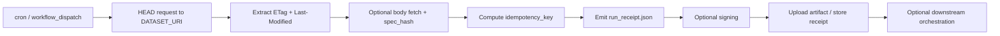

<!-- [KFM_META_BLOCK_V2]
doc_id: kfm://doc/<NEEDS-VERIFICATION-UUID>
title: Dataset Watch (Receipts Emitter)
type: standard
version: v1
status: draft
owners: <NEEDS VERIFICATION>
created: <NEEDS VERIFICATION>
updated: 2026-04-10
policy_label: public
related: [".github/workflows/ingest-watch.yml", "data/receipts/", "policy/", "tools/attest/"]
tags: [kfm, receipts, provenance, workflow, monitoring]
notes: ["Target repo path was not directly surfaced in the current session.", "Owners, canonical doc id, and commit history need verification from the mounted repository."]
[/KFM_META_BLOCK_V2] -->

# 📡 Dataset Watch (Receipts Emitter)

Deterministically monitors a dataset endpoint for change signals and emits a signed, auditable run receipt.

> [!IMPORTANT]
> This document is written to preserve the existing **receipts vs proofs** boundary. This workflow emits **run receipts**, not release proofs, policy decisions, or publication closure artifacts.

**Status:** Experimental  
**Owners:** NEEDS VERIFICATION  


**Quick jumps:** [Scope](#scope) · [Repo fit](#repo-fit) · [Inputs](#inputs) · [Exclusions](#exclusions) · [Directory tree](#directory-tree) · [Quickstart](#quickstart) · [Usage](#usage) · [Diagram](#diagram) · [Definition of done](#definition-of-done) · [FAQ](#faq)

---

## Scope

This workflow exists to observe a remote dataset endpoint, detect change signals, and leave behind a durable receipt of that observation.

It is designed for a narrow, disciplined job:

- poll a dataset URI with `HEAD`
- extract `ETag` and `Last-Modified`
- optionally fetch and hash the body as `spec_hash`
- compute a deterministic `idempotency_key`
- emit `run_receipt.json`
- optionally sign the receipt
- upload or retain the receipt as workflow evidence

> [!NOTE]
> In KFM terms, this is a **process-memory surface**. It is useful for audit, replay, and downstream orchestration, but it is not itself a promotion decision, catalog closure, or release proof.

[Back to top](#-dataset-watch-receipts-emitter)

---

## Repo fit

**Path:** NEEDS VERIFICATION  
**Likely execution surface:** `.github/workflows/ingest-watch.yml`  
**Likely downstream surfaces:** `data/receipts/`, `policy/`, `tools/attest/`

### Upstream links

- remote HTTP/HTTPS dataset endpoints
- scheduler triggers (`cron`)
- ad hoc operator runs (`workflow_dispatch`)

### Downstream links

- `data/receipts/` for stored receipt artifacts
- policy and attestation lanes that may consume receipts later
- registry / ingest contracts that may use receipt output as evidence input

### Accepted inputs

This directory or document area should describe only:

- watcher workflow behavior
- receipt fields and semantics
- deterministic change detection rules
- signing behavior for receipts
- operational usage for scheduled or manual runs

### Exclusions

This document should not become the home for:

- policy enforcement logic
- schema ownership for wider platform contracts
- catalog publishing rules
- release manifest assembly
- proof-pack semantics
- mutation of upstream data
- general CI/CD doctrine unrelated to this watcher

> [!CAUTION]
> Do not let this workflow silently expand into a publish lane. In KFM, receipts, decisions, catalog closure, and outward release are separate governed objects.

[Back to top](#-dataset-watch-receipts-emitter)

---

## Inputs

| Name | Type | Required | Meaning |
|---|---|---:|---|
| `DATASET_URI` | string | Yes | HTTP/HTTPS endpoint to observe |
| `cron` | schedule | No | Recurring execution trigger |
| `workflow_dispatch` | manual | No | Operator-triggered ad hoc run |

### Expected endpoint behavior

This workflow works best against endpoints that expose one or more of:

- `ETag`
- `Last-Modified`
- stable response bodies suitable for hashing
- reliable conditional fetch semantics

### Input posture

- read-only
- external-facing
- deterministic where source behavior is deterministic
- safe to re-run

---

## Exclusions

This watcher does **not** own the following responsibilities:

- deny/allow policy decisions
- STAC/DCAT/PROV publication
- release approval
- review-state transitions
- correction notices
- release manifests
- release proof packs
- canonical dataset versioning beyond this receipt surface

That separation is intentional.

---

## Evidence & proof boundary

A useful way to read this workflow in KFM:

| Object | Belongs here? | Why |
|---|---:|---|
| `run_receipt.json` | Yes | Proves that this observation run occurred |
| `idempotency_key` | Yes | Supports replay safety and dedupe |
| `spec_hash` | Yes | Optional content-level drift signal |
| signature / transparency evidence | Yes | Strengthens auditability of the receipt |
| policy result | No | Belongs in a decision envelope or policy lane |
| release manifest | No | Belongs in outward release assembly |
| catalog closure | No | Belongs in publishable metadata closure |
| release proof pack | No | Belongs in promotion / release evidence |

> [!TIP]
> Keep the watcher small. KFM grows by proving one clean seam at a time.

[Back to top](#-dataset-watch-receipts-emitter)

---

## Receipt contract

Each run produces a receipt with a shape along these lines:

```json
{
  "run_id": "20260410T150000Z-123456",
  "ts": "20260410T150000Z",
  "dataset_uri": "https://example.com/data",
  "etag": "\"abc123\"",
  "last_modified": "Wed, 10 Apr 2026 14:58:00 GMT",
  "idempotency_key": "sha256(...)",
  "spec_hash": "sha256(...)"
}
```

### Field semantics

| Field | Meaning |
|---|---|
| `run_id` | Unique execution identifier for this watcher run |
| `ts` | UTC run timestamp |
| `dataset_uri` | Observed endpoint |
| `etag` | Header-based change signal |
| `last_modified` | Secondary change signal |
| `idempotency_key` | Deterministic identity for the observed state |
| `spec_hash` | Optional body/content hash |

### KFM alignment note

This document intentionally uses `run_receipt` language. Broader KFM manuals describe richer artifact families such as `SourceDescriptor`, `IngestReceipt`, `DatasetVersion`, `CatalogClosure`, `EvidenceBundle`, and `ReleaseManifest`. This watcher should remain a narrow receipt emitter unless and until the repository surfaces a larger verified contract chain.

---

## Idempotency model

```text
idempotency_key = sha256(
  dataset_uri | etag | last_modified
)
```

### What this buys you

- same observed state → same deterministic identity
- safe retry behavior
- deduplication support
- downstream change gating without guessing

### What it does not guarantee

- semantic equivalence when source headers are weak or misleading
- policy correctness
- release readiness
- stable content identity unless `spec_hash` is also captured

> [!WARNING]
> Some endpoints expose weak validators. When header quality is poor, body hashing becomes much more important.

[Back to top](#-dataset-watch-receipts-emitter)

---

## Signing & transparency

### Default path

Use Sigstore/Cosign keyless signing when available.

That keeps receipt signing:

- short-lived
- OIDC-bound
- transparency-log visible
- easier to audit than ad hoc local keys

### Fallback path

OpenSSL or other local signing approaches may exist as a fallback, but they do not provide the same transparency properties unless separately integrated.

### Practical stance

The signature strengthens trust in the **receipt artifact**. It does not transform the receipt into a release proof.

---

## Directory tree

```text
<NEEDS-VERIFICATION-REPO-PATH>/
├── .github/
│   └── workflows/
│       └── ingest-watch.yml
├── data/
│   └── receipts/
│       └── <run artifacts>
├── docs/
│   └── <optional runbooks or operator notes>
└── policy/
    └── <downstream consumers; not owned by this workflow>
```

> [!NOTE]
> The exact mounted repository path was not directly surfaced in the current session. The tree above preserves the draft’s implied structure without claiming current repo proof.

---

## Diagram



### Interpretation

The important thing about this flow is not its visual shape. It is its boundary discipline:

- observe
- record
- sign
- stop

---

## Quickstart

1. Create the workflow file.

```bash
mkdir -p .github/workflows
touch .github/workflows/ingest-watch.yml
```

2. Set the endpoint to observe.

```yaml
env:
  DATASET_URI: "https://your-dataset-url"
```

3. Add schedule and manual trigger blocks as needed.

```yaml
on:
  schedule:
    - cron: "*/15 * * * *"
  workflow_dispatch:
```

4. Commit and run through a non-destructive test endpoint first.

> [!IMPORTANT]
> Before treating this as repo-ready, verify the canonical path, owners, badge conventions, and any existing workflow naming conventions in the mounted repository.

[Back to top](#-dataset-watch-receipts-emitter)

---

## Usage

### Scheduled mode

The workflow runs on its configured cron and emits a new receipt each time.

### Manual mode

Operators can trigger the watcher ad hoc through GitHub Actions.

### Expected outputs

- `run_receipt.json`
- optional signed receipt or transparency evidence
- optional artifact bundle for later review

### Expected operator checks

- endpoint reachable
- header values captured as expected
- no secrets leaked in logs
- receipt uploaded successfully
- signing path behaves consistently

---

## Verification posture

### CONFIRMED from current-session evidence

- the uploaded draft already defines this as a **Dataset Watch (Receipts Emitter)**
- the draft already places it near `.github/workflows/`, `data/receipts/`, `policy/`, and `tools/attest/`
- the draft already distinguishes receipts from proofs
- the draft already uses `ETag`, `Last-Modified`, `spec_hash`, and `idempotency_key`

### PROPOSED in this revision

- KFM meta block
- explicit repo-fit framing
- stronger proof-boundary language
- merge/definition-of-done section
- verification posture section
- clearer boundary between this watcher and wider KFM artifact families

### UNKNOWN / NEEDS VERIFICATION

- actual target repo path
- canonical owners
- whether `.github/workflows/ingest-watch.yml` already exists
- whether `data/receipts/` is the actual artifact path in the mounted repo
- whether attestation, policy, or downstream automation lanes are already implemented
- badge conventions used by adjacent repo docs

---

## Definition of done

A revision to this document is ready when:

- [ ] title and one-line purpose are present
- [ ] top impact block is present
- [ ] repo fit is described without inventing repo state
- [ ] inputs and exclusions are explicit
- [ ] at least one Mermaid diagram is included
- [ ] receipt semantics are documented
- [ ] receipts-vs-proofs boundary is explicit
- [ ] deterministic/idempotency behavior is described
- [ ] unknown repo facts remain labeled
- [ ] adjacent doctrine is linked or named where relevant
- [ ] the document does not silently claim live implementation beyond visible evidence

---

## Task list

### Immediate review gates

- [ ] Verify the intended file path for this README/doc
- [ ] Verify owners
- [ ] Verify whether `ingest-watch.yml` is already the canonical workflow name
- [ ] Verify whether `data/receipts/` is the real artifact location
- [ ] Verify whether there is an adjacent attestation README that should be linked
- [ ] Verify whether this doc belongs under a workflow directory, docs directory, or both

### Next useful expansions

- [ ] Add relative links to adjacent ingestion or attestation docs
- [ ] Add a minimal sample workflow YAML
- [ ] Add an example signed receipt artifact
- [ ] Add a downstream contract note for consumers of `run_receipt.json`
- [ ] Add rollback / stale-source operator notes only if surfaced from repo evidence

---

## FAQ

### Is this a proof system?

No. This emits **process receipts**, not proofs.

### What happens if the dataset does not change?

The receipt still records the run. The `idempotency_key` may remain stable while `run_id` changes.

### Why keep both headers and body hash?

Because some sources expose unreliable validators. Headers are cheap; body hashing is stronger.

### Does this publish data?

No. It observes and records.

### Does this make policy decisions?

No. Those belong downstream.

### Can it trigger other pipelines?

Yes, but only through explicit orchestration outside this workflow’s core scope.

---

## Appendix

<details>
<summary><strong>Example dataset URIs</strong></summary>

```text
USGS WBD
https://hydro.nationalmap.gov/arcgis/rest/services/wbd/MapServer/6

NHDPlus HR
https://hydro.nationalmap.gov/arcgis/rest/services/NHDPlus_HR/MapServer

STAC (HLS)
https://planetarycomputer.microsoft.com/api/stac/v1/collections/hls2-l30/items
```

</details>

<details>
<summary><strong>Illustrative workflow stub</strong></summary>

```yaml
name: dataset-watch

on:
  schedule:
    - cron: "*/15 * * * *"
  workflow_dispatch:

env:
  DATASET_URI: "https://example.com/data"

jobs:
  watch:
    runs-on: ubuntu-latest
    steps:
      - name: Probe dataset headers
        run: |
          curl -I "$DATASET_URI"

      - name: Emit receipt
        run: |
          echo '{"status":"illustrative-example-only"}' > run_receipt.json

      - name: Upload receipt
        uses: actions/upload-artifact@v4
        with:
          name: run-receipt
          path: run_receipt.json
```

</details>

<details>
<summary><strong>Why this document is intentionally conservative</strong></summary>

This revision avoids claiming current repo paths, tests, manifests, or workflow maturity that were not directly surfaced in the session. It keeps the original draft’s useful structure while tightening it to match KFM’s evidence-first and overclaim-resistant documentation posture.

</details>

[Back to top](#-dataset-watch-receipts-emitter)
