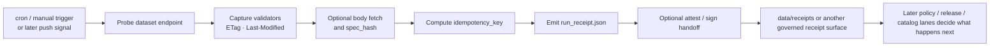

<!-- [KFM_META_BLOCK_V2]
doc_id: kfm://doc/<NEEDS_VERIFICATION_UUID>
title: Dataset Watch (Receipts Emitter)
type: standard
version: v1
status: draft
owners: @bartytime4life
created: <NEEDS_VERIFICATION_CREATED_DATE>
updated: 2026-04-10
policy_label: public
related: [docs/patterns/dataset_watch.md, docs/connectors/README.md, docs/operations/emit-only-watchers/README.md, docs/operations/emit-only-watchers/REGISTRY.md, docs/operations/emit-only-watchers/SCHEMA_STUBS.md, docs/architecture/TRUTH_PATH_LIFECYCLE.md, data/receipts/README.md, tools/attest/README.md, .github/workflows/README.md, .github/watchers/README.md, .github/actions/opa-gate/README.md, .github/actions/sbom-produce-and-sign/README.md, .github/CODEOWNERS, .github/PULL_REQUEST_TEMPLATE.md]
tags: [kfm, patterns, watcher, dataset-watch, receipts, provenance]
notes: [Mounted repo verification confirms this file path plus adjacent receipts, attest, workflow-doc, watcher-doc, and connector-doc surfaces. No checked-in ingest-watch workflow YAML, webhook receiver, or queue listener runtime was visible in the mounted tree.]
[/KFM_META_BLOCK_V2] -->

<a id="top"></a>

# Dataset Watch (Receipts Emitter)

Deterministically observes a dataset endpoint, records change signals, and emits a run receipt without claiming catalog closure, release proof, or publish authority.

> **Status:** experimental pattern · draft  
> **Owners:** `@bartytime4life` *(broad `/docs/` owner confirmed via [`.github/CODEOWNERS`](../../.github/CODEOWNERS); narrower path ownership was not surfaced)*  
>       
> **Quick jumps:** [Scope](#scope) · [Repo fit](#repo-fit) · [Accepted inputs](#accepted-inputs) · [Exclusions](#exclusions) · [Current verified snapshot](#current-verified-snapshot) · [Directory tree](#directory-tree) · [Quickstart](#quickstart) · [Usage](#usage) · [Diagram](#diagram) · [Boundary objects](#boundary-objects) · [Task list](#task-list--definition-of-done) · [FAQ](#faq) · [Appendix](#appendix)  
> **Repo fit:** `docs/patterns/dataset_watch.md` → upstream: [`../README.md`](../README.md), [`../connectors/README.md`](../connectors/README.md), [`../architecture/TRUTH_PATH_LIFECYCLE.md`](../architecture/TRUTH_PATH_LIFECYCLE.md), [`../operations/emit-only-watchers/README.md`](../operations/emit-only-watchers/README.md) · adjacent governed surfaces: [`../../data/receipts/README.md`](../../data/receipts/README.md), [`../../tools/attest/README.md`](../../tools/attest/README.md), [`../../.github/workflows/README.md`](../../.github/workflows/README.md), [`../../.github/watchers/README.md`](../../.github/watchers/README.md), [`../../.github/actions/opa-gate/README.md`](../../.github/actions/opa-gate/README.md), [`../../.github/actions/sbom-produce-and-sign/README.md`](../../.github/actions/sbom-produce-and-sign/README.md)  
> **Accepted here:** read-only dataset observation, deterministic change signals, run receipt semantics, idempotency rules, and handoff guidance into receipts / attestation / policy lanes  
> **Not here:** checked-in workflow certainty beyond what the tree proves, webhook receiver code, queue consumers, policy ownership, catalog closure, release manifests, or public publication behavior

> [!IMPORTANT]
> Mounted-repo verification confirms that this pattern document exists and that the repo already has real adjacent surfaces for receipts, attestation helpers, watcher doctrine, and workflow documentation. It does **not** confirm a checked-in `ingest-watch.yml`, a webhook receiver, or a queue-driven runtime in the mounted tree.

> [!NOTE]
> This is the repo-native shape closest to a generic “governed webhook ingestion” draft. In the mounted repo, the strongest verified pattern is still narrower: **observe → receipt → optional signing → downstream governed handoff**.

## Scope

This document defines a small, auditable watcher pattern for dataset observation.

Its job is intentionally narrow:

1. probe an endpoint or feed,
2. capture change signals such as `ETag`, `Last-Modified`, and optional body hash,
3. compute a deterministic identity for the observed state,
4. emit a `run_receipt.json`,
5. optionally hand the receipt to attestation and later policy / release lanes.

It is **not** an authority-changing surface. In KFM terms, that means this pattern stays upstream of catalog closure, `DecisionEnvelope`, `ReleaseManifest`, `EvidenceBundle`, and outward publication.

### Truth labels used in this file

| Label | Meaning here |
| --- | --- |
| **CONFIRMED** | Directly supported by the mounted repo tree or existing checked-in Markdown |
| **INFERRED** | Conservative conclusion drawn from multiple repo-visible surfaces |
| **PROPOSED** | Recommended behavior or extension not yet proven as checked-in runtime reality |
| **UNKNOWN** | Not directly verified strongly enough from the mounted repo |
| **NEEDS VERIFICATION** | Specific detail that should be checked before merge or implementation claims expand |

[Back to top](#top)

## Repo fit

The mounted repo now provides enough neighboring structure to place this document more precisely than a generic draft.

| Surface | Path | Why it matters | Status |
| --- | --- | --- | --- |
| Pattern doc | `docs/patterns/dataset_watch.md` | Existing repo-native home for this watcher / receipt pattern | **CONFIRMED** |
| Connector guidance | [`../connectors/README.md`](../connectors/README.md) | Connector docs already propose fetch patterns such as `listener` and `governed-upload` | **CONFIRMED** |
| Watcher doctrine | [`../operations/emit-only-watchers/README.md`](../operations/emit-only-watchers/README.md) | Keeps watcher posture emit-only, evidence-first, and non-publishing | **CONFIRMED** |
| Watcher registry model | [`../operations/emit-only-watchers/REGISTRY.md`](../operations/emit-only-watchers/REGISTRY.md) | Proposed runtime inputs for datasets, thresholds, and snapshot semantics | **CONFIRMED** doc / **PROPOSED** runtime |
| Watcher contract staging | [`../operations/emit-only-watchers/SCHEMA_STUBS.md`](../operations/emit-only-watchers/SCHEMA_STUBS.md) | Proposed shapes for `CheckRecord`, `EvidenceBundle`, `DecisionEnvelope`, and `CorrectionNotice` | **CONFIRMED** doc / **PROPOSED** schemas |
| Lifecycle law | [`../architecture/TRUTH_PATH_LIFECYCLE.md`](../architecture/TRUTH_PATH_LIFECYCLE.md) | Confirms receipts are process memory, not the whole release / proof path | **CONFIRMED** |
| Receipt storage lane | [`../../data/receipts/README.md`](../../data/receipts/README.md) | Real mounted repo surface for centrally stored process receipts | **CONFIRMED** |
| Attestation helper lane | [`../../tools/attest/README.md`](../../tools/attest/README.md) | Real mounted repo surface for attest / proof helper logic | **CONFIRMED** |
| Workflow docs lane | [`../../.github/workflows/README.md`](../../.github/workflows/README.md) | Confirms current public / mounted workflow surface is README-only | **CONFIRMED** |
| Watcher gatehouse lane | [`../../.github/watchers/README.md`](../../.github/watchers/README.md) | Confirms `.github/watchers/` is docs-only today | **CONFIRMED** |
| Policy gate action doc | [`../../.github/actions/opa-gate/README.md`](../../.github/actions/opa-gate/README.md) | Confirms fail-closed policy evaluation is documented as a separate control-plane concern | **CONFIRMED** doc / **NEEDS VERIFICATION** mounted action contract |
| SBOM/signing action doc | [`../../.github/actions/sbom-produce-and-sign/README.md`](../../.github/actions/sbom-produce-and-sign/README.md) | Confirms signing / attestation is described adjacent to, not inside, the watcher pattern | **CONFIRMED** doc / **NEEDS VERIFICATION** mounted action contract |

### Placement rule

This file should stay a **pattern / contract note**, not a hidden runtime home.

- If the repo later adds a concrete watcher workflow, keep the operational YAML under `.github/workflows/`.
- If the repo later adds runtime code, keep it under an owning execution surface such as `/pipelines/`, `/scripts/`, or another verified runtime lane.
- Keep `docs/patterns/dataset_watch.md` as the human-readable explanation of the seam, not the seam itself.

[Back to top](#top)

## Accepted inputs

The mounted repo and adjacent docs support a narrow set of inputs for this pattern.

| Input class | What belongs here | Why it fits |
| --- | --- | --- |
| Dataset URI | HTTP/HTTPS endpoint or feed URL to observe | Core subject of the watch pattern |
| Header validators | `ETag`, `Last-Modified`, content length, other stable response metadata | Cheap, deterministic change signals |
| Optional body hash | `spec_hash` or equivalent body-level digest | Stronger content drift detection when headers are weak |
| Schedule / manual trigger metadata | cron-like or operator-triggered run context | Helps form a stable run record without making this file a scheduler spec |
| Idempotency inputs | dataset URI + validator state + optional body hash | Supports replay safety and dedupe |
| Receipt output path | central receipts lane or another governed receipt-bearing artifact path | Connects pattern to repo-visible process-memory surfaces |
| Optional signing handoff | reference to attestation helpers or signing steps | Strengthens receipt integrity without collapsing receipts into proofs |

### Good fit examples

- a public ArcGIS REST layer with stable headers
- a STAC item or collection endpoint
- a Kansas data service with consistent HTTP validators
- a lightweight source poller used before a larger lane decides whether anything warrants promotion
- a later push/listener or webhook adaptation that still emits the same receipt boundary

## Exclusions

This file should not quietly absorb the stronger surfaces that KFM already names elsewhere.

| Keep out of this pattern as primary responsibility | Why | Put it here instead |
| --- | --- | --- |
| Policy allow / deny logic | Policy remains a separate governed lane | [`../../policy/`](../../policy/) and policy-gate actions |
| Catalog closure (`STAC` / `DCAT` / `PROV`) | Observation alone is not publication | `data/catalog/` and owning catalog lanes |
| Release manifests or proof packs | Receipts are process memory, not release truth | `data/proofs/` and release-bearing surfaces |
| Runtime receiver code, webhook handlers, queue consumers | Mounted repo does not currently prove them here | verified runtime / execution lane |
| Outward publication or client-facing routes | Violates the receipts-vs-publication boundary | governed API / release surfaces |
| Secret handling or signing identity ownership | Docs should not become secret or key stores | runtime secret management / control-plane config |
| “Webhook pipeline” claims that imply a checked-in receiver stack | Not verified in the mounted tree | keep as **PROPOSED** appendix material only |

> [!WARNING]
> Do not let a receipt emitter become a stealth publish lane. In KFM, **observation**, **decision**, **release**, and **runtime evidence resolution** are intentionally separate objects and phases.

[Back to top](#top)

## Current verified snapshot

Mounted-repo inspection supports the following concrete statements.

| Item | Mounted repo state | Reading posture |
| --- | --- | --- |
| `docs/patterns/dataset_watch.md` | Present | **CONFIRMED** |
| `docs/patterns/` children | Only `dataset_watch.md` was visible | **CONFIRMED** |
| `.github/workflows/README.md` | Present | **CONFIRMED** |
| `.github/workflows/*.yml` | No `ingest-watch.yml` was visible in the mounted tree listing | **CONFIRMED current absence** |
| `.github/watchers/README.md` | Present | **CONFIRMED** |
| `.github/actions/opa-gate/README.md` | Present | **CONFIRMED** |
| `.github/actions/sbom-produce-and-sign/README.md` | Present | **CONFIRMED** |
| `data/receipts/README.md` | Present | **CONFIRMED** |
| `tools/attest/README.md` | Present | **CONFIRMED** |
| `/docs/` owner mapping in `.github/CODEOWNERS` | `@bartytime4life` | **CONFIRMED** |
| Checked-in webhook receiver, queue listener, or push handler code | Not surfaced during mounted-repo inspection | **UNKNOWN / NEEDS VERIFICATION** |
| Merge-blocking workflow / attestation wiring for this exact pattern | Not surfaced as checked-in runtime or YAML | **UNKNOWN / NEEDS VERIFICATION** |

## Directory tree

### Current mounted-repo surfaces that shape this pattern

```text
docs/
└── patterns/
    └── dataset_watch.md

.github/
├── CODEOWNERS
├── PULL_REQUEST_TEMPLATE.md
├── actions/
│   ├── opa-gate/
│   │   └── README.md
│   ├── provenance-guard/
│   │   └── README.md
│   └── sbom-produce-and-sign/
│       └── README.md
├── watchers/
│   └── README.md
└── workflows/
    └── README.md

data/
└── receipts/
    └── README.md

tools/
└── attest/
    └── README.md
```

### What is *not* currently proven here

```text
.github/workflows/ingest-watch.yml        # not visible in mounted repo
docs/connectors/patterns/feed-listener.md # proposed by docs/connectors/README.md, not visible
runtime/webhook/receiver.py               # not visible
listener worker / queue consumer          # not visible
```

[Back to top](#top)

## Quickstart

The mounted repo supports an **inspection-first** quickstart, not a runtime one.

### 1. Inspect the current pattern and adjacent trust surfaces

```bash
sed -n '1,260p' docs/patterns/dataset_watch.md
sed -n '1,260p' docs/connectors/README.md
sed -n '1,260p' docs/operations/emit-only-watchers/README.md
sed -n '1,260p' data/receipts/README.md
sed -n '1,260p' tools/attest/README.md
sed -n '1,260p' .github/workflows/README.md
```

### 2. Verify the mounted tree before claiming execution details

```bash
find docs/patterns -maxdepth 2 -type f | sort
find .github/workflows -maxdepth 2 -type f | sort
find data/receipts -maxdepth 2 -type f | sort
find tools/attest -maxdepth 2 -type f | sort
```

### 3. Only then add a concrete workflow or runtime adapter

```bash
# illustrative branch-first pattern — do not treat these paths as already present
mkdir -p .github/workflows
$EDITOR .github/workflows/<new-watch-workflow>.yml
```

> [!CAUTION]
> Keep any runtime quickstart or workflow example tied to files that are actually present on the branch under review. The mounted repo does **not** currently prove `ingest-watch.yml`.

[Back to top](#top)

## Usage

Use this pattern when you need one small, reviewable seam that says:

- a dataset or feed was checked,
- the observed state can be identified deterministically,
- a receipt exists for replay or audit,
- downstream lanes can decide whether anything more consequential should happen.

### Minimal receipt contract

```json
{
  "run_id": "2026-04-10T15:00:00Z-0001",
  "timestamp": "2026-04-10T15:00:00Z",
  "dataset_uri": "https://example.org/data",
  "etag": "\"abc123\"",
  "last_modified": "Thu, 10 Apr 2026 14:58:00 GMT",
  "idempotency_key": "sha256(...)",
  "spec_hash": "sha256(...)"
}
```

### Field guide

| Field | Why it matters |
| --- | --- |
| `run_id` | Unique execution identity |
| `timestamp` | UTC observation time |
| `dataset_uri` | Subject under watch |
| `etag` | Cheap header-level drift signal |
| `last_modified` | Secondary freshness / change signal |
| `idempotency_key` | Replay-safe identity for the observed state |
| `spec_hash` | Stronger content signal when body hashing is used |

### Usage rule

The pattern should remain:

1. **read-only**,
2. **deterministic**,
3. **receipt-bearing**,
4. **policy-separable**.

If a change would make it decide publication, resolve rights, or silently mutate state, stop and move that behavior to the owning policy / release / runtime surface.

[Back to top](#top)

## Diagram



### Reading the diagram

This flow intentionally stops early.

It does **not** show catalog closure, `DecisionEnvelope`, or release, because those are downstream governed objects with their own lanes and proof burdens.

## Boundary objects

One source of drift in watcher docs is letting every artifact family blur together. Keep the table below visible.

| Object | Belongs in this pattern? | Why |
| --- | ---: | --- |
| `run_receipt.json` | Yes | Process memory for the observation run |
| `idempotency_key` | Yes | Safe replay and dedupe |
| `spec_hash` | Yes, when content hashing is used | Stronger drift signal |
| Signature / bundle ref for the receipt | Optional handoff | Strengthens integrity of the receipt artifact |
| `CheckRecord` | Adjacent / future fit | Better owned by watcher contract surfaces if formalized |
| `EvidenceBundle` | No | Stronger downstream proof object |
| `DecisionEnvelope` | No | Policy result object, not a raw watcher receipt |
| `ReleaseManifest` / `ReleaseProofPack` | No | Release-bearing objects, not observation records |
| Catalog closure (`STAC` / `DCAT` / `PROV`) | No | Publication / metadata closure happens later |

## Task list / definition of done

A mounted-repo-grounded revision of this file is ready when:

- [x] The file path is confirmed in the mounted repo.
- [x] Adjacent receipt, attestation, watcher, workflow-doc, and connector-doc surfaces are verified.
- [x] Current absence of `ingest-watch.yml` is stated explicitly instead of guessed around.
- [x] Receipts-vs-proofs boundary is preserved.
- [x] A Mermaid diagram is included and meaningful.
- [x] Inputs and exclusions are explicit.
- [ ] Add a concrete workflow example only after a real checked-in YAML exists.
- [ ] Add tests / fixtures only after their actual paths are visible in `tests/` or another verified lane.
- [ ] Add a real attestation example only after the mounted repo exposes the concrete helper or workflow contract.
- [ ] Add a concrete push / listener implementation path only after it lands in a verified runtime surface.

[Back to top](#top)

## FAQ

### Does the mounted repo already prove a runnable watcher workflow?

No. The mounted tree confirms the documentation surface and adjacent control-plane docs, but not a checked-in `ingest-watch.yml` or equivalent runtime for this pattern.

### Is this the same as a webhook ingestion pipeline?

Not yet. In the mounted repo, the verified shape is narrower: a dataset watch / receipt-emitter pattern. A push or webhook listener is still best treated as a **PROPOSED** variation unless the receiver stack and workflow wiring are checked in.

### Why keep receipts separate from proofs?

Because the repo already distinguishes `data/receipts/` from stronger release / proof surfaces. A receipt proves a run occurred; it does not, by itself, authorize publication.

### Where should policy decisions happen?

Outside this pattern, in the policy and review / promotion lanes. The mounted repo already documents fail-closed policy and promotion surfaces separately.

### Can this still be useful if the source does not change?

Yes. Repeated no-change receipts still provide auditability, freshness visibility, and replay context.

## Appendix

<details>
<summary><strong>Push / webhook adaptation (PROPOSED)</strong></summary>

The mounted repo already gives a grounded hint for future push-driven variants:

- [`docs/connectors/README.md`](../connectors/README.md) lists proposed fetch patterns `listener` and `governed-upload`.
- [`docs/operations/emit-only-watchers/README.md`](../operations/emit-only-watchers/README.md) keeps watcher outcomes emit-only and policy-separable.

A later webhook or queue-listener implementation should therefore preserve the same boundary:

```text
push signal / webhook / queue message
→ normalize event identity
→ capture authoritative locator + headers
→ optional body hash
→ emit run_receipt.json
→ optional signing / attestation handoff
→ stop
```

It should **not** embed policy, catalog closure, or release authority inside the receiver.

</details>

<details>
<summary><strong>Illustrative workflow stub (still PROPOSED)</strong></summary>

```yaml
name: dataset-watch

on:
  workflow_dispatch:
  schedule:
    - cron: "*/15 * * * *"

env:
  DATASET_URI: "https://example.org/data"

jobs:
  watch:
    runs-on: ubuntu-latest
    steps:
      - uses: actions/checkout@v4
      - name: Probe dataset headers
        run: curl -I "$DATASET_URI"

      - name: Emit illustrative receipt
        run: |
          echo '{"status":"illustrative-only"}' > run_receipt.json

      - name: Upload receipt
        uses: actions/upload-artifact@v4
        with:
          name: run-receipt
          path: run_receipt.json
```

Keep this stub out of the main body until a real workflow file exists on the branch under review.

</details>

[Back to top](#top)
