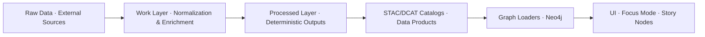
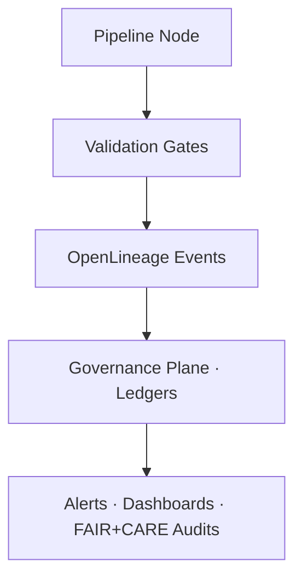

<div align="center">

# 🛠️ **Kansas Frontier Matrix — Pipelines Overview & Operations Guide (v11.2.2)**  
`docs/pipelines/README.md`

**Purpose**  
Define the authoritative **v11.2.2 operational architecture** for all Kansas Frontier Matrix pipelines—ETL, AI/ML–enriched, autonomous, streaming, and batch—ensuring reliability, sovereignty protection, FAIR+CARE integrity, deterministic transformations, and full governance compliance.

  
<!-- Badge Row -->


</div>

---

## 📘 Overview

### Purpose

This document defines the **end-to-end architecture and operational expectations** for all KFM pipelines. It ensures every dataset and AI-enriched transformation moves through a reproducible, sovereign-safe, FAIR+CARE–aligned lifecycle from **raw ingest → work → processed → catalogs → knowledge graph → UI systems**.

### Executive Summary

Pipelines in KFM v11.2.2 operate under a strict operational paradigm:

- Deterministic ETL & AI behavior  
- Mandatory structural, semantic, sovereignty, and governance validation  
- Full lineage (OpenLineage v2.5 + PROV-O extensions)  
- Strict data masking & Indigenous rights protections  
- AI guardrails for OCR/NER/summarization/feature extraction  
- Immutable promotion rules and dataset versioning  
- Autonomous drift/bias detection and reliability enforcement  
- Sustainability telemetry (energy, carbon, data movement costs)  

KFM pipelines are designed to be **self-governing, self-validating, and self-auditing**, producing datasets that meet high standards of transparency, ethics, and reproducibility.

### Scope

Applies to all pipelines in:

- ETL (batch + streaming)  
- AI/ML automation  
- Validation & observability  
- Provenance & lineage  
- Story Node + Focus Mode ingestion pipelines  

### Audience

Reliability engineers · Data architects · AI/ML engineers · FAIR+CARE governance · Knowledge graph engineers · Focus Mode developers

---

## 🗂️ Directory Layout

```text
📁 KansasFrontierMatrix/                     — Monorepo root
│
📁 docs/                                     — All documentation
│   📁 pipelines/                            — Pipeline documentation (this file + domain docs)
│   │   📄 README.md                         — ← Pipelines overview & operations guide
│   │   📁 meteorology/                      — Meteorology pipeline docs (HRRR, NDFD, GRIB2/Zarr)
│   │   📁 hydrology/                        — Hydrology pipeline docs (streamflow, reservoirs, WID)
│   │   📁 hazards/                          — Hazard pipeline docs (wildfire, tornado, drought)
│   │   📁 archaeology/                      — Archaeology pipeline docs (geophysics, surveys)
│   │   📁 reliability/                      — SLOs, error budgets, rollback, hotfix patterns
│   │   📁 case-studies/                     — Real-world pipeline incident and upgrade case studies
│   📁 standards/                            — Governance, Markdown, FAIR+CARE, sovereignty
│   📁 architecture/                         — System & subsystem architecture designs
│   📁 data/                                 — Data contracts, STAC/DCAT catalogs, provenance docs
│   📁 analyses/                             — Domain research & analysis
│   📄 glossary.md                           — Unified terms
│
📁 src/                                      — Backend code
│   📁 pipelines/                            — ETL, autonomous, batch, streaming, AI flows
│   │   📁 watchers/                         — Watchers that detect upstream data changes
│   │   📁 updater/                          — Updater Runners (schedulers, webhooks)
│   │   📁 domain/                           — Domain-specific ETL (hydrology, meteorology, hazards, etc.)
│   │   📁 reliability/                      — Shared reliability primitives
│   📁 graph/                                — Neo4j schema, loaders, queries
│   📁 api/                                  — FastAPI, GraphQL gateways
│   📁 tools/                                — Utility modules and scripts
│
📁 data/                                     — Data lifecycle (raw → work → processed → stac/dcat)
📁 schemas/                                  — JSON, STAC, DCAT, SHACL, telemetry schemas
📁 .github/                                  — CI/CD workflows and policy-as-code
```

---

## 🧭 Context

The pipeline layer connects:

- **Data** ←→ **Ontology** ←→ **UI + Focus Mode**

It must align to:

- Ontologies: CIDOC-CRM, GeoSPARQL, OWL-Time, PROV-O  
- Governance & ethics: FAIR+CARE, sovereignty policies, licensing  
- Tech standards: STAC, DCAT, JSON-LD, CF conventions  
- Operational standards: SLOs, error budgets, idempotency, WAL, concurrency safety  

This guide is the **root document** for pipeline-related architecture decisions.

---

## 🗺️ Diagrams

### Pipeline Lifecycle (Data Plane)



### Reliability & Observability Flow



---

## 🧠 Story Node & Focus Mode Integration

Pipelines feed Focus Mode and Story Nodes:

- Only **validated, sovereignty-compliant entities** are visible.  
- Narrative generation depends on:
  - Temporal consistency via OWL-Time  
  - Spatial validity via GeoSPARQL  
  - Provenance via PROV-O (`prov:wasDerivedFrom`, `prov:used`, `prov:generatedBy`)  
  - AI guardrails ensuring no speculative content  

Focus Mode can:

- Summarize pipeline states & health  
- Show key lineage chains  
- Visualize releases and promotions over time  

Focus Mode cannot:

- Reinterpret or overwrite normative pipeline definitions  
- Invent new pipeline stages or data sources  
- Circumvent governance or kill-switch states  

---

## 🧪 Validation & CI/CD

### Validation Layers

- **Structural** — schema, types, shape, CRS  
- **Semantic** — ontology, SHACL, domain rules  
- **Sovereignty** — H3-based masking, restricted-site rules  
- **FAIR+CARE** — licensing, CARE labels, risk categories  
- **Operational** — SLOs, latency, throughput, retry patterns  
- **AI** — label drift, bias, hallucination detection, explanation logging  

### CI Integration

Typical CI jobs include:

- `docs-lint-v11` — Markdown structure + YAML spec checks  
- `schema-lint-v11` — JSON/SHACL schemas  
- `pipeline-lint-v11` — structural checks for ETL configs  
- `lineage-audit-v11` — OpenLineage + PROV-O completeness  
- `governance-audit-v11` — FAIR+CARE & sovereignty compliance  
- `etl-validation-v11` — data-contract-level validations  

Any failure **blocks promotion** and requires governance review.

---

## 📦 Data & Metadata Expectations

Pipeline outputs MUST:

- Emit STAC Items & Collections (where geospatial).  
- Emit DCAT dataset records (for higher-level dataset definition).  
- Attach JSON-LD contexts referencing KFM ontologies.  
- Store cryptographic checksums (SHA-256) of canonical artifacts.  
- Provide machine-readable provenance.

Metadata details:

- Spatial extent (`bbox`, `geometry`).  
- Temporal extent (`start_datetime`, `end_datetime`, OWL-Time).  
- Source datasets and their licenses.  
- FAIR+CARE attributes and risk categories.  
- Version identifiers and run IDs.

---

## 🧱 Architectural Classes of Pipelines

1. **Extract Pipelines**  
   - Acquire data from external API, bucket, or flat-file source.  
   - Enforce license & usage policies on ingest.

2. **Transform Pipelines**  
   - Normalize schemas, units, and CRS.  
   - Run AI steps (OCR/NER/summarization) with guardrails.  
   - Emphasize determinism and repeatability.

3. **Validation Pipelines**  
   - Perform Great Expectations, schema checks, and FAIR+CARE/sovereignty validations.  
   - Output validation reports to `data/reports/`.

4. **Load Pipelines**  
   - Publish final artifacts to STAC/DCAT.  
   - Load graph nodes and relationships.  
   - Attach provenance and telemetry.

---

## ⚖ FAIR+CARE & Governance

Pipelines are designed to uphold:

### FAIR

- **Findable:** KFM IDs, STAC/DCAT indexing, search.  
- **Accessible:** Controlled but open-sharing where legally allowed.  
- **Interoperable:** Uses STAC, DCAT, CF, and KFM ontologies.  
- **Reusable:** Rich provenance and metadata.

### CARE

- **Collective Benefit:** Data pipelines serve communities, not exploitation.  
- **Authority to Control:** Indigenous and local communities retain control over use of their data.  
- **Responsibility:** Operators enforce masking & sovereignty rules.  
- **Ethics:** Transparent limitations and hazards documented.

Governance engine (GovHooks):

- Attaches governance metadata per run.  
- Enforces kill-switches and freeze windows.  
- Logs decisions in governance ledgers.

---

## 🕰 Version History

| Version | Date       | Summary                                                                                         |
|--------:|------------|-------------------------------------------------------------------------------------------------|
| v11.2.2 | 2025-11-27 | Canonical v11.2.2 rewrite; badge/footer alignment; layout normalized; telemetry & governance hooks updated. |
| v11.0.0 | 2025-11-20 | Initial v11 pipelines overview; established basic architecture and governance linkages.        |

---

<div align="center">

## 🛠️ **Kansas Frontier Matrix — Pipelines Overview & Operations Guide (v11.2.2)**  
*Deterministic pipelines · Governed automation · FAIR+CARE-aligned data flow*

  


  
© 2025 Kansas Frontier Matrix — CC-BY 4.0  
MCP-DL v6.3 · KFM-MDP v11.2.2 · FAIR+CARE Certified · Diamond⁹ Ω / Crown∞Ω  

[⬅ Back to Pipelines Home](README.md) ·  
[⚖ Governance Charter](../standards/governance/ROOT-GOVERNANCE.md) ·  
[📘 KFM Documentation Home](../README.md)

</div>
