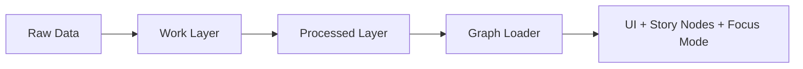
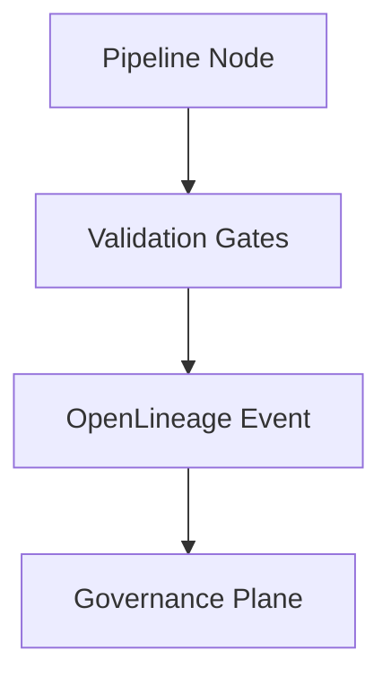

<div align="center">

# 🛠️ **Kansas Frontier Matrix — Pipelines Overview & Operations Guide (v11.2.2)**  
`docs/pipelines/README.md`

**Purpose:**  
Define the authoritative **v11.2.2 operational architecture** for all Kansas Frontier Matrix pipelines—ETL, AI/ML–enriched, autonomous, streaming, and batch—ensuring reliability, sovereignty protection, FAIR+CARE integrity, deterministic transformations, and full governance compliance.

[]() ·
[]() ·
[]() ·
[]() ·
[]()

</div>

---

## 📘 Overview

### Purpose  
This document defines the **end-to-end architecture and operational expectations** for all KFM pipelines. It ensures every dataset and AI-enriched transformation moves through a reproducible, sovereign-safe, FAIR+CARE–aligned lifecycle from raw ingest → work → processed → knowledge graph → UI systems.

### Executive Summary  
Pipelines in KFM v11.2.2 operate under a strict operational paradigm:

- Deterministic ETL & AI behavior  
- Mandatory structural, semantic, sovereignty, and governance validation  
- Full lineage (OpenLineage v2.5 + PROV-O extensions)  
- Strict data masking & Indigenous rights protections  
- AI guardrails for NER/OCR/summarization/feature extraction  
- Immutable promotion rules and dataset versioning  
- Autonomous drift/bias detection and reliability enforcement  
- Sustainability telemetry (energy, carbon, data movement costs)  

KFM pipelines are designed to be **self-governing, self-validating, and self-auditing**, producing datasets that meet the highest standards of transparency, ethics, and reproducibility.

### Scope  
Applicable to all pipelines in:  
- ETL (batch + streaming)  
- AI automation  
- Validation & observability  
- Provenance & lineage  
- Story Node + Focus Mode ingestion pipelines  

### Audience  
Reliability engineers · Data architects · AI/ML engineers · FAIR+CARE governance · Knowledge graph engineers · Focus Mode developers

---

## 🗂️ Directory Layout

```text
📁 KansasFrontierMatrix/                     — Monorepo root
│
├── 📂 docs/                                 — All documentation (standards, guides, analyses)
│   ├── 📂 pipelines/                        — Pipeline documentation (this file)
│   ├── 📂 standards/                        — Governance, Markdown, FAIR+CARE, sovereignty
│   ├── 📂 architecture/                     — System + subsystem architecture designs
│   ├── 📂 data/                             — Data contracts, STAC/DCAT catalogs
│   ├── 📂 analyses/                         — Domain-specific research
│   └── 📄 glossary.md                       — Unified term glossary
│
├── 📂 src/                                  — Backend source
│   ├── 📂 pipelines/                        — ETL, autonomous, batch, streaming, AI
│   ├── 📂 graph/                            — Neo4j schema, loaders, query engines
│   ├── 📂 api/                              — FastAPI services, GraphQL gateway
│   └── 📂 tools/                            — Utilities, migrations
│
├── 📂 data/                                 — Full data lifecycle
│   ├── 📂 sources/                          — Source manifests (external data catalog)
│   ├── 📂 raw/                              — Immutable raw data (DVC/LFS)
│   ├── 📂 work/                             — Normalized, enriched intermediate data
│   ├── 📂 processed/                        — Validated, FAIR+CARE-compliant outputs
│   └── 📂 stac/                             — STAC v11 catalog
│
├── 📂 schemas/                              — STAC, DCAT, JSON-LD, SHACL, telemetry schemas
│   ├── 📂 telemetry/                        — Energy, carbon, lineage schemas
│   └── 📂 json/                             — Validation schemas for pipelines
│
└── 📂 .github/                              — CI/CD workflows (kfm-ci, lineage-audit, governance)
```

---

## 🧭 Context

The pipelines subsystem is central to KFM’s **semantic data lifecycle**, enforcing:

- Ontological alignment (CIDOC-CRM, OWL-Time, GeoSPARQL)  
- Governance obligations (FAIR+CARE, sovereignty, licensing)  
- Technical guarantees (reproducibility, determinism, drift defense)  
- Narrative fidelity (Focus Mode + Story Node inputs)  

This guide defines how pipelines integrate with the broader system architecture.

---

## 🗺️ Diagrams

### Pipeline Lifecycle (Raw → Work → Processed → Graph)



### Reliability & Observability Flow



---

## 🧠 Story Node & Focus Mode Integration

Validated pipeline outputs directly feed Story Node & Focus Mode layers:

- Only **validated, sovereign-safe graph entities** are eligible  
- All narrative generation requires:
  - OWL-Time temporal validity  
  - GeoSPARQL spatial consistency  
  - Provenance anchoring (`prov:wasDerivedFrom`)  
  - AI guardrail success (non-speculative summaries)  

Focus Mode is allowed to:

- Summarize pipeline health  
- Extract metadata  
- Highlight lineage and validation status  

But cannot:

- Alter normative pipeline definitions  
- Invent non-existent pipeline behavior  
- Generate synthetic governance details  

---

## 🧪 Validation & CI/CD

### Validation Layers  

- **Structural**: schema checks, CRS validation, STAC/DCAT compatibility  
- **Semantic**: SHACL, ontology inference  
- **Sovereignty**: H3 r7 generalization, cultural masking  
- **FAIR+CARE**: labels, licensing, exposure risk  
- **Operational**: latency, throughput, retries, WAL recovery readiness  
- **AI**: hallucination guardrails, explanation provenance  

### CI Integration  

- `docs-lint-v11`  
- `schema-lint-v11`  
- `lineage-audit-v11`  
- `governance-audit-v11`  
- `etl-validation-v11`  

Any failure → promotion blocked.

---

## 📦 Data & Metadata

All pipeline outputs must include:

- STAC Items  
- DCAT Dataset metadata  
- JSON-LD with KFM context  
- Provenance packets (PROV-O)  
- Telemetry bundles (lineage, energy, carbon)  

Metadata fields MUST document:

- License  
- Spatial/temporal extent  
- Source lineage  
- CARE & sovereignty labels  
- Dataset version + run_id  
- SHA-256 checksums  

---

## 🧱 Architecture

### Pipeline Classes  

- **Extract**: ingestion, licensing checks, raw snapshots  
- **Transform**: normalization, enrichment, geocoding, OCR/NER, metadata generation  
- **Validate**: structural, semantic, sovereignty, FAIR+CARE, AI guardrails  
- **Load**: Neo4j ingestion, STAC/DCAT publishing, dataset finalization  

### Promotion Lifecycle  

```
raw → work → processed → graph → platform
```

Promotion requires:

- Complete validation suite  
- Full lineage  
- No sovereignty violations  
- No drift/bias failures  
- Successful WAL state  

---

## ⚖ FAIR+CARE & Governance

### FAIR  
- Findable: UUIDs, semantic IDs  
- Accessible: open licensing  
- Interoperable: STAC/DCAT/JSON-LD  
- Reusable: provenance + licensing  

### CARE  
- Authority to control  
- Collective benefit  
- Responsibility  
- Ethics  

### Governance Engine (GovHooks v4)  

Enforces:

- Masking rules  
- Licensing compliance  
- Risk scoring  
- Provenance verification  
- Promotion approvals  

---

## 🕰️ Version History

| Version | Date       | Notes                                                   |
|--------:|-----------:|---------------------------------------------------------|
| v11.2.2 | 2025-11-27 | Full rewrite under KFM-MDP v11.2.2; governance hardening |
| v11.0.0 | 2025-11-20 | Initial v11 pipelines overview                          |

---

<div align="center">

**Kansas Frontier Matrix — Pipelines Overview & Operations Guide v11.2.2**  
Scientific Insight × FAIR+CARE Ethics × Sustainable Intelligence  

[⬅ Back to Pipelines](README.md) ·  
[📚 Documentation Root](../README.md) ·  
[🌐 Project Homepage](../../README.md)

</div>
