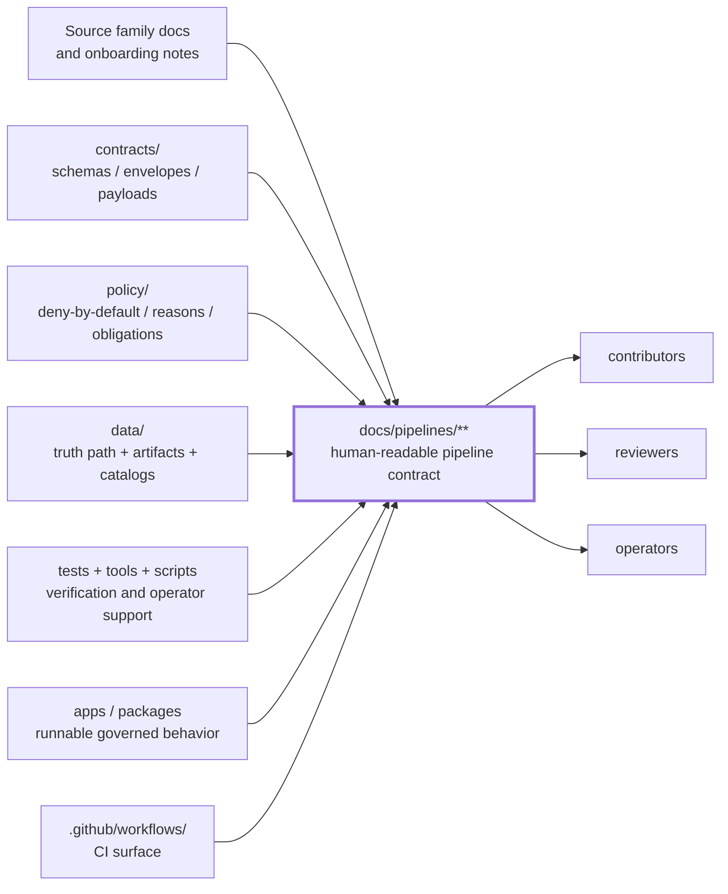

<!-- [KFM_META_BLOCK_V2]
doc_id: kfm://doc/NEEDS-VERIFICATION
title: pipelines
type: standard
version: v1
status: draft
owners: @bartytime4life
created: NEEDS-VERIFICATION
updated: NEEDS-VERIFICATION
policy_label: NEEDS-VERIFICATION
related: ["../README.md", "../architecture/", "../governance/", "../standards/", "../../apps/", "../../packages/", "../../contracts/", "../../policy/", "../../data/", "../../tests/", "../../tools/", "../../scripts/", "../../.github/workflows/"]
tags: [kfm, pipelines, docs]
notes: ["Grounded in current public repo surfaces plus March 2026 KFM doctrine.", "doc_id, created, updated, and policy_label need direct repo or steward verification before merge.", "Historical or support-corpus pipeline paths outside the currently verified public tree remain explicitly labeled as SOURCE-REPORTED or NEEDS VERIFICATION."]
[/KFM_META_BLOCK_V2] -->

# pipelines

Governed pipeline documentation for KFM: what a pipeline does, what it emits, what gates it must pass, and what it must never quietly imply.

> [!IMPORTANT]
> This directory is part of KFM’s **governed documentation surface**, not a loose notes folder. Pipeline docs here should strengthen inspectability across source intake, validation, promotion, publication, correction, and rollback.

> [!NOTE]
> This README is intentionally evidence-bounded. It distinguishes between:
> - **CONFIRMED** current public repo structure
> - **SOURCE-REPORTED** paths seen in project support material
> - **PROPOSED** structure or conventions that fit KFM doctrine
> - **UNKNOWN / NEEDS VERIFICATION** implementation details not proven in the current visible repo state

**Status:** experimental  
**Owners:** `@bartytime4life`  
**Path:** `docs/pipelines/README.md`  
**Repo role:** directory contract for human-readable pipeline specs, runbooks, artifact expectations, and boundary guidance


**Quick jumps:** [Scope](#scope) · [Repo fit](#repo-fit) · [Accepted inputs](#accepted-inputs) · [Exclusions](#exclusions) · [Directory tree](#directory-tree) · [Quickstart](#quickstart) · [Usage](#usage) · [Diagram](#diagram) · [Reference tables](#reference-tables) · [Task list](#task-list--definition-of-done) · [FAQ](#faq) · [Appendix](#appendix)

---

## Scope

This directory is for **pipeline-facing documentation** inside the `docs/` governed surface.

Use it for material such as:

- pipeline specifications
- operator runbooks
- source onboarding notes tied to one pipeline or family
- validation and promotion criteria
- artifact and receipt expectations
- replay, rollback, and correction guidance
- human-readable links between source intake, governed processing, catalog closure, and published outputs

The emphasis is not “how to improvise a script.” The emphasis is **how a pipeline participates in KFM’s governed truth path** and what must stay visible under review.

[Back to top](#pipelines)

## Repo fit

**Path:** `docs/pipelines/README.md`

### Upstream anchors

- [`../README.md`](../README.md) — docs-wide contract and documentation posture
- [`../architecture/`](../architecture/) — architectural doctrine and system placement
- [`../governance/`](../governance/) — policy, stewardship, review, and release controls
- [`../standards/`](../standards/) — shared conventions and document rules

### Adjacent repository surfaces

- [`../../apps/`](../../apps/) — runnable user-facing or operator-facing app surfaces
- [`../../packages/`](../../packages/) — reusable implementation modules and business-law surfaces
- [`../../contracts/`](../../contracts/) — contract surfaces and machine-readable interface expectations
- [`../../policy/`](../../policy/) — governed policy logic and decision posture
- [`../../data/`](../../data/) — lifecycle zones, catalog artifacts, and publish-facing outputs
- [`../../tests/`](../../tests/) — verification, negative paths, release/correction drills
- [`../../tools/`](../../tools/) — validators, diff/probe tooling, and support utilities
- [`../../scripts/`](../../scripts/) — repeatable repo-local execution entrypoints
- [`../../.github/workflows/`](../../.github/workflows/) — CI/CD workflow surface

### What this README is for

This README defines the **directory contract** for pipeline docs:

- what belongs here
- what should stay elsewhere
- how to describe gates, outputs, and failure states
- how to keep pipeline docs useful without overstating mounted implementation

### What it is not

This README is **not** the authoritative source for:

- executable policy
- machine-readable schemas
- CI enforcement
- runtime topology
- actual deployment state
- inferred implementation paths not visible in the active repo surface

Link to those surfaces. Do not duplicate them casually.

[Back to top](#pipelines)

## Accepted inputs

Belongs here when it is a **human-readable** pipeline-facing document, such as:

- a pipeline family README
- a pipeline spec
- an ingestion runbook
- an artifact guide for vectors, rasters, tiles, catalogs, receipts, or provenance bundles
- a replay / rollback / supersession note
- a review checklist for publish readiness
- a contributor guide for adding or revising one governed pipeline lane

Typical source material for docs in this directory includes:

- implementation notes in [`../../packages/`](../../packages/) or [`../../apps/`](../../apps/)
- machine-readable contract references in [`../../contracts/`](../../contracts/)
- policy rules in [`../../policy/`](../../policy/)
- test expectations in [`../../tests/`](../../tests/)
- lifecycle and artifact obligations in [`../../data/`](../../data/)
- doctrinal guidance from `docs/architecture/`, `docs/governance/`, and related KFM manuals

## Exclusions

Does **not** belong here:

| Does not belong here | Put it here instead | Why |
|---|---|---|
| Runnable implementation code | `../../packages/` or `../../apps/` | Code should live with its owning module or runtime |
| Machine-readable schemas | `../../contracts/` and related canonical schema surface(s) | This directory documents schemas; it should not fork contract law |
| Executable policy bundles | `../../policy/` | Policy must stay reviewable and testable in its owning layer |
| Canonical lifecycle artifacts | `../../data/` | Docs are not the authoritative artifact store |
| Validation harnesses and regression fixtures | `../../tests/` | Verification needs its own governed surface |
| One-off helper scripts | `../../scripts/` or `../../tools/` | Operational code should not hide in docs |
| Claims about live runtime or deployment state without proof | mark as `UNKNOWN` / `NEEDS VERIFICATION` | KFM prefers explicit incompleteness over persuasive overclaiming |

[Back to top](#pipelines)

## Directory tree

### Current verified public tree

```text
docs/
└── pipelines/
    └── README.md
```

That is the only pipeline-doc subtree **CONFIRMED** in the current visible public branch.

### Source-reported / historical / proposed expansion shapes

The broader KFM support corpus points to pipeline materials such as the following, but these should be treated as **SOURCE-REPORTED** or **NEEDS VERIFICATION** until rechecked in the active branch or local checkout:

```text
docs/pipelines/
├── soil/
│   ├── sda-weekly/README.md
│   ├── differential-updates/README.md
│   └── soil_artifacts.md
```

```text
historical-or-implementation-side examples
├── src/pipelines/hydrology/nwis_watcher/README.md
├── src/pipelines/air_quality/fusion/
├── src/pipelines/air_quality/INGEST_FLOW.md
└── src/pipelines/air_quality/drift_monitor/README.md
```

> [!CAUTION]
> The public repo surface verified in this review does **not** establish a top-level `src/` directory. References to `src/pipelines/**` therefore belong to historical/source-reported context, not to the current confirmed tree.

[Back to top](#pipelines)

## Quickstart

### Add or revise a pipeline doc

1. Start from the **owning contract and lifecycle question**, not from formatting.
2. Confirm what is actually visible in the current repo surface.
3. Link the relevant contract, policy, data, test, and tooling surfaces.
4. State the pipeline’s place in the truth path clearly.
5. Document what the pipeline emits and what must pass before promotion.
6. Name failure states, correction behavior, and replay/rollback expectations.
7. Mark anything not directly verified as `SOURCE-REPORTED`, `PROPOSED`, `UNKNOWN`, or `NEEDS VERIFICATION`.

### Minimal starter outline

```md
# <pipeline name>

One-line purpose.

## Scope
## Repo fit
## Inputs
## Outputs
## Lifecycle placement
## Validation gates
## Promotion / publish conditions
## Failure / rollback / correction
## Related contracts
## Related policy
## Related tests
## Evidence posture
```

### Link first, duplicate last

Prefer links to:

- the owning contract
- the governing policy surface
- the relevant lifecycle zone
- the validation harness
- the operator tool or script
- the release or proof object surface

That keeps docs aligned to repo truth and reduces drift.

[Back to top](#pipelines)

## Usage

### Reading a pipeline doc

A useful pipeline doc here should let a maintainer answer five questions quickly:

1. What enters the pipeline?
2. What comes out?
3. What gates must pass before promotion or publication?
4. Which proof objects, receipts, or support artifacts should exist?
5. What happens when validation fails or a correction is required?

### Writing a pipeline doc

A strong doc in this directory should make the following explicit:

- source family or source families
- dominant artifact grain
- lifecycle placement
- whether outputs are authoritative, derived, contextual, or provisional
- validation and policy gates
- correction / replay / rollback posture
- where machine-readable truth lives
- what remains unverified

### Naming guidance

Prefer names that reveal **function + source family**:

- `sda-weekly`
- `differential-updates`
- `soil_artifacts`
- `nwis-watcher`
- `drift-monitor`

Avoid vague buckets such as:

- `misc`
- `temp`
- `new-pipeline`
- `notes`
- `pipeline2`

[Back to top](#pipelines)

## Diagram


```mermaid
flowchart LR
    A[Source family docs<br/>and onboarding notes]
    B[docs/pipelines/**<br/>human-readable pipeline contract]
    C[contracts/<br/>schemas / envelopes / payloads]
    D[policy/<br/>deny-by-default / reasons / obligations]
    E[data/<br/>truth path + artifacts + catalogs]
    F[tests + tools + scripts<br/>verification and operator support]
    G[apps / packages<br/>runnable governed behavior]
    H[.github/workflows/<br/>CI surface]

    A --> B
    C --> B
    D --> B
    E --> B
    F --> B
    G --> B
    H --> B

    B --> I[contributors]
    B --> J[reviewers]
    B --> K[operators]

    style B stroke-width:3px
```

### Interpretation

This directory is the **human-readable bridge** between implementation, contracts, policy, lifecycle artifacts, and review. It is important, but it is not the runtime source of truth.

[Back to top](#pipelines)

## Reference tables

### What a pipeline doc here should carry

| Section | Required | Why |
|---|---:|---|
| Purpose | Yes | The reader should know the pipeline’s job immediately |
| Repo fit | Yes | Keeps boundaries and ownership visible |
| Inputs | Yes | Prevents source-role drift |
| Outputs | Yes | Clarifies emitted artifacts |
| Validation gates | Yes | KFM is governed, not optimistic |
| Promotion / publish conditions | Yes | Release state matters |
| Failure / rollback / correction | Yes | Fail-closed behavior must be explicit |
| Related contract / policy / test links | Yes | Docs should point to the authoritative surfaces |
| Evidence posture | Yes | Prevents accidental overclaiming |
| Worked example | Recommended | Helps maintainers act under pressure |

### Evidence labels used in this directory

| Label | Meaning here |
|---|---|
| **CONFIRMED** | Directly supported by the current visible repo surface or attached project doctrine |
| **SOURCE-REPORTED** | Mentioned in support material, inventories, or older/historical project packages |
| **PROPOSED** | Recommended structure or behavior consistent with KFM doctrine |
| **UNKNOWN** | Not verified strongly enough in the current session |
| **NEEDS VERIFICATION** | Must be checked before merge, release, or broad reuse |

### Path-status matrix

| Path | Current status | Notes |
|---|---|---|
| `docs/pipelines/README.md` | **CONFIRMED** | Present in current public `docs/pipelines/` |
| `docs/pipelines/soil/sda-weekly/README.md` | **SOURCE-REPORTED / NEEDS VERIFICATION** | Present in support corpus, not confirmed in current public tree |
| `docs/pipelines/soil/differential-updates/README.md` | **SOURCE-REPORTED / NEEDS VERIFICATION** | Same |
| `docs/pipelines/soil/soil_artifacts.md` | **SOURCE-REPORTED / NEEDS VERIFICATION** | Same |
| `src/pipelines/hydrology/nwis_watcher/README.md` | **SOURCE-REPORTED / historical** | Not part of the current verified public root structure |
| `src/pipelines/air_quality/fusion/` | **SOURCE-REPORTED / historical** | Same |
| `src/pipelines/air_quality/drift_monitor/README.md` | **SOURCE-REPORTED / historical** | Same |

### Current repo-fit cautions

| Caution | Why it matters |
|---|---|
| `contracts/` and `schemas/` coexist in the repo ecosystem | Do not silently declare one as authoritative in this README unless an ADR or repo rule confirms it |
| `.github/workflows/` is currently a documentation surface in the visible public branch | Do not imply active merge-gate YAML here unless separately verified |
| `docs/pipelines/` currently verifies only this README | Child docs should be added deliberately, not assumed into existence |

[Back to top](#pipelines)

## Task list / Definition of Done

A directory-level pipeline README or child pipeline doc is ready when:

- [ ] purpose is obvious from the first screen
- [ ] repo fit and path are explicit
- [ ] accepted inputs and exclusions are clear
- [ ] related contract / policy / data / test surfaces are linked
- [ ] lifecycle placement is stated
- [ ] validation gates are documented
- [ ] promotion / publish conditions are documented
- [ ] rollback / replay / correction behavior is documented
- [ ] evidence posture is explicit
- [ ] any historical or source-reported paths are labeled honestly
- [ ] no section implies mounted implementation that was not actually checked
- [ ] at least one meaningful diagram improves comprehension
- [ ] the file remains readable in GitHub without external explanation

> [!CAUTION]
> “Looks right” is not a Definition of Done in KFM. A shorter doc with visible uncertainty is safer than a polished doc that quietly upgrades assumptions into fact.

[Back to top](#pipelines)

## FAQ

### Why keep pipeline docs under `docs/` at all?

Because KFM treats documentation as part of the governed delivery surface. Code alone rarely communicates lifecycle placement, promotion burden, correction posture, and trust-visible review obligations well enough.

### Should machine-readable schemas be copied into this directory?

No. Link them. Duplication creates drift unless there is a strict synchronization rule.

### Does a pipeline doc prove that the pipeline is implemented?

No. A pipeline doc is documentation evidence, not implementation proof.

### Where should operational runbooks live?

Use the nearest stable home consistent with local repo convention. Shared runbooks may belong in [`../runbooks/`](../runbooks/); pipeline-specific runbooks may live beside the relevant pipeline doc when that improves review and operator clarity.

### What is the safest default when rights, sensitivity, or source trust is unclear?

Document the uncertainty, link the governing surface, and default to review-required / fail-closed behavior instead of implying broad publication.

[Back to top](#pipelines)

## Appendix

<details>
<summary><strong>Appendix A — Suggested child README pattern</strong></summary>

```md
# <pipeline slug>

One-line purpose.

> Status: experimental|active|stable
> Owners: ...
> Path: ...
> Quick jumps: Scope · Inputs · Outputs · Gates · Failure · Links

## Scope
## Repo fit
## Inputs
## Exclusions
## Directory tree
## Quickstart
## Usage
## Diagram
## Reference tables
## Task list
## FAQ
## Appendix
```

</details>

<details>
<summary><strong>Appendix B — Pipeline documentation anti-patterns</strong></summary>

Avoid these:

- treating a support-corpus path as a verified live repo path
- copying schema content into Markdown without a sync rule
- hiding failure states behind happy-path prose
- documenting derived surfaces as authoritative by omission
- naming a target-state workflow as if it were confirmed current CI behavior
- mixing doctrine, implementation, and speculation without labels

</details>

<details>
<summary><strong>Appendix C — Why this directory can stay small</strong></summary>

A good pipelines directory does not need to be large to be useful. In the current public tree, this directory is intentionally small and can still do meaningful work by:

- defining the boundary
- naming the trust posture
- pointing to the real governing surfaces
- creating a stable place for future pipeline specs when they are actually verified and ready

That is a stronger starting point than a busy subtree full of stale assumptions.

</details>
