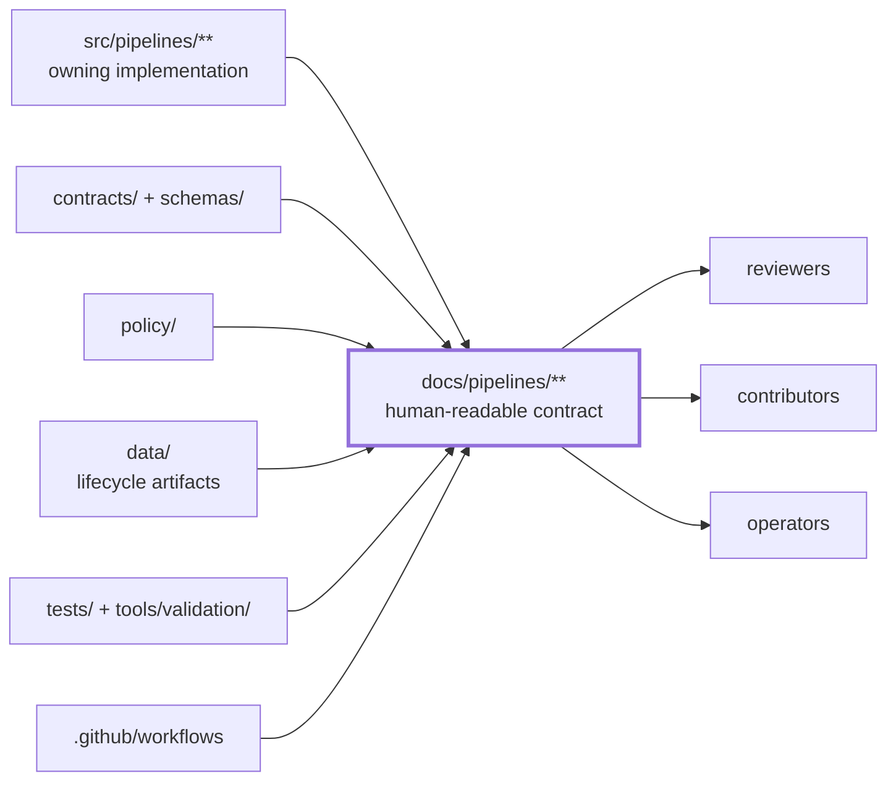

<!-- [KFM_META_BLOCK_V2]
doc_id: kfm://doc/NEEDS-VERIFICATION
title: pipelines
type: standard
version: v1
status: draft
owners: NEEDS-VERIFICATION
created: NEEDS-VERIFICATION
updated: NEEDS-VERIFICATION
policy_label: NEEDS-VERIFICATION
related: ["../README.md", "../architecture/", "../governance/", "../standards/", "../../src/pipelines/", "../../contracts/", "../../policy/", "../../data/", "../../tests/", "../../tools/"]
tags: [kfm, pipelines, docs]
notes: ["Grounded in current visible repo documentation conventions and KFM doctrinal corpus.", "doc_id, owners, dates, policy_label, and exact related set need direct repo verification before merge.", "Current live docs tree did not directly verify a mounted docs/pipelines subtree in this session."]
[/KFM_META_BLOCK_V2] -->

# pipelines

Governed pipeline documentation for KFM: what a pipeline does, what it emits, what gates it must pass, and what it must never quietly imply.

> [!IMPORTANT]
> This README is evidence-bounded. It is aligned to the **current visible repository documentation style** and to the attached March 2026 KFM doctrine, but the current session did **not** directly verify a mounted local repo checkout beyond the visible GitHub surfaces and attached project documents. Treat child paths and examples in this file as **CONFIRMED** only when they are visible in the active branch; otherwise treat them as **INFERRED**, **PROPOSED**, or **NEEDS VERIFICATION**.

> [!NOTE]
> The repository’s own root documentation points to `.github/README.md` as the directory-level README style benchmark, and `docs/README.md` already frames `docs/` as a governed delivery surface rather than a casual notes folder. This README follows that local pattern.

> **Status:** experimental  
> **Owners:** NEEDS VERIFICATION — check `../../.github/CODEOWNERS` or local ownership docs before merge  
> **Path:** `docs/pipelines/README.md`  
> **Repo role:** directory contract for human-readable pipeline specs, runbooks, and artifact expectations  
> **Truth posture:** `CONFIRMED` visible repo/doc evidence · `INFERRED` from adjacent repo patterns · `PROPOSED` target structure consistent with KFM doctrine · `UNKNOWN` not verified in the current session · `NEEDS VERIFICATION` before commit  
> **Current-session evidence:** live GitHub repo surfaces + attached KFM manuals; no directly mounted repo checkout in this chat session  
>  
>      
>  
> **Quick jumps:** [Scope](#scope) · [Repo fit](#repo-fit) · [Inputs](#accepted-inputs) · [Exclusions](#exclusions) · [Directory tree](#directory-tree) · [Quickstart](#quickstart) · [Usage](#usage) · [Diagram](#diagram) · [Reference tables](#reference-tables) · [Task list](#task-list--definition-of-done) · [FAQ](#faq) · [Appendix](#appendix)

---

## Scope

This directory is for **pipeline-facing documentation** in the KFM docs surface:

- pipeline specs
- runbooks
- integration notes
- promotion and rollback expectations
- validation gates
- artifact expectations
- source-to-output documentation that helps maintainers, reviewers, and contributors understand the governed flow

The emphasis here is not “how to hack something together.” It is **how a pipeline fits the KFM evidence path** and how its behavior stays inspectable under review, release, correction, and replay.

[Back to top](#pipelines)

## Repo fit

**Path:** `docs/pipelines/README.md`

**Upstream anchors**

- [`../README.md`](../README.md) — docs-wide rules and directory posture
- [`../architecture/`](../architecture/) — architectural doctrine and system placement
- [`../governance/`](../governance/) — policy, review, stewardship, and release controls
- [`../standards/`](../standards/) — documentation and profile conventions
- [`../../contracts/`](../../contracts/) — machine-readable contract surfaces
- [`../../policy/`](../../policy/) — policy rules and enforcement logic

**Downstream / adjacent implementation surfaces**

- [`../../src/pipelines/`](../../src/pipelines/) — owning implementation surface for runnable pipeline code
- [`../../data/`](../../data/) — lifecycle artifacts and published outputs
- [`../../tests/`](../../tests/) — tests, fixtures, and validation packs
- [`../../tools/`](../../tools/) — validators, helpers, and operational tooling

### What this README is for

This README gives the **directory contract** for pipeline docs:

- what belongs here
- what belongs elsewhere
- how to name and structure a pipeline doc
- how to document gates, artifacts, and failure states without overstating implementation reality

### What it is not

This is **not** the machine-readable source of truth for contracts, policies, schemas, runtime envelopes, or deployment state. Those belong in their owning surfaces and should be linked here rather than copied loosely.

[Back to top](#pipelines)

## Accepted inputs

Belongs here when it is a human-readable pipeline-facing document such as:

- a pipeline README or runbook
- a source onboarding flow for a specific pipeline family
- validation and promotion criteria for one pipeline
- artifact-production notes for vectors, rasters, tiles, catalogs, receipts, or provenance bundles
- rollback, replay, or kill-switch guidance for a pipeline
- operational checklists for governed ingestion, normalization, packaging, or publication
- contributor-facing documentation for adding or revising a pipeline lane

Typical source material for docs in this directory:

- owning code under `../../src/pipelines/**`
- contracts and schemas under `../../contracts/` or `../../schemas/`
- policy rules under `../../policy/`
- tests and fixtures under `../../tests/`
- lifecycle and artifact expectations from KFM doctrine

## Exclusions

Does **not** belong here:

| Does not belong here | Put it here instead | Why |
|---|---|---|
| Runnable pipeline code | `../../src/pipelines/` | Code should stay with the implementation surface |
| Machine-readable schemas | `../../contracts/` or `../../schemas/` | This directory documents them; it should not shadow them |
| Policy rule files | `../../policy/` | Policy must remain executable and reviewable in its owning layer |
| Canonical data artifacts | `../../data/` | Docs are not the authoritative artifact store |
| Secrets, credentials, private tokens | secure secret management surface | Never store operational secrets in docs |
| UI-only interaction specs | `../` UI / architecture / product docs | Keep boundaries crisp |
| Repo-state claims not directly verified | label as `UNKNOWN` / `NEEDS VERIFICATION` | KFM favors visible incompleteness over persuasive overclaiming |

[Back to top](#pipelines)

## Directory tree

The current visible live docs tree did **not** directly confirm a `docs/pipelines/` subtree in this session, so the layout below is intentionally split into what is **expected** versus what is merely **source-reported** or **proposed**.

```text
docs/
├── README.md                       # CONFIRMED: docs-wide contract and posture
├── architecture/                   # CONFIRMED
├── governance/                     # CONFIRMED
├── reports/                        # CONFIRMED
├── runbooks/                       # CONFIRMED
├── standards/                      # CONFIRMED
├── templates/                      # CONFIRMED
└── pipelines/                      # NEEDS VERIFICATION in current live tree
    ├── README.md                   # this file
    ├── soil/                       # source-reported examples exist; verify live branch
    │   ├── sda-weekly/README.md
    │   ├── differential-updates/README.md
    │   └── soil_artifacts.md
    ├── hydrology/                  # PROPOSED doc grouping if docs live outside src/
    ├── air-quality/                # PROPOSED doc grouping if docs live outside src/
    ├── patterns/                   # PROPOSED shared pipeline patterns
    └── runbooks/                   # PROPOSED shared rollback/replay/ops notes
```

> [!NOTE]
> Source-reported pipeline examples in the broader KFM corpus include soil specs under `docs/pipelines/soil/**` and implementation-facing hydrology / air-quality pipeline docs under `src/pipelines/**`. Before treating any child path above as live repo fact, verify it in the active checkout.

[Back to top](#pipelines)

## Quickstart

### Add a new pipeline doc

1. Start from the **owning implementation surface**.
2. Confirm the pipeline’s actual home, usually under `../../src/pipelines/**`.
3. Link the governing contract, schema, and policy surfaces instead of duplicating them.
4. State the lifecycle scope clearly:
   - source edge
   - raw/work/quarantine
   - processed
   - catalog / triplet
   - published / derived / runtime consequences
5. Document validation, promotion, rollback, and correction behavior.
6. Mark anything not directly verified as `INFERRED`, `PROPOSED`, `UNKNOWN`, or `NEEDS VERIFICATION`.

### Minimal starter outline

```md
# <pipeline name>

One-line purpose.

## Scope
## Inputs
## Outputs
## Lifecycle placement
## Validation gates
## Promotion gates
## Failure / rollback
## Related contracts
## Related implementation
## Evidence posture
```

### Link first, duplicate last

Prefer links to:

- owning implementation path
- schema file
- policy file
- test fixture
- validator
- runbook
- release or artifact surface

That keeps docs native to the repo and reduces doctrine drift.

[Back to top](#pipelines)

## Usage

### Reading a pipeline doc

Use a pipeline doc here to answer five questions quickly:

1. **What enters the pipeline?**
2. **What comes out?**
3. **What gates must pass before promotion?**
4. **What evidence, provenance, and review artifacts should exist?**
5. **What happens when checks fail?**

### Writing a pipeline doc

A good pipeline doc in this directory should make the following explicit:

- the dominant source family or source families
- the grain of the emitted artifact
- the lifecycle zone transitions
- whether outputs are authoritative, derived, contextual, or provisional
- the validation and policy gates
- the replay / idempotency / correction expectations
- where machine-readable truth lives
- what remains unverified

### Naming guidance

Prefer names that reveal the pipeline’s **function**, not just the source acronym.

Examples:

- `nwis-watcher`
- `soil_artifacts`
- `differential-updates`
- `fusion`
- `drift-monitor`

Avoid vague buckets like:

- `misc`
- `temp`
- `new-pipeline`
- `notes`
- `pipeline2`

[Back to top](#pipelines)

## Diagram


```mermaid
flowchart LR
    A[src/pipelines/**<br/>owning implementation]
    B[docs/pipelines/**<br/>human-readable contract]
    C[contracts/ + schemas/]
    D[policy/]
    E[data/<br/>lifecycle artifacts]
    F[tests/ + tools/validation/]
    G[.github/workflows]

    A --> B
    C --> B
    D --> B
    E --> B
    F --> B
    G --> B

    B --> H[reviewers]
    B --> I[contributors]
    B --> J[operators]

    style B stroke-width:3px
```

### Interpretation

The docs surface is not the runtime source of truth. It is the **human-readable bridge** between implementation, contracts, policy, artifacts, and review.

[Back to top](#pipelines)

## Reference tables

### What a pipeline doc should carry

| Section | Required | Why |
|---|---:|---|
| Purpose | Yes | Maintainers should know what the pipeline is for immediately |
| Repo fit | Yes | Makes ownership and boundaries visible |
| Inputs | Yes | Prevents scope drift |
| Outputs | Yes | Clarifies artifact expectations |
| Validation gates | Yes | KFM is governed, not optimistic |
| Promotion / publish rules | Yes | Release state matters |
| Failure / rollback | Yes | Fail-closed behavior must be explicit |
| Related implementation links | Yes | Docs should point to owning code |
| Evidence posture | Yes | Avoids repo-state overclaiming |
| Worked example | Recommended | Helps maintainers act, not just agree |

### Evidence labels used in this directory

| Label | Meaning here |
|---|---|
| **CONFIRMED** | Directly supported by the active repo view or attached project evidence |
| **INFERRED** | Strongly suggested by adjacent repo patterns, but not directly verified |
| **PROPOSED** | Recommended structure or behavior consistent with KFM doctrine |
| **UNKNOWN** | Not verified strongly enough in the current session |
| **NEEDS VERIFICATION** | Must be checked before merge, release, or broad reuse |

### Source-reported example paths to verify

| Path | Current status in this README | Notes |
|---|---|---|
| `docs/pipelines/soil/sda-weekly/README.md` | NEEDS VERIFICATION | Source-reported in KFM support material |
| `docs/pipelines/soil/differential-updates/README.md` | NEEDS VERIFICATION | Source-reported in KFM support material |
| `docs/pipelines/soil/soil_artifacts.md` | NEEDS VERIFICATION | Source-reported in KFM support material |
| `src/pipelines/hydrology/nwis_watcher/README.md` | SOURCE-REPORTED / implementation-side | Better treated as owning code-side doc unless duplicated here intentionally |
| `src/pipelines/air_quality/fusion/` | SOURCE-REPORTED / implementation-side | Same boundary rule |
| `src/pipelines/air_quality/drift_monitor/README.md` | SOURCE-REPORTED / implementation-side | Same boundary rule |

[Back to top](#pipelines)

## Task list / Definition of Done

A directory-level pipeline README or child pipeline doc is ready when:

- [ ] purpose is obvious from the first screen
- [ ] path and repo fit are explicit
- [ ] accepted inputs and exclusions are clear
- [ ] owning implementation path is linked
- [ ] related contract / schema / policy surfaces are linked
- [ ] lifecycle placement is stated
- [ ] validation gates are documented
- [ ] promotion / publish conditions are documented
- [ ] rollback / replay / correction behavior is documented
- [ ] evidence posture is explicit
- [ ] any source-reported paths not verified in the active branch are marked
- [ ] no section quietly implies mounted implementation that was not actually checked
- [ ] at least one diagram or table improves comprehension
- [ ] the file remains readable in GitHub without depending on external context

> [!CAUTION]
> “Looks plausible” is not a Definition of Done in KFM. A pipeline doc that smooths uncertainty away is worse than a shorter doc that keeps uncertainty visible.

[Back to top](#pipelines)

## FAQ

### Why document pipelines under `docs/` if code already exists under `src/pipelines/`?

Because code alone rarely communicates lifecycle placement, policy gates, publication obligations, review expectations, and rollback posture clearly enough for maintainers, reviewers, and adjacent contributors.

### Should contracts or schemas be copied into this directory?

No. Link them. Copying machine-readable truth into Markdown creates drift unless there is a strong reason and a clear synchronization rule.

### Does a pipeline doc prove the pipeline exists?

No. A pipeline doc is documentation evidence, not implementation proof. Treat implementation claims as `CONFIRMED` only when the active checkout, tests, manifests, or runtime evidence actually support them.

### Where should runbooks live?

Use the nearest stable home that matches local repo convention. Shared operational runbooks may belong under [`../runbooks/`](../runbooks/); pipeline-specific operational notes may belong beside the relevant pipeline doc when that makes review easier.

### What is the safest default if a pipeline touches rights-sensitive, policy-sensitive, or partially trusted data?

Document the constraint, link the owning governance surface, and default to fail-closed / review-required behavior rather than implying broad publication.

[Back to top](#pipelines)

## Appendix

<details>
<summary><strong>Appendix A — Suggested child README pattern</strong></summary>

```md
# <pipeline slug>

One-line purpose.

> Status: experimental|active|stable
> Owners: ...
> Path: ...
> Quick jumps: Scope · Inputs · Outputs · Gates · Failure · Links

## Scope
## Repo fit
## Inputs
## Exclusions
## Directory tree
## Quickstart
## Usage
## Diagram
## Reference tables
## Task list
## FAQ
## Appendix
```

</details>

<details>
<summary><strong>Appendix B — Pipeline documentation anti-patterns</strong></summary>

Avoid these:

- documenting raw source URLs without source-role or governance context
- treating derived tiles, graphs, or summaries as authoritative by omission
- hiding failure states behind “happy path” prose
- copying schemas into Markdown and letting them drift
- documenting a target-state route, workflow, or artifact as if it were verified repo reality
- mixing implementation notes, policy rules, and speculative design without labeling them

</details>

<details>
<summary><strong>Appendix C — Why this directory exists at all</strong></summary>

KFM’s broader documentation posture already treats docs as part of the governed delivery surface. For pipelines, that means the docs layer should help a reviewer see:

- what a pipeline claims to do
- what artifacts it is expected to emit
- what gates it must pass
- what can halt publication
- what needs direct repo verification before stronger claims are made

That is the reason this README favors **clear boundaries** over exhaustive prose.

</details># Pipelines

This directory stores pipelines-related documentation for Kansas Frontier Matrix.

- Add documents here as work is produced.
- Keep filenames descriptive and scoped to a single topic.
