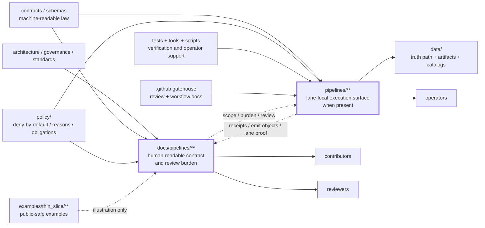

<!-- [KFM_META_BLOCK_V2]
doc_id: kfm://doc/NEEDS-VERIFICATION
title: pipelines
type: standard
version: v1
status: draft
owners: @bartytime4life
created: NEEDS-VERIFICATION
updated: NEEDS-VERIFICATION
policy_label: NEEDS-VERIFICATION
related: ["../README.md", "../architecture/", "../governance/", "../standards/", "../runbooks/", "./ssurgo_to_catchment.md", "../../pipelines/README.md", "../../pipelines/soils/gssurgo-ks/README.md", "../../pipelines/wbd-huc12-watcher/README.md", "../../.github/README.md", "../../apps/", "../../packages/", "../../contracts/", "../../schemas/", "../../policy/", "../../data/", "../../tests/", "../../tools/", "../../scripts/", "../../examples/thin_slice/README.md", "../../examples/thin_slice/hydrology/README.md", "../../.github/workflows/"]
tags: [kfm, pipelines, docs]
notes: ["Built upward from the existing draft plus attached March-April 2026 KFM doctrine.", "Direct current-session repo inspection was not available; path-level claims below are therefore deliberately bounded.", "This revision preserves the directory-contract role while downgrading unproved repo-state claims to INFERRED, PROPOSED, UNKNOWN, or NEEDS VERIFICATION."]
[/KFM_META_BLOCK_V2] -->

# pipelines

Governed documentation for how KFM pipeline lanes fit the truth path, what they emit, and what review burden they carry.

> [!IMPORTANT]
> `docs/pipelines/` is part of KFM's **governed documentation surface**, not a loose notes folder. Material here should strengthen inspectability across source intake, validation, promotion, publication, correction, and rollback.

> [!NOTE]
> This revision is intentionally **evidence-bounded**. In the current session, the strongest direct evidence is the supplied draft plus the attached KFM doctrine corpus. A mounted repository tree was not directly surfaced, so path-level claims below are labeled conservatively.

**Status:** experimental  
**Owners:** `@bartytime4life`  
**Path:** `docs/pipelines/README.md`  
**Repo role:** directory contract for human-readable pipeline specs, runbooks, artifact expectations, and boundary guidance that sit beside execution-facing pipeline lanes when those lanes are actually present and rechecked.


**Quick jumps:** [Scope](#scope) · [Repo fit](#repo-fit) · [Accepted inputs](#accepted-inputs) · [Exclusions](#exclusions) · [Directory tree](#directory-tree) · [Quickstart](#quickstart) · [Usage](#usage) · [Diagram](#diagram) · [Reference tables](#reference-tables) · [Task list](#task-list--definition-of-done) · [FAQ](#faq) · [Appendix](#appendix)

---

## Scope

This directory exists for **pipeline-facing documentation** inside the `docs/` governed surface.

Use it for material such as:

- pipeline specifications
- operator runbooks, or runbook pointers tied to one pipeline or one pipeline family
- source onboarding notes tied to one lane or one family
- validation and promotion criteria
- artifact and receipt expectations
- replay, rollback, supersession, and correction guidance
- human-readable links between source intake, governed processing, catalog closure, and published outputs

The emphasis is not “how to improvise a script.” The emphasis is **how a pipeline participates in KFM’s governed truth path** and what must stay visible under review.

[Back to top](#pipelines)

## Repo fit

**Path:** `docs/pipelines/README.md`

### Upstream anchors

- [`../README.md`](../README.md) — docs-wide contract and documentation posture
- [`../architecture/`](../architecture/) — architectural doctrine and system placement
- [`../governance/`](../governance/) — policy, stewardship, review, and release controls
- [`../standards/`](../standards/) — shared conventions and document rules
- [`../runbooks/`](../runbooks/) — operator procedure home when guidance becomes lifecycle-operational

### Evidence boundary for this revision

| Evidence class | Safe statement |
|---|---|
| **CONFIRMED in this session** | This README draft was directly supplied, and the attached KFM corpus repeatedly treats truth-path discipline, trust-visible review, and domain-specific publication burden as load-bearing. |
| **INFERRED from the attached corpus or current draft** | A sibling execution-facing `/pipelines/` surface likely exists or is intended; related child docs and lane READMEs are named repeatedly; docs and runtime surfaces should remain distinct. |
| **UNKNOWN / NEEDS VERIFICATION** | Exact child-file presence, workflow YAML inventory, active automation, test coverage, and mounted repo depth beyond the directly supplied draft. |

### Surface split: `docs/pipelines/` vs `/pipelines/`

| Surface | Intended role | Current session status |
|---|---|---|
| [`docs/pipelines/`](./) | Human-readable pipeline contract, review posture, and boundary guidance | **CONFIRMED** for this README draft; sibling child docs remain **NEEDS VERIFICATION** unless directly rechecked |
| [`../../pipelines/`](../../pipelines/) | Lane-local execution surface for fetch / transform / validate / emit work | **INFERRED / NEEDS VERIFICATION** in this session |
| [`../../.github/README.md`](../../.github/README.md) | Repo gatehouse for review, disclosure, workflow documentation, and watcher/control-plane scaffolding | **INFERRED / NEEDS VERIFICATION** in this session |

> [!IMPORTANT]
> These surfaces are related but **not interchangeable**. `docs/pipelines/` explains burden, boundaries, and review. Root `/pipelines/` is where lane-local execution work belongs when it becomes more than documentation.

### Adjacent repository surfaces

The following surfaces are relevant to this README’s role, but their exact mounted state was **not** directly rechecked in this session:

- [`../../pipelines/README.md`](../../pipelines/README.md)
- [`../../pipelines/soils/gssurgo-ks/README.md`](../../pipelines/soils/gssurgo-ks/README.md)
- [`../../pipelines/wbd-huc12-watcher/README.md`](../../pipelines/wbd-huc12-watcher/README.md)
- [`../../.github/README.md`](../../.github/README.md)
- [`../../apps/`](../../apps/)
- [`../../packages/`](../../packages/)
- [`../../contracts/`](../../contracts/)
- [`../../schemas/`](../../schemas/)
- [`../../policy/`](../../policy/)
- [`../../data/`](../../data/)
- [`../../tests/`](../../tests/)
- [`../../tools/`](../../tools/)
- [`../../scripts/`](../../scripts/)
- [`../../examples/thin_slice/README.md`](../../examples/thin_slice/README.md)
- [`../../examples/thin_slice/hydrology/README.md`](../../examples/thin_slice/hydrology/README.md)
- [`../../.github/workflows/`](../../.github/workflows/)

### What this README is for

This README defines the **directory contract** for pipeline docs:

- what belongs here
- what should stay elsewhere
- how to describe gates, outputs, and failure states
- how to keep pipeline docs useful without overstating mounted implementation

### What it is not

This README is **not** the authoritative source for:

- executable policy
- machine-readable schemas
- CI enforcement
- runtime topology
- actual deployment state
- inferred implementation paths not directly rechecked in the current session

Link to those surfaces. Do not duplicate them casually.

[Back to top](#pipelines)

## Accepted inputs

Belongs here when the material is a **human-readable** pipeline-facing document, such as:

- a pipeline family README
- a focused child pipeline spec for one transform or derivation lane
- an ingestion runbook or runbook pointer
- an artifact guide for vectors, rasters, tiles, catalogs, receipts, or provenance bundles
- a replay / rollback / supersession note
- a review checklist for publish readiness
- a contributor guide for adding or revising one governed pipeline lane

Typical source material for docs in this directory includes:

- implementation notes from runtime-owning modules
- lane-local execution intent from root `/pipelines/` where that surface is present
- machine-readable contract references in canonical contract surfaces
- policy rules in governing policy surfaces
- test expectations in verification surfaces
- lifecycle and artifact obligations in the truth-path data surfaces
- doctrinal guidance from `docs/architecture/`, `docs/governance/`, and related KFM manuals

[Back to top](#pipelines)

## Exclusions

Does **not** belong here:

| Does not belong here | Put it here instead | Why |
|---|---|---|
| Lane-local execution code, fetch scripts, watcher configs, or emit helpers | `../../pipelines/` | Runtime-shaped lane work belongs with the execution surface, not hidden in docs |
| Shared runtime or reusable implementation code | `../../packages/` or `../../apps/` | Code should live with its owning module or runtime |
| Machine-readable schemas | `../../contracts/` and related canonical schema surfaces | This directory documents schemas; it should not fork contract law |
| Executable policy bundles and policy fixtures | `../../policy/` | Policy must stay reviewable and testable in its owning layer |
| Canonical lifecycle artifacts | `../../data/` | Docs are not the authoritative artifact store |
| Validation harnesses, fixtures, and regression suites | `../../tests/` | Verification needs its own governed surface |
| One-off helper scripts | `../../scripts/` or `../../tools/` | Operational code should not hide inside docs |
| Illustrative payloads, walkthrough packs, or public-safe thin-slice explainer material | `../../examples/thin_slice/` | Examples are for explanation, not for silently becoming release truth |
| Claims about live runtime or deployment state without proof | mark as `UNKNOWN` / `NEEDS VERIFICATION` | KFM prefers explicit incompleteness over persuasive overclaiming |

[Back to top](#pipelines)

## Directory tree

### Directly surfaced in this session

```text
docs/
└── pipelines/
    └── README.md
```

### Named in the current draft or attached support corpus — recheck before merge

```text
docs/
└── pipelines/
    └── ssurgo_to_catchment.md
```

```text
pipelines/
├── README.md
├── soils/
│   └── gssurgo-ks/
│       └── README.md
└── wbd-huc12-watcher/
    └── README.md
```

> [!CAUTION]
> `pipelines/wbd-huc12-watcher/` appears in the attached April 2026 packet family as a **recommended first-create lane**, which is weaker than mounted repo proof. Treat it as **PROPOSED / NEEDS VERIFICATION** until live-rechecked.

### Support-corpus / historical expansion shapes

The broader support corpus points to materials such as the following, but these should remain **INFERRED / NEEDS VERIFICATION** until rechecked in the active branch or a mounted checkout:

```text
docs/pipelines/
└── soil/
    ├── sda-weekly/
    │   └── README.md
    ├── differential-updates/
    │   └── README.md
    └── soil_artifacts.md
```

```text
historical-or-support-corpus examples
src/
└── pipelines/
    ├── hydrology/
    │   └── nwis_watcher/
    │       └── README.md
    └── air_quality/
        ├── fusion/
        ├── INGEST_FLOW.md
        └── drift_monitor/
            └── README.md
```

> [!CAUTION]
> Historical `src/pipelines/**` references should stay visibly labeled as support-corpus material unless the current branch proves that path family is live again.

[Back to top](#pipelines)

## Quickstart

> [!NOTE]
> The commands below are useful in a mounted checkout, but this session did not directly surface one. Treat failures as evidence that a path needs recheck, not as a reason to silently re-promote older assumptions into fact.

### Inspect the documentation lane first

```bash
find docs/pipelines -maxdepth 3 -print | sort
sed -n '1,260p' docs/pipelines/README.md
```

### Recheck any sibling docs before editing them

```bash
sed -n '1,240p' docs/pipelines/ssurgo_to_catchment.md 2>/dev/null || true
```

### Recheck the execution neighbor before writing about it

```bash
test -d pipelines && find pipelines -maxdepth 4 -print | sort
sed -n '1,220p' pipelines/README.md 2>/dev/null || true
sed -n '1,220p' pipelines/soils/gssurgo-ks/README.md 2>/dev/null || true
sed -n '1,220p' pipelines/wbd-huc12-watcher/README.md 2>/dev/null || true
```

### Re-read the repo guardrails before changing a lane doc

```bash
sed -n '1,220p' .github/README.md 2>/dev/null || true
sed -n '1,220p' contracts/README.md 2>/dev/null || true
sed -n '1,220p' policy/README.md 2>/dev/null || true
sed -n '1,220p' schemas/README.md 2>/dev/null || true
sed -n '1,220p' tests/README.md 2>/dev/null || true
sed -n '1,220p' data/README.md 2>/dev/null || true
```

### Add or revise a pipeline doc

1. Start from the **owning contract and lifecycle question**, not from formatting.
2. Confirm what is actually visible in the current repo surface.
3. Link the relevant contract, policy, data, test, tooling, runbook, and execution-lane surfaces.
4. State the pipeline’s place in the truth path clearly.
5. Document what the pipeline emits and what must pass before promotion.
6. Name failure states, correction behavior, and replay / rollback expectations.
7. Mark anything not directly verified as `INFERRED`, `PROPOSED`, `UNKNOWN`, or `NEEDS VERIFICATION`.

### Minimal starter outline

```md
# <pipeline name>

One-line purpose.

## Scope
## Repo fit
## Inputs
## Outputs
## Lifecycle placement
## Validation gates
## Promotion / publish conditions
## Failure / rollback / correction
## Related contracts
## Related policy
## Related tests
## Evidence posture
```

[Back to top](#pipelines)

## Usage

### Reading a pipeline doc

A useful pipeline doc in this directory should let a maintainer answer five questions quickly:

1. What enters the pipeline?
2. What comes out?
3. What gates must pass before promotion or publication?
4. Which proof objects, receipts, or support artifacts should exist?
5. What happens when validation fails or a correction is required?

### Writing a pipeline doc

A strong doc here should make the following explicit:

- source family or source families
- dominant artifact grain
- lifecycle placement
- whether outputs are authoritative, derived, contextual, or provisional
- validation and policy gates
- correction / replay / rollback posture
- where machine-readable truth lives
- whether there is a sibling execution lane under root `/pipelines/`
- what remains unverified

### Use `docs/pipelines/` and `/pipelines/` together, not interchangeably

| If the material is mainly… | Prefer this home | Why |
|---|---|---|
| reviewable explanation, burden, lifecycle, and proof expectations | `docs/pipelines/` | this surface helps humans review and govern the lane |
| lane-local execution steps, recipes, watchers, emitters, and smoke tests | `/pipelines/` | this is the execution-shaped home when that surface is present |
| shared runtime code reused across lanes | `/packages/` or `/apps/` | reuse belongs with owning implementation modules |
| machine-checked contracts or policy law | `/contracts/`, `/schemas/`, `/policy/` | docs should point to law, not replace it |

> [!TIP]
> When a document starts to explain commands, config files, and emit objects more than it explains review burden, that is usually a sign the execution-shaped material belongs under root `/pipelines/`.

### Example material without truth drift

Use [`../../examples/thin_slice/`](../../examples/thin_slice/) for public-safe walkthroughs, sample payloads, and thin-slice explainers. Keep `docs/pipelines/` focused on requirements, review burden, and authoritative links into governing surfaces.

### Naming guidance

Prefer names that reveal **function + source family**:

- `sda-weekly`
- `differential-updates`
- `soil_artifacts`
- `nwis-watcher`
- `drift-monitor`
- `ssurgo_to_catchment`

Avoid vague buckets such as:

- `misc`
- `temp`
- `new-pipeline`
- `notes`
- `pipeline2`

[Back to top](#pipelines)

## Diagram


```mermaid
flowchart LR
    A["architecture / governance / standards"]
    B["docs/pipelines/**<br/>human-readable contract<br/>and review burden"]
    C["pipelines/**<br/>lane-local execution surface<br/>when present"]
    D["contracts / schemas<br/>machine-readable law"]
    E["policy/<br/>deny-by-default / reasons / obligations"]
    F["data/<br/>truth path + artifacts + catalogs"]
    G["tests + tools + scripts<br/>verification and operator support"]
    H[".github gatehouse<br/>review + workflow docs"]
    X["examples/thin_slice/**<br/>public-safe examples"]

    A --> B
    D --> B
    E --> B
    X -. "illustration only" .-> B

    D --> C
    E --> C
    G --> C
    H --> C
    C --> F

    B -. "scope / burden / review" .-> C
    C -. "receipts / emit objects / lane proof" .-> B

    B --> I["contributors"]
    B --> J["reviewers"]
    C --> K["operators"]

    style B stroke-width:3px
    style C stroke-width:3px
```

### Interpretation

This directory is the **human-readable bridge** between doctrine, contracts, policy, lifecycle artifacts, and execution lanes. It matters because it keeps burden legible. It is not the runtime source of truth, and it should not silently upgrade support-corpus paths into current implementation fact.

[Back to top](#pipelines)

## Reference tables

### What a pipeline doc here should carry

| Section | Required | Why |
|---|---:|---|
| Purpose | Yes | The reader should know the pipeline’s job immediately |
| Repo fit | Yes | Keeps boundaries and ownership visible |
| Inputs | Yes | Prevents source-role drift |
| Outputs | Yes | Clarifies emitted artifacts |
| Validation gates | Yes | KFM is governed, not optimistic |
| Promotion / publish conditions | Yes | Release state matters |
| Failure / rollback / correction | Yes | Fail-closed behavior must be explicit |
| Related contract / policy / test links | Yes | Docs should point to authoritative surfaces |
| Execution-neighbor links | Recommended | Helps readers move from explanation to lane work without guessing |
| Evidence posture | Yes | Prevents accidental overclaiming |
| Worked example | Recommended | Helps maintainers act under pressure |

### Evidence labels used in this directory

| Label | Meaning here |
|---|---|
| **CONFIRMED** | Directly supported in the current session by supplied text or attached doctrine |
| **INFERRED** | Strongly implied by the support corpus or adjacent context, but not directly rechecked as current repo fact |
| **PROPOSED** | Recommended structure or behavior consistent with KFM doctrine |
| **UNKNOWN** | Not verified strongly enough in the current session |
| **NEEDS VERIFICATION** | Must be checked before merge, release, or broad reuse |

### Path-status matrix

| Path | Status in this revision | Notes |
|---|---|---|
| `docs/pipelines/README.md` | **CONFIRMED** | This draft was directly supplied in session |
| `docs/pipelines/ssurgo_to_catchment.md` | **INFERRED / NEEDS VERIFICATION** | Named in the draft, not directly surfaced here |
| `pipelines/README.md` | **INFERRED / NEEDS VERIFICATION** | Named in the draft/support corpus, not directly rechecked |
| `pipelines/soils/gssurgo-ks/README.md` | **INFERRED / NEEDS VERIFICATION** | Same |
| `pipelines/wbd-huc12-watcher/README.md` | **PROPOSED / NEEDS VERIFICATION** | April 2026 notes recommend creating this lane; that is not proof it exists |
| `docs/pipelines/soil/sda-weekly/README.md` | **INFERRED / NEEDS VERIFICATION** | Support-corpus mention only |
| `docs/pipelines/soil/differential-updates/README.md` | **INFERRED / NEEDS VERIFICATION** | Support-corpus mention only |
| `docs/pipelines/soil/soil_artifacts.md` | **INFERRED / NEEDS VERIFICATION** | Support-corpus mention only |
| `src/pipelines/hydrology/nwis_watcher/README.md` | **INFERRED / NEEDS VERIFICATION** | Historical or support-corpus mention |
| `src/pipelines/air_quality/fusion/` | **INFERRED / NEEDS VERIFICATION** | Historical or support-corpus mention |
| `src/pipelines/air_quality/drift_monitor/README.md` | **INFERRED / NEEDS VERIFICATION** | Historical or support-corpus mention |

### Where pipeline-related material belongs

| Material | Best home | Why |
|---|---|---|
| Directory contract, burden, review posture, doc-only child specs | `docs/pipelines/` | this surface keeps human-readable obligations visible |
| Lane-local recipes, watcher configs, emit helpers, and smoke tests | `pipelines/` | this is the execution-shaped home when present |
| Shared modules reused across multiple lanes | `packages/` or `apps/` | reuse should live with implementation ownership |
| Canonical contracts, schemas, and envelope shapes | `contracts/` / `schemas/` | these are machine-readable law |
| Executable policy bundles and policy fixtures | `policy/` | governance must stay testable and enforceable |
| Truth-path artifacts, receipts, catalog entries, and published datasets | `data/` | docs are not the sovereign artifact store |

### Current caution register

| Caution | Why it matters |
|---|---|
| Mounted repo depth was not surfaced in this session | Do not imply active runtime, CI, or child-path presence from prose alone |
| The corpus repeatedly separates docs and execution surfaces | Do not blur review docs and lane work into one ambiguous home |
| `contracts/` and `schemas/` can both exist in KFM materials | Do not casually fork machine truth across both surfaces |
| `wbd-huc12-watcher` appears in April 2026 notes as a recommended first-create lane | Treat it as proposed until the live repo proves otherwise |
| `examples/thin_slice/` is a public-safe illustration surface | Use it for explanation, not as proof of release, policy enforcement, or mounted runtime behavior |

[Back to top](#pipelines)

## Task list / Definition of Done

A directory-level pipeline README or child pipeline doc is ready when:

- [ ] purpose is obvious from the first screen
- [ ] repo fit and path are explicit
- [ ] the evidence boundary is explicit
- [ ] accepted inputs and exclusions are clear
- [ ] related contract / policy / data / test surfaces are linked where grounded
- [ ] any relevant sibling `/pipelines/` links are either rechecked or labeled honestly
- [ ] lifecycle placement is stated
- [ ] validation gates are documented
- [ ] promotion / publish conditions are documented
- [ ] rollback / replay / correction behavior is documented
- [ ] evidence posture is explicit
- [ ] docs-vs-execution placement is not ambiguous
- [ ] any historical or support-corpus paths are labeled honestly
- [ ] no section implies mounted implementation that was not actually rechecked
- [ ] any illustrative example links point to public-safe example lanes rather than masquerading as canonical proof
- [ ] at least one meaningful diagram improves comprehension
- [ ] the file remains readable in GitHub without external explanation

> [!CAUTION]
> “Looks right” is not a Definition of Done in KFM. A shorter doc with visible uncertainty is safer than a polished doc that quietly upgrades assumptions into fact.

[Back to top](#pipelines)

## FAQ

### Why keep pipeline docs under `docs/` at all?

Because KFM treats documentation as part of the governed delivery surface. Code alone rarely communicates lifecycle placement, promotion burden, correction posture, and trust-visible review obligations well enough.

### Why do both `docs/pipelines/` and `/pipelines/` exist?

Because they solve different problems. `docs/pipelines/` explains burden, scope, and review. Root `/pipelines/` is the natural home for lane-local execution work when that surface is present and rechecked.

### Why are some path claims marked `NEEDS VERIFICATION` even though they are named here?

Because the current session did not directly surface a mounted checkout. Naming a path in older prose, support-corpus notes, or a draft README is not the same as proving it is live in the active branch.

### Should machine-readable schemas be copied into this directory?

No. Link them. Duplication creates drift unless there is a strict synchronization rule.

### Does a pipeline doc prove that the pipeline is implemented?

No. A pipeline doc is documentation evidence, not implementation proof.

### Where should operational runbooks live?

Use the nearest stable home consistent with local repo convention. Shared runbooks may belong in [`../runbooks/`](../runbooks/); pipeline-specific runbooks may live beside the relevant pipeline doc when that improves review and operator clarity.

### Where should illustrative payloads or thin-slice walkthroughs live?

Use [`../../examples/thin_slice/`](../../examples/thin_slice/) and its nested lanes for public-safe examples. Keep this directory focused on governed requirements, proof burden, and boundary guidance.

### What is the safest default when rights, sensitivity, or source trust is unclear?

Document the uncertainty, link the governing surface, and default to review-required / fail-closed behavior instead of implying broad publication.

[Back to top](#pipelines)

## Appendix

<details>
<summary><strong>Appendix A — Suggested child README pattern</strong></summary>

```md
# <pipeline slug>

One-line purpose.

> Status: experimental|active|stable
> Owners: ...
> Path: ...
> Quick jumps: Scope · Inputs · Outputs · Gates · Failure · Links

## Scope
## Repo fit
## Inputs
## Exclusions
## Directory tree
## Quickstart
## Usage
## Diagram
## Reference tables
## Task list
## FAQ
## Appendix
```

</details>

<details>
<summary><strong>Appendix B — Pipeline documentation anti-patterns</strong></summary>

Avoid these:

- treating a support-corpus path as a verified live repo path
- copying schema content into Markdown without a sync rule
- hiding failure states behind happy-path prose
- documenting derived surfaces as authoritative by omission
- naming a target-state workflow as if it were confirmed current CI behavior
- mixing doctrine, implementation, and speculation without labels
- using example lanes as if they were release proof or policy evidence
- describing root `/pipelines/` execution work as if it automatically belongs under `docs/pipelines/`

</details>

<details>
<summary><strong>Appendix C — Why this directory can stay small</strong></summary>

A good pipelines directory does not need to be large to be useful. In KFM, this surface can still do meaningful work by:

- defining the boundary
- naming the trust posture
- pointing to governing surfaces
- linking to execution neighbors without overstating their maturity
- carrying focused child docs when a lane deserves isolated review
- keeping illustrative walkthrough material in separate example lanes

That is stronger than a busy subtree full of stale assumptions.

</details>
