<div align="center">

# 🛠️ Kansas Frontier Matrix — Pipelines Overview & Operations Guide  
`docs/pipelines/README.md`

**Purpose**  
Define the authoritative **v11.2.4 operational architecture** for all Kansas Frontier Matrix pipelines—ETL, AI/ML–enriched, autonomous, streaming, and batch—ensuring reliability, sovereignty protection, FAIR+CARE integrity, deterministic transformations, and full governance compliance across the KFM stack.

<br/>


</div>

---

## 📘 Overview

### 1. Purpose

This document defines the **end-to-end architecture and operational expectations** for all KFM pipelines. It ensures that every dataset and AI-enriched transformation moves through a reproducible, sovereignty-aware, FAIR+CARE–aligned lifecycle:

> `raw` → `work` → `processed` → catalogs (STAC/DCAT) → knowledge graph → Story Nodes & Focus Mode

### 2. Executive summary

Pipelines in KFM v11.2.4 operate under a strict operational paradigm:

- **Deterministic ETL & AI behavior** — same inputs + config → same outputs.  
- **Mandatory validation layers** — structural, semantic, sovereignty, and governance checks.  
- **Complete lineage** — OpenLineage v2.5 plus PROV-O exports for archival and graph integration.  
- **Data masking & Indigenous rights protections** — especially for archaeological and culturally sensitive content.  
- **AI guardrails** — for OCR/NER/summarization/feature extraction steps.  
- **Immutable promotion and dataset versioning rules** — promoting only via governed transitions.  
- **Reliability & drift detection** — error budgets, SLOs, and bias/drift checks where AI is involved.  
- **Sustainability telemetry** — energy, carbon, and data movement costs at pipeline/node boundaries.

KFM pipelines are designed to be **self-governing, self-validating, and self-auditing**, producing datasets that meet high standards of transparency, ethics, and reproducibility.

### 3. Scope

This overview applies to all pipelines in:

- **ETL** — batch and streaming.  
- **AI/ML automation** — including training, inference, and precomputation.  
- **Validation & observability** — telemetry, SLOs, anomaly detection.  
- **Provenance & lineage** — OpenLineage, PROV-O, STAC/DCAT alignment.  
- **Story Node & Focus Mode ingestion** — narrative and graph-aware pipelines.

### 4. Audience

- Reliability & SRE engineers.  
- Data & pipeline architects.  
- AI/ML engineers.  
- FAIR+CARE and sovereignty governance teams.  
- Knowledge graph engineers.  
- Story Node & Focus Mode developers.

---

## 🗂️ Directory Layout

```text
📂 docs/pipelines/
├── 📄 README.md                          # 🛠️ Pipelines overview & operations guide (this file)
├── 📂 core/                              # ⚙️ Core pipeline architecture & shared patterns
│   ├── 📄 README.md                      # ⚙️ Core Pipeline Architecture Index
│   └── 📂 queue-architecture/            # 🔁 Queue-centric pipeline architecture standard
│       └── 📄 README.md
├── 📂 atmo/                              # 🌦 Atmospheric & NODD-related pipelines
│   └── 📂 nodd-sns-sqs/
│       └── 📂 validation/
│           └── 📄 README.md              # 🛡️ FAIR+CARE validation gates for SNS→SQS auto-updates
├── 📂 soil/                              # 🟫 Soil pipelines (gNATSGO, SSURGO, etc.)
│   └── 📂 gnatsgo-auto-ingest/
│       └── 📄 README.md                  # 🟫 Automated Soil Data Ingestion Pipeline
├── 📂 hydrology/                         # 💧 Hydrology pipelines (streamflow, reservoirs, WID) — to be documented
│   └── 📄 README.md                      # Hydrology pipelines index (to be created)
├── 📂 archaeology/                       # 🏺 Archaeology pipelines (geophysics, surveys) — to be documented
│   └── 📄 README.md                      # Archaeology pipelines index (to be created)
├── 📂 hazards/                           # ⚡ Hazards (wildfire, tornado, drought) — to be documented
│   └── 📄 README.md                      # Hazards pipelines index (to be created)
├── 📂 reliability/                       # 🧰 Reliability, SLOs, rollback & hotfix patterns
│   └── 📄 README.md                      # Reliability pipeline patterns (to be created)
└── 📂 case-studies/                      # 📚 Pipeline incident and upgrade case studies
    └── 📄 README.md                      # Case-study index (to be created)
```

Author rules:

- Every directory under `docs/pipelines/` **must** have a `README.md` describing its scope and link back to this overview.  
- Domain pipeline docs (e.g., `soil/gnatsgo-auto-ingest`) must declare:
  - How they instantiate the **queue-architecture** standard.  
  - How they integrate with lineage, geoprivacy, and energy standards.

---

## 🧭 Context

KFM’s overall stack:

> Deterministic ETL → STAC/DCAT/PROV catalogs → Neo4j knowledge graph → API layer → Frontend (React/MapLibre/Cesium) → Story Nodes → Focus Mode

The pipeline layer:

- Binds **external sources** (NOAA, NRCS, USGS, archives, etc.) into KFM’s **ontology-aligned**, **governed** internal representations.  
- Must align with:
  - **Ontologies:** CIDOC-CRM, GeoSPARQL, OWL-Time, PROV-O, KFM-OP v11.  
  - **Governance & ethics:** FAIR+CARE, sovereignty policy, licensing.  
  - **Technical standards:** STAC, DCAT, JSON-LD, CF conventions.  
  - **Operational standards:** queue-centric architecture, SLOs, idempotency, WAL, backfill policies.

This overview is the **root document** for pipeline-related architecture decisions and should be referenced from:

- `docs/pipelines/core/README.md`  
- All domain pipeline READMEs under `docs/pipelines/*`.

---

## 🗺️ Diagrams

### 1. Pipeline lifecycle (data plane)

```mermaid
flowchart LR
    A[Raw Data · External Sources] --> B[Work Layer · Normalization & Enrichment]
    B --> C[Processed Layer · Deterministic Outputs]
    C --> D[STAC/DCAT Catalogs · Data Products]
    D --> E[Graph Loaders · Neo4j]
    E --> F[UI · Focus Mode · Story Nodes]
```



### 2. Reliability & observability flow

```mermaid
flowchart TD
    X[Pipeline Node] --> Y[Validation Gates]
    Y --> Z[OpenLineage Events]
    Z --> G[Governance Plane · Ledgers]
    G --> H[Alerts · Dashboards · FAIR+CARE Audits]
```



Diagrams are illustrative only; authoritative behavior is defined in the queue-architecture, lineage, geoprivacy, and validation-gates standards.

---

## 🧠 Story Node & Focus Mode Integration

Pipelines feed **Story Nodes** and **Focus Mode** by:

- Publishing **validated, sovereignty-compliant entities** into:
  - STAC/DCAT catalogs.  
  - The Neo4j knowledge graph.  
- Ensuring each entity has:
  - Temporal semantics (OWL-Time intervals).  
  - Spatial semantics (GeoSPARQL geometries, H3 aggregates where needed).  
  - Provenance (PROV-O + OpenLineage references).  

Focus Mode:

- **MAY**:
  - Summarize pipeline states and recent runs.  
  - Show key lineage chains from raw data to narratives.  
  - Visualize releases and promotions over time.  

- **MUST NOT**:
  - Reinterpret or overwrite normative pipeline definitions.  
  - Invent new pipeline stages or data sources.  
  - Bypass sovereign data protections or kill-switches.

Story Nodes referencing pipeline-derived content must:

- Link back to pipeline versions and dataset IDs.  
- Reflect masking/generalization choices required by geoprivacy and geoethical standards.

---

## 🧪 Validation & CI/CD

### 1. Validation layers

Pipelines must implement layered validation:

- **Structural**
  - Schema, types, shapes, CRS, basic integrity.  
- **Semantic**
  - Ontology and SHACL checks, domain rules (e.g., hydrologic consistency).  
- **Sovereignty & geoprivacy**
  - H3-based masking, restricted-site rules, Tribal review flags.  
- **FAIR+CARE**
  - Licensing, FAIR metadata, CARE labels, risk categories.  
- **Operational**
  - SLOs, latency/throughput, retries, error budgets.  
- **AI/ML**
  - Dataset distributions, drift checks, bias checks, explanation logging where applicable.

### 2. CI integration

Representative CI workflows (names may vary but semantics are mandatory):

- `docs-lint-v11` — Markdown structure and YAML front-matter validation per KFM-MDP v11.2.4.  
- `schema-lint-v11` — JSON/SHACL schema validation for pipeline configs and outputs.  
- `pipeline-lint-v11` — Structural linting of ETL DAGs, configs, and queue usage.  
- `lineage-audit-v11` — OpenLineage + PROV-O completeness checks.  
- `governance-audit-v11` — FAIR+CARE & sovereignty compliance checks.  
- `etl-validation-v11` — Data-contract and Great Expectations validation suites.

Any failure **blocks promotion** of the relevant change or dataset and may require governance review (FAIR+CARE Council, Reliability Board, or Data Provenance Board).

---

## 📦 Data & Metadata

Pipeline outputs MUST:

- Emit **STAC Items & Collections** (where geospatial) with:
  - Spatial extent (`bbox`, `geometry`).  
  - Temporal extent (`start_datetime`, `end_datetime`).  
  - Asset metadata (media types, roles, checksums).  

- Emit **DCAT dataset records** with:
  - `dct:title`, `dct:description`, `dct:license`, `dct:temporal`, `dct:spatial`.  
  - Links to distributions and provenance.

- Attach **JSON-LD contexts** referencing KFM ontologies and external standards.  
- Store **cryptographic checksums** (SHA-256) of canonical artifacts.  
- Provide **machine-readable provenance links** (OpenLineage run IDs, PROV-O entities/activities/agents).

Metadata expectations include:

- Clear source dataset references and licenses.  
- FAIR+CARE attributes and risk categories.  
- Version identifiers and run IDs connected to lineage standards.  
- Energy and carbon metrics (when available) linked to energy standards.

---

## 🧱 Architecture

KFM recognizes several **architectural classes of pipelines**, all expected to use the **queue-centric pipeline architecture** (see `docs/pipelines/core/queue-architecture/README.md`) or provide an equivalent deterministic, replayable design:

### 1. Extract pipelines

- Acquire data from external APIs, buckets, or flat-file sources.  
- Honor licensing and usage policies on ingest.  
- Emit OpenLineage events and basic provenance entities.

### 2. Transform pipelines

- Normalize schemas, units, CRS, and temporal representations.  
- Run AI steps (e.g., OCR, NER, summarization) under strict guardrails.  
- Emphasize **determinism, idempotency, and WAL-backed replays**.

### 3. Validation pipelines

- Perform Great Expectations, schema checks, FAIR+CARE/sovereignty validations.  
- Implement **gate-like behavior** (e.g., SNS→SQS validation gates) that decides promotion vs. quarantine.  
- Write validation reports under controlled locations (e.g., `data/reports/`).

### 4. Load pipelines

- Publish artifacts to STAC/DCAT and internal registries.  
- Load graph nodes and relationships into Neo4j.  
- Attach provenance and telemetry to outputs.

### 5. Cross-cutting architecture

All classes must:

- Use config-driven behavior (YAML/JSON, not hard-coded paths).  
- Integrate with queue-centric patterns for ordering, dedupe, and replay where applicable.  
- Emit OpenLineage events and PROV-O-compatible metadata.  
- Respect geoprivacy/geospatial masking and geoethics standards when dealing with sensitive datasets.

---

## ⚖ FAIR+CARE & Governance

### 1. FAIR principles in pipelines

- **Findable**
  - Stable KFM IDs, STAC/DCAT indexing, and searchable metadata.  
- **Accessible**
  - Controlled access mechanisms; clear licensing and access rights.  
- **Interoperable**
  - Use of STAC, DCAT, CF conventions, and KFM ontologies.  
- **Reusable**
  - Rich provenance, clear license terms, and documented limitations.

### 2. CARE and sovereignty

- **Collective Benefit**
  - Pipelines are designed to support communities and long-term stewardship, not extractive use.  
- **Authority to Control**
  - Indigenous and local communities retain control where their data or landscapes are involved; pipeline behavior reflects sovereignty policy settings.  
- **Responsibility**
  - Operators enforce masking, review gates, and redaction policies; violations must be traceable through lineage.  
- **Ethics**
  - Limitations and hazards are documented; speculative or misleading outputs are avoided.

### 3. Governance engine & hooks

- Governance metadata (e.g., CARE labels, sovereignty flags, risk categories) is attached **per run** via:
  - OpenLineage facets.  
  - STAC/DCAT and PROV-O metadata.  

- Governance mechanisms can:
  - Enforce kill-switches and freeze windows.  
  - Block promotion when governance checks fail.  
  - Log decisions in governance ledgers for audit.

Pipelines that handle **culturally sensitive** or **restricted** content must coordinate with:

- FAIR+CARE Council.  
- Tribal Sovereignty / Indigenous Data Protection bodies.  
- Data Provenance Board (for lineage implications).

---

## 🕰️ Version History

| Version | Date       | Status            | Summary                                                                                         |
|--------:|------------|-------------------|-------------------------------------------------------------------------------------------------|
| v11.2.4 | 2025-12-05 | Active / Enforced | Updated to KFM-MDP v11.2.4; aligned directory layout with new `core/`, `soil/`, and `atmo/` docs; integrated queue, lineage, energy, and validation-gates standards. |
| v11.2.2 | 2025-11-27 | Superseded        | Canonical v11.2.2 rewrite; badge/footer alignment; layout normalized; telemetry & governance hooks updated. |
| v11.0.0 | 2025-11-20 | Superseded        | Initial v11 pipelines overview; established basic architecture and governance linkages.        |

Future revisions must:

- Add references to new domain pipeline READMEs as they are created.  
- Keep alignment with queue-architecture, lineage, geoprivacy, and energy standards.  
- Update CI/validation expectations as pipeline tooling evolves.

---

<div align="center">

🛠️ **Kansas Frontier Matrix — Pipelines Overview & Operations Guide (v11.2.4)**  
Deterministic Pipelines · Governed Automation · FAIR+CARE-Aligned Data Flow  

<br/>


<br/><br/>

[📘 Docs Root](..) · [⚙ Core Pipelines](./core/README.md) · [🧬 Lineage Standard](../standards/lineage/openlineage-integration.md) · [⚖ Governance](../standards/governance/ROOT-GOVERNANCE.md)

</div>