# 🧠 **Kansas Frontier Matrix — AI · ETL Integration Architecture Guide (v11.0.0)**  
`docs/pipelines/ai-etl-integration.md`

**Purpose:**  
Define the **canonical v11 architecture and guardrails** for integrating AI/ML components into KFM’s ETL pipelines.  
Ensures AI remains *assistive, constrained, explainable, provenance-complete*, and fully aligned with FAIR+CARE, sovereignty, STAC/DCAT v11, and the Neo4j ontology stack.

---

# 📘 Executive Summary

AI in KFM v11 is **not** an opaque black-box bolted onto ETL — it is a **tightly-governed, lineage-rich co-pilot** that:

- Performs OCR, NER, geocoding, summarization, pattern detection, and predictive modeling  
- Emits **derived** or **annotative** fields only (never overwriting sources-of-truth)  
- Publishes all outputs as **provenance-attached, schema-validated entities**  
- Powers **Focus Mode v3** and **Story Nodes v3** with explainable narratives  
- Operates under explicit CARE, sovereignty, and ethics constraints  

This guide describes **how AI components must attach to ETL pipelines**, which responsibilities belong to AI vs. deterministic code, and what validation + observability requirements apply before AI outputs are promoted into the KFM knowledge graph.

---

# 🧩 1. AI Roles in the ETL Stack

AI components are allowed to perform the following categories of tasks:

- **Perception**  
  - OCR on scanned maps and documents  
  - Image-to-text extraction for historical imagery  

- **Understanding**  
  - NER (people, places, events, organizations)  
  - Geoparsing & geocoding using GNIS / OSM / tribal gazetteers  
  - Topic tagging & document classification (treaty vs. newspaper vs. deed)  

- **Summarization & Narrative Preparation**  
  - Document-level summaries (for UI cards, Focus mode, Story Node candidates)  
  - Multi-document condensed overviews (with explicit provenance aggregation)  

- **Pattern & Predictive Modeling**  
  - Climate/hazards projections (where models exist and are documented)  
  - Outlier detection & anomaly surfacing (e.g., suspicious flood records, corrupted time series)  

- **Schema Assistance**  
  - Suggesting CIDOC-CRM class mappings (never auto-committing)  
  - Suggesting relationships for human review in curation workflows  

Every AI output must be treated as **data with its own provenance**, not as an unquestionable truth.

---

# 🗺️ 2. Integration Architecture

```mermaid
flowchart LR
    A["Raw Inputs
    (docs, maps, rasters, tables, sensors)"]
        --> B["Deterministic ETL
        (parse, normalize, reproject)"]

    B --> C["AI Enrichment Layer
    OCR · NER · Geocoding · Summaries · Predictions"]

    C --> D["Validation & Governance
    Schema · CARE · Sovereignty · Lineage"]

    D --> E["Knowledge Graph
    Neo4j · CIDOC-CRM · GeoSPARQL · OWL-Time · PROV-O"]

    D --> F["STAC/DCAT Registries
    data/stac · catalogs"]

    E --> G["Focus Mode v3 · Story Nodes v3"]
```

**Key principles:**

- AI is **logically downstream** of deterministic ETL.  
- No ingest path is *only* AI — all flows pass through deterministic checks.  
- Promotion into the graph/UI requires validation & governance approval.

---

# 🧱 3. Responsibilities & Boundaries

## 3.1 Deterministic ETL Responsibilities

Deterministic code is responsible for:

- Basic parsing & format conversions (CSV → normalized table, TIFF → COG)  
- CRS normalization and geometry fixing  
- Unit conversions & numeric sanity checks  
- Cross-field consistency checks (date ranges, ID formats, referential integrity)  
- Guaranteeing that AI receives **clean, predictable** input  

## 3.2 AI Responsibilities

AI components are responsible for:

- Generating candidate annotations, labels, summaries, and derived metrics  
- Providing **confidence scores, uncertainty indicators, and explanations**  
- Attaching PROV-O lineage (`prov:wasGeneratedBy` AI activity)  
- Respecting domain constraints (e.g., not inventing treaty dates)  

## 3.3 Hard Boundaries

- AI may **not**:
  - Overwrite original fields from authoritative sources  
  - Bypass schema validation or sovereignty checks  
  - Persist new graph entities without passing through pipeline validation  
  - Generate speculative numeric values that look like measurements  

- All AI writes are:
  - Clearly namespaced (e.g., `ai_summary`, `ai_tags`, `ai_confidence`)  
  - Linked to model IDs and versioned configurations  
  - Upgradeable/fixable by re-running the same pipeline  

---

# 🧪 4. Data Contracts for AI Outputs

AI outputs are governed by **KFM Pipeline Data Contracts (KFM-PDC v11.0)**:

- Each AI field (e.g., `ai_summary`, `ai_place_candidates`, `ai_event_link_hints`) is defined in a **JSON Schema**  
- Contracts specify:
  - Type, allowed ranges, required metadata  
  - Required provenance fields (model ID, version, timestamp)  
  - Expected confidence structure (e.g., `p_high`, `p_medium`, `p_low`)  

AI/ETL pipelines MUST:

- Validate their AI outputs against the schemas referenced by `json_schema_ref`  
- Reject or quarantine outputs that fail schema or governance criteria  
- Record failures as OpenLineage events for debugging and audit

---

# 🛰️ 5. Provenance & Observability for AI Steps

Every AI step must emit:

- A PROV-O `prov:Activity` node (AI inference)  
- `prov:used` references to:
  - Input entities  
  - Model artifact (e.g., Story Summary Model v3.2)  
  - Configuration (prompt or hyperparameters)  
- `prov:generated` references to the resulting entities/fields  

These lineage events are published to:

- The **OpenLineage bus**  
- The **Neo4j lineage graph**  
- STAC `processing` and `lineage` properties where applicable  

This enables:

- Re-running a given AI step with identical inputs for reproducibility  
- Tracing all fields displayed in Focus Mode back to an exact inference call  
- Debugging model performance, drift, and bias over time  

---

# 🧭 6. Focus Mode v3 Integration

AI outputs are key inputs to Focus Mode v3, but must satisfy:

- **Validation**: Only AI summaries whose underlying entities pass ETL/graph validation are used  
- **Explainability**: Focus panels must be able to show:
  - Source documents  
  - Supporting data points  
  - Model version & configuration  
- **Ethics & CARE**:
  - No sensitive tribal information surfaced without proper flags  
  - No speculative or uncorroborated historical claims in narrative form  

Focus Mode uses AI primarily to:

- Rank and highlight relevant entities for the user’s focal selection  
- Generate concise, citation-rich summaries from validated data  
- Suggest candidate Story Nodes for human curation  

---

# 📖 7. Story Nodes v3 Integration

AI/ETL integration for Story Nodes:

1. Deterministic ETL:
   - Ensures all referenced entities (events, places, people) exist and are valid  
   - Provides the base spatiotemporal envelope  

2. AI:
   - Proposes narrative candidates (`ai_story_candidates`)  
   - Provides descriptive text and multi-document summarization  

3. Validation & Governance:
   - Enforces `story-node.schema.json`  
   - Applies CARE & sovereignty rules  
   - Approves or rejects Story Node promotion  

4. Graph Load:
   - Approved Story Nodes become first-class entities in the graph  
   - Focus Mode can reuse them as narrative anchors  

---

# 🛡️ 8. AI Governance & Risk Controls

The following controls are mandatory:

- **Model Registry**: Every model used in ETL has:
  - Unique ID  
  - Version  
  - Training data summary  
  - Intended-use statement  
  - Limitations & known failure modes  

- **Approval Gate**: New or updated models require:
  - FAIR+CARE review  
  - Sovereignty implications review (for cultural/historical data)  
  - Acceptance by the KFM FAIR+CARE Council  

- **Runtime Policies (GovHooks v4)**:
  - Prevent model use outside its approved scope  
  - Enforce max-confidence thresholds for unsupervised promotion  
  - Require human review for high-risk narratives or inferences  

---

# 🧾 9. Validation & CI Requirements

AI/ETL integration is covered by:

- `etl-validation-v11` — ensures ETL contracts are respected  
- `ai-governance-v11` — checks AI usage, model registry references, and provenance  
- `schema-lint-v11` — validates JSON/JSON-LD for AI fields  
- `lineage-audit-v11` — verifies PROV-O chain completeness  
- `governance-audit-v11` — confirms CARE & sovereignty adherence  

No pipeline using AI may be promoted unless all checks pass in CI.

---

# 🕰 Version History

| Version | Date       | Notes                                                                      |
|--------:|-----------:|----------------------------------------------------------------------------|
| v11.0.0 | 2025-11-20 | Initial AI · ETL integration architecture for KFM v11 LTS.                 |

---

# 🔗 Footer

**Back to Root:** `../../README.md`  
**Back to Architecture:** `../architecture/system_overview.md`  
**Back to Standards:** `../standards/README.md`

