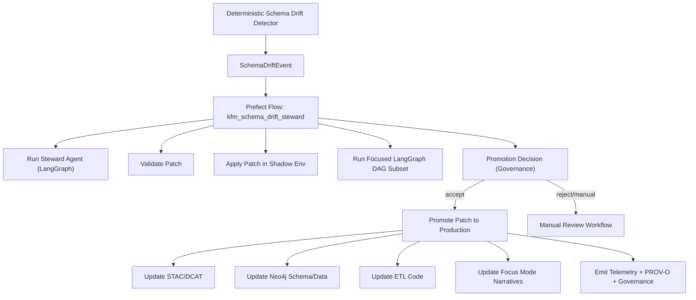

# 🔁 **Agentic Schema Drift Steward — Flow Layer**  
`docs/pipelines/ai/agentic-schema-drift/flows/README.md`

**Purpose:**  
Document the **Prefect durable execution flows** and **LangGraph subgraphs** that orchestrate the KFM v11.2.2 Agentic Schema Drift Steward.  
This layer handles **task retries**, **shadow application**, **governance gating**, **telemetry emission**, and **PROV-O lineage** for safe, autonomous ETL schema evolution.

---

## 📘 Overview

This folder contains the **execution layer** for the Schema Drift Steward System:

- Prefect flows that implement:
  - Durable execution (resume after failure)
  - Multi-step orchestration (baseline load → agent run → validation → shadow apply → promotion)
  - Task-level retries, caching, timeouts  
  - Telemetry + governance + lineage hooks

- LangGraph subgraphs that provide:
  - Multi-tool agent routing  
  - STAC/DCAT validators  
  - Cypher generation for Neo4j schema migration  
  - Deterministic DAG execution for agent reasoning  

This is where the **architecture spec becomes running code**.

---

## 🗂️ Directory Layout (v11.2.2)

    docs/pipelines/ai/agentic-schema-drift/flows/
    ├── 📄 README.md                                   # This file
    │
    ├── 📜 prefect_schema_drift_flow.py                # Main Prefect v3 durable-flow implementation
    ├── 📜 prefect_shadow_apply_flow.py                # Optional additional flow for shadow-only evaluation
    ├── 📜 prefect_patch_promotion_flow.py             # Promotion + governance-gated flow
    │
    ├── 📜 langgraph_subgraph.py                       # Core LangGraph DAG used by the Steward agent
    ├── 📜 langgraph_tools.py                          # STAC/DCAT validators, schema inspectors, Cypher generators
    │
    └── 📁 examples/                                   # Example flow triggers
        ├── 📄 event_sample.json
        ├── 📄 patch_sample.json
        └── 📄 lineage_sample.json

---

## 🔧 Prefect Flows

### 1. 🧠 `prefect_schema_drift_flow.py`
Primary durable execution flow:

- Load baseline schemas & governance constraints  
- Run Schema Drift Steward Agent (internal LangGraph)  
- Validate patch with regression tests  
- Apply patch in **shadow environment**  
- Run Focused LangGraph DAG subsets  
- Decide on promotion or manual-review path  
- Emit telemetry + PROV-O lineage  

### 2. 🛰️ `prefect_shadow_apply_flow.py`
Utility flow for:

- Isolated evaluation of risky / high-severity drift  
- No promotion  
- Produces lineage + telemetry for audits  

### 3. 🚦 `prefect_patch_promotion_flow.py`
Handles:

- Governance-gated promotion  
- CARE checks  
- Sovereignty rules  
- Updating ETL code, STAC/DCAT metadata, Neo4j schema  
- Triggering downstream reindex tasks  

---

## 🔬 LangGraph Subgraphs

### `langgraph_subgraph.py`
Contains:

- Multi-step reasoning for drift classification  
- Mapping old/new schema semantics  
- STAC/DCAT update reasoning  
- Neo4j graph migration plan reasoning  
- Error-handling nodes & fallback logic  

### `langgraph_tools.py`
Implements callable tools for:

- STAC v11 validation  
- DCAT 3.0 JSON-LD validation  
- Neo4j schema introspection  
- Cypher patch generation  
- Telemetry summarization  

All tools are **pipeline-contract safe** and produce typed outputs.

---

## 🪜 Execution Sequence (Mermaid Rendering-Safe)

---

## 📡 Telemetry & Lineage Emission

All flows produce:

- `agentic-schema-drift-telemetry.json` entries  
- OpenLineage spans (task → flow → agent → tools)  
- PROV-O JSON-LD chain  
- Governance ledger entries (CARE, sovereignty, policy IDs)  
- Energy/Carbon v2 metrics  

---

## 🧪 Testing Requirements

Flow-layer CI tests must validate:

- Prefect retry/caching semantics  
- Shadow-apply correctness  
- Promotion gate logic  
- LangGraph tool routing determinism  
- Telemetry schema correctness  
- PROV-O lineage generation  
- FAIR+CARE governance rules  

Promotion flows must **not** auto-run without passing all tests.

---

## 🕰 Version History

| Version  | Date       | Notes                                                     |
|----------|------------|-----------------------------------------------------------|
| v11.2.2  | 2025-11-28 | Complete uplift; added mermaid flow + governance hooks    |
| v11.0.0  | 2025-11-22 | Initial flow-layer scaffold                               |

---

### 🔗 Footer  
[⬅ Agentic Schema Drift Source](../src/README.md) · [🤖 Architecture Guide](../../agentic-schema-drift-durable-execution.md) · [🏛 Governance](../../../standards/governance/ROOT-GOVERNANCE.md)

