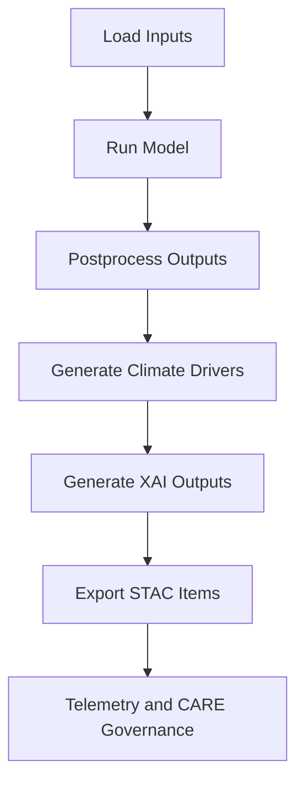

# 🌡️🤖🧩 **Climate AI Batch Inference — Task Library**  
`docs/pipelines/ai/inference/climate/batch/tasks/README.md`

**Purpose:**  
Define the **task-level building blocks** used in KFM climate batch inference pipelines.  
Each task is deterministic, modular, FAIR+CARE governed, lineage-safe, and designed for reuse across **downscaling**, **bias correction**, **driver generation**, and **anomaly detection** workflows.

---

## 📘 Overview

Batch climate inference in KFM is composed of **small, deterministic, schema-controlled tasks**.

These tasks run under:

- Airflow 3.x DAGs  
- Prefect flows  
- LangGraph agentic DAGs  

Each task:

- Accepts STAC-defined inputs  
- Produces validated, deterministic outputs  
- Writes PROV-O lineage facets  
- Emits OTel telemetry  
- Enforces CARE + sovereignty masking  
- Produces XAI-ready metadata for downstream JSON-LD generation  

---

## 🗂 Directory Layout (v11.2.2)

    docs/pipelines/ai/inference/climate/batch/tasks/
    ├── 📄 README.md                    # This file
    │
    ├── 📄 load_inputs.py               # Fetch STAC Items → hydrate arrays/frames
    ├── 📄 run_model.py                 # Deterministic ML inference (seed locked)
    ├── 📄 postprocess.py               # Bias correction, smoothing, temporal alignment
    ├── 📄 export_stac.py               # Write STAC Items + assets
    ├── 📄 generate_drivers.py          # Produce hazard-linked climate drivers
    ├── 📄 generate_xai.py              # SHAP/IG/CAM/spatial-attribution generation
    ├── 📄 faircare_checks.py           # CARE, sovereignty, masking enforcement
    └── 📄 telemetry.py                 # OTel events, metrics, lineage emission

---

## 🔍 Task Specifications

### 1. 📥 `load_inputs.py` — Input Hydration Task
- Fetch STAC Items (climate inputs)
- Validate CRS + vertical axis  
- Load arrays: NetCDF/COG/GeoParquet  
- Emit `prov:used` lineage entries  
- CARE-safe filtering of sensitive spatial/temporal ranges  

---

### 2. 🧠 `run_model.py` — Deterministic ML Inference
- Load model card + frozen weights  
- Apply seed-locking  
- Run inference for:
  - downscaling  
  - anomaly detection  
  - hazard-linked climate drivers  
- Output deterministic predictions  
- Emit:
  - energy/carbon telemetry  
  - `prov:wasGeneratedBy`  

---

### 3. 🧹 `postprocess.py` — Bias Correction / Cleanup
- Quantile-mapping or analog ML correction  
- Temporal alignment  
- Spatial smoothing (where allowed)  
- H3 mask enforcement  
- CRS/vertical verification  
- CARE-safe transformations  

---

### 4. 🧮 `generate_drivers.py` — Climate Driver Synthesis
Generates hazard-aligned drivers:

- CAPE / CIN  
- SRH / bulk shear  
- lapse rates  
- LLJ metrics  
- moisture transport  
- freeze–thaw indicators  

All exported with:

- deterministic arrays  
- STAC metadata  
- JSON-LD driver semantics  

---

### 5. 🧬 `generate_xai.py` — Explainability Outputs
Produces:

- SHAP vectors (global/local)  
- Integrated Gradients (global/local)  
- CAM spatial maps  
- Spatial-attribution rasters/tiles  

Outputs include:

- JSON-LD XAI bundles  
- PROV-O explainability lineage  
- CARE + sovereignty metadata  

---

### 6. 📦 `export_stac.py` — STAC Item Writer
- Writes COG/NetCDF/Parquet assets  
- Adds:
  - `proj:*`
  - `kfm:*`
  - `checksum:multihash`  
- Registers Item in KFM STAC catalog  
- Emits OTel span metadata  

---

### 7. 🛡️ `faircare_checks.py` — Ethical Compliance Task
- CARE scope evaluation  
- Sovereignty flags  
- Sensitive geography masking (H3)  
- Narrative safety checks  
- Data Contract v3 enforcement  
- “Fail closed” governance policy  

---

### 8. 📊 `telemetry.py` — Observability + Lineage
- OpenTelemetry metrics, logs, traces  
- Energy + carbon accounting  
- Provenance bundle construction  
- Task-duration histograms  
- Retry metadata  

---

## 🧭 Task Graph Overview (Mermaid Safe)

---

## 🕰 Version History

| Version  | Date       | Notes                                                  |
|----------|------------|--------------------------------------------------------|
| v11.2.2  | 2025-11-28 | Initial climate batch task library for KFM v11.2.2     |

---

### 🔗 Footer  
[⬅ Back to Batch Inference](../README.md) · [🌡️ Climate Inference Root](../README.md) · [🏛 Governance](../../../../../standards/governance/ROOT-GOVERNANCE.md)

